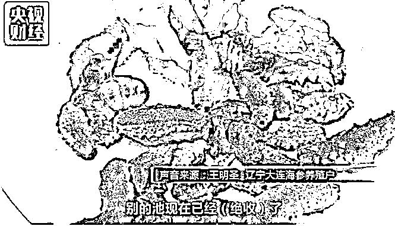

# 夜报||东北的海参都被热死了，连尸体都化了

东北有一家公司，叫獐子岛，在大连，有一年他说他家的扇贝跑了，成了 A 股市场的黑天鹅，獐子岛的扇贝跑了成为基金研究员口口相传的段子。

而今天，更大的黑天鹅出来了，东北的海参都被热死了，连尸体都找不到了。据央视财经报道，还是大连，海参出现了大量的死亡现象，有 90%的海参池可能出现绝收现象。

据养殖户介绍，海参特别怕热，高温它会一点点化成水，看不见了。所以很多海参还没来得抢救就已经在水下化掉了。

往年海水温度正常是 25、26 度，今年持续高温，下午两三点能达到 36 到 37 度，30 度海参就已经承受不了了。

从渔业部门了解到，受持续高温影响，辽宁多地的池塘养殖海参从 7 月 23 号开始出现缺氧、化皮的现象，到 7 月 28 号，水深在 7 米以内的养殖池就出现海参大面积死亡的情况。目前初步统计，海参受灾损失面积 95 万亩，损失产量 6.8 万吨，直接经济损失 68.7 亿元。

从目前央视的报道来看，上一次扇贝跑了是无解之谜，黑幕重重，但是这一次的海参是真死了，因为大量被调研的海参养殖池都已经真正绝收了，这次应该不存在黑幕，是真的天灾。

但是天灾一样可怕，大连的那些个农业养殖公司，建议还是回避下，今天这报道一出，明天股市立刻就会有反应的。。。

今天，特朗普连发 4 个推特，其中第一个推特非常奇葩，把 A 股在过去几个月里下跌 27%居然当成了他炫耀的政绩。

图 1

图 2

图 3

图 4

年初的时候，人民日报曾预计美股 18 年存在下跌 20%的巨大风险，结果是 A 股下跌了 27%被美国拿来当炫耀的成果。

而美国纳达克斯，今年则上涨 13%左右，形成鲜明对比。

所以，毛衣战这种事，怎么打我们都不管，股市跌成这样真的说不过去了，今年以来各大基金全军覆没，全面陷入亏损。

A 股最高点 3600 点，跌 20%大概是 2880 点附近，我认为这里就是底部了，因为历史上一波跌穿 20%，是陷入熊市和经济衰退的典型标志，所以从 3000 向下就一路买，结果 A 股他能跌 27%。。。

上周，特朗普推出了 2000 亿 25%的关税计划，引发 A 股剧烈下跌，这种黑天鹅直接被硬吃，A 股又从 2900 被打到了 2800 之下。

我的策略是中线，认定了底部就不做短线折腾，所以我没有动，情绪的舒缓需要时间，但是我认为大概几天之内，就能完成这种缓冲，继续开始筑底。

股市都的太恶心了，就这样吧，反正 18 年不会是啥好市场，都是拿点小钱参与来感知市场以防错过牛市，都是做做波段，高抛低吸。等呗，等到牛市再全军出击。

觉得此文的分析有道理，对你有所帮助，请随手转发。

长按下方图片，识别二维码，即可关注我

近期精彩文章回顾（回复“目录”关键词可查看更多）

华为员工都这么穷，怪不得拼多多能火 | 房价跌 20%就会全面崩盘，地产杠杆远比你想的要脆弱 |  为什么碧桂园的质量那么差 | 清醒点，放弃全面开征房产税的幻想 | 央行和财政部隔空掐架，我支持央妈

紫竹好物馆