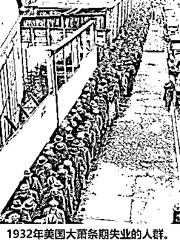

# 不减税，中国就会陷入滞涨深渊

> *中国目前还没有找到一个既能让经济快速发展又让其结构得到优化的方法。每次经济发展一减速，政府就重回举债投资刺激增长的老路。*

*英国《金融时报》马丁.沃尔夫*

1929 年 10 月，以纽约股市大崩盘为开端，美国进入了十年大萧条。到 1933 年初，美国有半数银行倒闭，13 万家以上企业破产，失业率达到破纪录的 25%，领救济食品的穷人排队长度能有几个街区那么长，整个美国处于末日降临的阶段，人们看不到未来。

在经济崩溃的时候，美国政府依然奉行不干涉的自由主义经济，没有采取任何行动，当时的主流经济学家认为市场经济会修复一切，政府不应该插手。但是奇迹并没有出现，美国经济持续恶化，大萧条期间，美国股市下跌了 90%以上，整个美国笼罩在绝望的阴影中，人民渐渐的不再信任自由市场这种主流经济学。

在这种背景下，1933 年，罗斯福上任了，罗斯福全盘否定了自由市场经济学，改为实行凯恩斯主义，简单的说就是国进民退，大幅度的强化政府的权利，扩大政府支出，以通过大规模的公共基础建设和社会福利保障来扩大社会总需求。扩大税收、扩大支出，把投资的职能从私人企业家手里转移到政府手里来摆脱大萧条的泥潭。

从 1935 年开始，美国所有经济指标开始触底反弹，到 1939 年，罗斯福取得了巨大的成果，美国是全球唯一的一个不通过战争就挣脱经济危机影响的国家，第一次世界大战和第二次世界大战，美国都没有受到实质性的影响，反而大发战争财，一举成为了世界上最发达的国家。

鉴于罗斯福的巨大功绩，他成为了美国历史上空前绝后的连任 4 届的美国总统，也是 20 世界美国民众最爱戴的总统，感谢凯恩斯主义。

**凯恩斯主义的失效**

二战之后，美国迎来了自己的巅峰时刻，和英法德在战争中耗尽所有力量所不同的是，美国不但没有在二战中受损，反而国力大进，一举超过英国成为无可争议的全球第一，黄金储备量达到了全球储量的 80%，美元成为了世界货币。

战后，美国继续执行凯恩斯主义，一旦美国经济出现衰退的迹象，政府就使用财政支出和货币扩张来解决，扩大总需求这一招看起来无往不胜，凯恩斯主义已经彻底的成为了主流经济学，当时的经济学家声称已经找到了经济的奥妙，理论上政府有能力熨平一切经济波动，让世界再无经济危机。

在随后的 50、60 年代里，美国经济平稳而坚定的逐年上涨，美国的影响力扩大到全球各地，以至于有人将这一时期称之为美国的黄金时期。

凯恩斯主义真的无所不能吗？简单的印货币然后扩大政府支出就能解决一切？并不是，借钱是要还的，投资是要承担风险的，做坏事是要付出代价的。这句话在前一段时间响彻中国媒体，同样适用于几十年前的美国。

随着美国不断的偷偷印钞票，其他盟国扛不住了，人们愿意用美元作为世界货币，是基于 80%的黄金储备在美国所产生的信用，但是美国这么印钞票，是在吸全世界的血来补充它自己的经济。

其他西方国家也不傻，为了不被美国割羊毛，各国都不断的使用美元兑换黄金然后运回本国，美国的黄金储备急速下降，到了 1971 年 8 月，美国扛不住了，宣布美元和黄金脱钩，停止用黄金来兑付美元。

从这一天开始，美元信用崩溃了，美元开始了疯狂的贬值之路，美国开始为他过去几十年里印的钞票还债了，借钱，是要还的。怎么个还法，还黄金吗？自然是还不起的，于是就只能不断的通货膨胀，从 1971 年开始，美国进入了恐怖的十年滞涨时期。

“滞胀”是指生产停滞、失业率增加和通货膨胀并存的经济现象。在滞胀时期，平均每 3 年美国就会产生一次衰退，而美国根据过去百战百胜的凯恩斯主义，不断的进行印钞+基建这个法宝来解决衰退，但是对美国经济的刺激效果越来越弱。大量企业倒闭，工人失业，经济增长停滞，印刷的钞票全部转为通货膨胀，通货膨胀率常年高达 10%以上，扩张式的财政政策和货币政策全部失灵，对经济的刺激接近于 0。

在这一时期，为了控制物价飞涨，美国政府多次推出物价管制，严控牛肉价格，则牛肉短缺断货，严控汽油价格，则汽油短缺断货，有时候为了加一次油，美国人需要排一天的队，严重降低了社会效率。

在滞涨时期，美国的国力大幅度衰弱，失业率常年高达 10%以上，美苏力量出现了逆转，苏联在全世界开始了步步扩张，而美国只能步步防御，美国的十年滞涨时期，是苏联最辉煌的时期。

1979 年，苏联攻占阿富汗，达到了冷战时期苏联势力的巅峰时刻。

里根经济学的诞生

滞涨十年以后，美国民众彻底放弃了对凯恩斯主义的幻想，他们转而选举了一名演员做总统，这就是号称美国历史上最帅的总统，里根。

1980 年，里根上任，里根旗下的经济学家认为，凯恩斯主义有巨大的缺陷，美国陷入滞涨的根本原因，是政府过多的干预经济，政府制定了过多的法规来束缚企业的手脚，制定了过高的税收降低了私企的投资欲望。政府给予低效率行业过多的保护，使之不受外国竞争者的影响，降低了美国的生产率。里根竞选的口号是“**政府从来不是解决问题的办法,政府本身就是问题所在。**”这一点，和凯恩斯主义完全相反。

而货币刺激本身，也有巨大的问题。里根旗下经济学家认为，只有在人们具有“**货币幻觉**”的情况下，也就是人们预期的通货膨胀率低于实际通货膨胀的情况下，凯恩斯主义的货币刺激需求理论才能收到暂时的成效，一旦人们从经验中学习，把货币通胀预期调高之后，货币刺激就会失效，如果想要获得效果，就必须把超过人们预期的货币投放进市场，这会引起更严重的通货膨胀，最终会引发恶性通胀来毁灭经济。

鉴于此，里根提出了自己的一套经济学理论，彻底否定了凯恩斯经济学，这套理论，被后人称之为里根经济学。

里根对重病缠身的美国经济开出了药方，那就是**减税、放松管制和紧缩银根**。里根把最高累进税率从 70%降到 28%，成为美国历史上最大规模的减税，解除了大部分市场的政府管制措施，同时把银行存款利率疯狂的提升到 20%来回收货币，遏制通胀，同时大规模发行国债，扩大政府赤字。

这套方案抛出后，遭到了主流凯恩斯经济学家的嘲笑，媒体和公众也都不看好里根，当时有著名的经济学家断言，如果里根敢这么做，会把美国经济拖进无底深渊。

里根推行这个政策后，通胀率立竿见影的下去了，1979 年美国的 CPI 是 11.8%，而 1982 年仅为 3.8%，但是那些经济学家说的也没错，美国的经济泡沫也的确被戳破了。

1982 年，美国经济极度紧缩，房地产销售面积降低了 70%左右，汽车销售额也降低到了 20 年来的最低点，农场主们也怨声载道。田纳西州《专业建筑商》杂志在封面上怒火万丈地刊登“通缉令”，控诉政府“预谋并冷血残杀数百万小企业”、“劫持房产主的美国梦”。

货币紧缩是异常痛苦的，给经济带来的阵痛是不可避免的，美国又是自由言论国家，当时的美国人把里根的祖坟都给骂的冒黑烟了，但是当时里根以惊人的毅力顶住了各方面的压力，坚持推进自己的主张和理论。拒绝再次使用“货币刺激”的慢性毒药，让美国经济从迷恋投机重回实体经济的正轨。

到了 1982 年底，美国经济触底回升，实体经济爆发出了惊人的经济活力，到 1983 年底 GDP 全年综合增长了 6.5%，全年共增加 350 万个就业岗位，增长速度令人瞠目结舌。美国摆脱了滞涨的阴影并离开了紧缩的阵痛，在 1984 年的连任竞选中，里根以压倒性的优势击败了来自民主党的总统候选人沃尔特•蒙代尔。

这个优势大到什么地步呢，**里根赢得了 50 个州里的 49 个州**，可怜的蒙代尔只获得了他老家明尼苏达州一个州的选举人票，制造了美国历史上最悬殊的竞选差距，49 比 1。

到 1988 年里根卸任的时候，美国早就走出滞涨的泥潭，开启了高度增长，美国股市的 35 年长牛，就是从 1983 年开始作为起点的，8 年任期后，里根的施政方针，被单独命名为里根经济学，里根本人也被评为历史上最杰出的总统之一。

里根治下美国的经济强到什么程度呢，里根任内美国开启星球大战计划，该计划旨在建立一套强有力的空中防御系统，使得核武威胁化为乌有。迫使苏联进行军备竞赛，不仅逆转了美苏之间的攻守之势，甚至直接拖垮了苏联经济，间接造成了苏联解体。而里根并不是像苏联那样狂造坦克和核武器，而是狡猾的利用星球大战计划来投资高科技研究，这些军事研究成果在苏联解体之后，直接就转为民用。互联网、芯片、卫星 GPS 系统，都是星球大战时期产生的雏形，原始计划都是为了军用，但是军转民后，这些**高科技奠定了美国未来数十年的经济基础**。

大幅度减少政府税收和经济管控，同时大幅度扩大政府支出，但是并不是投资于基建，而是投资于高科技，这就是里根经济学。

里根经济学的本质，是在否定凯恩斯主义和大政府模式，属于国退民进，是罗斯福政策的逆向操作。这说明世界经济是在不断循环的，没有哪一套经济学能通吃到底。

中国的凯恩斯临界点

而中国的经济走势，和美国的经济走势非常的像，中国之前的高速发展，非常类似于 20 世界五六十年代美国的黄金时期，而 08 年之后的货币大放水，3 年一衰退，也非常的类似于美国的十年滞涨年代。

但是这只是类似，并不完全一样，因为过去的十年里，中国的经济还是有增长的，并不是纯粹的滞涨，但是随着货币放水效果的越来越弱，中国也已经达到了凯恩斯主义失效的临界点，如果不妥善处理，进入真正的滞涨指日可待，所以转为里根经济学势在必行。

中国是大政府社会，天生就喜欢凯恩斯主义，也是最擅长使用凯恩斯主义的国家，可以说同样的经济背景下使用凯恩斯主义，中国的效率十倍于美国政府，但是作为对应的，中国天然厌恶里根经济学。

每次经济发展一减速，中国政府就重回举债投资刺激增长的老路，如果经济治理真的这么简单，早就天下太平了。曾经中国人是极度厌恶借钱的，储蓄是美德，从银行借钱的人被认为是疯子，很多人都认为今天自己手里的一百块，老了之后，他还是一百块。

在这种背景下，印钱放水是非常有效果的，本质上是在掠夺这些储蓄之人的钱财，但是随着十余年来的反复教育，借债度日被越来越多的中国人所接受，连县城的农民工都知道从银行借钱买房子是保存自己财富的好办法，他们不懂什么经济学，纯粹是在凭直觉。

当全民拒绝储蓄，都在举债度日，赌货币会继续通胀贬值的时候，再印钱放水已经没什么意义了，经济学告诉我们，只有释放超过人们预期的货币量，才能继续制造货币幻觉，也就是通胀率必须一年比一年高才能起到持续的刺激效果，一直到人们彻底对货币丧失信心，产生类似津巴布韦那样的恶性通胀，一百万亿元的钞票可以拿来当厕纸。

中国目前已经到了这个临界点，随着 10 年来的 3 波大放水，货币对于中国经济的刺激已经越来越弱，货币幻觉的边际效应趋近于 0，靠放水无脑解决问题的时代已经过去了。

但是现在中国能像里根那样直接刺破泡沫吗？能，但是不敢。如果这样做，房价必定一溃千里，把利率疯狂提升到 20%意味着什么大家知道嘛，意味着那些月供 2 万的小伙伴们，现在需要**月供 7~8 万**左右啦，还不起月供怎么办，**凉****拌。。。**

如今房价还没进入下行周期，各地的债务违约已经开始此起彼伏的露出苗头，一旦国之重器地产业正式步入了下行周期，后果简直不堪设想。

里根推行新政后，美国房地产销售额大幅下降了 70%左右，地产商直接在杂志上大骂总统，美国政府对地产商的依赖远远低于中国政府，所以里根政府可以冷血无情的摧毁地产业，中国不敢。

既然不敢大幅度提升利率，那么里根的三板斧，就还剩下减税和放松管制这二条路了。不想让房价崩，又想刺激经济，减税是最佳手段。

如果不想提升利率，又不想减税，还想继续执行凯恩斯主义的话，那么中国将无可避免的进入滞涨，如果通胀率达到 10%的标准，再压制 10 年房价不涨，房价炸弹就将被软性拆除，也就是滞涨，其实是解决房地产问题的一剂药方。

但是这么做，代价是极其巨大的，持续的放水维持通胀，是在鼓励投机，越是借钱投机的人，活的越好，而拒不减税，则无法激活实体经济的活力，整个社会会变得死气沉沉。

美国的十年滞涨，给美国带来的是巨大的痛苦和衰退，如果没有刮骨疗毒的勇气，中国也进入滞涨年代，那么代价可能比美国还要大。不减税，中国经济可能被拖进滞涨的深渊，中国用了凯恩斯主义这么多年，已经到了转向的临界点了。

央行行长易纲曾经这样说过：

> *中央银行的主要责任人要有反潮流的勇气和智慧，一个不被市场和公众批评的在任央行行长，是不会在历史上站得住的行长。*

如今，我也这么认为，同时，我希望财政部也能这么认为，**该减税了**。

觉得此文的分析有道理，对你有所帮助，请随手转发。

长按下方图片，识别二维码，即可关注我

近期精彩文章回顾（回复“目录”关键词可查看更多）

华为员工都这么穷，怪不得拼多多能火 | 房价跌 20%就会全面崩盘，地产杠杆远比你想的要脆弱 |  为什么碧桂园的质量那么差 | 清醒点，放弃全面开征房产税的幻想 | 央行和财政部隔空掐架，我支持央妈

紫竹好物馆