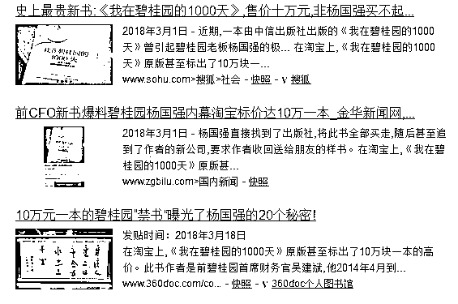

# 知名媒体走进碧桂园，进门就送香奈儿

今天，碧桂园发起了“走进碧桂园”活动，邀请全国知名媒体参观碧桂园，召开新闻开发布会，然后碧桂园又火了。

火在什么地方呢，据部分良心媒体爆料称，这次碧桂园下了血本，每一名到场记者，都单独配有一名专员接待，**进门就先送一盒香奈儿**。

图 1

图 2

而到访的所有媒体，当然也是按照老规矩，包接包送包吃住，五星级大酒店走起，我们在这份议程安排上的最下方可以看到，**机票、餐饮、住宿、交通**都专门安排了一个负责人，可谓是照顾的无微不至，方方面面都替媒体考虑到了。

你以为这就完了嘛，当然不会，区区一盒香奈儿那只能是伴手礼，随手送的而已，后面还有大红包呢。

大家都看到了，关于这个大红包，这个财经记者用了一个“据说”，是恶意揣测，还是确有其事？很快，就被其他媒体给扒出了图，有图有真相。

这个信封到底有多厚，就无从知晓了，打开这个信封的记者是绝对不会曝光的，曝光这个信封的记者也是不会打开的，所以里面的金额就永远是个迷了，不过从伴手礼的高档程度来看，这里面肯定不会是个小数。

为什么要塞大红包，很显然，吃人嘴软拿人手短啊，收了大红包，你还好意思说别人坏话吗？所以我们可以看到，今天主流媒体铺天盖地的给予了碧桂园正面宣传报道。作为一个良心自媒体，我不得不说，在碧桂园到处塌房，一个月死 7 人，伤数十人的大背景下，碧桂园搞这种送钱公关活动，真的是很蠢。而那些收了香奈儿和大红包的媒体人，就不是蠢了，那叫坏。这种群死群伤大背景下还敢收这样的礼物给碧桂园站台的记者，难道你就听不到废墟下面民工的冤魂在哀鸣吗？

上海碧桂园模架坍塌，工人被掩埋，1 死 9 伤

杭州碧桂园基坑塌陷，导致附近楼房成为危楼，江湖外号“五星级的大坑”

六安活动板房坍塌事故，6 死 10 伤，被侃五星级的家变五星期的家

历史上每次出了事故，财大气粗的碧桂园都是用糖衣炮弹去摆平媒体，这已经不是第一次了，而是持续了很多年了，多年以前，就有媒体报道过碧桂园的负面新闻，然后被碧桂园找上门来。

找上门来是打架吗？不是，碧桂园是来送钱的，碧桂园是很多媒体的大广告商，既然已经是大金主了，那自然不能得罪，负面新闻一律撤掉。

收了红包的记者，让怎么写就怎么写，而收了钱的媒体，则拒绝发布任何负面材料。

而之前，碧桂园前首席财务官吴建斌曾出版了一本书，叫《我在碧桂园的 1000 天》，这本书出版后杨国强直接找到了出版社，把所有的存书全部买走并直接买断了这本书，然后甚至追到了作者的新公司要求作者收回给朋友的样书，力求没有一本书流落在外，在淘宝上，正版的《我在碧桂园的 1000 天》已经成为了绝本，**标价 10 万块一本**。

哦对了，还有一件事，最先曝光碧桂园给每个记者进门就送香奈儿当伴手礼的微博，已经被删除了，存活时间大概只有 2 个小时，今天中午就不见了。

在今天的发布会上，碧桂园董事局主席杨国强现身表示，我赚这么多钱为了什么，我要为社会和民族复兴多做一些事情，我是真心的去做这些事情。我感觉自己是天底下最笨的人。这句话和对应视频被媒体当成正面材料被广为宣传。

但是没想到的是，这句话瞬间就火了，好事的网友立刻写出了新段子，天下最笨杨国强、不知妻美刘强东、普通家庭马化腾、悔创阿里杰克马、一无所有王健林、下周回国贾跃亭、名下无房潘石屹。

这次碧桂园之所以召开媒体见面会，是因为在过去的一个多月时间里，碧桂园在全国多个工地发生事故，造成大量死伤。所以今天走进碧桂园的，应该是死难者家属和受伤工人，而不应该是那些收了钱就只会抬轿子的所谓媒体。碧桂园应该反思的是自己的高周转制度，而不是觉得自己是最笨的人。

碧桂园的客户多在三四线城市，很多人一辈子都没见过香奈儿，如今他们的房子出了事，来报道的记者反而人手一盒香奈儿回家了，你们这些记者良心不会痛吗？

而这次的大红包，一个就堪比三四线城市购房者几个月的血汗钱，碧桂园不思提升质量和口碑，反而给各路记者发红包封嘴，这种行为合适吗？

与其**公关媒体，不如提高自身**，**媒体的笔只能改变短期的舆论，而民众的嘴才能改变长期的舆论**。

碧桂园，你的安身立命之本是**购房者的口碑和评价**，而不是那些媒体和记者。

觉得此文的分析有道理，对你有所帮助，

请随手转发。

*今天的活动，主流媒体和知名大 V 都在被邀请之列，我也被邀请了，但是我没去，去的话真的就说不清楚了。正好我昨天也请假出去谈事情了，时间高度重合啊，不过我今天回来了，今天周五本来夜报是应该不写的，为了证明我今天没去参加碧桂园的活动拿大礼包，我决定今天晚上连发 2 个夜报做一下大新闻评论，放在第二条和第三条推送来证明我今天真的很忙，没有参加活动的时间。*

长按下方图片，识别二维码，即可关注我

近期精彩文章回顾（回复“目录”关键词可查看更多）

华为员工都这么穷，怪不得拼多多能火 | 房价跌 20%就会全面崩盘，地产杠杆远比你想的要脆弱 |  为什么碧桂园的质量那么差 | 清醒点，放弃全面开征房产税的幻想 | 央行和财政部隔空掐架，我支持央妈