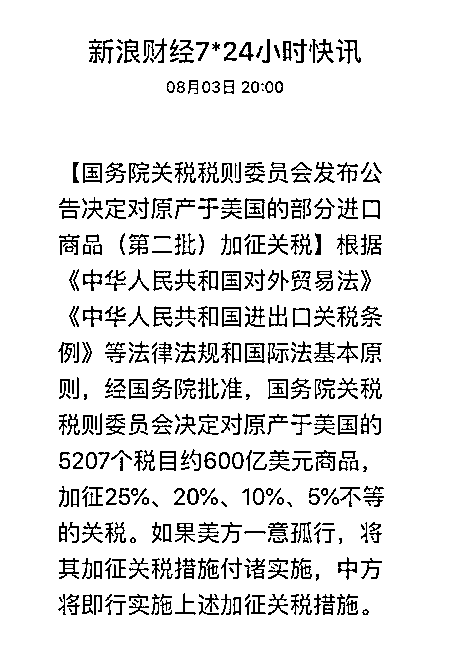

# 中国对美国发动了全面反击

今天，重磅新闻爆出，国务院关税税则委员会决定对原产于美国的 5207 个税目约 600 亿美元商品，加征 25%、20%、10%、5%不等的关税。如果美方一意孤行，将其加征关税措施付诸实施，中方将即行实施上述加征关税措施。

俗话说，新闻越短，事情越大，这一次中国是坚决的对美国发动了反击。

在前一段时间，美国特朗普先是恐吓中国要对 2000 亿美金商品加征 10%的关税，然后又恐吓要对中国 5000 亿美金商品加征 10%的关税，中国政府明确表示对这种极限讹诈的行为强烈反对，拒不接受美国的讹诈和胁迫，希望美国能回到谈判桌进行平等自由的协商。

出于对美国的善意和诚心谈判的因素，中国在前一段时间并没有强硬回击美国的挑衅，始终追求以善意谈判为解决手段。

但是美国不仅无视中国的善意，反而步步紧逼，在前几天，特朗普公开宣布要对中国 2000 亿美金商品将额外关税从 10%提升到 25%。

所以我们可以看出如果始终沉默，始终以和平谈判作为诉求的话，那是谈不出什么结果的，美国会不断的提升关税来进行更极限的讹诈。

所以，此次中方决定对自美进口的约 600 亿美元产品按照四档不同税率加征关税。

根据公布的信息，四档具体税率分别是：25%、20%、10%和 5%，涉及 5207 个税目，其中：

2493 个税目商品，加征 25%的关税；

1078 个税目商品，加征 20%的关税；

974 个税目商品，加征 10%的关税；

662 个税目商品，加征 5%的关税。

同时，中方明确宣布，如果美方一意孤行，将其加征关税措施付诸实施，中方将即行实施上述加征关税措施。

意思就是，中方宣布了这个关税政策，但是暂不执行，依然欢迎美国重新回到谈判桌来和平解决，如果美国单方面宣布了加税，那么中国也只能被迫跟随加税，中国不希望打贸易战，但是美国如果执意要打，中国也只能奉陪到底。

中国人不挑事，但是也不怕事！

觉得此文的分析有道理，对你有所帮助，请随手转发。

长按下方图片，识别二维码，即可关注我

近期精彩文章回顾（回复“目录”关键词可查看更多）

华为员工都这么穷，怪不得拼多多能火 | 房价跌 20%就会全面崩盘，地产杠杆远比你想的要脆弱 |  为什么碧桂园的质量那么差 | 清醒点，放弃全面开征房产税的幻想 | 央行和财政部隔空掐架，我支持央妈