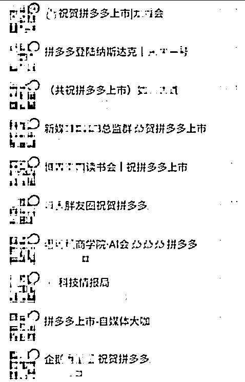
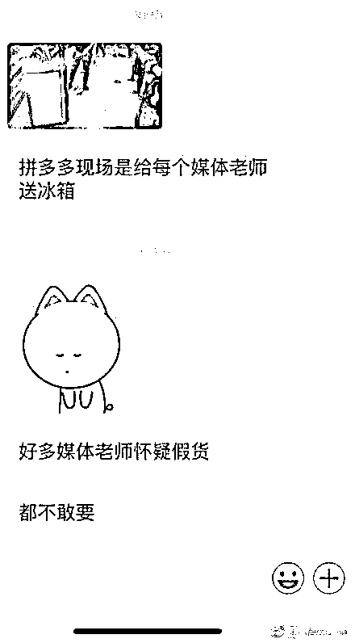

# 拼多多也曾给媒体送礼，但是却无人敢要

我今天在头条，写了关于碧桂园给媒体人手送一份香奈儿当伴手礼，并悄悄塞了一个大红包的事情。但是很多读者却不知道，在前几天拼多多上市的时候，也曾广邀媒体前来捧场，也是人手送一份大礼包，但是却无人敢要。

拼多多上市前，摆平了很多媒体，都塞了不少钱，甚至这些媒体的微信群都改成了这样的名字。

对媒体是很大方了，直接塞现金，但是对来 IPO 现场报道的记者，拼多多却出现了致命性的战略失误，他这次没塞现金，人手送了一冰箱。

送冰箱是好事啊，然鹅什么呢，然鹅的是，这些媒体虽然都在恭祝拼多多上市，但是自己都不傻，怀疑这冰箱是假货，都不敢要。给现金就敢要，给货就不敢要。。。

这些媒体老师自己都不敢用拼多多送的货，却拼命的夸拼多多，这种言行不一的行为严重的抹黑了媒体行业，也说明了传统记者行业为什么从无冕之王，变得越来越不得人心的原因。

没有广告媒体活不下去，所以接广告可以理解，但是请注意底线，已所不欲勿施于人，自己都不想用的东西，千万不要推荐给别人，那是昧着良心在赚钱。

媒体，要有媒体的操守，也要有媒体的底线，君子爱财取之有道，否则你就不配从事媒体这一行业，那些去拼多多上市现场的媒体老师们，你们为什么不敢要那台冰箱。

觉得此文的分析有道理，对你有所帮助，请随手转发。

长按下方图片，识别二维码，即可关注我

近期精彩文章回顾（回复“目录”关键词可查看更多）

华为员工都这么穷，怪不得拼多多能火 | 房价跌 20%就会全面崩盘，地产杠杆远比你想的要脆弱 |  为什么碧桂园的质量那么差 | 清醒点，放弃全面开征房产税的幻想 | 央行和财政部隔空掐架，我支持央妈