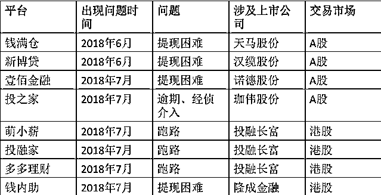
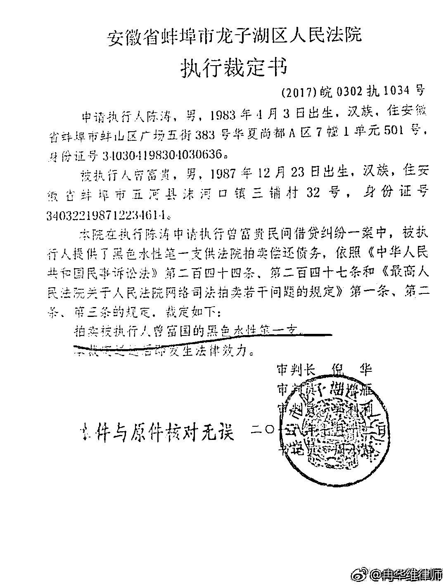
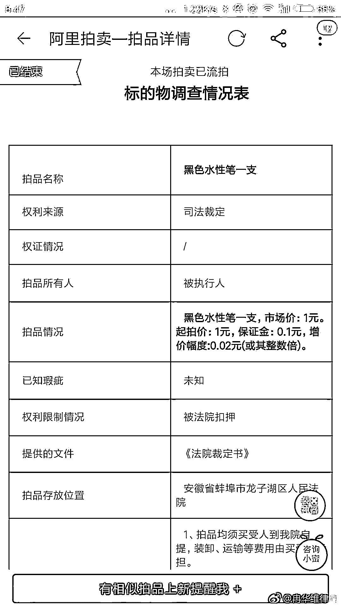
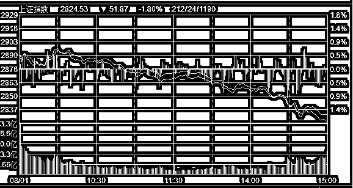
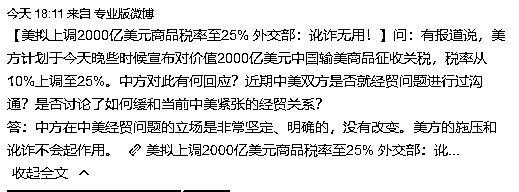

# 夜报||又一家航母级 P2P 倒下了

又一家 P2P 巨头出事了，这次倒下的是草根投资，这家 P2P 有多么牛呢，成立于 2013 年的草根投资，先后完成了 4 轮融资，投资方不乏顺为资本这样的知名基金以及华闻传媒等上市公司，甚至在股东方里还出现了广州基金和的身影。

根据草根投资官网介绍，草根投资兼具上市系、国资系、风投系背景，且已经与中国建设银行浙江省分行达成合作，并于今年 1 月入选了由杭州市创业投资协会发布的“杭州独角兽企业”榜单。

注意哦，他曾名列独角兽名单，如今墙倒众人推，广州基金、人保财险、汇银控股先后发布公告，澄清与草根投资的关系。其中，单方面宣布与草根投资战略合作终止的港股上市公司汇银控股，半个月前才刚刚签订这个战略合作协议。

而在前一段时间曾被大肆宣传的草根投资 D 轮融资，总金额高达 23 亿元，号称网贷行业迄今为止最大的单笔融资，领投方是上市公司洲际油气，如今在洲际油气的公告中声称，只是签署了投资意向书，没有实际投资，和草根投资没有一毛钱关系。

从 6 月 P2P 平台爆雷潮爆发以来，多家上市公司试图撇清与 P2P 平台的关系。

还能怎么说呢，雷潮还在继续，我在 6 月初就给大家报警了，要求全部落袋避险，如今一再验证，雷声滚滚，建议小心为上，半年之后再来也不迟。

~~~

否则的话，一旦你的钱没了，去要债那可就难了，看看下面这个民间借贷纠纷强制执行案，法院强制执行了一只黑色水性笔。。。

一块钱，真是大气，震到我了。

~~~

剩下的最后一段，本来应该是大写特写的，但是完全不敢写。今天上午，A 股涨的本来好好的，结果突然跳水，从上冲小阳到中阴。

大家知道为什么吗？这个新闻报道就说明了，我就不写了

这个黑天鹅真的是超级超级大只的，没办法硬吃了，真的是在赌国运啊，国家赢则我们赢，国家输则我们输。今天早上明明有国家队硬当多头打算向上冲击，结果也给砸傻了。

今天就先写这么多，明天提前请个假，有要事要出差谈一天，周五见。