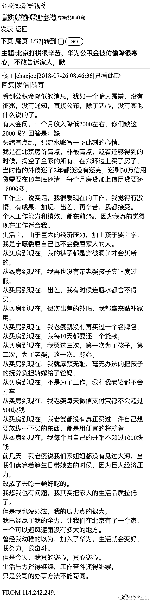
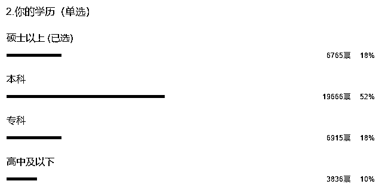
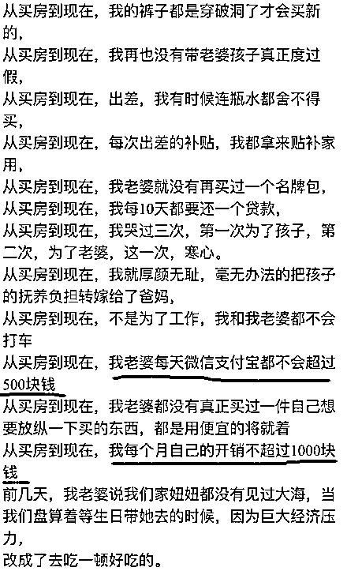
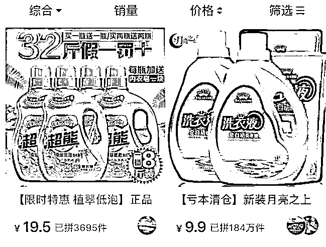
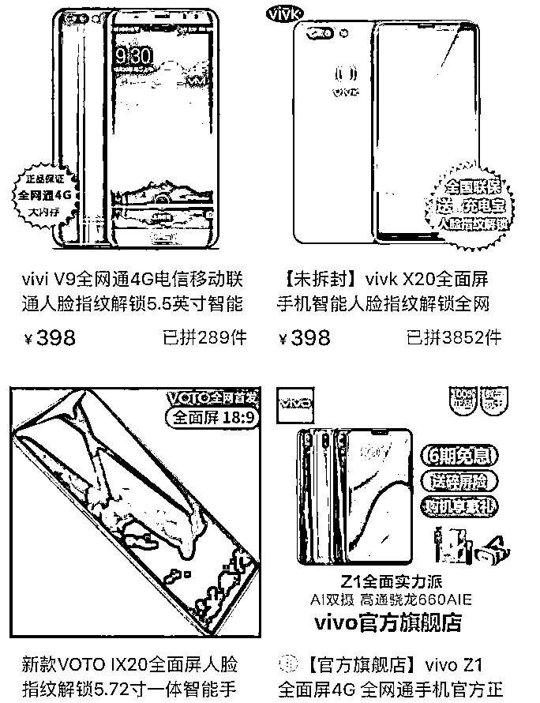
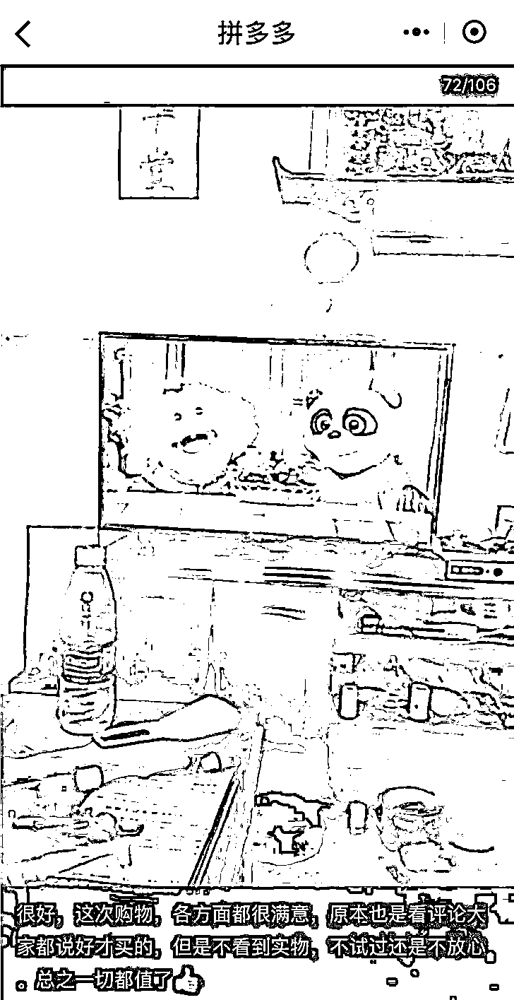
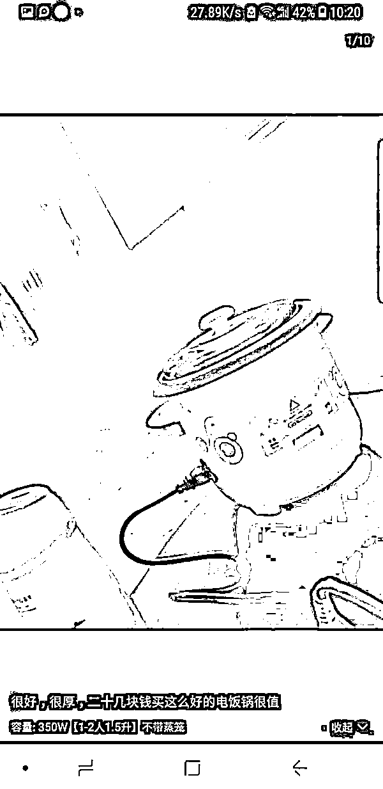
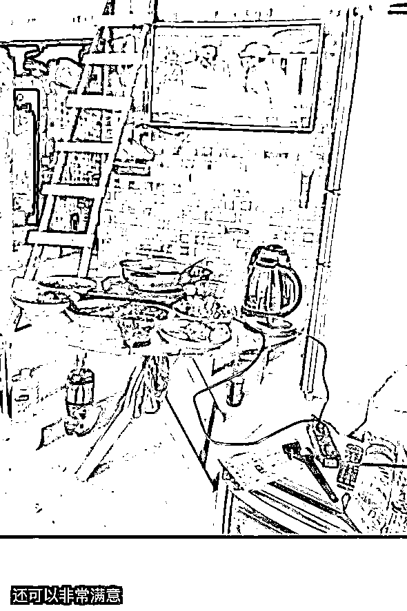
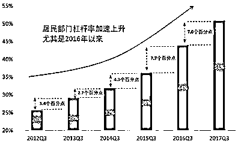

# 华为员工都这么穷，怪不得拼多多能火

在 7 月 26 日，有一名华为员工在网上公开发帖，爆出华为北京员工降低公积金一事，经媒体核实，原来华为在全国各地都是按照最低标准缴纳公积金，为 5%，但是北京的公积金标准一直是 12%，这些天北京刚刚下调了标准华为立刻跟进，于是这位华为员工的公积金账户每个月就少了 2000 元，估计是捅了财务篓子了，于是这位财务濒临崩溃的华为员工就爆发了。

（先给大家看看原贴）

华为方面回应称，依据《关于改进住房公积金缴存机制进一步降低企业成本的通知》和“同地同标准”原则，华为公司现在将北京、上海、成都、济南、杭州和廊坊等地住房公积金缴存比例调至 5%，与深圳等地缴存标准一致。

我给大家梳理一下这个帖子，首先，北京的标准从 12%降低到 5%后，这位华为员工吐槽自己的收入少了 2000 元，按照 7%计算，这位华为员工的月入在 28500 之上，如果扣的钱不是 2000 整，是 2000 多一点的话，那么他就是月薪三万的存在。

月薪三万是个什么概念，年入 36 万，这仅仅是工资，加上华为的各种奖金、补贴，年收入妥妥的破 50 万，破 50 万是个什么概念呢，我的粉丝群体收入远超中国平均值，这个数据都能排到前 4%，如果放在全国，估计是前 0.4%。

贴一个以前我做的调查表

可以看到，我的粉丝群体学历远远超过中国人平均 3.69%的本科率，收入当然也是远远超过。

关于这个中国人均学历的数据，可以参考我之前写的《中国只有 3%的人具有本科学历，还有 3000 万人穷的超乎想象》，关于人均收入，可以参考《月薪 5000，你将碾压 95%的中国人》，这些数据当初不被公众认可，我是率先科普，现在也慢慢的被很多人所接受了，我看到很多媒体也在科普这些的数据了，美团总裁王兴也公开发了这么一篇说说。 

好，这位华为员工的收入这么高，属于全国绝对精英，手头一定很阔绰吧，我以前也认为是的，现在看来我是被这个华为员工给科普了，年薪 50 万，原来活的穷如狗。 

这位华为员工说，在北京买了房之后，掏空全家六个钱包，还借了很多外债，外债还了 2 年也没还完，每个月要还贷 18000 元左右。

这位华为员工肯定是很优秀的，在华为这种人才济济的残酷竞争环境中，绩效考核居然还能排到前 5%，但是这样优秀的人才，用了一长串的排比句来形容他活的惨状，表面看起来是在北京有房的高收入人才，实际上全在给贷款打工，我依稀看到了一个感觉对未来满怀希望但是实际被剥削的一干二净的农奴。。。

年薪 50 万的人，一个月个人消费不超过 1000 块，老婆的支付宝余额常年不超过 500 元，只能用一个惨字可以形容，年薪 50 万的人个人消费只有这么一点，这也给我们解释了一个疑惑，为什么在中国 GDP 排到全球第二的时候，中国人消费能力枯竭的那么厉害，中国成长最迅速的公司，居然是专卖低质低价货色的拼多多。 

**拼多多的崛起**

就在华为员工发帖控诉自己凄惨生活的同一天，7 月 26 日夜里，拼多多宣布登录美国纳达克斯，开盘价 26.5 美元/股，较 19 美元/股的发行价上涨 39.47%，显示资本对这家公司的强烈看好。

拼多多这家公司，市值已经达到了 240 亿美元的规模，而从 0 到 100 亿，淘宝花了 4 年，京东花了 6 年，而拼多多只用了 3 年。

俗话说 80%的利润是由 20%的顾客创造的，那么拼多多是不是得到了全球第二大 GDP 国家中大部分富人的信赖呢，还真不是，拼多多专卖低质低价货，目标人群根本不是富人。

拼多多上的爆款，一般都是这个样子的。

三星大彩电只要 388，创造了奇迹，当然，虽然这个商标长的很像三星，但是实际上肯定不是三星，你仔细看看，会看出差别的。

还有这款**超熊洗衣液**和一个售出 184 万件的超级爆款月亮“之上”洗衣液。。。

还有 VIVO 手机的孪生兄弟，VIVI，VIVK、VOTO 手机,还别说，我写这篇文章的时候对着图片都敲错了好多次，实在是太像了。。。

这是在卖假货，严重侵犯农民兄弟的智商和利益吗？还真不是，连年薪 50 万的华为精英，月消费都只能控制在 1000 元以内，那些三四线城市月薪只有二三千的小员工，甚至更低的农村人，他们一个月能有多少钱拿出来消费？二三百？还是一二百？

他们的很多家庭，已经很长很长时间没有置办过家电了，不是不想消费，是不敢，望着那高高在上的标价签，只能默默回家。实际上，农村乡镇市场向来都是假冒伪劣商品的聚集地，性能特别差，价格也不算特别便宜，论性价比其实远远不如拼多多。拼多多卖的货，质量当然不怎么样，但是价格实在够便宜，让很多贫困人口买到了以前想都不敢想的消费品，我们来欣赏一下拼多多买家秀。

这位购买 388 元大彩电的兄弟认为这次的消费非常值，因为这个彩电有效提升了家庭幸福水平。

这个 20 多块钱的电饭煲。。。当然也很值了，说实话 20 多块钱的电饭煲把我震到了，运费多少钱了。。。

翻翻拼多多的买家评论，绝大多数人都对买来的商品很满意，就冲这个价格，我都可以武断的判定这些商品质量一定不怎么样，用一段时间之后必定毛病百出。要是质量好还这么便宜，早就统治地球了，但是质量差，但是依然不能阻挡好评如潮。

为什么会这样，我们其实可以从上图买家秀的背景中看到，这些家庭是非常贫困的，家庭装修简单粗暴的透露了他们的家庭财力状态，比较典型的，就是下图这位电视机的买家秀图片，就凭这个图片我都能猜出他们的家庭年收入大概情况，肯定远低于全国平均值。

拼多多的崛起，完美的昭示了中国处于消费降级的道路上，服务于穷人的拼多多和榨菜火了，服务于富豪的茅台也火了，而原本应该是国家消费主力军的中产，因为个个背负房贷，实际消费能力连农民工都不如。拼多多发展迅速的日子，正是中国居民大规模加杠杆的时间，15 年底房价开始暴涨，而居民部门杠杆率从 16 年开始加速上升。

这个杠杆加到了什么程度呢，全国人民都没钱了，看似手里有大堆的房产，账面资产非常多，但是就是没有现金，没有现金也就算了，每个月到手的工资，大部分都直接被拿走了，各种贷款压力直接把居民给吸成人干了。

强如年薪 50 万的华为精英，月消费也就那个样子，1000 元，靠这点钱能拉动什么经济，拼多多火起来那是理所当然啊，中下层群众手里是没钱，但是他们也有享受好生活的欲望和权力。

对了，那位因为每个月减少了 2000 元公积金收入而满腹牢骚上网发帖抱怨的华为员工，既然怨气那么大，他会因此辞职吗？放心他不会的，因为他有房贷压力在，他没那个胆子辞职。

觉得此文的分析有道理，对你有所帮助，请随手转发。

往期回顾（回复“目录”关键词可查看更多）

香港人说，香港房价必须这么贵！| 刚性兑付是一种骗局 |成本 200 的百姓救命药卖到 2 万一盒，难道没钱就得死？| 中国的房价什么时候会崩盘？| 你根本不知道烟草公司有多赚钱 | 中央这次打击三四线城市房价的决心为何如此坚定| 我是如何保证自己不近视的 | 魏忠贤其实是个贤臣 | 2 分钟了解中国 50 年的艰辛发展史 |历史数据表明：中国最赚钱的职业十年一个轮回 |大利空，货币化棚改权限被收回