# 荐读|| 原来，只需一个冰柜就能测出城市冷暖

**文/小飞**

前段时间，收割机轮番开动。

有华帝承诺退全款后的出尔反尔，

有碧桂园赶工期造的五星期的家，

有为了牟利罔顾生命的长生生物，

还有对投资人毫不手软进行收割的跑路 P2P。

人们都调侃，遍布世界的镰刀，总有一款收割方式在等着你。

于是你越发的相信，在这个物欲横流的社会，资本逐利的本性已经深深地印刻在每个人的身上，善良和真情早就一文不值。

但是我看到的是，有良知的人一直在我们身边，他们在努力用自己的善良改变着世界，哪怕只有一点点。

刷频的冰柜

事情先是发生在杭州。

在杭州文三路出现了一个装满免费冷饮、无人看管的冰柜。

冰柜旁边的告示上写明，为快递小哥外卖员、交警和环卫工人免费提供。

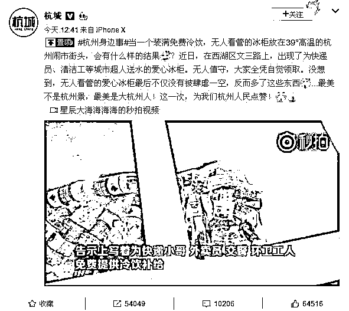

活动持续了 5 天。在这 5 天里，摄像头记录下了发生的一切。

有两个男孩子，从冰柜里拿出了两瓶水，打开后才看到告示内容，于是翻遍全身、掏出零钱放回了冰柜。

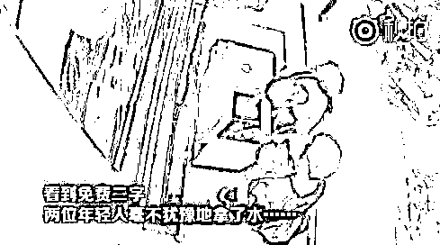

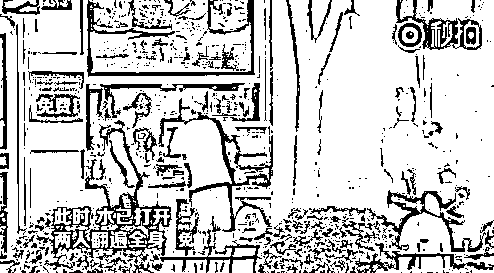

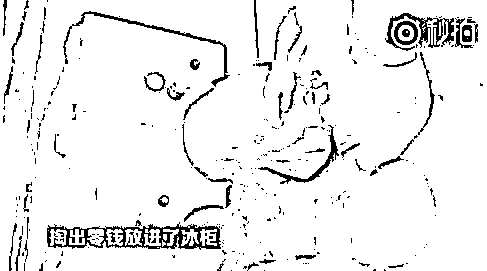

有一位女生，拿出冰棍后发现了告示内容，于是又默默地将冰棍放了回去。

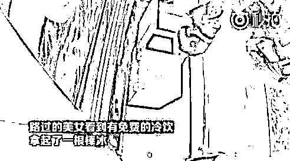

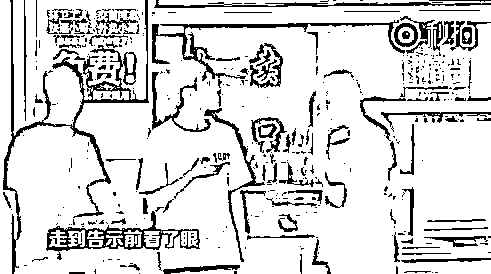

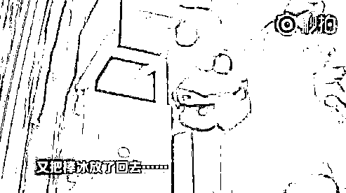

一位路过的大爷，不仅没拿冰柜里的东西，反而从自己的袋子里掏出一个苹果放了进去，还是选的较大的苹果。

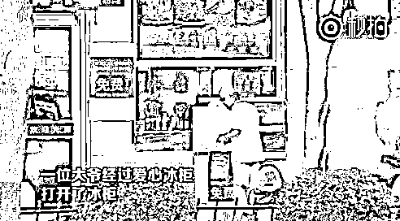

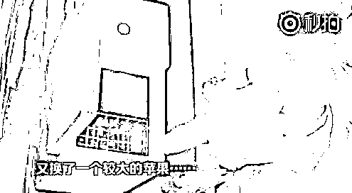

还有一个小男孩，没从冰柜里拿东西，而是往冰柜里放了封信。

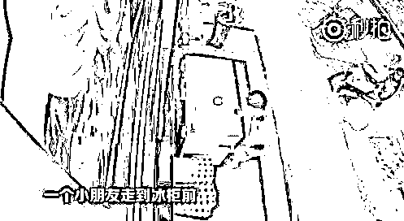

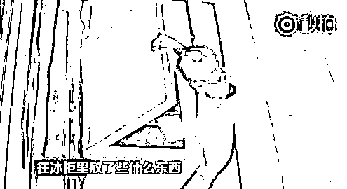

原来是特意写的感谢信。

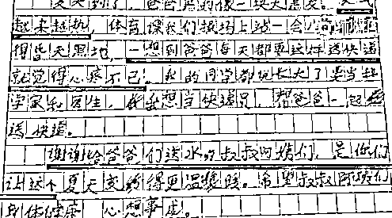

上海街头也出现了免费的冰柜。

在上海普陀区曹杨路地铁站，出现了一台装满冷饮、无人看管的冰柜。

同样的高温天气，同样的免费冰柜，会不会出现同样的暖心举动呢？

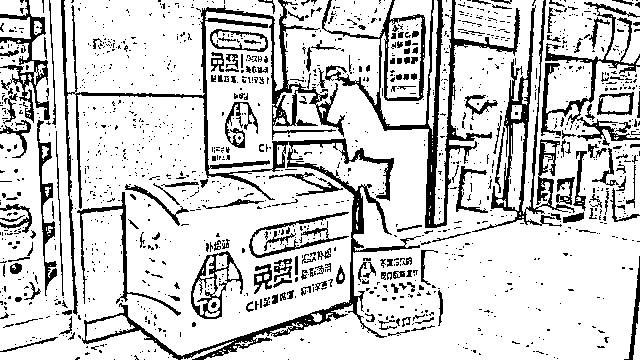

出现了一位小姑娘，从冰柜里拿出了一根冰棒。还没来得及拆开，她妈妈看到了一旁的告示，就让她把冰棒放回去了，然后去了旁边的超市买。

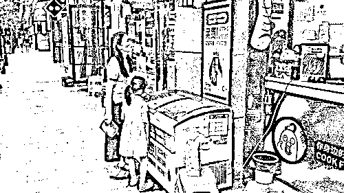

渐渐地，有越来越多的快递小哥发现了冰柜，并且很开心地拍照，像是在告诉其他小伙伴。

果然没过多久，就来了不少快递小哥陆续过来取冷饮。但是每个人都很自觉地只取一瓶。

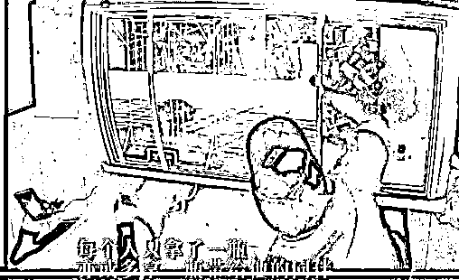

有一位环卫工阿姨，顶着烈日在劳作。当工作人员告诉阿姨这里可以免费取水时，阿姨很开心，但是却拒绝了：这怎么好意思拿，还是给更渴的人吧。

到最后，当工作人员递水给阿姨时，阿姨一直说谢谢。

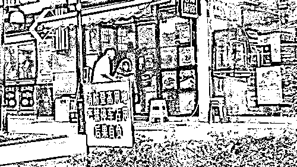

有一位小伙子，从冰柜里拿出一瓶水后，又从口袋里掏出几枚硬币放了进去。

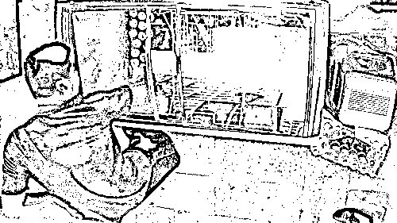

在隔壁超市工作的一位阿姨，发现冰柜后，转身回超市抱出了一箱雪碧，整整齐齐地放进了冰柜。

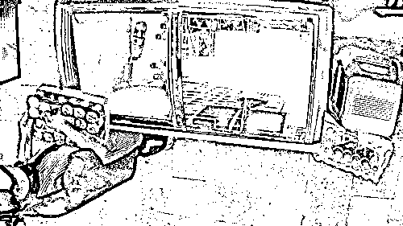

路过的一位年轻小伙子，看到冰柜后拍了几张照片走了。不久后居然抱着两盒西瓜回来，放进了冰柜。

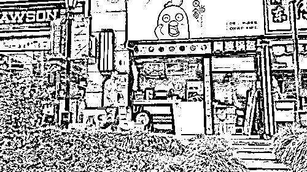

冰柜还在，暖心举动也在接力。炎炎烈日下，冷饮消除的是暑热，温暖的却是人心。

我居然被这两个小小的冰柜感动到。

谁都想被这个世界温柔相待。

你在温柔对待别人的同时，别人也在温柔地对待你。

也许今天他是烈日下奔波的快递/外卖小哥，但明日他就成了给救护车引路的英雄。

也许今天他是顶着高温工作的环卫工人，但明日他就成了拾金不昧的恩人。

还有更多的、为我们的城市默默奉献着的交警、公交车司机、老师、医生等等。

今天我们能体谅别人，明天别人就能体谅我们。

每一个人的爱心与善意微不足道，但是长此以往，涓涓细流必定能汇成滔滔江海。

最近的负面新闻太多，以至于大家对社会都下意识感到绝望。

但其实在现实中，身边类似这样的温暖细节无处不在、无时不有，只不过是被我们忽略了。

免费冰柜的出现恰是一个契机，把大家的善良与爱心都激发了出来，让更多的人感受到了城市间温暖的善意。

谁都愿被这个世界温柔相待。

正如一位网友的评论，希望有一天，「爱心冰柜」不再成为新闻，人人视之如常。

