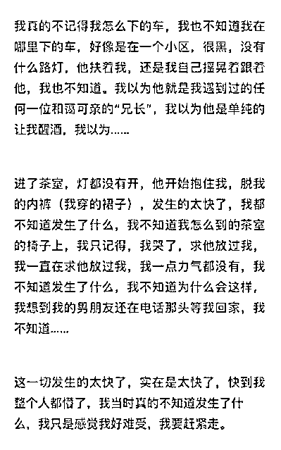
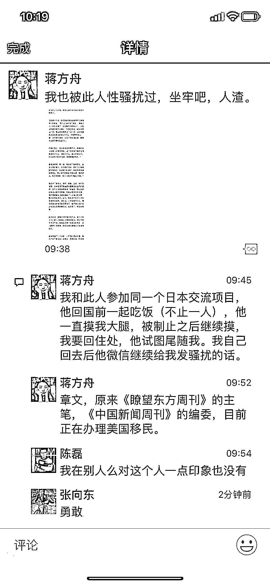
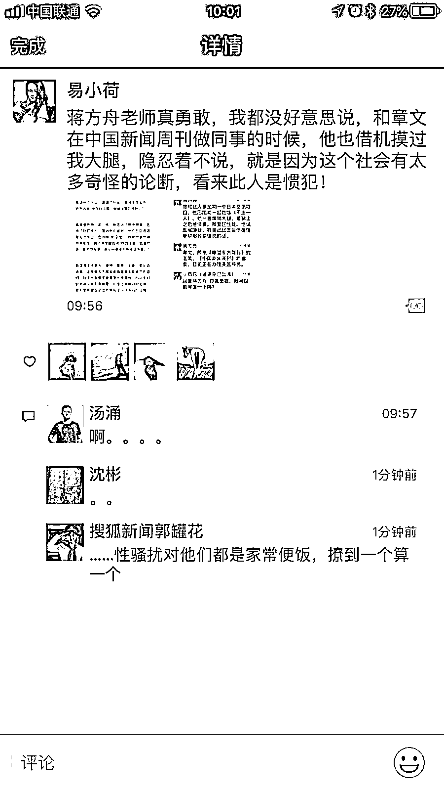
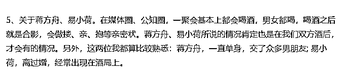
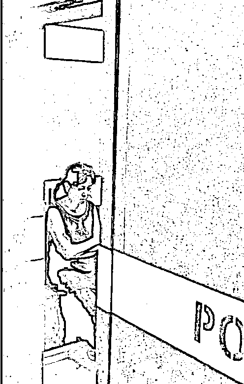
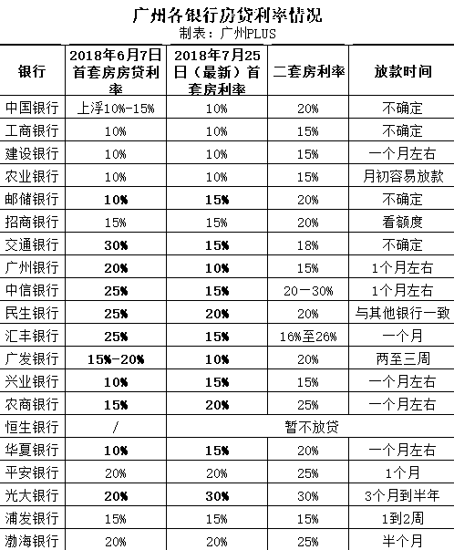
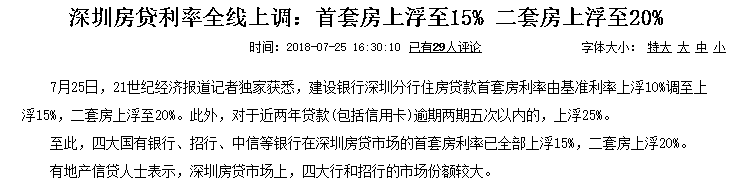

# 夜报|| 今天刷爆朋友圈的，居然是性侵

lass="" data-copyright="0" data-ratio="0.0828125" data-s="300,640" src="http://mmbiz.qpic.cn/mmbiz_jpg/vVoVQ59VnF7pjKibM5nc3cXt2QIbjAjfRPFKsE447q0Gd6NhZ60rnLUGiayiblD7bJjicw3Px3Yfiadf5YcDrO9mabA/640?wx_fmt=jpeg" data-type="jpeg" data-w="1280" style=""/>

今天，刷爆朋友圈的居然是一个性侵指控。前两天，有一位女生在微博匿名举报，发布了一篇《章文，请停止你的侵害》，以长文细细描写了事件经过，明确指控章文强奸自己。

据作者称，章文是自己导师的好朋友，在一次饭局上因为自己严重醉酒，被章文带到了一个“茶室”然后实施了性侵。

这本是一起普通的民事案件，报案后让警方秉公处理就可以了，章文只能说小有名气而已，之所以能火，是因为另外二个名气挺大的媒体人同一天发朋友圈指控章文曾对自己性骚扰，这下事情就大了，首先开火的是作家、媒体人蒋方舟。

然后资深媒体人、记者易小荷也发声指控。

这二位都是媒体圈挺出名的人，朋友圈也很广，换到其他地方的普通桃色案件，在这里瞬间火爆全网。

而章文也发布了澄清声明，大意就是这件事有女方暧昧的因素在里面，不完全是他的责任，他不认为这是强奸。

首先对这件事定个义，性侵、性骚扰肯定是严重不对的，不管什么原因，只要做过，就有错，章文这个声明，很明显侧面承认了自己做过，那就什么都不用说了。

然后，我今天最想关注的，不是性侵案，是疫苗后续处理啊，今天的头版头条本来应该是长生 X 物董事长高某芳被逮捕的图片新闻，而不是桃色性侵八卦新闻。

不知道她在沉思什么，应该很后悔吧，不过晚了。今天是周三，果然火不过三天，主流媒体的注意力就换了。。。

据公告，兴业证券手握 1.78 亿股的长生生物质押股，而长生生物目前有退市风险，至少也是几十个跌停，据记者了解，事件爆发后，兴业证券开展了积极应对举措，但是这些股票都是限售股，是无法出售的，当然实际上卖也卖不掉。

至于让大股东补钱那是更不可能的了，一分钱都拿不到，所以股份转移到兴业证券名下指日可待。

网友评论：股权质押，一不小心质押成大股东了，可以改名叫兴业生物嘛

今天，我看到一个新闻标题，说广州六大银行下浮房贷利率，交通银行利率从上浮 30%改为上浮 15%，砍了一半。

我当时就震惊了，央妈不是说从降杠杆改为稳杠杆嘛，这尼玛哪是稳杠杆啊，这是重新上杠杆吧，这么快的放水速度。。。

后来我仔细查了一下，这个报道有问题，属于故意报道部分事实，实际上，广州的利率下降的有限。

而与此同时，隔壁的深圳市，利率则全面上浮，再度对房价形成压制。

这种调控说明二点，第一点这一波放水暂时没有影响到对房价的调控，利率政策没有改变。第二点是政府实行的是多地轮换制度，这里收紧一点，那里就放松一点，循环控制，避免全国形成统一预期，这一点我昨天的头条文章也说明了类似的道理。

有可能是冲上去的，但是必定很困难，如果满仓，提心吊胆，万一冲关失败，那满仓又下去，那种感觉是非常难受的。

所以，先卖一部分的话，如果跌下来，继续买入摊低成本，如果冲破 3000 点，那就必定攻击 3100 点，打下 3100，这一波大抄底就全红了，因为我们是 3100-2850 分批一层层抄底的。

至于 3200，几乎没可能打下来，还记得我们上次 3200 卖了一波打算做第一批落袋嘛，结果直接逃在了最高点，实际上根本没人认为那里是最高点，我也是，越长越卖的铁则才让我们恰好幸运逃顶了。

而这一波，是 2700 启动的，涨到 3200 难度太大，这里我卖到几乎空仓都可以考虑。

那个有点远了，3000 之前是必定要减仓的，一口气上去难度超乎想象，这里必有抛压，不用分析都知道，而证监会是千方百计的要重回 3 字头的，让他们攻关去吧，我们先休息，所以 2956 之上，要先卖 3 成再说。