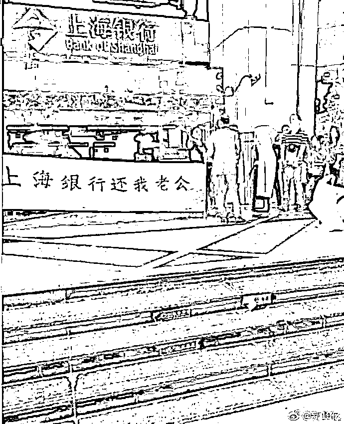
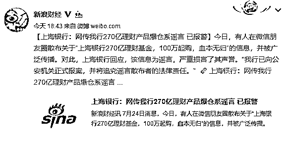
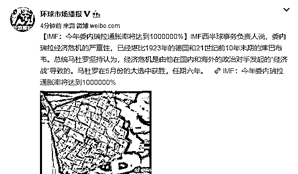
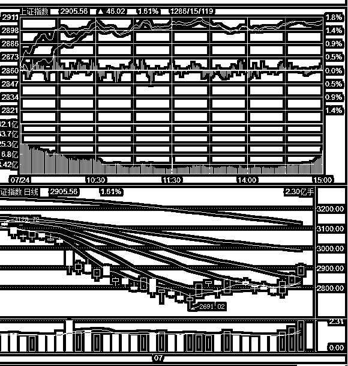
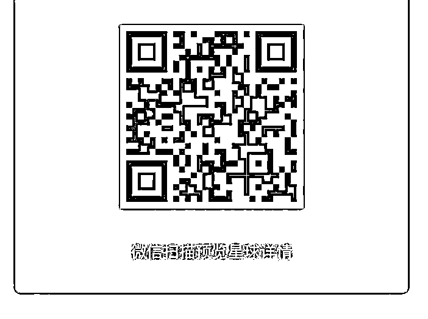

# 夜报||上海银行被围堵，270 亿私募资金血本无归

lass="" data-copyright="0" data-ratio="0.0828125" data-s="300,640" src="http://mmbiz.qpic.cn/mmbiz_jpg/vVoVQ59VnF7pjKibM5nc3cXt2QIbjAjfRPFKsE447q0Gd6NhZ60rnLUGiayiblD7bJjicw3Px3Yfiadf5YcDrO9mabA/640?wx_fmt=jpeg" data-type="jpeg" data-w="1280" style=""/>

预告，今天送粉丝福利，万 1.5 开户，放在文章末尾。

今天，一张图片在朋友圈被刷屏了，上海银行被投资人围堵封门，据称是理财资金遭到重大损失，损失资金在 270 亿元左右。

随后，上海银行公开辟谣，说“上海银行 270 亿理财基金，100 万起购，血本无归”属于谣言。

如果是谣言的话，那么图片的真相是怎么回事呢，我点开了新闻稿看了一下。原来，270 亿元资金损失确有其事，上海银行对媒体表示，上海银行还表示，该谣言所涉“理财基金”非所发行的理财产品，也非上海银行代为销售的理财产品，而是阜兴集团旗下三家私募基金管理人发行的私募股权投资基金；上海银行只是托管银行之一。

而之所以投资人会来银行闹事，是因为这家阳光私募跑路了，人都找不到了，公司也消失了，没办法才来找托管行的麻烦，看看能不能捞一点损失回来。

这次涉及的资金，民间称是 350 亿，银行称是 270 亿，全是 100 万起购的大户，正规银行正规私募，结果灰飞烟灭跑路了。就算按照 270 亿来算，这也是一笔大钱啊，P2P 坑的是小户，这里坑的全是大户。

怎么说呢，18 年还是小心点，风险性投资少配置点，在风险到处暴露的时候，银行理财性价比还是挺高的。

~~~~

我今天还看到另外一个好玩的新闻和大家分享一下，媒体报道，委内瑞拉今年的通胀率上涨到了。。。。没仔细数，反正好多个 0.

这个国家算是废了，他们的钞票上厕所都嫌硬。。。

~~~

今天，股市继续突飞猛进，量价齐升，配合完美，上涨 1.6%，突破 2900 点。

而且很有意思的是，今天早上就直线拉升到 2900 点附近了，直线爆拉，然后始终高位震荡横盘，异常的强势。

仅仅从今天早上的走势，就可以看出，这一波还没有涨完，后面还有的涨，2900 点并不能满足我，实际上，接近 3000 点我才会考虑卖出，而且只卖 3 成，后面的更高我才会考虑卖。

区间震荡操作法则就是这样，下跌不慌，越跌越买，涨了不贪，越长越卖。

今天不好意思，头条那篇文章，涉及数据和分析太多，写的很困难，所以耗时过长，所以今天发的很晚，大概就这样，股市部分的分析，都是月级别的操作，一个月我大概只操作一次，每天都是只观察，以防出现异动，大部分时候，都是按照既有计划行事。

~~~

接下来，送粉丝福利，现在券商价格战越来越激烈了，这几天居然有个券商找我来合作，愿意万 1.5 开户，远远比以前的券商给的价格要低的多，可以说低到理论极致了，而且是一个上市公司券商，非常靠谱。

名字就不说了，和万 1.5 字眼放在一篇文章里，属于绝对违规，要被处罚的，所以我把开户链接和名字都转移到知识星球了。

佣金不是个小数，据统计，以资产 10 万计算，每年的佣金大概在几千元左右，如果能换一家更低佣金的券商，每年能节省好多好多个鸡腿。

图知识星球