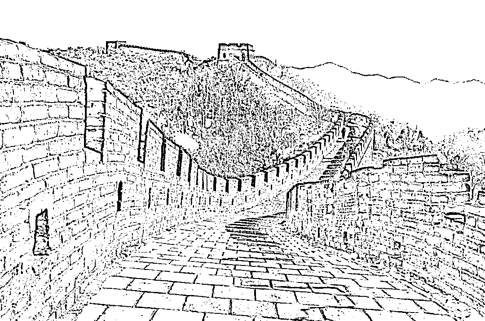
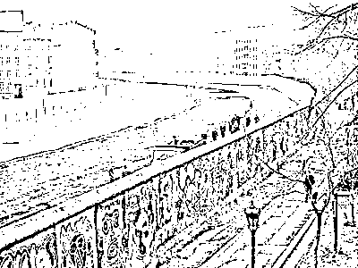
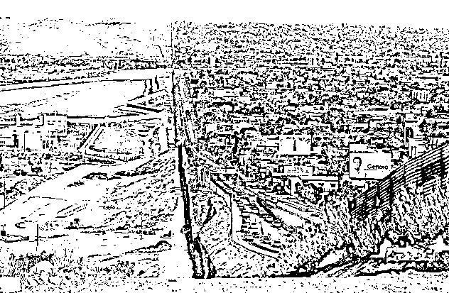
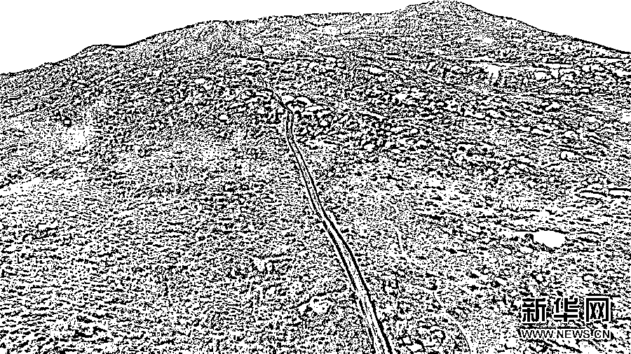

# 长城那么单薄，是如何挡住蛮夷大军的

喜欢我的都关注我了~

万里长城是世界奇迹之一，是古代中原王朝智慧和国力凝聚的精华，但是凡是去过长城参观的人，都有一个很大的困惑，长城这么单薄，有啥用，它是怎么挡住蛮夷大军的。

长城大概就只有图中这么薄，也并不高。如果是一百人守长城，一百人在下面攻长城，城防还是有用的，肯定是守军必胜。

但问题是，长城太长了啊，万里长城，横亘中国北部，按照一里城墙布一个士兵计算，要耗费万名精兵。以大明朝为例，全国的军队也就百万左右，而根据古代屡禁不绝的吃空饷习俗，给一万的编制里面能有二百个能打的就不错了，很多都是老弱病残来凑数领钱的。

要知道，不是所有的长城都是依山而建的，也不是万里长城处处都是雄关峻岭，长城有很多段是在平地上或者是矮丘上建造的。士兵也不是时刻在岗，而是要轮班的，所以这个兵力配置即便增加十倍，撒到长城里依然是稀疏无比。

所以，当敌军蓄意发起突击的时候，可能是数百人趁夜攻击一段城墙，墙上只有一个守军。还没反应过来就把城墙占了，大军跟上后几天就能把城墙拆成平地。

所以，长城就是一个摆设，很多人都是这么认为的，如果发生战斗，它的确也就只是当烽火台用，那么长城真的没有军事作用吗？

01 长城的军事威慑力

历朝历代的统治者并不傻，如果长城真的没有威慑力，不可能修了一代又一代，最终修的如此气势磅礴，实际上，长城的军事威慑力是非常强的。

从军事上来看，长城抵挡不住任何一次蓄意突击，但是长城绝对有能力把你攻击的警讯给发出去，即便你摸黑连杀百里的长城守军都没有，隔壁一里之外又是一个值班的守军，他早上起来看到隔壁人不在了，依然会狼烟示警。

而破口之后的敌军，时间是非常有限的，他们要在中原军队集结之前，完成劫掠然后撤离，当年明朝那么差劲，清军如此强悍，毁长城破关之后，也是劫掠一番就速速撤离，否则一旦退路被堵住，那就是瓮中捉鳖。

长城之所以有用的最根本原因，是塞外太穷太弱，中原太富太强，哪怕中原腐朽不堪，所能抽调的力量也不是塞外军队能比拟的。但是古代通讯太落后，军队集结调动又太慢，所以只需要长城起到一个烽火台的作用，塞外军队就只能望长城兴叹。

这里还要做一个科普，为什么中原这么强，塞外这么弱，不趁自己强的时候灭绝塞外，而是辛苦的修城墙呢。

那是因为在中原统治者看来，不能种庄稼的土地，都是废土地。草原的确可以养马，但是地广人稀，不能固定到处流窜的农民无法管理。如果没有古代的户籍制度束缚，这些人是良民，还是匪盗那可不好说，与其如此，这片废土索性不要。

所以，塞外虽然始终很弱，被长城死死的阻挡在外，但是中原并没有趁自己强大出兵塞外的计划。而等到中原虚弱，塞外变强敢于和中原面对面硬刚的时候，所谓长城的确就是一个摆设，但是这并妨碍长城的重要军事作用。

因为在绝大多数的时间里，中原的总体实力都远远强于塞外。

02 长城的经济威慑力

长城之所以如此被中原王朝所看重，除了军事防骚扰作用外，还有一个重要的作用是能对塞外造成毁灭性的经济打击。

我们都知道，草原民族的经济是非常落后的，很多物资都严重匮乏，中原的很多商品在草原上都是宝贝，而且一旦失去这些商品，经济立刻就会丧失活力。

古代的帝王虽然不懂经济学，但是通过长期的实践也摸索出了这个道理，古代中原王朝经常把放开双边贸易作为恩赐，和你这个部族关系好，就允许你来贸易，想制裁你的时候就禁止贸易。因为双方经济体量差异巨大，断绝贸易对中原损伤很微小，但是对塞外部族的损伤就非常之大。

例如在明朝，统治者就经常依据政治和军事形势，对蒙古族和后金反复打开或关闭双边贸易，作为谈判的一种筹码。明朝经常对投靠而来的某些蒙古部族开放贸易，而对那些不听话的部族断绝贸易，实行以夷制夷，从内部分化游牧民族。

但是如果没有长城的存在，这种经济战是完全无法实行的，茫茫边界，小路无数，随便选一条就可以运输货物，顶多是因为无法走大路降低了运输效率而已，和走私的巨大利润完全无法相比。

但是当长城建立之后，这种走私活动就非常困难，商人为了获得厚利愿意冒险翻越山岭，但是一般没有胆子敢于损毁长城，有长城的地方就完全无法走私。

当商人只能通过关隘运输的时候，中央政府的贸易禁令就能彻底的发挥作用，而通过历史经验来看，这种贸易政策在控制塞外部族方面，效果非常良好。

而当商路断绝的时候，长城周边的经济就会变得非常凋敝，因为他们失去了经济的毛细血管，所以长城周边区域的人烟就会变得非常稀少，而关隘附近的人烟就会变得非常密集。这种情况导致当地方大军从长城破口而入的时候，根本无法掠夺居民获得任何补给，后勤压力十分的巨大，要想减轻后勤压力，只能强攻关隘。而历代中原王朝在关隘处修建的要塞都是非常雄伟的，驻扎的军队数量也远远多于长城，根本不是那么好攻破的。

经济方面的压制，让长城的作用再次翻倍，成为威慑游牧民族的第一利器。

03 现代的长城

综上所述，长城不仅有用，而且实在是太有用了，单薄和易损毁都不能掩盖其耀眼的光芒。一直到现代，还有很多国家在设立自己的长城。

例如冷战时期，东西德中间就设有一道柏林墙，柏林墙就更搞笑了，真的就只是一堵墙，搬一把梯子就能翻过去，这种墙是能挡得住坦克还是大炮？

但是这个柏林墙的存在，彻底分割了德国，军事的预警作用和经济的封锁作用都完美的发挥了出来，你说连这么普通的一堵墙都能发挥作用，长城再怎么单薄，也比这种墙要雄壮的多吧。

无独有偶，特朗普政府打算修一个墨西哥墙，把美国和墨西哥的边境彻底隔离开，美墨双方的经济差距大概有这么大。

而在荒无人烟的野外，墨西哥墙依然必须要建。

以今天美国现代化军队的反应速度和军事实力，墨西哥墙的军事意义几乎就是零，在这种情况下，特朗普依然认为有必要修建墨西哥墙这种现代长城，你说古代的中原王朝，他们有没有修长城的必要。

其实，具备隔离、封锁作用的东西都可以称之为长城，全球每一个国家都有自己的无形长城，无非形式不同罢了。

觉得此文的分析有道理，对你有所帮助，请随手转发。

长按下方图片，识别二维码，即可关注我

近期精彩文章回顾（回复“目录”关键词可查看更多）

华为员工都这么穷，怪不得拼多多能火 | 房价跌 20%就会全面崩盘，地产杠杆远比你想的要脆弱 |  为什么碧桂园的质量那么差 | 清醒点，放弃全面开征房产税的幻想 | 央行和财政部隔空掐架，我支持央妈 |中国土地制度源自香港，但是香港却是劏房密布 | 为什么中介哄抢租赁房源，因为贩毒都没它来钱快