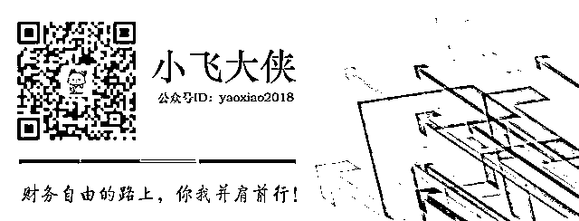

# 摆脱贫穷，光靠努力工作还不行

"margin-bottom: 25px;">穷的定义

都说人生百态，但有一点却是高度相似——哭穷。

**在售楼处卖房子的小姐姐哭穷；**

**站在课堂上教书育人的特级教师哭穷；**

**一路过关斩将月入两三万的私企高管也哭穷。**

哭穷的人很多，基本上遍布在社会的各行各业。但是仔细辨别还是会发现，哭穷的人都有一个共同的特征，就是他们参照的都是自己接触到的圈子。

售楼处的小姐姐接触到的都是购房者，每天看着一群人举着全款往前冲，几百万几千万的眼都不眨一下就往房子上砸。于是她的认知里：好多有钱人啊！除了我，哪里还有穷人？

站在讲台上的老师每天接触到的就是学生和家长。随着现在“再穷不能穷教育，再苦不能苦孩子”观念的盛行下，现在的孩子上下学有轿车接送，课外有高价补习班上，各种学习机等也配备齐全，生怕落于人后。每天的耳濡目染之下，再理智的人也会认为：有钱人遍地都是，只有我还是个穷逼。

月入两三万的私企高管更不用说了，接触到的基本都是高端人群，为了拿下项目各种跪舔。两三万算什么？还不是苦逼的加班狗一个？

王健林爸爸的“一个亿小目标”脱口而出后，刷爆了每个人的朋友圈，也炸出了不少“哭穷”的小伙伴。

其实这无可厚非。

我们虽然同处在一个社会中，但是由于接触到的阶层不同，选择的参照对象不同，所以对社会的认知水平也会不同。

比如，以王健林的小目标作为参照标准的话，怕是只有马云之类的才能不算穷人。但是对村口卖菜的老农来说，我们大多数人的生活已经到了他无法企及的水平了。

也就是说，只要选择的参照不同，得出的结论也会不同。而往往，我们都习惯于以高标准为参照，于是得出的结论自然都是一样的，就是“穷”。

不是光靠努力就能摆脱

人们为什么要工作？

因为穷！

越穷，就越珍惜工作，越努力工作。

但是知不知道，并不是只要努力工作就能摆脱贫穷。对真正处于底层的人们来说，更大的可能是，越努力，越贫穷。

比如建筑工地上的农名工。

基本上都是背井离乡，为了到大城市找一份可以糊口的工作。他们每天泡在工地上，吃住都在工地上，辛辛苦苦起早贪黑。一年到头连件像样的衣服都不舍得买，回家也只舍得买最便宜的硬座票，就为了多攒点钱带回家过年。

但是工地上的不确定性颇大，包工头卷款潜逃、项目烂尾、不慎发生意外等等，只要随便一个环节出错，都会让他们一夜归零，甚至倾家荡产，失去生命。

他们难道不够努力么？够努力的了，但是还是一样越努力越贫穷。他们自己，包括他们的家庭，随时都暴露在各种风险之中。

比如奔波在城市间的外卖/快递小哥。

每隔一段时间就会有关于他们的新闻出现。

**一快递小哥因家里无人看娃，无奈背着宝宝送快递；**

**一外卖小哥因大雨耽搁，眼看就要迟到，急得在电梯里痛哭出声。**

不是实在没有办法的话，谁会去选择一份风里来雨里去的工作呢？别再听信网络上传的神乎其神的外卖/快递小哥工资多高多高了，其实真没有。

有次大家定下午茶，定了足足有几十杯。外卖小哥分了两次搬上来，后来发现商家少装了两杯，就重新返回去取。跨越小半个城区，来回跑的这两趟足以让外卖小哥多接几单了。而这一单，才挣了不到 4 元钱。

后来，我们再定下午茶的时候，就尽量按最低配送标准分开下单了。这样，同样的工作量，但是外卖小哥能多赚一点。

谁敢说他们不努力？

为了这份工作，他们甚至将宝宝都背负在身上；

为了一个好评，他们可以忍受着饥肠辘辘的肚子给我们送饭；

为了多赚一点，他们能牺牲掉宝贵的睡眠半夜了都还在送夜宵。

可是，还是一样越努力越贫穷。

为什么会这样

以前人们总说“只要肯努力，就一定会有收获。”但是现在还会这么说的人几乎没有了。

因为人们发现，更多的时候你的收获和你所付出的努力并不对等。

其实，穷不可怕，可怕的是越来越穷，越忙越穷。

因为越穷，就越只会关注到眼前的一点点收益。就会把所有的时间和精力都投入到劳动生产上。同时也因为越穷，越不敢花钱投资。不论这个投资对象是理财产品还是自身。

就像农民工和外卖小哥。因为穷，只能拼命工作，牺牲休息时间加班。不仅消耗掉了自己的所有时间，还摧毁了自己的身体。

因为穷，更加不会考虑承担哪怕一点点风险去学着理财，或者扩宽自己的知识面，使得财富增长缓慢，只能依靠最原始的方法进行积累。

而且，还因为门槛低竞争者越来越多，导致自身价值的下降，劳动付出与回报更加不成比例。并且长期来看，不仅收入会降低，而且早晚会被更年轻的劳动力淘汰。

最后陷入一个恶性循环。

因为穷，就越在意钱，就越会选择来钱快的活。

为了赚点加班费甚至牺牲休息时间，每天都超负荷工作。

因为穷，就越不敢花钱，就会对一点蝇头小利斤斤计较。

为了多省几毛钱甚至可以花一下午的时间货比三家。

因为穷，就越在意投入与产出比。

不敢承担理财风险，也不愿意买保险，更不可能用于自身技能的提升。

于是，财富的积累速度堪比蜗牛，没有保险的加持每天就犹如在“裸奔”，知识水平及业务技能的停滞从而限制收入的增长，一直超负荷工作的身体最终不堪重负……

然后，一切归零。

着手改变

如果你发现自己陷入了这样一个越努力越贫穷的怪圈，那么请先审视自身。看看平时是怎么对待自己的时间的。

**是否为了工作忙到废寝忘食，加班加到无视家人朋友？**

**是否下班回到家之后便直接“葛优瘫”，刷刷抖音追追剧？**

**是否对自己的知识水平、职业技能等水平的提升有所计划？**

如果全都“是”，那么多半已经陷入这个怪圈了。不过没有关系，亡羊补牢为时不晚。

“种一棵树最好的时间是十年前，而后是现在。”

对人生来说也是一样，我们的每一个选择和改变，都是前期投资的结果。

在没有钱的时候，投资自己的碎片时间，真的是最高效的投资方式了。

越没钱，就越容易自我放弃。

因为投资自己看不到效果，不能马上兑换到财富，还不如多加班换钱，或者刷刷抖音打打英雄，好歹能排解下寂寞和空虚。

于是你慢慢就忘记，人生不是百米赛跑，人生是场马拉松。现实中的逆袭，都是经过漫长的积累，量变到质变的结果。

还有很多人认为，即使我不刷抖音，也能早早就睡了。但是请别忘了，早睡也是投资方式的一种——投资健康。

年轻时不觉得什么，总是透支健康。但是一到中年，便会惊觉健康的重要性。身体一旦没有了，就什么都没有了。

都说年轻的时候拿健康换钱，到了老年又拿钱换健康。但是其实更多的时候是再多的钱都换不回健康。

肯德基老爷爷创立肯德基的时候已经 80 高龄。命运之神奇值得所有人期待，所以更要保持住健康的体魄，活得尽量久，尽量健康，说不定到最后还会收到一个命运大礼包呢。

所以，从现在开始，跳出越努力越贫穷的怪圈吧。

投资自己、投资健康，一步一个脚印慢慢积累。

就像种树一样，先种下一颗种子，然后浇水施肥，精心呵护，并给它足够的时间，最后一定会结出令人意想不到的果实。

