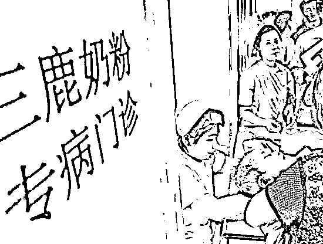
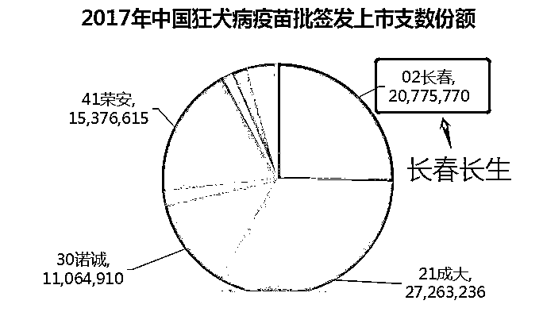
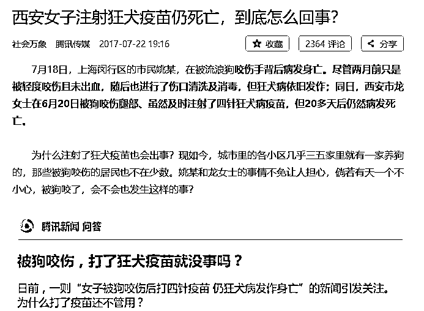
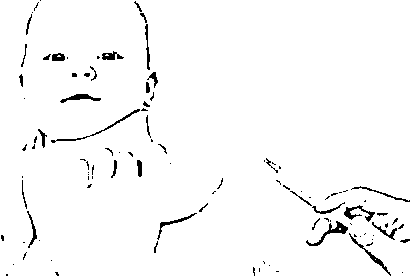
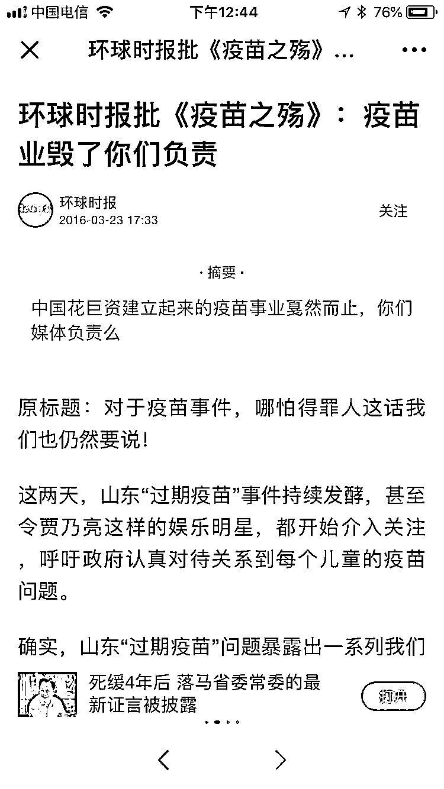
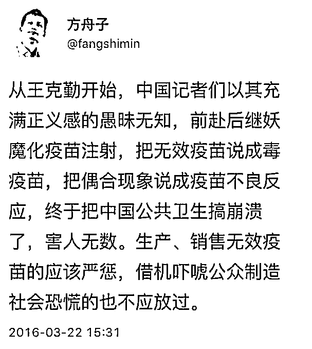
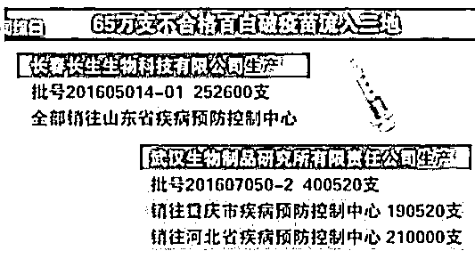
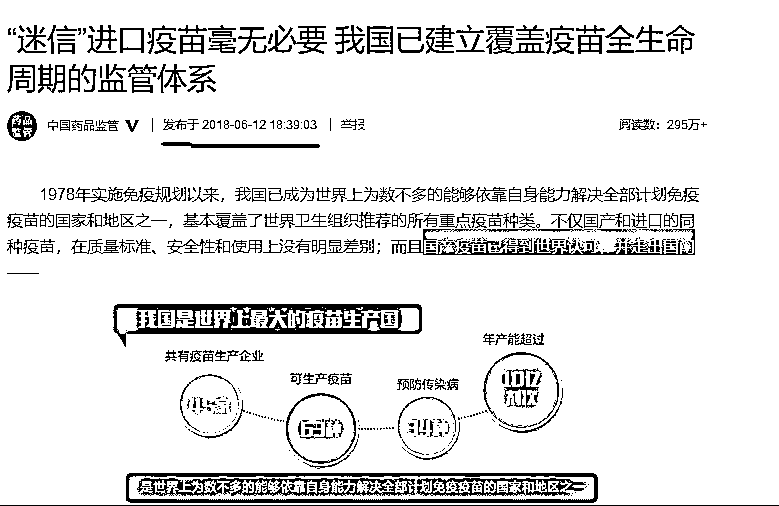
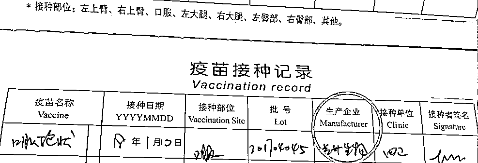

# 从三聚氰胺到造假疫苗，中国儿童的生命安全谁来保障？

食物和药品，是最注重质量安全的二个领域，因为他们直接和生命安全打交道，世界各国政府都会设立”食品和药物管理局”这一监察机构。可惜每隔一段时间，中国总有黑心企业顶风作案，每次被监管立案后都会震惊世人。**前有三聚氰胺、后有造假疫苗**，中国儿童这是怎么了，想要安全健康的成长为什么就那么难。

2008 年，中国奶粉业爆发三聚氰胺事件，三聚氰胺事件以三鹿为代表，但是几乎所有大奶粉厂都卷入其中，该事件重创中国制造商品信誉，多个国家禁止了中国乳制品进口。

三聚氰胺事件，可统计的受波及儿童高达四万人，这是前往医院治疗的人数，而实际受影响但是没去医院检查治疗的中国儿童简直不可计数，**我说百万级，那都是往轻了估算**。

从此，国产奶粉业在消费者心中的形象一落千丈，进口奶粉不管再贵，都有人愿意去买，十年过去了，如今**仍然有很多人对国产奶粉心存忌惮**，不敢购买国产奶粉。

而在 08 年三鹿倒在三聚氰胺之前，就早有预警。2004 年，阜阳大头娃娃事件，公布的不合格奶粉企业和伪劣奶粉中，三鹿奶粉亦在名单之中，但是**随后发布通知说这是疾控中心工作人员失误所致，把三鹿撤出"黑名单"，**多个国家机关联合发文，要求各地允许三鹿奶粉正常销售。

很明显，三鹿这一轮逃出生天，让他对法律法规再也不会心存畏惧。于是，到了 08 年，更大的质量问题爆发了，只是可惜了那些受害的孩子们，他们是无辜的。

三鹿倒台之后，一晃就是十年，2018 年中国大地上又爆出一起震惊世人的大案，这一次造假的不是奶粉，是疫苗。

长生生物是中国最大的乙肝疫苗企业、最大的流感疫苗企业、第二大水痘疫苗企业、第二大狂犬病疫苗企业，他们生产的疫苗每天都源源不断的注射进中国儿童的体内。

18 年 7 月 15 日，国家药品监督管理局发布通告：长春长生生物在狂犬疫苗的生产过程中存在记录造假等严重违反法律法规的行为，国家药监局迅速责成吉林省食品药品监督管理局收回长春长生的《GMP 证书》。

长生生物的狂犬疫苗造假，而且是中国第二大狂犬病疫苗企业，那么这个第二大的含金量的多少，一年能生产多少只狂犬疫苗呢？根据公开财报显示，2017 年长生生物一共销售了 2078 万支狂犬疫苗！二千万支每年啊，这得注射进多少人体内，全国每使用 4 支狂犬疫苗，就有一支是长生生物的。

如果一个人被病犬咬伤，狂犬病的发病率为 15%，但是一旦发病，死亡率接近 100%，24 小时内及时注射狂犬疫苗，可以大幅度降低发病率。去年西安有一位可怜女子，注射 4 支狂犬疫苗，依然病发身亡，当时有一堆专家出来解释可能性的原因，现在看来，还可能有另外一种原因，那就是使用了无效疫苗。。。

更过分的是，长生生物的疫苗，他不是某一批次的原料受到污染，也不是某一个批次的产品监控不合格，而是**有系统有组织性的主动造假**，药监局的通告明明白白的写清楚他是生产记录造假。

生产记录都能主动造假，还有什么不能造假，而实际上，17 年 10 月，吉林省药监局就对长生生物展开了立案调查，根据调查结果，其百白破疫苗生产存在严重造假行为，和狂犬疫苗一样，其生产数据同样为主动造假，为了扩大利润，其疫苗的成分含量远低于国家最低标准，换句话说，其生产的疫苗，为无效疫苗。而**每一个失效疫苗背后，都有可能是一条人命**（百白破疫苗是用于预防百日咳、白喉和破伤风的疫苗，面向 3 个月至 6 周岁儿童接种。）。

在这一案件中，查处出的造假批次疫苗共计 25 万支，全部销售到山东，库存仅剩余 186 支，也就是 25 万个山东儿童，以为自己注射了疫苗，但是实际注射的连清水都不如，**一旦将来感染了百日咳、白喉和破伤风，其死亡率极高**。

说到山东，在 2016 年刚刚爆出的惊天疫苗大案，山东警方破获案值 5.7 亿元非法疫苗案，疫苗含 25 种儿童、成人用二类疫苗。据济南警方初步统计，在长达 5 年多时间，庞某卫母女从医药公司业务员或疫苗贩子手中，低价购入流感、乙肝、狂犬病等 25 种人用疫苗然后加价售往湖北、安徽、广东、河南、四川等 18 个省。

当时疫苗案主犯是山东的，山东孩子也是受害最深的，而这次不符合规定的疫苗，第一批被检出的，又是山东，真是令人唏嘘。

而在山东过期疫苗案爆发时，有一篇《疫苗之殇》火爆了朋友圈，这种呼吁政府加强对疫苗监管的文章，居然被人说成是要毁了中国疫苗业。

还引来了一些利益集团的疯狂攻击，

而实际上毁了中国疫苗业的，是揭露黑暗，呼吁监管的记者呢，还是那些制造假疫苗的黑心企业？

一家公司的问题疫苗绝对不仅仅是被检出的部分，按照常理来说，一家大疫苗公司，一旦开始主动意识的造假，那么很有可能他不合格的并不是一个批次，而且全部有问题，反正疫苗这东西，虽然无效，但是也无毒，卖出去一般人根本看不出来，坑人没商量。

17 年长生生物被查出 25 万支疫苗存在造假问题，这么大的案子，有没有被重罚甚至直接破产处理呢？没有。坑害了 25 万家庭，还是在意外情况下被监管小概率抓个正着，这种情况下，**仅仅罚款 300 万元**。

而以狂犬疫苗为例，其利润率为 80%~100%，如此之高的利润，如此之低的犯罪成本，如此轻松的逃出生天，他们会吸取教训吗？

2004 年三鹿奶粉从阜阳大头娃娃事件逃脱后，完全没有吸取教训，我行我素继续造假坑害国人。长生生物也一样不会吸取教训，继续造假生产疫苗，如果没被抓就安全无事，如果被抓了，就**再交 300 万罚款呗，有什么大不了的**。

而讽刺的是，国家药监局在今年 6 月份，刚刚发文说“迷信”进口疫苗毫无必要，国产疫苗已得到世界认可，并走出国门。

“**中国人的疫苗必须牢牢地掌握在中国人的手里**。”多么振奋人心的口号，多么振聋发聩的声音。理想很丰满，但是现实很骨感，为什么会出现这种情况，和劣币驱除良币的市场氛围密不可分。

以国内疫苗龙头是成大生物，其狂犬疫苗报价 149 元，而长生生物报价 239 元，价格差距明显，但是长生的疫苗这几年一直卖的很好。为什么呢，**因为 2017 年长生生物销售费用 5.83 亿，25 个销售，人均销售（回****扣）费用 2330 万元，是成大生物的 47 倍**。疫苗好不好，不是消费者说了算，是医药渠道说了算，当这些专业的医药渠道都被回扣所收买的时候，后果可想而知。

每个孩子都有一个疫苗接种证，上面会清楚的记录每一支疫苗的生产企业，麻痹我家孩子里面居然也有一只是长生生物的，亏我那么信任国产疫苗。

对于这个疫苗，我打算下次去医院的时候询问医生能否重新注射，**而接下来注射的其他种类疫苗，如果有的选，我会选进口疫苗，哪怕他贵一点**。

对于狂犬疫苗而言，疫苗的注射有效期只有 24 小时，时间越久效果越差，现在纠正已经晚了。不过也不用太过恐慌，按照医学研究数据，被病狗咬了之后不注射疫苗的情况下，发病概率只有 15%，如果被健康的狗咬了，那么不会发病，综合起来，发病率并不高。狂犬病的恐怖之处在于一旦发病无药可治，而不是说他一定发病。当然，如果被咬的日期很近，赶快去防疫站询问一下，**如果还能补救的话就再打其他厂家的疫苗**。

刚才说过长生生物是全国最大的乙肝疫苗企业、最大的流感疫苗企业、第二大水痘疫苗企业、第二大狂犬病疫苗企业，同时也生产百白破等疫苗，以狂犬疫苗为例，你在任意地方接种，都有 1/4 的概率被注射长生生物的假疫苗，而乙肝疫苗、水痘疫苗、流感疫苗的比例都不会比这个差。所以，**我建议每个爸妈都回头核查一下自家孩子的疫苗注射记录本，如果上面显示你家孩子注射过长生生物的疫苗，建议找医生询问能否重新注射其他厂家的**。

毕竟每一个父母都希望自家的孩子健康成长，哪怕是万分之一的概率我们也不愿意冒险，奶粉是这样，疫苗更是这样。

PS：昨天刷爆朋友圈的《疫苗之王》一天就被删帖了，所以这篇写疫苗的文章和谐的概率极高，不过出于中国人的良知和责任感，我还是要写，只要能多给一个孩子提供一个补救信息和知识，就值了，被封就被封了吧。

看到此文的，都是缘分，说不定啥时候就没了。

觉得此文的分析有道理，对你有所帮助，请随手转发。推荐阅读：为什么碧桂园的质量那么差

往期回顾（回复“目录”关键词可查看更多）

香港人说，香港房价必须这么贵！| 刚性兑付是一种骗局 | 成本 200 的百姓救命药卖到 2 万一盒，难道没钱就得死？| 中国的房价什么时候会崩盘？| 你根本不知道烟草公司有多赚钱 | 中央这次打击三四线城市房价的决心为何如此坚定| 我是如何保证自己不近视的 | 魏忠贤其实是个贤臣 | 2 分钟了解中国 50 年的艰辛发展史 |历史数据表明：中国最赚钱的职业十年一个轮回 |房价大利空，货币化棚改权限被收回

