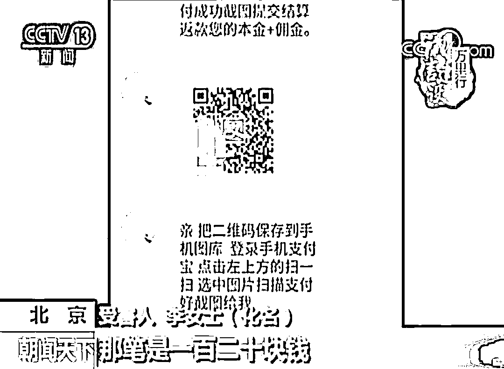
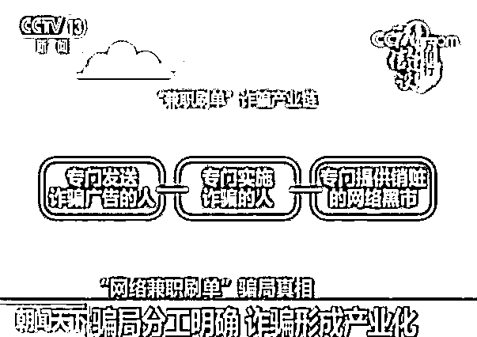
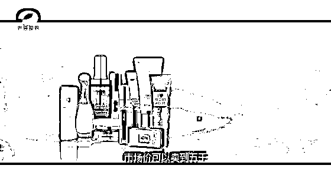
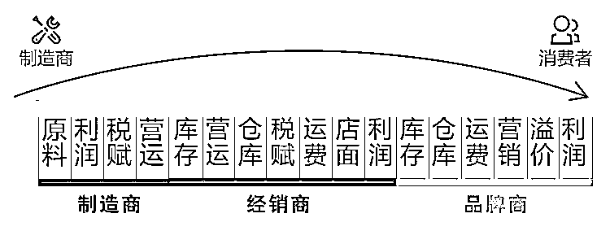
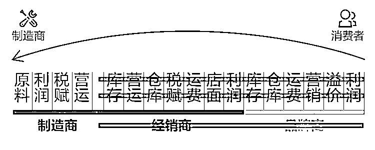

# 电商刷单骗局越来越猖獗，专门欺骗中下层群众

兼职网络刷单，只需一部手机，足不出户就能轻松日赚几百元。这些招聘广告大家应该都见过，但是很少有人知道，这其实是一场骗局。

听起来很诱人，但是据央视新闻报道，这其实是一种新式诈骗，上当受骗的人非常之多，大量的小白被骗。

我们都知道，电商刷单是一种常见的行为，刷单指的是电商付款请人假扮顾客，用以假乱真的购物来提高网店的排名和销量数据以吸引真实的顾客。

从本质上来说，**这属于一种欺骗行为**，严重扰乱商业信用和市场秩序，在新修订的《反不正当竞争法》中，对网络刷单做出了明确的处罚规定。但是这种刷单骗局和上述那种刷单行为相比，性质就恶劣太多了。

李女士的遭遇

北京的李女士希望利用业余时间赚一点外快补贴家用，觉得网络兼职刷单很适合她，于是就和所谓的刷单公司客服联系，在填写了入职申请表之后，接到了第一个刷单任务，这个任务，李女士支付了 120 元购买了一个指定的物品，支付完成后，客服当场返还了 125 元，也就是说，几分钟时间，动动手指李女士就赚取了 5 元钱，资金增值了 4%左右。

客服人员告诉李女士，只要刷单的金额越多，返还的佣金就越多，于是李女士放开手脚开始刷单，但是没想到的是随后的任务中，骗子以网络卡单为由无法返款，李女士不仅没有收到返佣，连本金都要不回来了。骗子客服说只有继续做任务，才能激活之前的订单，否则之前的那一个就拿不回来了。为了能把前期的投入拿回来，李女士鬼迷心窍的继续做了多次任务，**最后损失 78600 元**。。。

而实际上，类似的骗局受害者不止李女士一个，而且非常普遍。受害人主要集中在：涉世未深的大学生；工资不高但是业余时间很多的人；赋闲在家的无业者。换句话说，都是钱少时间多的群体，**专门欺骗中下层群众，诈骗成功率高**，追回款项困难。

为什么这个诈骗成功率这么高，这么容易获得受害人的信任，**那是因为电商刷单是真实存在的**，确实有很多的网络店家雇人刷单，而所付出的成本，也的确是每单 5~10 元。但是这个刷单行业，也已经形成了产业化、规模化。

假设你每天刷 20 单，每单给你 5 元，因为刷单必须全程截图所以刷一单至少消耗 15 分钟，由于电商平台限制一个号一个月最多刷 4 单，所以你需要准备 50 个以上的钻号，每天不休息，连续刷 12 小时，你一个月才能赚 6000，而且这绝对不是只有一个号的普通散户刷的起来的，你要准备海量的身份证和账号。另外，现在已经出现了很多职业刷手和工作室，专业懂行知道规矩，谁敢让一个什么都不懂的大学生来刷自己的店铺，要是被平台判定出虚假交易店铺被封，谁来负这个责任，你会赔钱吗？

所以，**刷单业务一般都交给专业的刷单工作室**，而工作室通过专业软件来提升工作效率，通过规模化和信用来降低运营成本，这才能获取盈利，故，你在市场外面看到的兼职刷单招聘，**100%的是骗局，绝对没有例外**。

刷单本身也是一种骗局

但是刷单这个行为的本身，他也是一种骗局，商家为什么要请人刷单，是为了伪造交易记录和好评数据，横行电商平台的好评返现和晒图发红包等行为其实如出一辙，严格来说，**都属于伪造信用****。**

伪造信用的目的，是为了让新来的顾客通过浏览交易记录和买家评论，判定这家店铺商品的好坏，大量的购买记录和铺天盖地的好评会让不熟悉这家店铺的新顾客第一时间认定这家卖的是好货，从而产生真实的购买。

而那些老老实实不刷单的人，排名始终上不去，店里就几十个购买和几个评价记录，不足以让新客户产生信任，即便来了逛一圈，也会离开不予购买。所以最后，整个电商平台掀起刷单狂潮，不刷就得死，劣币驱除良币。

第三方支付工具，解决了网络购物买卖双方的金钱信任问题，但是没有解决商品质量的信任问题，消费者鉴别网络商品的质量，完全依赖于用户评价，所以**刷单这种行为，严重破坏了商业公平，损害了消费者的知情权，让消费者判断商品质量变的无比困难****。**

但是偏偏，在传统电商平台中，这种行为是无法杜绝的，无论多么严格的监管，都只能让刷单的成本变高，无限接近于真实购买成本，而不能根除。如果说刷单骗局是专门欺骗少数中下层百姓的话，那么刷单这个行为，其实是在欺骗所有的中下层百姓。

新电商的出现

所以，新电商出现了，新电商最大的特色就是根除了刷单问题，他以自营商城的模式，用整个平台的信用给商品质量进行背书，这样就没有了刷单的必要性，从而根除了刷单行为，对整个平台商品质量的判断也变的简单轻松。

而新电商的盈利模式，就是找一块细分垂直市场，然后把这块市场给做到极致，用个性化的服务和压缩到极致的性价比来在电商霸主平台的市场份额里，拿下自己的那一块。

所以，每一个新电商，都必须有一手自己的绝活，靠着这一手绝活，他在某一个领域给消费者提供更优的质量以及更低的价格，才能在电商霸主先发优势的垄断市场中打开自己的一片天地。

这些新电商，走的是细分市场的垂直路线，依靠出售特性明显的商品，把某一细分领域的性价比做到极致来吸引用户黏性来抢夺传统电商霸主平台的市场盲区，这些新电商，注定只能走小而美的路线，绝对不会走，也不能走综合类电商平台的路线。

例如曾经在美国成为垂直领域新电商典范的闪购网站 FAB，他靠出售个性化定制商品受到广大用户的欢迎，获得了极强的市场黏性，盈利相当不错。但是在接受了高额融资后，迫于投资方的压力，放弃小而美的路线，开始走大而全，试图成为一个综合性的电商平台，挑战亚马逊的霸主地位，结果反而是失去了自己的竞争优势，原有的核心用户大量流失，销售额大跌 75%以上。

之所以会出现这种情况，是因为**电商领域的先发优势是极难被打破的，只要淘宝不自己内部出问题，他永远不会被任何人击败，包括京东**。你必须要有更高的性价比才能虎口夺食，而你要实现更高的性价比，你肯定不能使用一样的商业模式。

淘宝 2003 年成立，京东 2004 年成立，具有今天的行业规模和优势是理所当然的，新电商凭什么刚成立几年就有资格挑战他们，所以新电商就必须在在某个领域上要具备稳胜一头的性价比，也就是有自己的一手绝活。

所以，每一个新电商都有一个自己的标签，他们只做某一个领域的垂直市场，有专门做母婴市场的，有专门做海淘市场的，有专门做奢侈品市场，有专门做廉价品市场的等等。新电商如雨后春笋般的涌现，有多少垂直市场，就有多少个新电商，中国新电商的数量，这几年已经达到数十家。

这些新电商的出现是顺应市场的需要，彻底解决了刷单痼疾，如果传统电商大平台不解决这一问题继续吃老本的话，那么很明显市场份额会继续被逐渐侵蚀，消费者权益决定一切，刷单骗局必须被彻底根治，它不仅欺骗消费者的知情权，还把庞大的刷单成本转嫁到消费者头上。

**在一个成熟的电商竞争体系中，我认为不应该存在刷单这样明显侵害消费者权益的东西，刷单需要得到彻底根治****。**

新电商解决了刷单的难题，覆盖多个垂直细分市场，那么有没有专攻大牌商品垂直领域的新电商呢，也有。**必要商城**采用 C2M（用户直连工厂模式），用户先下单，工厂再生产大幅降低成本，让用户可以一二百块钱的价格享受到高端商品。

必要商城和很多大牌厂商均有合作，比如依视路眼镜，他们就把价格给压低到了一二百元，唯一的要求是等待一个生产周期而已。还有新秀丽箱包在专卖店大概卖 1000~1500，而通过 C2M 直连工厂的模式，可以降低到 200~300 元左右。

整个电商平台实际上就是直营店模式，没有刷好评赚流量的必要性，而且并不是卖货的运营模式，接近于一种委托代加工的模式。

传统销售加价模式

C2M 销售砍价模式

除此之外，他还有许多的的大牌商品，因为很多国际大牌其实是中国工厂生产的，终端零售和出厂价的差距非常大。如果能以出厂价买到大牌商品，那是非常划算的，而大工厂不对外接单，只面向大客户。

大家应该都看过《我不是药神》里主角程勇去印度药厂买药时，报出 500 盒的进货量遭到工厂鄙视的那个眼神。但是工厂给程勇的出厂价是 500 元，印度自己的零售药店都要卖 2000 元，运回中国更是可以卖 5000 元以上，这些影片的细节，其实都反应了现实，大牌商品的定价的确是这样的。

这是一个创新的时代，只有创新的企业才能保证持续不断的活力，这也是一个诚信的时代，只有建立起完善诚信体系的企业才能获得消费者的依赖。提升效率，降低成本，保护消费者权益，才是电商生存的前提。

像必要商城这样的新电商，我希望越多越好，不能把成本压下来，不能净化诚信环境的传统电商，市场份额被逐渐侵蚀是必然的，也希望他们早日能向创新型新电商学习，不能沉浸在往日的辉煌中不可自拔。

随着电商竞争的越来越激烈，未来我们的每一件商品都有希望直接拿到出厂价，也不用再担心买到次品，这是电商发展的终极方向，性价比提升到极致。