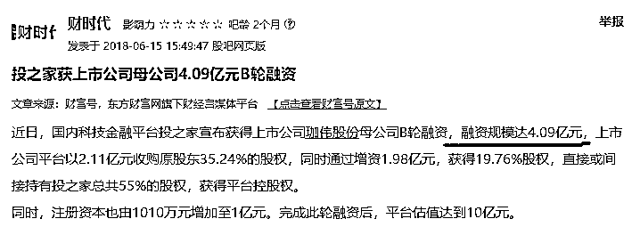
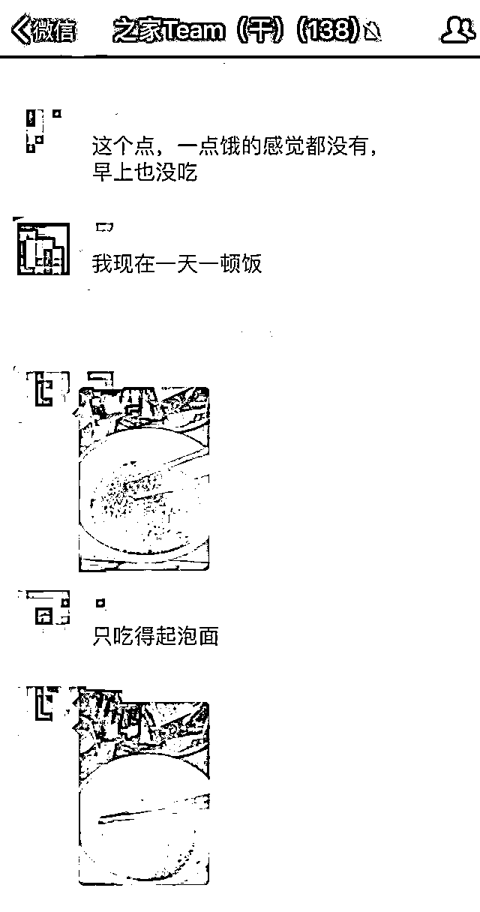
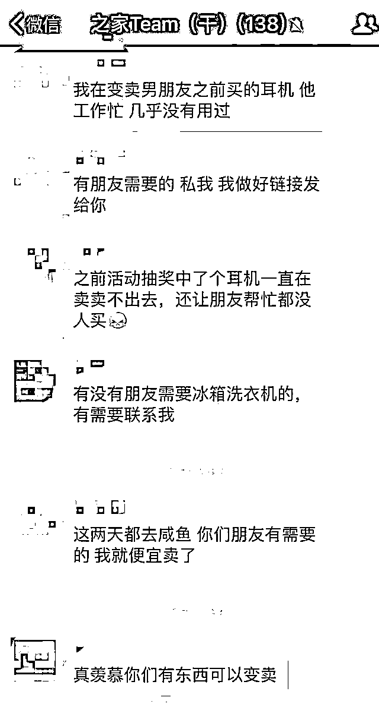
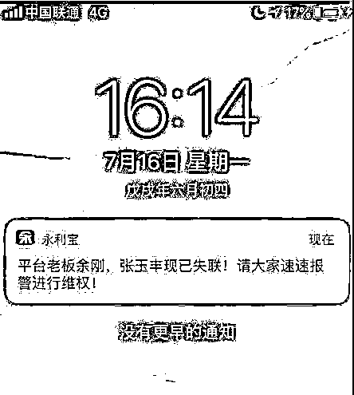

# 夜报| 一个标志性的平台炸雷了

这几天，P2P 行业里一个标志性的平台炸雷了，这个我昨天晚上夜报里提过，叫投之家，但是只是一笔带过，我今天仔细说说这个平台。

这些天炸雷的 P2P 多如牛毛，投之家里 200 亿灰飞烟灭，但是也不算最大，比他规模大的也不少，为什么说投之家是一个行业炸雷标志性平台呢。

因为投之家地位和炸雷方式都很特殊，特殊在什么地方呢。首先，投之家的创始人就是网贷之家的创始人，而网贷之家号称 P2P 届的百晓生，是专门给 P2P 做评级的，如今自己亲自做的 P2P 炸雷了，这对行业的震动是很大的，你说这么专业的机构亲自搞的 P2P 都完蛋了，整个行业里还有哪个敢说是安全的。整个 P2P 行业最后一定是剩几家笑到最后独霸市场，但是我们并不知道是哪几家，太难猜了。投之家和网贷之家的创始人徐红伟，目前已经被警方控制调查。

其次是炸雷方式也很特殊，根据投之家目前的自述，在 18 年 6 月份徐红伟卖掉了投之家股份，但是新股东接盘后一个月就炸雷了，是徐红伟坑了新股东吗？不是的，按照收购条款，在收购之前，徐红伟要按照新股东的要求放贷给指定的公司，贷款到位后，新股东才会开始收购投之家，差不多是按照 1 比 3 的比例，也就是说新股东指定的公司从投之家拿到 15 亿贷款的话，新股东就会出 5 亿收购投之家。

投之家 2017.12 月开始卖，签订对赌协议，冲量 20 个亿卖 4 亿。2018 年 6 月对赌协议完成，之家拿到款项，完成工商变更。期间之家也发现有假标。2018 年 7 月资金链断裂炸雷。看起来好像是新股东诈骗了投之家，以收购的名义，从投之家套钱出来，实属诈骗，徐红伟是无辜的。

而根据投之家员工反映：

7 月 12 日，朱明春突然要求网贷之家的员工立即搬家，要给投之家新来的董事长郑林国腾挪办公室，并要求当天必须搬完。当天搬家一直持续到晚上，甚至连与网贷之家、广东互联网金融协会等相关的 logo 信息也全部处理掉了。

网贷之家的新办公室为特发信息科技大厦 10 楼。当天据 10 楼员工反映，徐红伟、黄诗樵、朱明春、华得莉、颜渊、邓伟、马骏、朱峰、邓拥等人在 10 楼茶水间从上午开始一直开会开到深夜，具体会议内容，我们员工完全无法得知。

7 月 13 日早上，员工们正常上班，到公司后发现公司图片墙与高管相关的照片全部被毁坏，仓库和 ceo 办公室被清空，办公电脑的网线和电源线均被拔掉，部分员工的硬盘甚至直接被卸掉。员工们预判公司可能出了问题，于是员工开始联系高管 CEO 黄诗樵、coo 邓伟、cio 覃五权、总助颜渊，结果这几位核心高管集体失联，于是大家开始恐慌收拾东西，同时部分员工开始报案。

看完这段陈述，你觉得徐红伟他们还是无辜的嘛，实际上原始创业人团队卖投之家拿到了 4 个亿，如果是诈骗，6 月 15 号为什么要打钱，一分钱都不会打啊，这里面合谋的可能性极大。

而这个事件里，平台的员工也是最无辜的，他们完全被蒙在鼓里，损失极为巨大，投之家的 100 多名员工投资总计 2000 多万元，其中不少为结婚买房的款项，还有亲戚朋友的钱，因为他们特别信任投之家以及网贷之家。而实际上，他们除了自己投的钱，亲戚朋友也都投了不少，这一下六亲都不要认了

投之家的员工群里，现在穷的只能吃泡面。

还有人直接开始变卖值点钱的家具了

即使平台出事，员工也无法知晓，高管都是一声不吭，直到炸雷前都是毫无征兆，投之家员工向记者表示，平台出事后，很多同事直接崩溃了。

一边维权，一边被骂，一边找工作，这是投之家员工目前的现状。

目前炸雷的平台里，坑员工坑的是越来越惨，前几天炸雷的平台甚至员工直接从后台发送到 P2P 界面号召投资人直接报案，也基本都是这个情况，高管把情况隐瞒的滴水不漏，自家员工一样坑。

现在这个炸雷潮是越演越烈了，投之家的炸雷，标志炸雷潮到了高潮期，已经进入了下半场，质量差的 P2P 平台已经炸的差不多了，下面开始炸大平台，现在已经有前 50 强的平台也炸雷了。

等这一波炸完，剩下的全是好样的，又有三五年好日子可以过，金融行业就是这样，是有周期的，行情好的时候大家一起发财，谁都没事，不好的时候一起亏，挨个炸雷。

投之家涉及 A 股珈伟股份，昨天分析过了，回避，从 P2P 套钱的上市公司基本都是山穷水尽了，他里面还隐藏多少雷你根本不知道，说不定哪天就继续引爆了。

~~~~

因与南京银行陷入借贷纠纷，神雾集团等被法院裁定查封、扣押、冻结约 1 亿元财产。不多说，神雾系的大坑肯定不止这 1 亿，虽然已经跌很多了，但是里面隐藏的地雷太多了，属于典型的不能碰的股，可以说 90%的 A 股都比这样的股强，因为你永远不知道哪天被炸死，而且你可以明显的预期到，99%的概率不会大涨，那你买他干嘛。

~~

今天对于 A 股影响最大的事情，是人民币的贬值，今天贬值 0.7%，什么意思呢，就是假设外资投资了 100 亿 A 股，今天 A 股不涨不跌的情况下，外资要亏 0.7%，今天 A 股大盘上涨 0.7%的话，外资是不赢不亏。

你说这种事情多么不划算，换你是外资你会怎么办。。。肯定是先卖点货规避风险啊。

所以，今天 A 股承受重压，始终没上去，不过关于这个我也没在意，毕竟这个底部折腾的没有意义，一天的振幅并不大，1%都不到，我今天继续没啥操作，这一波跌下来越跌越买，涨上去我会越涨越卖，但是不涨到满意的点位是一点都不卖，18 年不是靠炒股发财的年份，是风险之年，我 17 年就反复说过，熊市只留少量资金练手，确保自己的盘感以至于牛市来的时候不至于被刷下车。

所以对付这种慢熊，千万不要着急，耐着性子，一波只赚一点点，其核心目的，是不被牛市所抛弃，等牛市涨上天了你才反应过来重新杀回股市，那你又是接盘侠了。