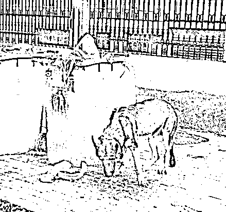
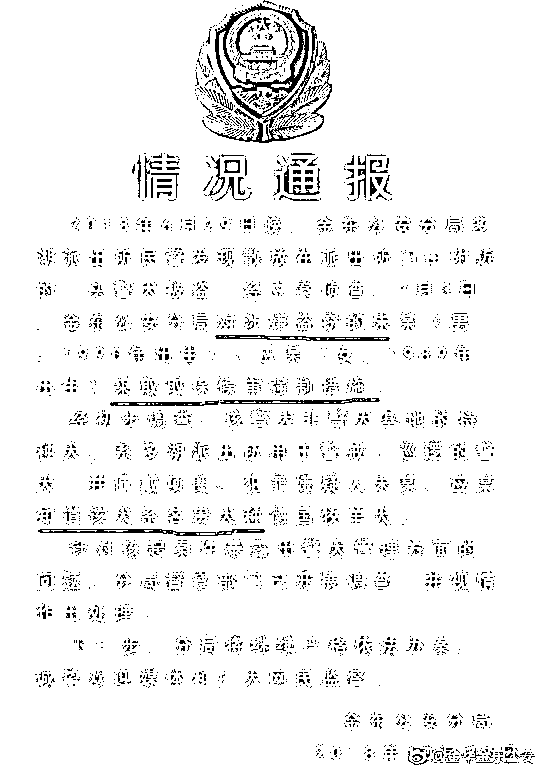
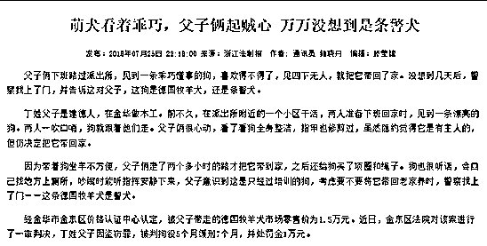
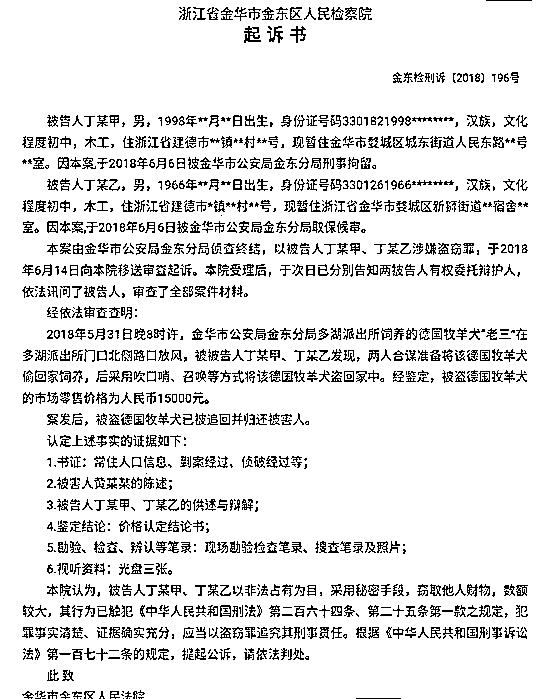

# 难以置信，吃空饷都吃到警犬头上了 | 紫竹张先生

喜欢我的都关注我了~

吃空饷这个词汇并不陌生，是我国近期反腐的主要对象之一，很多人在某单位有职位，每月领薪水，但是从不上班，这种行为属于窃取国库资金，称之为吃空饷。

吃空饷这个词汇起源于明朝，指从军队中冒领饷银的行为，吃空饷、喝兵血严重损害了军队的战斗力。据史料记载，明朝末期编制为一万人的军队，实地核查只有六七千人，其中有四五千是临时招募来应付上级点卯的，而扛得动武器铠甲能操练的丁壮，只有区区一二百人，几乎都是将领亲属的家丁。。。

所以，当你看到明朝史书上一万人的军队被满清一千人全歼的时候千万不要惊讶，因为那实际上是一千人打一二百人，全歼太正常了。而改革开放之后，吃空饷的行为已经蔓延到了政府和事业单位之中。

2005 年，中国中编办就在全国开展了清理"吃空饷"工作，但是吃空饷的风气一直屡禁不绝，2014 年，中央组织了吃空饷专项整治工作，重拳之下，当年在全国清理清退"吃空饷"的人数为 162629 人，16 万人啊，全国总共才多少公务员，这还只是被清查清退出来的，隐蔽起来的还没列入数据。

随着这几年的铁腕打击，高压反腐，吃空饷的歪风邪气被一扫而空，但是没想到，在 2018 年，我们居然在一条警犬身上看到了吃空饷死灰复燃的痕迹。

1**一条皮包骨头的警犬**

2018 年 6 月 29 日浙江金华的应女士晚饭后和丈夫一起出门散步，看到一只皮包骨头的牧羊犬在路边垃圾桶里翻找食物，特别可怜，这只狗瘦成什么样呢，瘦成这个样子。

应女士出于同情心，把这条狗带回了家打算救助，这只狗招呼一下，就自己上了应女士的车，回家后，应女士给这条狗洗澡喂食查项圈，都没有找到原主人的信息，应女士认为，这估计是一条被主人遗弃的流浪犬。

但是没想到，刚过几天，就有警察找上门，说这条瘦骨嶙峋的牧羊犬是警犬，他们涉嫌盗窃警犬罪，警方决定对应女士夫妻立案侦查。据警方声称，这条警犬价值 15000 元，犯罪嫌疑人应女士夫妻“知道该犬系名贵犬种”，故以盗窃罪采取取保候审的强制措施。

而实际上，这条警犬不是第一次“被盗窃”了，仅仅一个月前，2018 年 5 月 31 日，这条德国牧羊犬也是在路边，被丁某甲、丁某乙用“吹口哨、召唤”的方式“盗窃”回家中，然后被警方找上门，以盗窃罪被判拘役 5 个月，缓刑 7 个月，罚金 10000 元。

还有一份正儿八经的起诉书，最终在金华做木工的打工父子背了一个刑责还要赔偿一万大洋。据检察院出示的审讯笔录显示，犯罪嫌疑人在多湖派出所附近路口发现这只牧羊犬的时候，吹了一声口哨，这只狗就自己跑了过来，二名犯罪嫌疑人一路呼唤将狗带回了家，途中狗还走错过路，被嫌疑人一声口哨给呼唤了回来。

这只警犬真是听话，陌生人随便喊一声就跟别人回家了，就这样子能当警犬？但是按照庭审资料显示，这只牧羊犬是多湖派出所以人民币 15000 元价格从金华市公安局警犬基地购置，用于治安巡逻。

资料上显示这只狗是正儿八经的警犬，之所以沦落至此，我估计是饿的。

2**警犬的伙食费**

从照片中我们可以发现，这种狗瘦的简直不像话，就是流浪犬，这么瘦的也非常罕见，而且多次被人拍到在垃圾桶里翻找食物充饥。

这次的警犬盗窃案件，有很多地方可以吐槽金华警方，比如警犬出门不带警用背心标志身份，而且居然没有专人栓绳牵引，要知道就算普通狗出门不栓绳也是违法的。但是最让人目瞪口呆的是，这只狗居然能瘦成这个样子，他的伙食费哪去了？被谁给吃了？

中国不同地方的警犬每日的伙食费标准是不同的，但是少则每天三四十左右，多则一百元左右。按国家规定，警犬只吃狗粮、水果及香肠。非工作时间，每天安排二顿大餐，其中包含一斤狗粮、四两牛肉、二个鸡蛋，外加一片钙片和一颗鱼肝油。

你再回去瞅瞅那只皮包骨头的警犬，你相信它一天能吃到这些东西吗？这些东西全吃进肚子里，活动量不够大的警犬早就肥成猪了好吗，还有必要饿的去垃圾桶找食物吗？实际上，就算只是把剩菜剩饭直接倒给警犬，它也不至于饿成这个地步。

那么问题来了，按照每日 30 元计算，警犬一个月伙食费有 900 元，按照每日 100 元计算，警犬一个月伙食费有 3000 元，这些钱哪去了？

金华警方利用这条狗钓鱼执法，已经罚没了上万元，这个我就不管了。我现在只想问金华警方一句，这条狗既然是在册警犬，那么国家一定会拨给伙食费，国家花纳税人的钱发下来的警犬伙食费，你们的这条警犬吃到了没，如果按规定办事，这条警犬怎么会饿成这个样子。

古代将领克扣军人伙食费，士兵敢怒不敢言，金华警方克扣警犬伙食费，警犬不敢怒也不能言。国家拨下来的警犬伙食费，十有八九都进了私人腰包里了吧，这和吃空饷有什么区别。

一条警犬的伙食费虽然不多，但是这是原则问题，贪污一块钱和贪污一亿元性质是一样的，在高压反腐风暴下，利用人头来吃国家空饷已经没人敢做了，但是利用狗头来吃国家空饷，居然还有人敢明目张胆的去做。

老虎要打，苍蝇也要打，否则今天敢贪这只警犬的伙食费，明天就敢贪纳税人的民脂民膏，惊天巨贪都是从收一条烟开始练胆的。

练到最后，无法无天。

觉得此文的分析有道理，对你有所帮助，请随手转发。

长按下方图片，识别二维码，即可关注我

近期精彩文章回顾（回复“目录”关键词可查看更多）

华为员工都这么穷，怪不得拼多多能火 | 房价跌 20%就会全面崩盘，地产杠杆远比你想的要脆弱 |  为什么碧桂园的质量那么差 | 清醒点，放弃全面开征房产税的幻想 | 央行和财政部隔空掐架，我支持央妈 |中国土地制度源自香港，但是香港却是劏房密布 | 为什么中介哄抢租赁房源，因为贩毒都没它来钱快