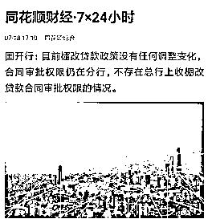
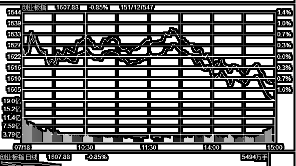

# 夜报| 国开行审批权在玩文字游戏

今天下午各大网站爆了一个大新闻，抬头就是国开行说目前棚改贷款政策没有任何调整变化，合同审批权限仍在分行，不存在总行上收棚改审批权限的事情。

当时我就震惊了，大事情啊，前一段时间整个中国的舆论都爆炸了，全在报道这个事情，然后突然说这个事情不存在？风向要逆转吗？还是说中央打算把房地产投资回报率从每年 1.5%，70 年回本，给再涨价成收益率 1%，100 年回本？

于是我就赶紧点进去看了，仔细查看了新闻通稿之后，发现这是一个标题党，文字游戏。标题虽然很劲爆，但是里面的内容却不是这样的。

新闻开头是这样的：国开行相关部门负责人说，根据国开行现行信贷管理制度规定，贷款合同的审批及签订权限均在分行，目前没有任何调整变化，合同审批权限仍在分行，不存在总行上收棚改贷款合同审批权限的情况。

明明白白的说，审批和签订权限在于分行，那么为什么说标题党呢，是因为新闻的后面是这样说的：

“近期，为深入贯彻中央关于打赢防范化解重大风险攻坚战的精神，落实有关监管要求，国开行将合同审查权限统一到总行，主要是防范地方政府过度举债，避免各地政策把握不一致，集中到总行统一把关。”国开行相关部门负责人说。

总结起来说是这样的，棚改的审批权和签订权限在分行，但是合同审查权限收归统一到总行，收回审查权限的目的是防范地方政府过度举债，所以需要集中到总行统一把关。

意思就是，一个地方政府的项目合同送过来，要总行先审查，总行说这个能做，那分行就可以进行审批并签订合同，总行如果说这个不能做，那就没有后面的事情了。

我想问一下，这和审批权限收归总行有什么区别吗？那为什么国开行要特地出来找媒体出这么一个声明呢，我的理解是甩锅，把责任给甩掉。

由于棚改计划过热，投放的货币太多，三四线城市的房价被硬生生的给推上去了，在国家总体控房价的基础上显得格格不入，所以国开行要收回地方分行随意发钱的权利。

但是自从这个事情报道之后，全国人民都燃爆了，所有的媒体都在说这个事情，一边倒的唱衰三四线房价，没有任何例外。我们要知道，全国所有地区的房子，从三四线到北上广，都是具有大量泡沫的，如果不是因为预期它会继续上涨，谁脑抽了用 5%的贷款利率去购买出租回报率 1.5%的资产。

那么当全国一致预期三四线房价会跌之后会发生什么事情呢，他很有可能会崩盘，有可能直接打回到价值中枢。

价值中枢是多少呢，按 5%贷款利率计算成本，按 70 年报废，年折旧 1.5%，按合理利润 1.5%计算，出租回报率要达到 8%左右才能算打回价值中枢，由于房地产是不保本的，这个投资回报率是非常合理的。

那么如果租金不涨，单靠房价下跌，从 1.5%跌回 8%的 投资回报率，房价需要跌多少呢，算的结果可以吓死你，原房价的 1.5/8=18.75%，也就是说，原价 1 万的房价，现价 2000 出售啦。

如果真跌成这个样子，毫无疑问，全国都完蛋了，那么就要开始追责了，到底是什么原因把房地产的杠杆给玩崩了。到时候一查，国开行收回审批权限导致的，你说国开行的领导能免责吗？不可能的，和 2015 年股市杠杆断裂肖刚负责一个道理，总得有人出来负责人。房价涨跌国开行都拿不到政绩，如果下跌还要当替罪羊，多冤啊。

所以，国开行这个申明，就是在甩锅，我没有收回审批权限，你们媒体报道的是错误的，我收回的其实是审查权限，房价如果出了意外，和我没责任。

此外，和住建部 7 月 12 日的声明也有直接关系，住建部 12 日就棚改举行通气会。住建部在会上表示，将因地制宜推进棚改货币化安置，商品住房库存不足、房价上涨压力较大的地方，应有针对性地及时调整棚改安置政策，更多采取新建棚改安置房的方式；商品住房库存量较大的地方，可以继续推进棚改货币化安置。

这话说的和我之前分析的是一样的，棚改资金会继续释放，但是一定是放到那种房价这二年被压崩盘的城市或者库存压力极大卖不掉的城市，例如房价腰斩的环京区域，就很有可能，但是具体的还是要看政策。

既然和之前分析的是一样的，为什么 12 号住建部还要出个通知呢，很明显，也是甩锅，我没有推出激进的措施，如果房价玩崩了，我没责任，和今天国开行的声明是一个道理。

中国房价崩盘的责任太大，远大于股市，根本不是哪一个官员或者部门可以抗的下来的，能撇清就撇清，完全可以理解。

假设将来中国房价崩了，那一定会是大环境导致的，一定不会是任何一个部门和任何一个政策导致的，无人出来背锅，没有一个人愿意当替罪羊，哪怕是他，他也会说不是，这是完全可以预期到的结果。

所以，指望政府出手砸崩楼市是不可能的，没人会出手的，避之不及，连沾一点嫌疑都不愿意，而实际上他们又全在出手压制房价上涨，这是看的出来的。

所以呢，结果还是那个结果，只有横了，大家僵着吧，真的没啥好办法，换你是住建部和国开行领导，你也会这么去撇清关系的，好不容易爬到这么高的位置，冒天大风险以一己之力去砸盘，你愿意吗？

今天，创业板收阴，止步八连阳，而全天保持强势，下跌是 1 点 25 突然开始的，被莫名利空给打下去的，从涨 0.8%变成了跌 0.8%，可惜了九阳神功。

原因就不用深究了，这种小幅波动非常常见，上证只跌了 0.3%，波段分析不看日内，只看日 K，我今天没啥操作，坐等这一波冲上去回个血，创业板带头冲，就没啥大事。

倒是投之家的事情有看头，200 亿的平台暴雷了，涉及上市公司珈伟股份，因为有人怀疑珈伟股份在投之家放假标套钱出去。

今天深交所对珈伟股份发出问询函，于是我仔细的看了一下珈伟股份的 K 线图，可以明显看出，这个票是一个庄股，之前连续无量跌停，简直就是庄股的不二标志，之所以投之家暴雷，和这个主力崩盘我估计有直接关系吧。

类似于这样的操盘主力，在崩盘之后，还被证监会给盯上了，基本就没啥救了，建议别盲目抄底，送命啊，等他自己再盘整一段时间，资金被其他人给抽走再次断裂然后 GG 吧，这个档口，只会有人从珈伟抽钱走，不会有人再给他注资的，死是早晚的事情。