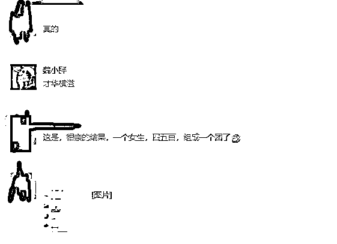
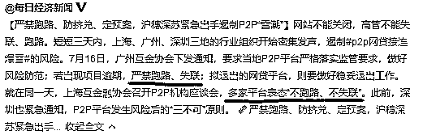
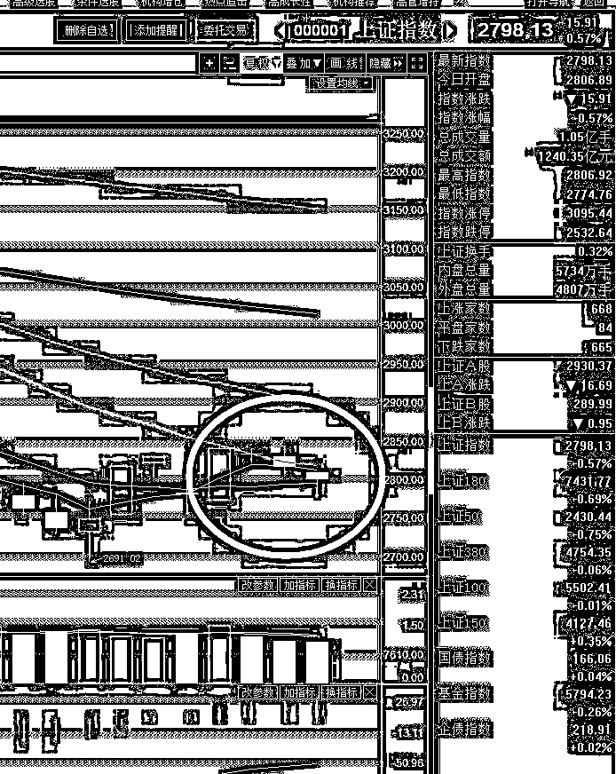

# 夜报| 昨天相亲活动的小总结

昨天相亲活动圆满完成，留言直接炸掉了，铺天盖地的征婚信息，还都是超优质青年，我以前认为是留言精选是 50 个封顶，这次才知道是 100 个。。。

我头条精选了 100 个以后，还有大概 3000 个留言没有选上，里面有很多超优质男女真的很可惜，于是我在次条里又翻了一部分，直到困的不行。

我翻留言的标准是，写的资料越细致上墙概率越大，因为我无法核实资料真实性，所以那些肯花心思写的很长很细致的人，我判定是征婚诚意很高的人，只写十几个字的我就先放一放了，因为看起来他们不是很着急。

而在相亲之后也有很多有趣的留言，有人一个小时收到 50 个相亲请求，到了今天晚上，估计还要再翻个 2~3 倍，这个和阅读量呈正比。

上墙越晚的，被浏览次数越少，对应的相亲人数就会越少，但是一二百人实在是太多了，实际上当人数超过 10 个的时候，你就花眼了，也不知道选谁了。所以下次建议直接明细条件，排除 90%的相亲对象，不要说什么人好就行，没人会承认自己人不好的，人好就行这个条件等于没有条件。等人过来，你还是要提出自己的条件再筛一波的，这不是浪费时间嘛对吧。

如果不加条件，那么极端情况会出现这种情况，这是我今晚 10 点半收到的信息，说有个女生昨天相亲收到了四五百个好友申请，于是这个女生干脆把这些人拉成了几个微信群，如此庞大的数量，我不知道这个女生怎么选人。。。

还有一个好玩的是在相亲大会上碰到自己已经毕业的师姐，地球真的是够小。。。

这次只能解决少部分人的婚姻问题，这个东西本来就是随手为之，并不是专职去当红娘啦，过半年再说把，年底之前要是有呼声我就再开第二场，让你们春节前带个对象回家。

~~~

P2P 的雷潮惊动了各地，官方协会密集发声，遏制 P2P 暴雷的风险，要求严禁跑路、失联，而多家平台也表态“不跑路、不失联”。

看到这里我就乐了，好像之前那些跑路的平台是自己想跑路一样，资金链运转健康的时候哪个愿意跑路，还不都是被逼的，没钱了不跑路又能怎么样，这是能“严禁”的了的吗？

老老实实推进制度规范，只要是正经做 P2P 业务的，不是蓄意庞氏骗局的，那就可以，至于死活那就交给市场了，银行都不敢说一定不会破产，何况 P2P，健康与否和整体金融环境呈正比关系。

~~~

今天股市的走势属于典型的先抑后扬，开盘之后 A 股和港股同步走低，原因不明，我也没看到什么利空，技术走势也是属于空转多的大势，所以我就没管他。

而实际上，创业板的走势是非常强的，今天跌到 2 点左右的时候，一股爆发直接把指数给拉红了，至今连 5 日线都没破，几乎可以不用管他了，而虚弱的上证指数，始终盘旋在 20 日均线下方择机突破。

这种走势，其实是非常漂亮的，仅凭这样的走势，至少也是筑底。我今天依然没有操作，我现在是根据日 K 级别，做波段交易，没有大的问题，我都不会轻易动，而目前属于筑底反弹，自然应该重仓持有。

不过 18 年属于熊市，或者说不会是牛市，以练手为主，所以这一波涨上去，我依然会逐步分批卖出，现在说这个太早了，因为刚开始反弹，后面等等看。