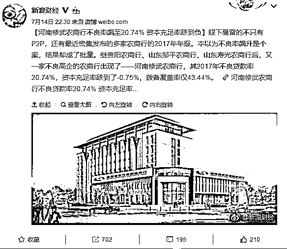
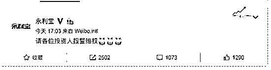
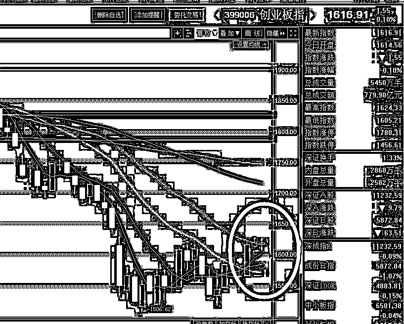

# 夜报|| 个别农商行开始出现破产征兆

1

自从国家允许银行破产之后，一直也没见银行破过产，但是如今不止是 P2P 出问题，甚至连一些农商行都开始出问题了，今天又一家不良高企的银行出现了，河南修武农商行，其 2017 年不良贷款率 20.74%，资本充足率跌到了-0.75%，拨备覆盖率仅 43.44%。

我给大家解释一下不良贷款率的定义，他的意思是指金融机构不良贷款占总贷款余额的比重。所谓不良贷款率 20%，意思就是你放出去 10 亿贷款，有 2 亿收不回来了成为坏账。这个比例实在是太高了，你要多高的利率才能覆盖掉这么大的风险，P2P 都不敢说覆盖的掉，何况银行。

所以，这家银行亏了，亏的还很厉害，资本充足率跌到了-0.75%，跌成负值什么意思呢，就是这家银行已经把自己的本钱亏完了，如果这个时候收回全部贷款返还给储户，整个银行全部的自有资产全部变卖都填不满这个窟窿，每个储户会净亏 0.75%，相对于 P2P 来说好太多啦，但是这可是银行啊。。。

2

说到 P2P，今天出现了一个良心 P2P 员工，今天下午，永利宝的 APP 对所有用户发出了一条消息，说老板跑路了，建议大家报案。

一个小时之后，还在官微上再度发了一条消息，建议大家报警维权。

从这个哭泣的表情中我们可以猜到，这个员工估计自己也投了很多钱在平台里，结果被老板给坑了，他也只能利用自己的职权无奈的发几个公开信息来保护自己了。

有一个投资人说“自从跟网贷大佬们学会了分散投资，鸡蛋不要装在一个篮子里，聪明的我把资金分散放到了下列平台：投融家、钱妈妈、银票网、善林金融、唐小僧、联璧。。。结果现在所有维权群里都能看到我的身影。”

雷潮还没平息，我还是之前的建议，让市场自动的大浪淘沙，留下的才是好 P2P，现在选好平台太难了，半年之后就容易多了。

3

造假疫苗草菅人命的长生生物，今天无悬念跌停，这个股如果踩雷的，继续挂跌停，不要有任何幻想，打开跌停后，除非天降奇迹，否则他还会继续下跌。

4

大盘今天反复震荡，最终收横盘，但是我们要注意，上证估计还受 20 日均线压制，但是创业板，目前的走势图是明显的长阳之后收横盘，这是要继续上涨的典型图形。

总的来说，我今天没有操作，继续持股待涨，这一波还没完，等涨到满意的位置再逐渐的一批批抛，现在还早。

今晚兴趣点主要是开相亲大会，记得去头条下面参与。