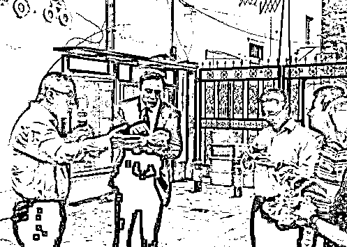

# Z 夜报|| 每个人每周都要充一次电

今天我把夜报给放到头条的位置了，因为今天我把时间抽出来看书充电了，这种行为我决定以后每周一次。

我的每一篇头条，都是高浓度知识精华进行输出，要求做到每一篇文章，都具备新思维和新逻辑，要求每个人看到后，都会吸收到新的知识并感觉自己的智商得到了提升。

紫竹出品必属精品这个理念是非常好的，但是他有个缺点，就是对自身知识储备的要求实在是太高了，任你以前读过千本书，也经不住这么耗，没多长时间就把你耗成人干了。

所以，我们每个人都要进行日常读书学习来充电，我也一样，不管我以前读过多少书，有过多少知识储备，一样要进行日常充电，而我现在每天挤出时间去看书学习，明显不够用了，所以每周必须抽出一天的时间去规模化的大量读书充电，这样才可以做到自身知识储备的进出平衡。

而我的夜报，是财经类新闻点评合集，每周 5 篇，时间是周末到周四，而头条我会输出 6 篇，每周选一天时间休息充电，一定是夜报所在的日子，这样不至于开天窗，可以让夜报顶上去。

故，在今天的夜报之前，我先插入这一段，顺便也鼓励大家平时一起读书学习，这世界上没有人是行走的百科全书，都是读书读出来的，一旦你中断了学习，知识枯竭的速度简直快的不要不要的。

每个人每周都要充一次电，我是这样，你也是。

~~~

然后，给大家看一个周末火爆网络的截图，那就是特斯拉陷入了财务危机，老板马斯克流落街头啃煎饼果子度日！

马斯克就是美国钢铁侠的原型，特斯拉不仅造电动车，还造火箭，是美国高科技企业的典范，如今特斯拉的老板跑到中国街头啃煎饼果子，还穿着西装，这么接地气的土味形象马上就把中国网友给震惊了。有媒体把马斯克买了多少煎饼果子（12 份），啥口味（微辣），里面加了啥（加里脊）都扒出来了…

钢铁侠秒变煎饼侠，很有趣。不过最让我欣慰的是他来中国吃煎饼的原因，是因为特朗斯在上海的工厂即将开建，这家工厂两到三年后，将达到预期的产能 50 万辆的目标，是上海有史以来最大的外资制造业项目，也是特斯拉在美国之外的第一座工厂。

特朗普处心积虑的打毛衣战，结果特斯拉跑中国去了，哈雷摩托跑欧洲去了，你说有趣不。

~~~

证监会研究中心正局级研究员刘青松在 2018 国际货币论坛上表示，通过过去几十年的判断，去杠杆最核心的是要经济健康发展，才能去杠杆。金融去杠杆要服务于服从于实体经济健康发展的需要；要大力发展股权融资；优秀证券公司适度加杠杆；加强融资类业务监测监控监管，严打地下非法配资活动；贯彻资管新规，拆除多层嵌套，消除监管套利。此外他还称去杠杆是一个漫长的过程，“要谨慎，不能操之过急”。

这个新闻里，最重要的一句话是“优秀证券公司适度加杠杆”以及“去杠杆不能操之过急”，我想在某种意义上表达了上头的意思。

按惯例，这种正局级的人物说话，故意出来吹风的可能性大，加杠杆我觉得是不会加杠杆的，毕竟他也说了，优秀的证券公司可以适度加杠杆，而不是全体加杠杆，但是我觉得，目前轰轰烈烈的去杠杆，可能真的是要缓一缓了，可以不加，但是去杠杆可能会略微停一停。

这个对股市是较大利好，而股市上周抗住了 2000 亿黑天鹅冲击，不跌反涨，暴跌之后出大利空不跌，是见底征兆，故股市看筑底，要发动一波反弹，建议继续持股不动。整体的技术图形，也均符合见底标志。

另外，还有一个上市公司比较惨，国家药品监督管理局发布通告，称长生生物狂犬病疫苗生产存在记录造假等严重违反《药品生产质量管理规范》行为，决定收回该企业《药品 GMP 证书》，责令停止狂犬疫苗的生产。吉林省食品药品监督管理局调查组已进驻该企业，对相关违法违规行为立案调查。

没话说，一家药物公司拿到批文是千难万难的，赚钱全靠这个了，对应的，一旦证书被收回，是致命打击。

预估连续跌停，建议直接挂跌停板。

~~

国开行原副行长、辽宁省原副省长刘克崮认为，个税起征点提升到 5000 元太多了，认为如果提到 5000 元这么高，那么中国的个税基本是富人在交税，他认为，如果提升到这个档次，那么中国是三千万人交税，占 13 亿人口的不到 3%，都是高收入，中收入都不交税。而美国是 1.6 亿人交税，占三亿人口的 51%，是我们的大约 20 倍，所以这个状况要改变。

工资超过 5000 元你就超越了 95%的中国人，这个论题我写过，很多人都不认同，如今国开行的原副行长也这么说，大家应该心里都有点数了吧。

不过，这个副行长希望降低起征标准，建议个人所得税应该从富人税转变成国民税，最终实现全覆盖，提高缴纳个税的人口范围和提高个税在整体税收中的比重。这个我是完全不赞同的，中国房贷压力太重，富人的灰色收入太多，别老针对工薪阶层了，中国和美国不一样，刘行长你说话之前，有没有看看美国的超高收入富人缴纳多少个税，而中国的超高收入富人又缴纳多少个税呢，中国没有美国的那种征税制度和诚信体系，所以也就不能盲目照搬。

对了，上次我写中国人收入文章的时候，绝大多数人都不信，那是因为互联网用户里，一二线中产阶层居多，而喜欢看财经文章的，高收入家庭居多，所以我的粉丝，人均收入远远超过全国平均值，所以才会出现科普难度如此之大的现象，因为和日常认知差距太大了，今天就顺手做一个日常调查，看看大家的年龄和收入，投票结果我明天会公布在夜报里，满足大家好奇心。

觉得此文的分析有道理，对你有所帮助，请随手转发。

往期回顾（回复“目录”关键词可查看更多）

香港人说，香港房价必须这么贵！| 刚性兑付是一种骗局 |成本 200 的百姓救命药卖到 2 万一盒，难道没钱就得死？| 中国的房价什么时候会崩盘？| 你根本不知道烟草公司有多赚钱 | 中央这次打击三四线城市房价的决心为何如此坚定| 我是如何保证自己不近视的 | 魏忠贤其实是个贤臣 | 2 分钟了解中国 50 年的艰辛发展史 |历史数据表明：中国最赚钱的职业十年一个轮回 |房价大利空，货币化棚改权限被收回

