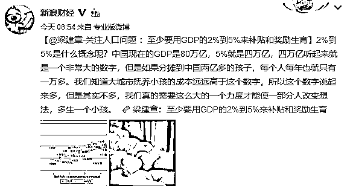
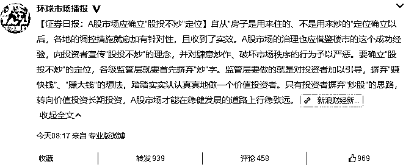
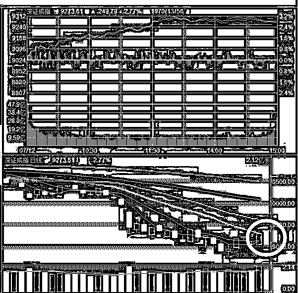
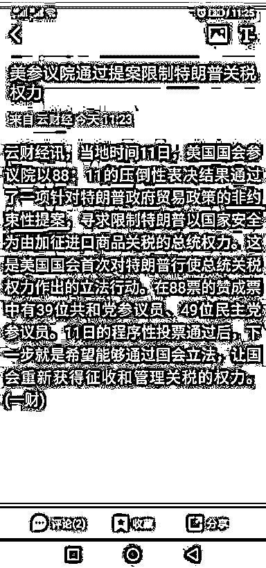
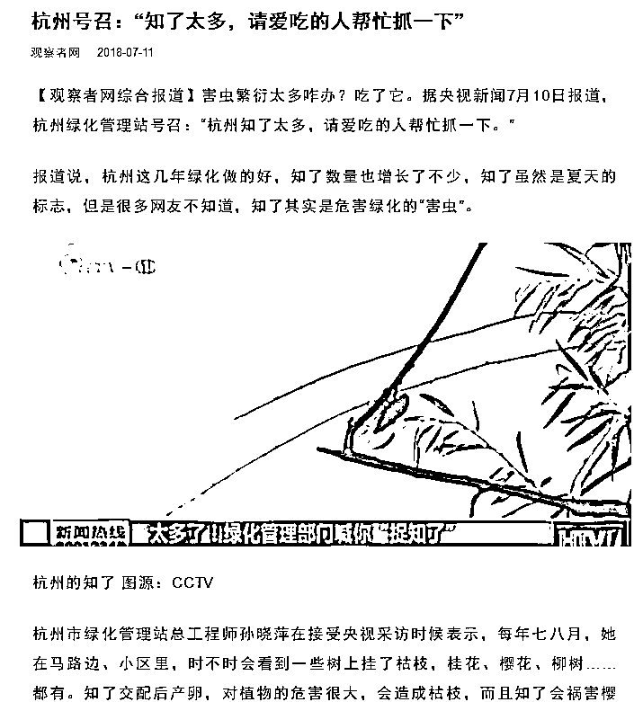

# Z 夜报|| 中国终于要开始鼓励生育了，股市和楼市都需要新韭菜啊

今天，新闻报道说国家卫健委已组织专家，研究奖励生育的可能性，测算对不同孩次家庭给予奖励，所能带来对刺激生育的不同效果。这项研究预计将在年底完成，届时可能上报有关部门。

据称，该研究将探讨包括对生育子女家庭给予物质、税收减免等奖励的可能性。“奖励一孩还是奖励二孩？怎么奖励？每年要花多少钱，这些都需要深入论证。”有关专家表示，“最终的目的是让成本、效益最大化。

其中，最夸张的一个专家叫梁建章，他居然建议说用 GDP 的 2~5%来补贴生育，我想他可能没搞清楚 GDP 和财政收入之间的区别，即便拿出财政收入的 1%来补贴生育，都是惊天动地的大事了。

虽然我知道早晚有这一天，但是没想到这一天来的这么快，这刚开放二胎几年，就开始面临鼓励生育的问题了，说明开放了二胎还是没人愿意生，形势很危急，出生人口不足，股市和楼市都缺韭菜了。。。

我个人私下认为，国之大计，应该制定的有前瞻性和预见性一点，这种要么极左要么极右的国策，过于粗暴简单了，要是真的开始全面放开生育，甚至开始鼓励生育，那可真是。

早知如此，何必当初啊。

~~~~~~

今天，看到一个重大的股市新闻，证券日报发布惊人言论，中国股市应该股投不炒。

自从房子是拿来住的，不是拿来炒的这个房住不炒的口号提出以来，由于部分棚改城市房价炒作之风越演越烈，被民众戏称为房子是拿来炒的，股市是拿来住的。

但是这只是民众戏称，民众可以说股市不是拿来炒的，但是官媒不能这么说啊，按这个思路逻辑，中国有望成为全球首个股票不炒的国家。

当然，证券日报说的，要投资者摈弃炒股的思路，转向价值长期投资，A 股才能稳定健康的发展，这么说是没错的，鼓励长期投资是所有成熟资本市场都应该做的。但是那并不代表要强制这么做，事实上，任何一国的股市，各种力量都是互相并存的，他们互为对手盘，互相组成了股市的生态，缺少任何一股力量，股市都是不健康的。监管可以引导扩大长期投资的力量并有序改造，但是绝对不能上升为行动口号来硬的。

更何况，中国股民是否实行长期投资，那要看 A 股有没有那么多好企业，个个都是铁公鸡，分红率还比不过存款，有什么好长期投资的，如果把口号改成，不分红的企业没资格上市，我觉得还是比较符合中国现状的，不是每个企业都是伯克希尔公司的。

昨天 2000E 爆发，重大黑天鹅来袭，但是我经过分析认为，如此巨大的黑天鹅，居然只跌了那么一点，属于典型的出利空不怎么跌，对应的就是底部征兆，而出大利好不怎么涨，那是顶部征兆。

在这个逻辑的支撑下，我们打算硬撑这波 2000E 大黑天鹅，这里怎么看都是底部了，结果今天整个 A 股大面积爆发，全体大暴涨，个股中位数要赚 3%左右，其中，上证指数和深成指，今天都兵临 20 日线下了，收盘价刚好顶住这个压力位，可以认为，突破只是时间问题，无非是几天而已。

今天这根鼓舞人心的大阳线，预示着整个 7 月，都是好日子，继续拿着，估计要到 8 月左右才会形势恶化。

对了，关于毛衣战，今天有一个新闻刷屏了，就是这个，说美国参议院通过提案限制特没谱的关税权利，一时间人人轰动。

我这里要告诉大家的是，参议院没这么大的权利能约束总统，国会还差不多，这个提案顶多只能说是建议国会约束特没谱的权利，而不是说美国真的开始约束特没谱了，注意这个报道里面，我标红的词汇，非约束性提案。

当然，今天 A 股的反弹是超跌反弹，本来就该涨的，这个新闻有没有，都不会耽误上涨，主力资金都知道他没啥用，不会影响资金的方向性运作的。

~~~~

剩下的基本没了，还有一个比较好玩的和大家说一下，我今天看到一个新闻，说杭州的知了泛滥成灾，政府建议市民抓知了除虫害。

知了这玩意，油炸之后是挺好吃的，不知道为啥杭州人不爱吃，另外我查了一下，知了在自然界的天敌是螳螂和一些鸟类，可惜这些东西的数量不够用，我在网上查的资料显示，知了最大的天敌，居然是人类。

我泱泱大中华，能把全球排名前列的危险物种小龙虾都给吃濒危，现在只能靠人工养殖苟延残喘，还怕区区知了，不能给中国人丢人，建议吃货们行动起来，把杭州知了给吃绝种了。