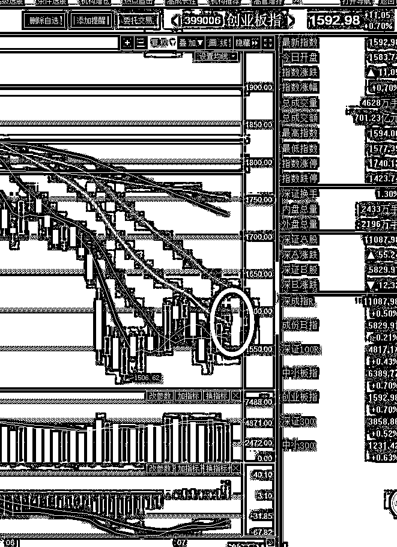

# 夜报 || 马云和马化腾解套了

小米近日在香港上市，上市之前，马云、马化腾、李嘉诚均大额认购，雷军的富豪圈子，基本每个人也都认购了几百万到上千万，在富豪圈子里，这等于是贺喜的随份子钱了。

但是上市首日，小米让所有人都目瞪口呆的开盘破发了，估值如此之低，按最低估值 IPO 的，居然还能开盘破发，师母已呆。

这下尴尬了，要是把看雷军面子认购股票的一群大佬，套在里面个一年半载的，那以后雷军出门咋见人啊，出席个宴会，发现要么是自己不认识的没办法搭话，凡是自己认识的都皮笑肉不笑的看着自己，这挺尴尬的。

所以雷军出手了，昨天夜间雷军携新老朋友在香港某酒店举办小米香港主板上市庆功宴，雷军放话，“要让在上市首日买入小米公司股票的投资人赚一倍”。

于是，小米今天应声暴涨 13%来响应这句话...

老实说，雷军这么说话是不妥当的，有以言论影响股市的嫌疑，不过在这种股市萎靡的档口，他这么做也没人追究的，毕竟上涨就是好事，今天是小米空难，做空小米的人都被打爆了。

今天马云和马化腾都解套了，以后雷军可以安心出席宴会了。

~~~

而今天的 A 股，实现了重要的多军突破，三大指数全部收小阳，其中创业板率先突破了重要压制线-20 日均线。

这可是个难得的突破，虽然还不至于成为多头的全军出击指令，但是至少一扫一个月来的大跌雾霾，要知道在纯粹的空头趋势下，任何一个指标向上突破 20 日均线都是非常困难的。

在这种情况下，创业板率先反攻，剩下的就等其余 2 个指标也向上突破了，等三大指标全部向上突破 20 日均线的时候，日子就舒服了。

这一波向上走完之后，我会逐渐减仓。但是不是现在，这个价位我还不打算卖，至少等大盘再猛涨一波再说。

而对于近期走势，很明显，最黑暗的时候已经过去了，现在怎么走都很舒服，除非来大阴线，否则图形是越走越好看，政策面的地雷已经过去了，现在技术面也越来越好看了，那就很舒服了。

好不容易熬到出头的日子，当然不能轻易走人，7 月份是翻身的时候，记住了。

今天就写那么多吧，白天出去有事，傍晚才回来，赶在 12 点之前把夜报写出来了，不然又要拆分到后花园去发，明天搜集搜集东西，提前发一点，今天发的太晚了不好意思。