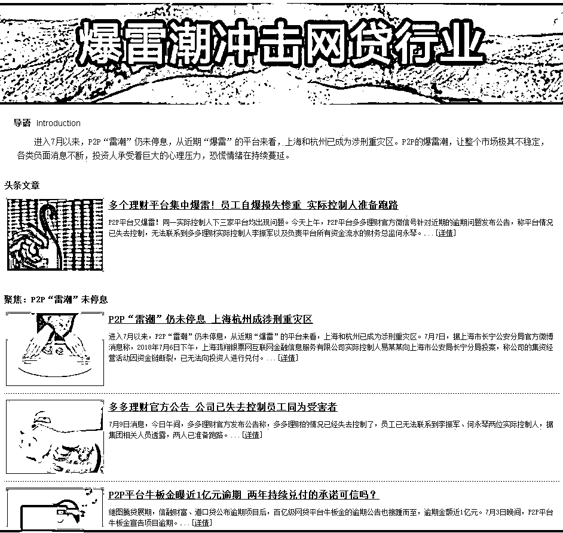
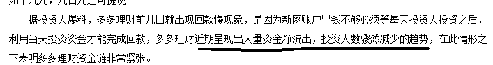

# 今天把夜报放在头条

昨天那篇香港房价的文章，被好多人抄袭，是那种直接复制且不注明作者的抄袭，以前我都不管的，今天突然来了兴致，就去多个平台一个个举报，于是一天就过去了，所以今天的头条开天窗了，真的没时间写了。你们不知道举报几十个之后，感觉身体都被掏空了。。。以后大家见到之后随手帮我举报下吧，个人时间精力真的不够。

所以我今天把夜报放到了头条的文章，平时我一般把他放次条的。很多新粉不知道次条夜报和头条的区别，他们的区别就是，头条使用学术论文的格式进行撰写，要求严谨且有趣，可以说是篇篇精华，当然对应所耗费的时间精力那也是很多的，写完之后就一个感觉，那就是累，所以被人直接拿去抄袭，我是比较愤怒的。

次条夜报，是散文体，个人日记模式，对国内外重大新闻，把我认为有趣的部分摘出来做一个汇总，然后给予简单的评价，是一种和人聊天的感觉，写完之后感觉很爽。这种文章里全是个人私货，所以一般没人抄。。。

~~~~

好，先谈谈 P2P，我记得我 6 月中旬报过警，说连环暴雷即将开启，因为恐慌性挤兑，可能会有很多家平台撑不住，也许本来还能抗三五年的，现在几天就被冲垮了，这个风险完全不可预测，你不知道哪家平台扛得住，哪家平台扛不住。

所以，最佳的选择就是全部回避观望，等半年，他们的暴雷速度减缓下来，冲击波过去了那才是安全的时候，能抗住这一波暴雷潮的，都是有二把刷子的平台。

至于我号召大家提前抽资避险，会不会提前引发挤兑，这关我啥事呢，大浪当前，保住自己就不错了。那些满是窟窿的平台，注定只能有少数人安全上岸的，那我希望上岸的那批人，是我的粉丝。至于那些没有窟窿，资金链非常健康的平台，我这号召了一小拨人离场，也无伤大雅，等你们抗完这波抽资潮，半年后还会回来投你们的。

所以，既然能预料到可能发生挤兑潮，那索性带着自己人先挤兑个一波再说。到了 7 月，挤兑潮开始逐渐爆发威力了。

媒体都已经把这个暴雷潮整理成一个专题了，其中 7 月以来，上海和杭州是重灾区，都是大平台，是涉刑重灾区。以今天刚刚暴雷的杭州多多理财为例，他的死亡原因被媒体介绍的非常情况，就是死于挤兑。

怎么说呢，安稳做壁上观，等雷潮稳定下来再说吧。

~~~~~

今天还有一个大新闻是小米上市当天破发了，这一下轰动媒体了，小米上市万众瞩目，还是国内首个 CDR 项目，李嘉诚、马云、马化腾等一众大佬都参与了认购。IPO 价格定在了 17 元，是报价区间的最低价格，估值仅仅 485 亿美金，要知道 2014 年底小米第五轮融资的时候，机构都给出了 450 亿美金估值。

这种状态下的独角兽，要是登录 A 股，得给几个涨停？我觉得三五个是最起码的吧，按照行规，2014 年一级市场都估值 450 亿美金了，到了 2018 年，估值个千亿美金，那真的是正常现象。

但是到了港股，485 亿美金估值都不给，直接就给破发了，换句话说，2014 年按 450 亿美金估值投资小米的人，扣除利息后，稳亏，这种事情在 A 股是不可思议的，但是在港股却出现了。就小米这个估值，比 A 股很多公司那真的是要良心太多了，但是然并卵，居然破发，各大金融媒体全部大跌眼镜，幸好推迟了 CDR，要是同步上市，A 股大涨，港股破发，那才真是好玩呢。

其实看到今天这种情况，我倒是有点理解管理层为什么要推进 CDR 了，腾讯阿里这种已经在境外上市的，要回来只能 CDR 可以理解。但是小米这种公司，非要弄到港股上市，然后再发 CDR 回到 A 股再上市，为啥要多此一举，这还真的是有道理的。

A 股有天然的缺陷，已经尾大不掉，相比成熟的资本市场实在过于羸弱，于是监管层曾经推进很多 A 股在香港上市，用 A 股和 H 股做价格对比，可以明显发现，AH 股是长期倒挂的，这还是在有 H 股做参照的基础上，那些没有 H 股做参照的，股价早都飞天了。

所以，小米这种独角兽，是可以在 A 股直接上市的，但是一方面监管层担心抽血过度，想让港股分担一点抽血压力，一方面是不信任 A 股的估值体系，想以港股的估值体系为主，再以 CDR 的形式回到 A 股，本质上来说，就是推动小米在 A 股上市，但是非要转这么一道手。

A 股不能给小米合理的估值，证监会也没那个本事定出正确的估值，那只能交给港股市场，让小米在港股经受历练之后，确定了真正的合理估值，然后再 CDR 回到 A 股，因为 CDR 本质上就是 H 股，用一个凭证的方式来 A 股流通而已，所以不存在 AH 倒挂，估值也会非常合理。

所以我们可以看出，监管层的本意是推动美股那样的市场，让投资者能够真正的参与到好公司，严厉打击讲故事炒作之风，让分红、回购这种真金白银的方案成为拉升股价的主要手段。

这个做法，本质上是好的，就是步子走的有点太快了，稍微慢一点，让市场缓口气就好了。

~~

昨天晚上的夜报，由于超过了 12 点，发在了紫色后花园里，昨天的夜报明确的说，本周上涨概率大，理由也很充沛，IPO 速度也减缓了，CDR 也暂时实质暂停了，贸易战的大雷也暂时排除了，技术面也严重超跌了，连被制裁的美国大豆都大涨 4.5%了。

而今天，A 股全面暴涨，三大指数齐头并进，全部普涨 2.5%左右，大盘重返 2800，整个盘面一片红，而且是大小盘齐飞，没有缺陷的红。

今天刚开始涨，短期内看不到什么风险，肯定先等等看了，我昨天说的是本周上涨概率大，而不是今天上涨概率大，我觉得本周的累计涨幅，应该不止 2.5%，建议继续持有，这个区域没有任何卖出价值。

觉得此文的分析有道理，对你有所帮助，请随手转发。

往期回顾（回复“目录”关键词可查看更多）

为什么中国必须购买美国国债？| 租房贷款会将房子拆分成房骨和房皮 | 香港人说，香港房价必须这么贵！ | 中国的房价什么时候会崩盘？| 你根本不知道烟草公司有多赚钱 | 如何把自家孩子培养成一个顶尖人才 | 我是如何保证自己不近视的 | 魏忠贤其实是个贤臣 | 2 分钟了解中国 50 年的艰辛发展史 |历史数据表明：中国最赚钱的职业十年一个轮回 |房价大利空，货币化棚改权限被收回

