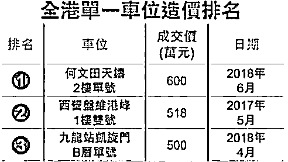
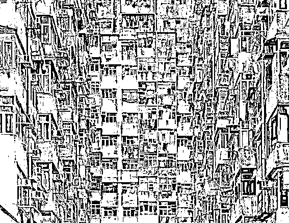
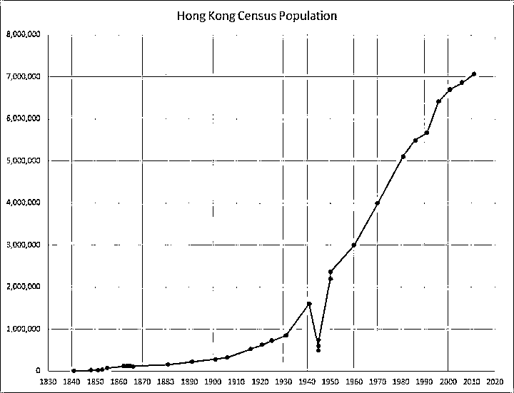

# 香港人说，香港房价必须这么贵！

大家都知道，要轮疯狂的楼市，北京上海只能算第二名，第一名当之无愧的属于香港地区，房屋单价为世界第一，各项地产价格数据完胜东京、纽约、北京等城市，高到什么程度呢，一个车位能卖 600 万元，车位比车贵，房子比人贵。整个香港的房屋均价目前是 22-30 万一平米，注意是全港均价而不是最贵的豪宅区。

为什么香港楼市这么贵，有人给出了三大理由，那就是地少、人多、经济发达，但是我们仔细推理可以发现，这三条理由全部站不住脚。

香港的土地一点都不少

有人说香港弹丸之地，承载了如此之多的人口，房价必然上涨。地少人多会导致房价上涨这个逻辑支撑了日本的上一轮房价大泡沫，已经被证实为伪命题，而人口密度比香港还大的新加坡，多年来房价始终平稳，更是彻底的证明这个论断是错误的。更有利的证据是，香港的土地一点都不少，只是都没开发而已。

根据目前的数据来看，整个香港的土地，目前有接近 80%尚未开发，这些土地如果不用于商业和工业，全部造成住宅，每提供 1%的土地，可以解决 100 万人的置业问题。至于有些人拿香港多山，丘陵地区开发困难说事，认为这些土地不能开发为住宅。我想说的是这话简直太业余了，中国目前的土木技术，上能平山下能填海，香港如此之高的房价，就算是喜马拉雅山，开发商都能给你挖平了。

目前的现状是，香港一方面房价暴涨，一方面仍有大量的储备土地和闲置土地，全香港 1100 余平方公里的土地上，仅郊野公园就有 400 多平方公里，而与此同时，香港人均居住面积 16 平米，大量香港人居住在鸽子笼里，住房痛苦指数全球第一。

为什么香港宁愿房价这么高也不增加土地供应，下文会有仔细分析

香港人多也不是房价上涨的理由

很多人说，香港人多啊，且人口持续涌入，所以房价必然上涨。但是其实，100 年来，香港的人口始终的爆发式增长的，但是历史上香港的房价从来没有成为人民的沉重负担，香港的房价实际上是最近一二十年开始暴涨的，但是与此同时，最近十年香港的人口增速却是是历史上最慢的，所以人口持续增长是导致香港房价上涨的论断站不住脚。

我们可以看到，香港自开港以来，人口从 0 开始始终持续增长，建国以来增长速度维持恒定，基本就是 20 年翻一倍的速度，这个人口流入速度是很恐怖的，这和香港金融中心的地位是分不开的。但是这个不重要，重要的是，我们知道香港的人口流入是一种常态，而不是突然发生的意外，那么为什么以前的房子没人喊贵，现在的房子人人喊贵，这就有问题了。

香港经济好更不是房价暴涨的理由

至于第三个理由，香港是金融中心，经济好收入高，所以房价上涨是正常的，这就更不对了。香港是很富裕，但是也没那么富裕，人均收入超过香港但是房价不如香港的城市，全球到处都是，东京、纽约、伦敦、巴黎，哪个比香港穷？但是他们的房价远远不如香港。

甚至，这些城市的房价只是香港的零头，真的只是零头，2018 年香港均价是 20 多万一平米，把最前面那个 2 抹掉，就是东京、纽约、伦敦、巴黎的房价均价。

所以，房价高要求人均收入高，这样才符合基本面，但是人均收入高却不一定房价高，这是有多国数据作为铁证的。

香港房价的历史

既然这些都不是香港房价高的原因，那么香港房价高的真正原因是什么，这就要看看香港的房价历史了。

香港房价高最大的问题是港府手中有地但是却不卖，扩大土地供应压制房价，非不能也，实不为也，而造成这个问题的根源，居然在于香港人民自己。

首先，我们从上面的香港人口历史走势图可以看到，100 年来，香港的人口始终是在持续增长的，而香港的经济在百年来也始终在持续高速增长，所以香港一直是一块梦想的淘金之地，在这种人口持续涌入、经济始终高速增长的城市生活，你做什么都赚钱，香港人也一直有炒房的传统。

而香港楼市泡沫的巅峰，出现在 1997 年，这次泡沫峰顶的冲击点始于 1995 年。

这一年，离香港回归只有 2 年，关于回归后香港的发展是港人最喜欢讨论的话题，大陆 13 亿的人口让香港的房地产炒作有了无限的想象力和故事可以洗脑。

“大陆一定会接盘”，这是 95 年响彻香港炒房界的口号，理由很简单，香港那么富，大陆那么穷，香港回归之后，大陆的有钱人一定会源源不断的进入香港当接盘侠，其理由和逻辑，和今天中国人认为富起来的农民工一定会当大城市的接盘侠差不多。

当时的香港，不买房的是傻子，在最疯狂的时候，刚买房一个月就暴涨 15%是常见的事情，买到就是赚到，越等越后悔，当时香港的种种乱象，和今天的中国差不多。

在 97 年的香港，所有港人无心工作，每天最关心的事情就是哪里又开新楼盘了，因为买房人太多，整个香港的房子供不应求，所以不得不实行摇号制度。在这种排队摇号的制度下，买到就是赚到，很多人摇到房子之后转手一卖就是几十万的差价，等于几年的工资，这种情况下没有任何人肯安心工作，一有新盘放出，马上就是全港排队摇号。

**香港人把这种盛况，称之为****炒楼花****。**

这一切，在 1997 年都成为了泡沫幻影，在 97 年，香港的楼市发生了二件大事，那就是亚洲金融风暴和特首董建华上任。

1997 年，金融风暴席卷亚洲，香港也遭到了索罗斯的攻击，虽然在大陆的鼎力支持下勉强击退了国际炒家，但是香港也元气大伤，港股和楼市同时暴跌，香港楼市直接腰斩，这一次的暴跌是香港楼市的漫漫熊途的起始点。

但是仅仅一次金融攻击只能打断楼市上涨的趋势，而不能终结，08 年金融危机的规模和伤害比 97 年金融风暴要大的多，也没改变中国房价的上涨即是明证，真正逆转香港房价的人，是香港特首董建华。

1997 年，香港首任特首董建华宣誓就职，在当时的香港，高房价引发的民愤铺天盖地，报纸媒体都在声讨香港的高房价摧毁了香港人的梦想，压制了香港的经济。没房的人在骂政府，想有房子住；有小房子的人也在骂政府，想买大房子；有大房子的人也在骂政府，想买更多的房子。所有人都在说自己置业难，买不起房，恩，和今天的中国人差不多。

于是，作为首任特首，董先生想一举解决这个港人置业难问题，他提出了八万五公屋计划，想要让全港人都安居乐业，在这个雄心勃勃的计划中，董特首提出：

1、每年兴建的公营和私营房屋单位不少于八万五千个

2、十年内全港七成的家庭可以自置居所

3、轮候租住公屋的平均时间缩 短至三年

十年内，让全香港人都买得起房，都有自己的住宅，香港人安居乐业，再也不用发愁住房问题，这是不是个好政策，好政策啊，全港人都拍手叫好，称之为大善政。那么董特首是不是打嘴炮光说不干呢？不是的，董特首说到做到，上任当年就大兴土木建设公屋，每年八万五的建设计划一点折扣都不打，第一年开建的房屋甚至高达十万套，新官上任三把火，董特首这是憋着劲要做一个大政绩。

从 2000 年开始，董特首的廉价公屋建成开始入市，这一下可不得了，巨量的供应瞬间摧毁了市场，1999 年刚大幅反弹 20%的香港楼价应声跳水，在巨大供求预期之下，香港房价一路走跌，在 2004 年跌至谷底，六年间跌了七成。

从 1997 年底开始，香港的刚需们抗了大概五六年，到了 2003 年初左右，扛不住了，陆陆续续的开始有人因为房屋被银行没收拍卖而自杀，在当时的香港，负资产者有 10 万户之多，95-97 年买入房产的人悉数被套，不仅自己拿来当首付的一辈子的积蓄没了，还倒欠银行几百万元，一个月 2 万的月供让很多家庭不堪重负，勉强抗了几年之后几乎耗尽了所有的力量，当因为种种意外被公司辞退的时候，房屋被没收拍卖，然后银行通知你还欠几百万，以后一辈子都在还债的阴影中，自己还没有工作，自杀就成为不少人唯一的选择。

这个时候香港人才突然发现，他们要的不是便宜的房子，而是只允许自己购买的便宜房子，他们实质上要的是投机暴富，要的是洗劫别人的财富来达到自己富别人穷的目的。持有大量的房子的人不希望房价下跌，持有一个房子的人也不希望房价下跌，甚至只持有四五十平米蜗居的贫民，也不希望房价下跌，因为房价下跌切切实实的损害了他们的利益。只有那些彻底的无房者，才会支持房价下跌，但是连工作一辈子连一个超小户型的房子都没有的人，又有几个呢，这样的人又有多少话语权和组织能力呢。

于是，2003 年 7 月 1 日香港街头爆发 50 万人大游行，抗议香港房价下跌，要求港府救市，董建华滚蛋，八万五公屋计划是造成香港房价下跌的主要原因等等言论充斥媒体。没有人会承认自己当年是因为贪婪或者愚昧高位买入房产的，他们把一切原因都推给政府。挽救负资产者，拯救香港中产阶级，让房价上涨居然成了最大的政治正确。

于是，八万五公屋计划被实质暂停，大幅减少供地数量，董建华想让全香港人都安居乐业做一个大政绩，结果成了最大的行政败笔。

2005 年，董建华黯然离任，香港在继任特首的带领下，房价就开启了一路飞涨的模式，到今天已经翻了五倍。香港人再度成为房奴，高房价让港人不堪重负，压制香港经济活力的论调再次出现在媒体之上，要求政府想办法让香港人能安居乐业，和 1997 年的舆论差不多，历史总是在不断的轮回。

但是这一次，有董建华悲惨的先例在，还有哪个香港特首敢让每个香港人都住得上房。

觉得此文的分析有道理，对你有所帮助，请随手转发。

往期回顾（回复“目录”关键词可查看更多）

为什么中国必须购买美国国债？| 租房贷款会将房子拆分成房骨和房皮 | 宁波老虎事件遇难者不应该得到赔偿 | 中国的房价什么时候会崩盘？| 你根本不知道烟草公司有多赚钱 | 如何把自家孩子培养成一个顶尖人才 | 我是如何保证自己不近视的 | 魏忠贤其实是个贤臣 | 2 分钟了解中国 50 年的艰辛发展史 |历史数据表明：中国最赚钱的职业十年一个轮回 |房价大利空，货币化棚改权限被收回

