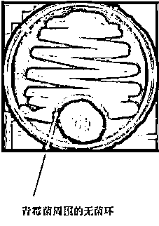

# 癌症很快就会被攻克，人类的医药发展史让你充满希望

《我不是药神》里展示了一款叫格列卫的神奇药物，只要终身服药，白血病人就能保住性命，这款药代表的就是人命，但是药不是天上掉的，是人类发明的，那么你知道从古至今人类发明新药的手段有什么变化吗？

实践指导理论的古代医学

在古代，人类的药物靠的是实践指导理论，简单的说，就是先知道结果，再去解释原因，是一个先果后因的顺序。

什么意思呢，简单的说一下就是古人的药物不是发明的，是发现的，都是意外收获，知道这个草药可以治疗这个病之后，再以一套理论去解释为什么。

古代发明草药的主要途径就是试，中国就有神农氏尝百草的传说，找大量的草药自己吃下去试试，看看有什么用。西方的巫医都知道一些能治病的草药，并主要靠这个方法维持声望，其实他们就是原始的中医。

但是很显然，这种方法获得的药物疗效判定，和尝草药的医生水平有很大关联，而且很难解释为什么，也很难衡量最佳剂量和毒副作用，即便是集合数千年中医智慧集合的本草纲目，也只能部分解决这个问题，而且这种方法获得的草药，大部分只能治疗小病，很多都是可以病人自愈的，草药只是辅助作用。那么能对致命性疾病进行针对性治疗的好草药有没有呢，也有，但是这种药基本都不是医生试出来的，而是拿人命堆出来的。

我们都知道，现代医学研发一款新药代价巨大，动辄需要十余年，耗资数十亿美金，平均成功率还只有 10%，可以说只有屈指可数的医药巨头有能力独立研发新药。那么古人没有那么强的经济实力和技术实力，他们是靠什么研发新药的呢？

古代的每一款特效药，都是靠数百年时间和数千万甚至数亿人命堆积出来的，这些致命性疾病古代称之为瘟疫，如疟疾、天花等传染性疾病在古代一旦染上，无药可救，只能靠人体自愈，死亡率 90%以上，十室九空，没死的人继续繁衍。

就这么年复一年的繁衍和死亡，终于有一天，有一个人在瘟疫肆虐的时候，偶然吃了一种植物，然后奇迹般的好了，他尝试着给同村的人也吃一下试试，居然也好了，于是一款特效药就被发明出来了。

例如屠呦呦的青蒿素，就是来源于古中医的《肘后备急方》的对青蒿“捣之取汁”的治疗方案，然后屠呦呦通过乙醚低温提取出单纯的青蒿素，经临床验证对疟疾具备奇效。这说明几千年的古中医遗留的财富是非常多的，而且每一个特效药的出现，都是靠大量的人命试出来的。不过这些特效药，只能称之为发现，而不是发明。

但是这并不代表这种做法是科学的，因为实践指导理论这个顺序是完全错误的，古人知其然不知其所以然，对于为什么古方中的草药组合能治病有很多解释，都是不科学且互相冲突矛盾的，无法科学解释自己的治病原理是古代医学最大的不足，例如古代中医的很多复方需要使用二三十味草药，那么减掉 3 味药行不行？每种药增点量，减点量会对病人产生什么理论影响？会增加疗效还是增加毒副作用？推测的理论影响和临床验证能完全一致吗？中医无法解释，因为他自己也不懂，只能说老祖宗吃了这个药就好了，所以他是有效的，祖宗之法不可变，所以方子不能改。

理论和实践相结合的近代医学

古代西方的医学是远远落后于中国医学的，中医已经写出本草纲目的时候，西方的医学知识还主要掌握在巫医手里呢，药物的疗效通常和神灵之力挂钩，可谓愚昧至极。

但是当近代科学飞速发展之后，西方医学的水平也飞速提升，西方进入近代医学的标志性发明，就是青霉素。

古人的空气是纯天然的，饮水是无污染的，食物是纯绿色的，按理说都是可以长命百岁的，但是为什么平均寿命都不足 30 岁，而现代人的寿命直接暴涨呢，其中一个很重要的原因就是青霉素的发明，这是一种让全球人均寿命直接提升 20 年的黄金药物。

为什么古代人均寿命这么低，一个很大的原因是太容易死了，死因是细菌感染。古人的每一天出门，都是一次和细菌之间的生存冒险，一旦得了由于擦伤或咬伤而引起的皮肤感染，平均 9 个人中有 1 个会失去生命；感染上肺炎后，10 人中有 3 人会丧命；肺结核、霍乱、脑膜炎、破伤风，个个要命而且个个都潜伏在你身边，就等你的皮肤出现一个缺口给他一个表现的机会。

在第一次世界大战中，死于感染的士兵远远大于直接阵亡的士兵，医生对这些细菌感染束手无策，只能进行简单的创口消毒，然后期望病人自身免疫力消灭细菌。大概相当于我们今天面对癌症的感觉是一样的，只能期望人体自愈，看谁运气好了。

此时，西方医学已经发现了致病细菌，并且成功将其分离出来，但是始终对其没有办法，但是这种对致病原的分离，是区分古代医学和近代医学的重要分水岭，近代医学知道发病原理，并且第一次的试图去针对性消灭这些病菌。

1928 年，英国一位在细菌实验室里任职的医生弗莱明，在外出休假的时候不小心把几十个长有葡萄球菌的培养皿遗忘在实验台上，同时恰好忘了关闭实验室的窗户，导致一些培养皿被窗外飘进的某种霉菌给污染，等他休假回来后惊奇的发现，其中一个培养皿被一种真菌污染，其中的葡萄球菌被真菌给杀死，硬生生的形成了一个空环。

这种真菌是青霉菌，弗莱明猜测是青霉菌分泌了某种物质能杀死这些细菌，他把这种神秘物质称之为青霉素，他提取出了青霉汁，但是由于没有大企业的工程技术支持，他无法将青霉汁浓缩，于是他没有做后续工作，只是把自己的发现写成了一篇论文。

1937 年，牛津的一个医学团队注意到了 9 年前弗莱明的论文，恰好这个团队具备提纯青霉素的工程能力，于是他们在弗莱明的基础上进行了继续研究，他们在青霉汁的基础上成功分离出了高纯度青霉素，为下一步的动物实验铺平了道路。

有很多物质都对细菌具备灭杀作用，如酒精、硫酸、甚至热水都可以，但是这并不代表这些物质能够注射到人体来帮人体灭菌，因为他一样可以灭杀人体正常细胞。所以青霉素能否用于人体，还是要经过试验，第一步的试验就是动物实验。

1940 年 5 月，牛津实验室的佛罗里用化脓性链球菌感染了 8 只实验鼠。随后给 2 只小鼠服用了 10 毫克青霉素，另外 2 只服用 5 毫克，还有 4 只不服用任何青霉素。次日凌晨，对照组的 4 只小鼠全部死亡，而服用了青霉素的 4 只小鼠全部存活，青霉素在动物试验中被证明对化脓性链球菌具备疗效且没有明显毒副作用。

在二战之中，一支青霉素就代表一条人命，在当时的中国，一支青霉素的价格等于一根金条，他的疗效可见一斑。青霉素神奇的疗效立刻震惊了英国政府，青霉素成为盟国除了原子弹之外的第二个秘密武器，也缔造了美国现代医药产业。四年以后，英国和盟国军队在诺曼底重返欧洲大陆，这一次，他们装备了 10 万单位的青霉素。

青霉素是介于发明和发现的一种产物，严格意义上来说依然属于发现，因为他是自然界的产物，并没有无中生有的创造一种新物质。但是他的出现不仅让人类第一次战胜了病菌，而且给了人类一个思路，让人类得以踏入了现代医学。

理论指导实践的现代医学

青霉素的发现告诉人类，只要我们分离出致病原，然后在实验室内不断的寻找各种物质灭杀他，理论上是可以找到一种新药来治愈他，成本和代价比古代拿人命试的方法要低得多，但是限于人类的认知问题，近代医学中只能在实验室里碰运气，而随着现代医学基因理论和现代化学理论的高速发展，让人类打开了现代医学的大门，那就是理论指导实践，其标志性产物，就是治疗白血病的格列卫。

1956 年，在美国的费城，主攻白血病和肿瘤的彼得医生发现，在慢性骨髓性白血病的癌细胞中，22 号染色体明显比正常人的要短。实验室进一步研究了 7 名白血病人的染色体，发现均具有此现象，于是彼得团队怀疑这个异常的染色体是导致白血病的源头所在，于是他们就这个现象发表了多条论文，震惊了整个癌症研究领域，这个异常的 22 号染色体因此被命名为费城染色体。

这个发现能治病吗？不能。这在现代医学里连敲门砖都算不上，属于基础研究，但是他是后续所有研究的基石。1973 年，芝加哥大学的珍妮特在彼得的基础上又前进了一步，她的团队发现，22 号染色体之所以这么短，是因为它的一部分染色体易位到了 9 号染色体上。

这个发现能治病吗？也不能，甚至到目前为止，连癌症的发病机理都还没搞清楚。1983 年，美国国立癌症研究所取得了巨大突破，他们发现，9 号染色体上的 Abl 基因，恰好与 22 号染色体上的 BCR 基因连到了一块，产生了一条 BCR-Abl 融合基因。

这个新诞生的组合基因有什么作用呢，他的作用就是修正了酪氨酸激酶的活性，正常的酪氨酸激酶活性是受到严格抑制的，但是这种新的酪氨酸激酶被称之为 BCR-Abl 蛋白，它一直处于活跃状态，换言之就是不受人体控制的疯狂的分裂繁殖，从而导致了癌症的发生。

为了验证这一发现，实验室将 BCR-Abl 融合基因导入小鼠体内细胞，小鼠果然出现了致命的白血病症状，至此，人类终于发现了白血病的发病机理。

这个发现能治病吗？还是不能。在白血病的发病机理被发现之后，美国诺华公司的实验室立即启动了寻找 BCR-Abl 蛋白抑制剂的项目，他们认为，只要抑制了 BCR-Abl 蛋白的合成，就能治疗白血病。

这一次，由于现代化学的高速发展，人类已经可以随心所欲的搭配分子式来无中生有的创造化合物，于是这一次人类没有傻乎乎的拿出无数的自然物质去碰运气，而是针对性的根据实验室的研究数据，不断的优化化合物的分子式，进行针对性的修饰，这大大加速了新药的研发速度和成功概率。又过了接近 20 年，诺华实验室进行了几十万种新化合物的尝试，终于发现了一种化合物满足医学上的一切需求，他被称之为伊马替尼，也叫格列卫。

在 1998 年，格列卫终于进入了人体临床试验阶段，在招募来的志愿者身上，格列卫展现了让人震惊的，堪称奇迹般的疗效，在 54 名志愿者身上，有 53 名出现了血液学上的完全缓解。由于其出色的治疗效果，美国药监局在进行二期临床试验后，为了加速此药上市，特批格列卫可以先上市，再做三期临床，可以说是超级绿色通道了。在三期临床试验中，5 年后，依旧有 98%的患者取得了血液学上的完全缓解。

换句话说，慢性骨髓性白血病不再是不治之症，由于格列卫的出现，他现在顶多是和糖尿病一个级别的重症，只要服药，你就没事。在胰岛素发明之前，糖尿病曾经是真正的不治之症，死亡率为 100%且无自愈可能性，比癌症还要高，而且通常活不过一年，医生能做的唯一事情，就是建议患者少吃含糖食物。但是在胰岛素发明之后，只要坚持注射胰岛素，那么糖尿病患者可以生存很久很久，和普通人并无太大区别。

格列卫让人类进入了靶向药时代，是现代医学理论和现代化学理论发展到一定高度后的完美结合，是典型的理论指导实践，他的出现标志着人类摆脱了对自然物质的依赖，踏入了现代医学的大门，人类可以无中生有的发明一种药物，靶向针对治疗，而不是靠撞大运去发现一种药物。

现代医学的大门叩开之后，只要在一个领域取得了第一个突破，就代表人类有能力消灭这整个领域的疾病，因为你是靠理论取解决第一个问题的。例如格列卫是专门针对性治疗慢性骨髓白血病的，但是他的出现为研究解决其他癌症指明了方向，只要找到了致病基因，就能找到致病基因产生的异常蛋白，然后利用现代化学针对性的发明出对应的抑制化合物，就能治疗这个癌症。

所以，在现代医学的加持下，人类解决所有的癌症是完全做得到的，只是需要时间而已，因为方向已经明确，剩下的就是靠实验室的反复工作来解决这个问题，在理论的指导下，人类不再是无头苍蝇。

理论解决一切的未来医学

现代医学只是叩开了人体奥秘的大门而已，但是也仅仅是大门，在浩瀚的人体奥秘面前，人类顶多是小学一年级的水平，别说破解整个人体的基因奥秘，就目前的医学水平，人类连一款能有效灭杀病毒的手段都没有。

注意，是整个人类，都没有任意一款可以灭杀任意一种病毒的药物，换言之，小到感冒病毒，大到艾滋病毒，随便来一个人类都没辙，现代的所谓抗病毒药物，其实只是一些增强自身免疫力来消灭病毒的办法，和古代的人参鸡汤给你补补身体来治病的原理是一样的。

所以，人类的医学理论还很弱，和经典物理学理论的差距，差不多相当于发明车轮和发明运载火箭的差距。当理论发展到极致的时候，理论可以指导一切，就好像经典物理学一样，整个人类的现代机械其实都是在经典物理学的指导下进行发明的，撞大运你是撞不出登月火箭的。经典物理学足以满足人类在地球上的一切需求，如果要飞出太阳系，那就需要爱因斯坦用相对论开创的新物理学了。

理论上，如果人类医学理论能发展到破译人体全部基因组的奥秘，能够随心所欲的搭配基因组合，并且知道每一个基因组合代表的含义，而人类的化学理论能够发展到能够随心所欲的搭配出自己想要效果的化合物，那么人类将轻松灭绝一切疾病，甚至长生不老药，那也不一定就是传说。

癌症用现代医学的知识就可以解决，而且不会太远。但是艾滋病涉及病毒，而病毒问题的理论高度和基因是一样的，因为病毒本质上就是一组基因而已，所以艾滋病的解决，需要人类医学再进行一次大的突破，达到未来医学的高度才有可能，所以短时间内是没有解决可能性的。

不过这一天终究会来，而我希望是中国的研究所来解决这一问题，中国医学理论目前极度落后，希望奋起直追，然后领先于全球，让我这个中国人也能顺便享享福。

觉得此文的分析有道理，对你有所帮助，请随手转发。

往期回顾（回复“目录”关键词可查看更多）

为什么中国必须购买美国国债？| 租房贷款会将房子拆分成房骨和房皮 | 宁波老虎事件遇难者不应该得到赔偿 | 中国的房价什么时候会崩盘？| 你根本不知道烟草公司有多赚钱 | 如何把自家孩子培养成一个顶尖人才 | 我是如何保证自己不近视的 | 魏忠贤其实是个贤臣 | 2 分钟了解中国 50 年的艰辛发展史 |历史数据表明：中国最赚钱的职业十年一个轮回 |房价大利空，货币化棚改权限被收回

