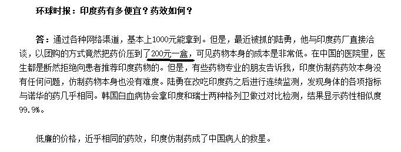
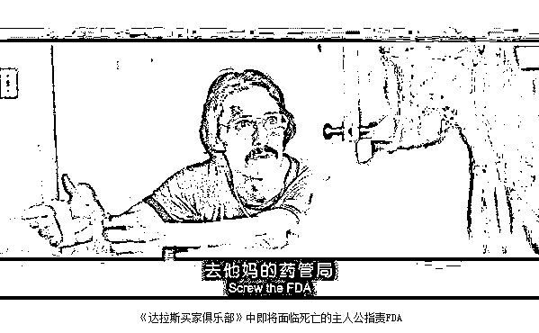

# 成本 200 的百姓救命药卖到 2 万一盒，难道没钱就得死？

这几天《我不是药神》这部电影爆了，被称之为难得的国产好片，这部电影之所以这么火爆，是因为他把现代医药的伦理冲突困境展露无遗，选取的药物原型也是争议最大的**癌症神药**格列卫。

神奇的格列卫

白血病是一种恶性肿瘤，而且是排行第六的恶性肿瘤，致死率非常的高，这个我应该不用科普了，它的凶名相信大家都有所耳闻。

而格列卫是新一代的靶向性抗癌药，是所有抗肿瘤药中效果最好的一种，其中对于慢性粒细胞白血病效果堪称神药，并对胃肠道间质肿瘤也有非常好的疗效，他对癌细胞进行靶向攻击，全面压制癌细胞。

格列卫治疗慢性粒白血病神到了什么地步呢，只要你一直吃这个药，你就不会死，他把白血病这种恶性肿瘤，生生的给降级到了高血压这种慢性病的危害程度。

这个疗效，当年惊艳全球，拿下一堆大奖，在格列卫的研发过程中，造就了 5 位美国科学院院士，5 位临床医学研究奖得主，1 位美国国家自然科学奖得主，世界首次发现染色体易位现象，并世界首次发现肿瘤细胞中的染色体变异现象，是世界医学的一项重大突破。

但是这款药有一个缺陷，那就是只能压制但是无法根除白血病，所以慢粒白血病和胃肠间质瘤患者须终身服药，一旦断药，癌细胞立刻就会卷土重来，速度非常之快，所以慢性粒白血病患者，必须持续服用格列卫，药就是生命，断药就是断命。

昂贵的格列卫

饱受争议的格列卫，除了其疗效让病人具备极强的依赖性之外，还有一个重要的因素，就是他的价格实在太昂贵，昂贵到足以让病人倾家荡产，为了活命被榨干每一分钱，引发巨大的伦理危机。

诺华格列卫 2001 年第一次引入中国至今，价格一直是 23500 元一盒，一盒为一个月服用剂量，一年耗资 28 万元。诺华从未降过价，只是根据病人的经济能力，在国家的施压下，2006 年在中国推行买三赠九等相关的优惠，但病人一年的经济负担仍然超过了 7 万，掏空了很多中国老百姓的家底。

一年花费 28 万或者 7 万元，就能保你的命，否则你就要去死，这笔钱值得花吗？对于很多富人来说是值得花的，但是对于更多的中国人来说，是花不起的，一条人命值多少钱，在这件事上表现的淋漓尽致，当你明知道医院里就有药，只要吃下去你肯定能活，但是你家境困难买不起的时候，你会有多么的绝望。（本文首发于公众号：紫竹张先生）

“我吃了三年的药，吃掉了房子，吃垮了家人。”影片中的这句台词，就是很多慢粒白血病患者的真实写照。

仿制的格列卫

格列卫的研发非常困难，集中了大量人力物力，但是其生产过程并不复杂，原材料也很便宜。昂贵的售价和其低廉的成本出现了巨大的反差，加上刚性的市场需求，自然会引来仿制药，其中最出名的，就是印度版格列卫。

印度版格列卫有多便宜，药神的原型是中国人陆勇，他在和印度药厂谈判的时候，把出厂价压到了 200 人民币一盒，其实际生产成本肯定低于 200 元，而正版药的售价，是 2.3 万人民币，这中间的差价简直可怖。

陆勇，被捕后被国内主流媒体称之为“药侠”，34 岁那年，他得了癌症，靠格列卫维持生命，但是经济的压力让他不堪重负，突然有一天，他找到了购买印度仿制药的途径，随后他把这种药效可靠，价格低廉的药物介绍给病友，最后一传十十传百，找到陆勇请求代购的人越来越多，陆勇把价格砍到了 200 元一盒，然后几乎没有加价的卖给他们，数千名癌症患者因此得以延续生命。

陆勇被捕那天，1002 名癌症患者在联名信上签字为他声援，呼吁司法部门让他们这些白血病患者多活几天，时值《达拉斯买家俱乐部》上映，主人公在影片中与癌症、人们的偏见及美国食品药品监督管理局抗争，陆勇简直就是这部电影的主角现实版。

中国怎么没有格列卫

我们都知道，格列卫不是印度研发的，是印度仿制的，说通俗点就是抄袭，既然印度都造的出来，中国为什么没有自己的格列卫，难道中国的仿制能力还比不过印度吗？

印度大规模仿制外国药品，有些药物甚至美国刚上架几个月，印度那边的仿制药就出炉，之所以如此规模化，是因为印度在 1970 年的《专利法》放弃了对药品化合物的知识产权保护，否认外国药企的专利权，允许本国企业生产仿制药，所以印度成了世界药厂。

对于印度产格列卫而言，他在印度是合法且有效的真药，但是到了中国，就是无法拿到行政批文的假药，中国是保护国际药企的专利权的，印度产格列卫明显侵害了诺华公司的专利权，所以当然不会被允许进口。由于不允许侵犯诺华的专利权，中国的药企也不敢去偷偷研发生产格列卫。

所以，全世界的仿制药几乎都集中在印度，连美国人有时候都偷偷的跑去印度买药，这是印度的法律所决定的。

专利保护和人命谁更大

中国对专利进行保护，这件事肯定是正确的。任何一个专利的发明都是要耗费大量的人力物力，如果不对专利进行保护，那么在发展的前期抄先进国家是很爽的，但是在发展的后期，就会被动挨打。

例如中国，原创和自主研发能力非常薄弱，其核心原因并不是什么填鸭式教学压抑了学生的想象力，根本原因是过去几十年里中国根本不重视对专利发明的保护，抄袭成风，谁也不愿意踏踏实实搞研发。研究出新东西有什么用，别人一下子就给你抄走了，你哭都没地方哭去，既然这样，我干嘛还要搞研究，跟着抄别人的就是了。

如果一个社会都是这种思维，那么他永远只能从事低级制造，永远只能跟着发达国家屁股后面走，因为你始终慢半拍，你不会自主研发，只会抄袭。有些产品是很容易抄的，你追上的步伐还快一点，但是像工业母机这种高精尖产品，你就是仿制能力再强，你连样机都拿不到，拿到的产品一般都差个三四代，所以你就根本没办法抄了。这种高精尖的东西只能靠自己研发，别无他法。

所以，对专利的保护是正确且有必要的，只要这个专利是别人发明的，无论售价多贵，都是有道理的，嫌贵你可以不买，就当这个世界没发明过这个东西就是。但是当专利保护和人命牵扯到一起的时候，事情就变的复杂棘手了。

赚钱可以，但是要有个度，当因为要赚取专利费而导致很多病人吃不起药只能凄惨的死亡，这种明知道生路在哪里，只是因为穷而眼睁睁的看着自己死去的悲剧，是任何一国的伦理都无法接受的。研发一种新药的成本通常都在 10 亿美元以上，医药公司很困难，但是病人因此倾家荡产，也很困难，我们不能单纯的倾向于某一边，社会效率和社会公平是互相制衡的，为了社会公平，牺牲一点社会效率，是可以接受的。

解决方案

那么，我国是如何解决这种冲突的呢，国家先是和诺华直接谈判施压，争取到了 3+9 优惠，也就是购买 3 盒送 9 盒，让每年病人的花费降低到了 7 万元，最近又通过立法，18 年开始各地陆续将格列卫等一系列抗癌药列入医保范围，国家给承担 70%的费用，并将抗癌药的进口关税，下降为 0，让病人的负担再次降低到每年 2 万以下。国家已经做出了巨大的努力，剩下的就要看中国药企争不争气了。

然后，陆勇是一个旗帜性的人物，经过一年的争论之后，警方决定对陆勇不起诉。这说明，官方其实对陆勇及背后的癌症患者是同情的，并想尽办法在法律许可的框架内，给予支持。

在这个世界，活着很简单，但是我希望有一天，人人都吃的起救命药，不管贫穷还是富裕，每一个生命都是平等的，没钱不是回家等死的理由，每个人都有权利活的越来越好。

觉得此文的分析有道理，对你有所帮助，请随手转发。

往期回顾（回复“目录”关键词可查看更多）

为什么中国必须购买美国国债？| 租房贷款会将房子拆分成房骨和房皮 | 宁波老虎事件遇难者不应该得到赔偿 | 中国的房价什么时候会崩盘？| 你根本不知道烟草公司有多赚钱 | 如何把自家孩子培养成一个顶尖人才 | 我是如何保证自己不近视的 | 魏忠贤其实是个贤臣 | 2 分钟了解中国 50 年的艰辛发展史 |历史数据表明：中国最赚钱的职业十年一个轮回 |房价大利空，货币化棚改权限被收回

