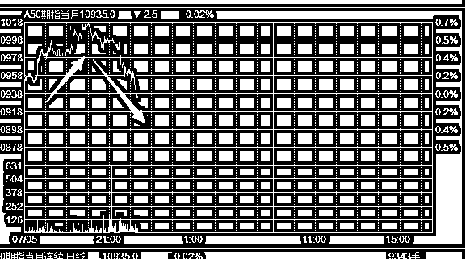
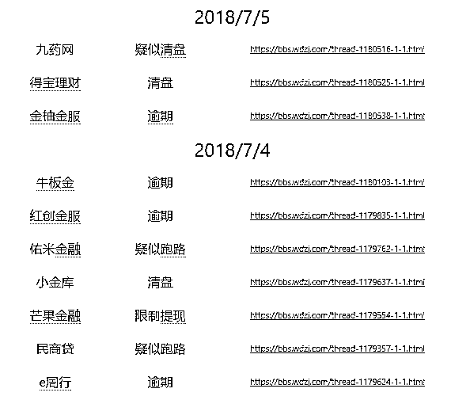

# 夜报 || 欧美股市全线高开，特朗普要认怂？

今天是周四，明天是周五，我们都知道，周五，也就是 7 月 6 号，美国会对中国的 500 亿美金商品进行征税，而中国早已反复警告，如果美国加税，中国会立刻加税，之前的优惠条件也会全部取消。

在市场资金避险的预期下，今天市场萎靡不振，虽然有屡次反弹抵抗，但是最终是全面收跌，从今天亚太其他股市的收跌幅度来看，这是个普遍现象。

但是到了今天夜间，爆出一个消息，美国驻德国大使在与德国车企高管的一场会议上表示，美国总统特朗普可能放弃对自欧盟进口汽车征收关税的威胁。然后今天欧股开盘，汽车板块高开高走，势将创下两年以来最大单日涨幅，带动欧股实现全面大涨，美股也是跳空高开。

欧美股市的迹象，说明这个新闻是真实的，特朗普的确可能放弃对欧盟征收汽车关税的打算。这说明特朗普有可能在贸易战上寻求一定的妥协和让步，而不是一味的强压。

把这个风声特地放在周四去宣布，有没有一种放风试探美国国内舆论立场的可能性呢，看看国内对于软化的对外政策反应如何，这有没有可能，是在给周五的贸易战做铺垫，如果国内形势可控，那么周五特朗普就会做出对中国软化的政策。

这种走势，也说明贸易战是对全球都是双输的行为，如果停止贸易战，那么则双赢。那么明天美国会不会放弃对中国的攻击呢，从种种迹象来看，概率很低。。。

据小道媒体报道，目前在美国的媒体上，对中国的攻击已经是一轮又一轮的开始了，目前还在交易的富时 A50，在受到美欧关系缓和的刺激暴涨之后，直接调头暴跌。

从这种走势来判断，目前的小道消息是真的，只不过主流媒体还在静默而已，释放美欧关系走好的消息，引来对中国的开炮攻击，这说明反华势力非常的强硬，明天又是一场腥风血雨啊，目前美股也在高开低走佐证此事。

从技术上说，目前是严重超跌，上证周 K 是 7 连阴，同志们，7 连阴啊，还是周线，这都多少年没见过这种单边下跌不回头的事情了，技术上怎么看都是严重超跌。各种指标我就不赘述了，日 K 底背离早就出现了，不过没有撑住引起大反弹而已，底背离只是一种逆转趋势的力量，连日 K 底背离都没扛得住，可见这次趋势下跌的力量之严重。我认为从 3600 跌到 3000 点已经很安全了，怎么都有个反弹再下跌，没想到能一口气直穿 2800，真是牛逼。

从政策面说，银保会郭主席屡屡发声呵护股市，几乎二三天就要发言一次，今天面对记者采访时说：“上市公司平均估值水平在主要经济体中居于低位”，意思就是说 A 股已经很便宜了来买吧。而北上资金今天单日流入 23 亿，美的集团获净买入达 3.93 亿元为今日净买入最大个股，一改过去几天始终流出的姿态，也是一种姿态。

不管怎么样，这跌的都有点多了，而且是始终无反弹的下跌，随时都会发生的反弹，让人很纠结。周五的雷是可以预计的，但是也只能硬吃，市场已经提前预估到了这个结果，不会差到太多的。

我这里希望的是，本周五的晚上，证监会能手下留情，多关注一下市场的实际情况，无脑发 IPO 谁都会啊，还要高智商的监管做什么。

~~~~~

对了，我这里有一份数据，是昨天和今天刚暴雷的 P2P 平台，其中牛板金还算是一个活期 P2P 的龙头平台，大家看一眼名单吧。

还是我半个月前说的那句话，连环暴雷会持续一阵子呢，到处都是本金全损的可能，自己多小心点，现在的金融市场真的不太平。这个阶段不建议投资任何 P2P 啊，等半年再说。