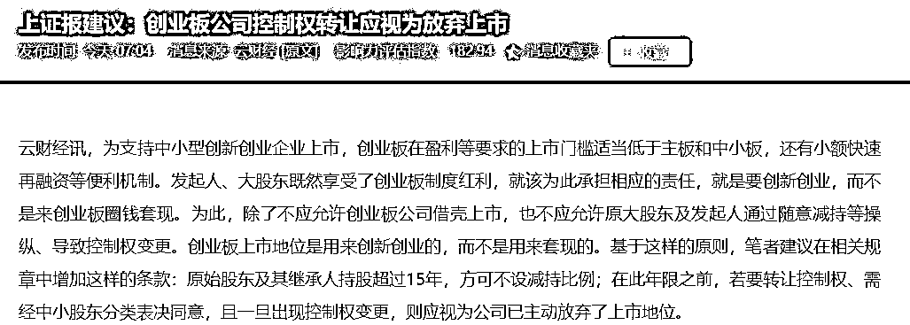
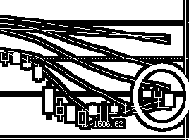

# Z 夜报 || 避险情绪升温，市场都在等待周五

美国今晚属于节假日，今天休市，所以昨天夜里美国避险情绪就开始发酵了，这特朗普一天一个情绪，休市一天都很危险，所以昨夜美股单边走跌，科技股领跌。

对应的，今天早上开盘，亚太股市的避险情绪也开始升温，大家都知道，本周五是一个大限，中方已经做好了准备，进行了很多让步以及多次警告，但是现在依然不能排除美国悍然推出 500 亿方案的可能性，美国动手之前，中国不敢大涨。

但是最关键的，还是今天早上 7 点，上证报的一则新闻，倡议创业板公司控制权转让应视为放弃上市。

首先，这个倡议肯定是好事，方向和目标都是对的，但是这实质上等于倡议严监管，堵塞大股东减持之路，如果立刻执行那也是好事，但是提前放风。。。只能加速大股东减持逃跑，我个人认为，今天创业板承压的主要因素就是他。但是从道理上说，我还是支持官方推出这样的政策的。

昨天创业板兵临 20 日均线脚下，我昨天就在想，贸易战结果宣布之前，过去了好像也没啥用吧，但是考虑到目前只能装死不动，也就懒得折腾了，今天果然还是没过去。

这个区域，实际上已经跌到了很多公司容忍的边缘，前几天的蓝筹大跌，也得到了上市公司的支持，很多上市公司已经频频宣布回购方案来维护股价了。

今天，美的集团发布了最豪气方案，将拿出不超过 40 亿元进行回购，回购价格不超过 50 元/股，预计回购上限 8000 万股，约占公司发行总股本的 1.2%，而今天美的的价格是 45 元，更关键的是，美的去年涨了那么多，刚跌了一点就开始回购维护股价了。

这个回购我给大家说一下是什么意思，就是上市公司把自己的利润拿出来购买自己的股票，这个利润购买的股票是没有主体的，他属于上市公司，但是不属于任何个人，所以上市公司会把他直接给注销掉，也就是如果全部回购，8000 万股就凭空从二级市场上消失了。

这种行为，是美股刺激股价的不二法宝，尤其有利于小股东，我很高兴 A 股也开始有人陆陆续续的使用这种办法，这是中国的进步。

明天是周四，后天是周五，本周五晚上，中美的贸易战就要进行重大战役了，很多公号已经提前被封贴禁言了，说明形势还是有点严峻的，美国发动的概率有点大。所以本周我的策略是涨一点就卖，奈何大家都这么看，没怎么涨，所以也只能硬吃了，现在被套了，可以说是完全的只能躺着不动了，这幅度有点大，高手死于抄底啊。玩了二年的震荡，没想到直接来了一波趋势大跌，不过我对这一波回本还是有信心的。

~~~

对了，雅百特今天晚上发了公告，公司直接被证监会移送公安机关了，罪名是公司在 2015 年报虚增当期营业收入及利润，涉嫌构成违规披露、不披露重要信息罪，股票自 7 月 6 日起实行“退市风险警示”特别处理。

按照行规，这个股票死定了，20 个跌停起步走，建议每天晚上八九点坚持挂次日的跌停板吧，运气好你能早跑出来，也是有可能的。