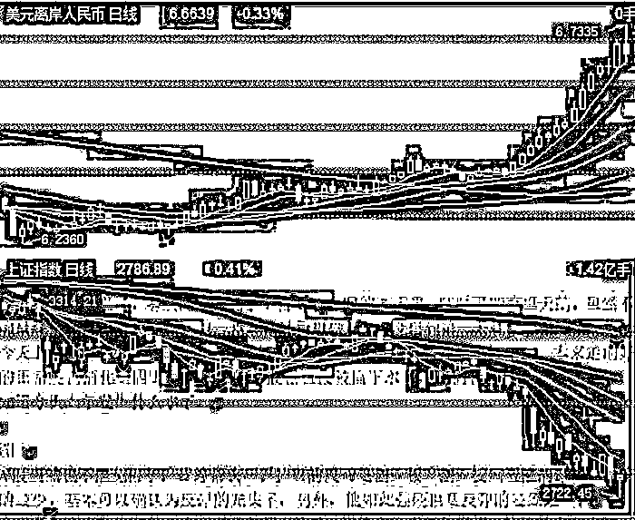
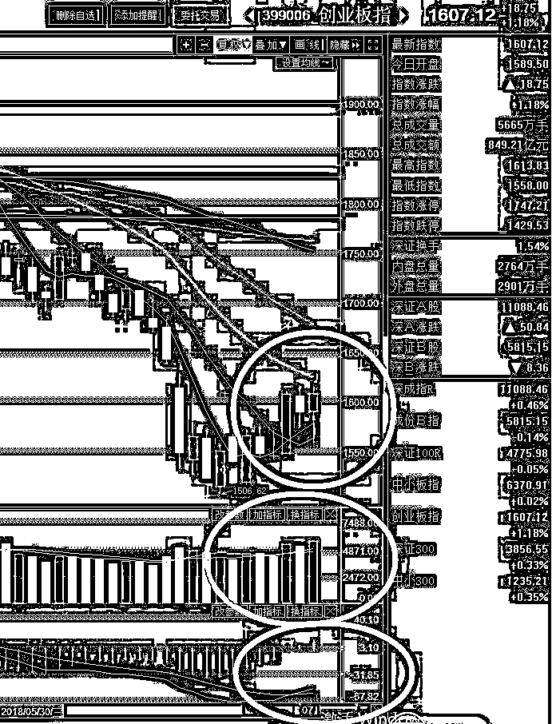

# Z 夜报 || 过去 70 年，中国各省份的经济发展是怎样的

大家还记得上次有人根据过去数十年各国家的经济发展做了一个动态变化视频吧，有人仿照这个逻辑把中国各省份的经济发展历史，做成了视频模式进行展示，我今天在网上看到了，非常精彩的视频，值得给大家分享一下看一下。

我对这个视频的感叹是，这真的是 30 年河东 30 年河西，各地区经济的切换强度真的是目瞪口呆，先进和落后的转换非常快，真的是不进则退。

~~~~~~

看完了视频，我们来看看今天的汇率，今天股市走出了深 V 见底，疯狂贬值的汇率也终于收了一根倒头锤终止了跌势，双方呈现一种完美对称的图形走势。

为什么人民币贬值会对股市产生影响，我也可以给大家说一下，外资买入股票，在 A 股不涨不跌的情况下，如果汇率贬值了 5%，那么外资实际上就损失了 5%，也就是说，在这期间，A 股大盘要上涨 5%才能对冲外资的损失。

所以当外资预期股市涨幅不足以对冲汇率损失的时候，他们就会撤退，越多的人有这种想法，资金流出就越严重。整个 5 月和 6 月的上半月，港股通都疯狂流入抄底，但是 6 月底这一会出现罕见的净流出，就是这个问题导致的。

幸好，我国对外资入 A 股有严格的额度限制，跑的时候跑的也很慢，这个严重不利于引入外资，因为他们风险不可控，但是当汇率贬值的时候，好处就体现出来了，他们跑不掉，降低了对中国金融市场的冲击程度。

~~~

今天股市，走出了一个大深 V，在上午的时候，蓝筹集体狂砸，我看到有些蓝筹股甚至跌幅快 6%了，这些蓝筹跌的比垃圾股还猛。。。

在中午濒临收盘之前，再度打出新低，盘中一度下跌接近 2%，护盘资金实在忍不住了，开始出手，拉出一个大深 V，到了收盘，上证收涨 0.41%，创业板收涨 1.18%.

上证的图形，不好看，始终没有彻底站稳 5 日线，今天这走势典型的是依靠护盘，而不是市场自发的力量，不过创业板的走势就好看多了。

连续几天，在各种利空，蓝筹砸盘的情况下，顽强的向上涨，甚至量能还出现了同步放大，这是非常好看的走势。

这一波猜底猜的伤，在过去二年，都是按照大震荡横盘走的，谁知道一口气来了一波趋势下跌，真的很难受，3000 点多次抄底，2850-2950 我只买了 3 成，重头戏是 3050 附近的几笔，虽然是创业板为主，但是上证也不少，没想到还能跌那么多，抗的很难受。不过这一波已经这样了，就只能等反弹出土了，毕竟这个时候，怎么看，最困难的时候都应该过去了，创业板已经出现了领头反弹的迹象，那么一切都好办，最黑暗的时候已经过去了.

觉得此文的分析有道理，对你有所帮助，请随手转发。

往期回顾（回复“目录”关键词可查看更多）

为什么中国必须购买美国国债？| 租房贷款会将房子拆分成房骨和房皮 | 宁波老虎事件遇难者不应该得到赔偿 | 中国的房价什么时候会崩盘？| 你根本不知道烟草公司有多赚钱 | 如何把自家孩子培养成一个顶尖人才 | 我是如何保证自己不近视的 | 魏忠贤其实是个贤臣 | 2 分钟了解中国 50 年的艰辛发展史 |历史数据表明：中国最赚钱的职业十年一个轮回 |房价大利空，货币化棚改权限被收回

