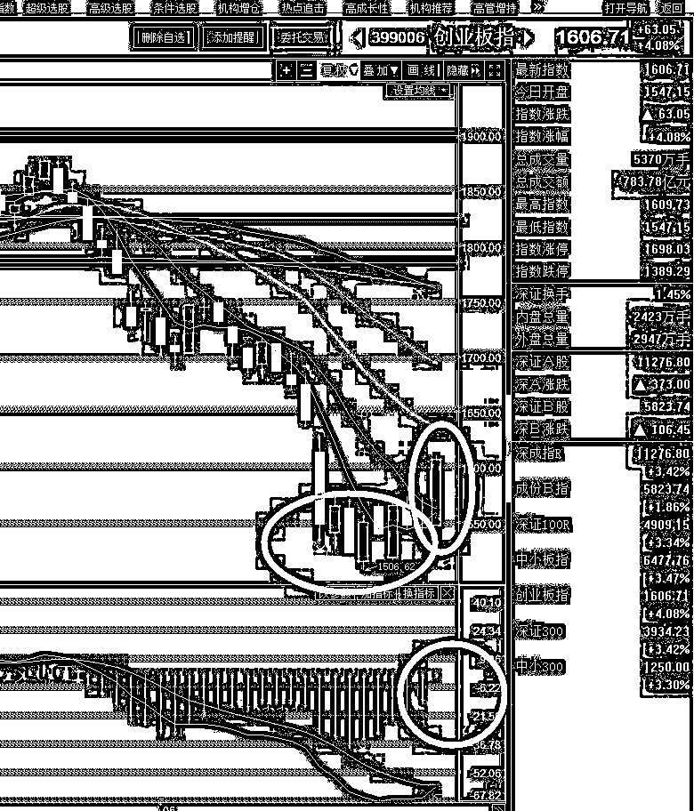
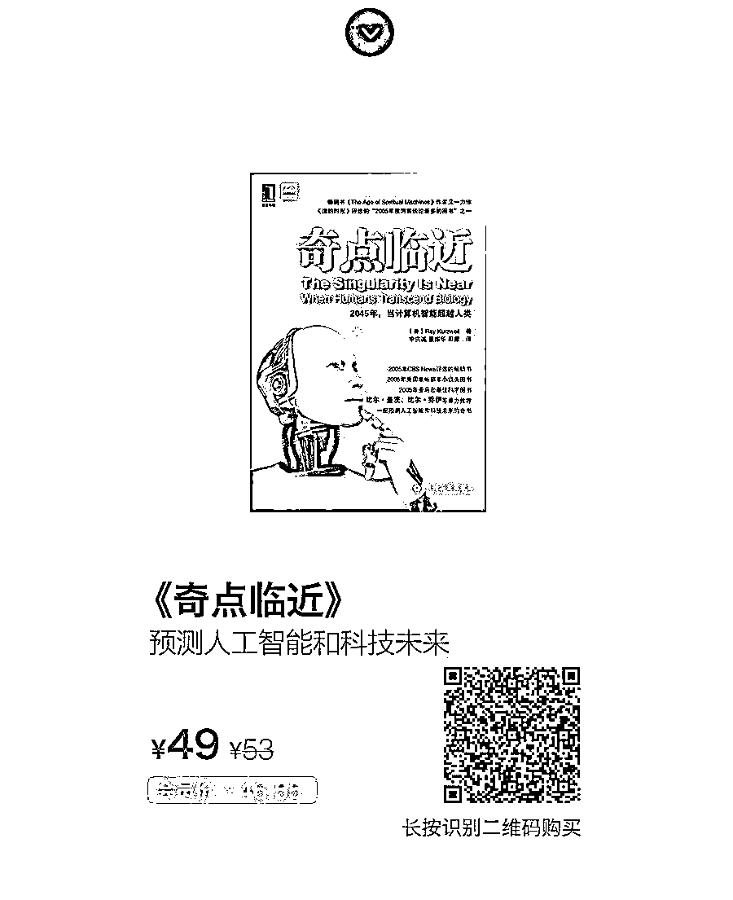

# 夜报 || 六月出事的 P2P 平台扩大到 66 家，今天推荐一本好书

前一段时间我和大家说，P2P 行业将开始一波炸雷潮，有可能会激发连锁反应，风波估计要好几个月才能平息，我今天看到媒体报道了一个数据和大家分享一下。

据不完全统计，6 月停业及问题平台数量为 66 家，其中问题平台 52 家(提现困难 49 家、跑路 3 家)，停业平台 14 家。

在 2018 年整体去杠杆，美国缩表加息，中国金融行业到处缺钱的大背景下，这里面提现困难 49 家和停业的 14 家，和死了没有任何区别，想原地复活的可能性接近于零，这年头就算你是好好的平台都有可能被突然的挤兑给冲垮，何况你已经有不良信用记录的平台。

换句话说，整个 6 月，死了 66 家 P2P 平台，平均一天 2 家，要不是媒体进行专业统计报道，我都不知道居然死了这么多家，比较有名的也就四五家，其余都是默默无闻的小平台，所以没上头条报道，但是 6 月最终盘点下来，一个月死 66 家也太吓人了点。

所以，这波雷潮有点大，比我之前想象的还要大一点，没有半年这事真平息不掉，建议大家稍安勿躁，18 年本金安全第一，放个 P2P 最多 8%多一点吧，放余额宝都 4%了，放银行理财 5~6%，停个半年，能有多少利差，关键保住了本金啊，我之前说过，醒悟过来抽资的 投资者会越来越多，这些平台到后面支撑的会越来越困难，肯定是一波大洗牌，到底谁能笑到，没人知道，我也不知道，最稳妥的办法，就是先离场，等他们自己厮杀完了再下场投资，免得被殃及池鱼。

~~~~

今天是 7 月 1 号，中国对美国之前承诺的一系列让步条件，包括放开外资投资比例限制，降低关税等，全部开始实行，如果 6 号美国继续扩大争端，那么中国会在目前降税的基础上，再征收 25%的惩罚性关税，如汽车为例，现在是从 25%降低到 15%，如果 6 号美国搞事情，那么会提升到 40%。

这属于典型的先礼后兵，把挑起贸易战的黑锅全部甩到美国身上，后面再怎么打，都可以博取国内外的同情，因为美国人实在太无礼了。另外，很多美国盟友也无法忍受特朗普的胡搅蛮缠，开始大规模反击了，中国身边突然多了很多盟军，压力一下小了很多，继欧盟之后，加拿大也开始对美国征收报复性关税。

加拿大外长弗里兰 29 日正式宣布，为反制美国对加拿大加征钢铝产品关税，从 7 月 1 日起，加拿大将对价值 126 亿美元、约合 834 亿元人民币的美国产品征收报复性关税！弗里兰说，美国以危害国家安全为由对加拿大的钢铝产品征收关税，这个做法不仅荒唐而且有害，违反了世界贸易组织的规则和北美自由贸易协定。加拿大别无他法，只能挑战美国的决定。(环球时报)

126 亿美元哦，对中国来说都不是个小数，中国和美国掀起 500 亿美金的战争都小心翼翼的，加拿大直接把 126 亿的筹码拍桌子上了，对于加拿大这种经济体量来说，拿出 126 亿的筹码真的是豪赌了。

~~~

周四晚上的时候，我说再熬一天，到了 7 月就能开始回血了，别着急，再等一等，结果 6 月的最后一天，A 股掀起了大反弹。本周五，创业板暴涨 4%，上证大涨 2%

对于上证的图形来看，还看不出来是见底反弹或者说是下跌中继，但是创业板的图形，是典型的筑底反弹。

这种级别的大涨肯定是有余波的，哪怕明后天是横盘，他也能把整个图形拖到健康状态来，6 月凄惨的下跌估计要见一段落了，五穷六绝七翻身，估计 18 年可以完美的实现。

上涨不的一蹴而就的，反复很正常，实际上，下周五是 7 月 6 号，美国公布 500 亿关税的日子，市场疑虑非常大，在美国定调之前，黑天鹅随时可能有，没人敢大涨，所以我估计，下周还是筑底的图形比较大，但是不管美国是否征收关税，整体回调，我认为已经结束了，后面就是筑底和择机反弹二条路走了，大家稍安勿躁，多等一等。

下周，如果反弹到 2900，我会减仓 1 成，上证创业板各 0.5 那种，目的也不是看空减仓，收点小肉顺便看能不能做个 T，仅此而已，6 号一旦过去，不管美国执行什么关税策略，都直接买回来。

这只是个娱乐仓位，大头仓位还在后面，不涨到一定程度，我是不会卖的，网格战术最黑暗的时候已经过去了，已经打到满仓了，剩下的就是慢慢越涨越卖的日子了。

~~~

有很多人让我推荐几本好书，所以我决定每隔一段时间，给大家介绍几本比较优秀的书籍，今天推荐的是《**奇点临近**》，我觉得很值得看一看。

这本书，对科学技术的发展规律，历史经验的总结和对未来的展望，都描写的非常透彻，对人工智能的畅想和预见，更是让人脑洞大开。作者认为，摩尔定律是没有终点的，技术的持续爆炸会在不远的将来彻底颠覆人类的生活。他用严密的推理过程，慢慢瓦解过去的成见，描绘出不可思议的未来世界

这本书涉及了非常多的科学知识，而且非常有趣，作为科普读物再适合不过了，他很适合放进自家书架长期阅读。扫描下方二维码或者点击阅读原文即可查看详细信息。

