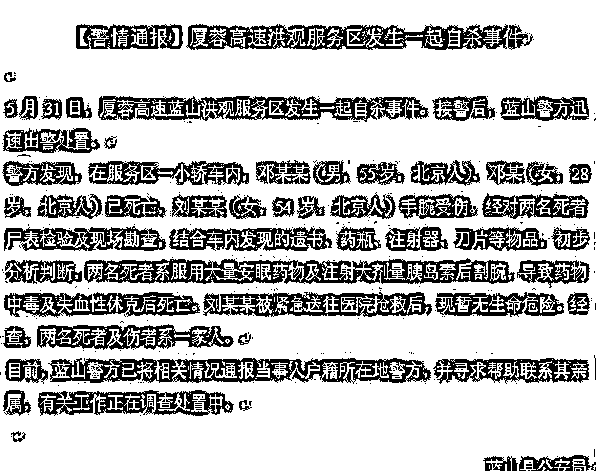
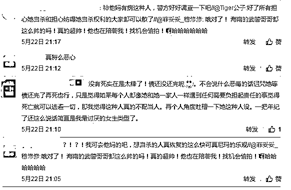
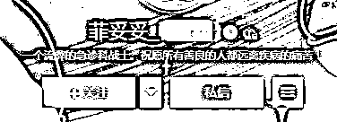
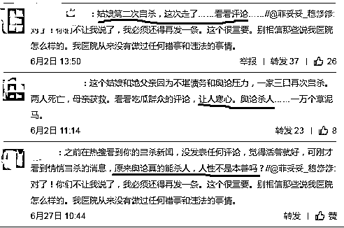
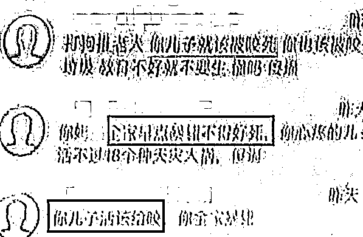
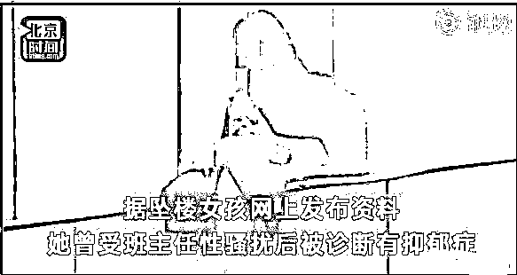
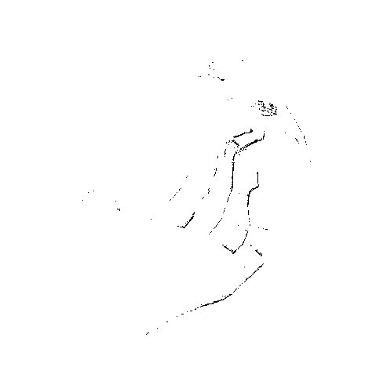

# 多一点善意，世界会变的更美好

**作者：小飞大侠**

善与恶，有时候就在一念之间，一句话，有时候可以改变别人的整个世界。

6 月 2 日，在湖南高速服务区的一辆小轿车内，发现了三位自杀者，其中两人不幸身亡，一人重伤抢救。当时便有记者了解到，这三位自杀者为一家三口，此前因欠下巨额高利贷无力偿还，曾在海南决定自杀。后被海南警方救下，并在警方开导下放弃了轻生的想法，准备回北京好好生活。

本来是一件皆大欢喜的事情，偏偏招来了网友的质疑——怀疑这自杀是为了博取同情演的苦情戏，说这一家人打算靠互联网众筹牟利……不仅如此，还有网友人肉搜索其家人，另当事人及其亲属不胜其扰，压力太大心力交瘁，最终还是酿成悲剧。

在第一次自杀前，这个女孩在微博上发了一封「遗书」，只是单纯地想跟这个世界道别。被女孩的朋友看到了并报了警。结果就因为女孩没死，并且还继续在微博上发了乐观的言论，于是遭到网友的质疑、指责、谩骂。

仅仅十天之后，这家人还是走上了绝路，而这一次，他们成功了。

女孩的微博现在还在，只是自 5 月 22 日后便再也没有更新了。

微博的简介是：一个流弊的急诊科战士。祝愿所有善良的人都远离疾病的痛苦！

往前翻她的微博，每一条都能感受到女孩对生活的热爱，对工作的热爱。甚至在自杀被救起来后，面对网友的质疑，还会耐心地加以解释。

本来就是一个很乐观的女孩，在自杀未遂后更能感受到这个世界的美好，也会更加珍惜当下。当她用俏皮的口吻说出「武警哥哥好帅」时，便能看出她已经放弃轻生的念头了，这个世界的温暖和美好成功地将她留了下来。

结果就偏偏有人以最大的恶意来揣度，认为一个人既然满身债务、已经走投无路到要用自杀来逃避的程度，就应该泪流满面、苦苦哀求、博取同情，这样才符合一个自杀未遂的人设。最好是在广大网友的同情心泛滥时，贴上自己的银行账号，向大家求助帮忙还债，这样就更符合一个弱者的人设了。如若不然，就是骗子、就是戏精、就是浪费大家的感情，不仅在网络上用最恶毒的话语去攻击，现实生活中还要人肉之，并不停地加以骚扰。

如果说女孩第一次自杀是因为巨额的高利贷，那么可以说，第二次自杀便是因为这些网友可怕的言论。女孩的微博下面还保留着那些诛心的话，每一句每一字都仿佛一把利剑，直指女孩一家。 

本侠也有一个可爱的女儿，非常宠爱之，恨不得将全世界都捧到女儿面前哄她开心。也正是因为有了女儿，才真正懂得了为人父母之后的那种责任感和焦虑。从此再不能平静地看儿童被拐的新闻，再不能轻松地浏览儿童被虐待的案件。

所以，看到一家三口自杀的新闻时，我想到的是，到底是面临着多大的绝望，才会带着女儿一起赴死？

我设身处地地想了一下，如果只是债务问题实在无力偿还，作为父母，肯定会将所有的债务揽到自己身上，让女儿能尽情地享受剩下的人生。虎毒尚且不食子呢，亲生父母怎么可能忍心拉着最疼爱的女儿一起自杀？

那么唯一行得通的解释就是「网络暴力」已经使得他们逃无可逃。如果女儿活下来，将要独自面对这可怕的世界，作为父母，于心不忍。

这个时候，他们已经被逼的没有其他选择了。 

第二个新闻，发生在一家餐馆的老板身上。6 月 22 日，南宁的童老板因前几天酒后怒摔一条狗，生意和生活完全被毁，就连妻子也差一点失去。

据报道，当天邻居养的狗没栓好，咬了童老板的儿子，童老板酒劲上来后护子心切，把狗给摔了。结果狗死了，自己一家也因为摔狗的举动被网友人肉。

从此生活不再平静，即使童老板说已经和狗的主人达成和解，即使童老板找到电视台道歉，网友也没放过他们，辱骂、威胁、骚扰、恐吓一直没停过。

苦心经营的两个饭店一直被骚扰，已经无法再继续经营；在大学念书的儿子也被挖出来指名道姓地威胁；而童老板的妻子更是不堪重负，意图通过自杀「来给狗偿命」。

「爱狗人士」才不管你是出于什么原因，总之摔狗就是不对，你儿子就活该被咬。

这不是简单的和狗的主人达成和解就能完事的，这涉及到对「狗权」的侵犯。

就算你上电视台道歉了，那只能说明你想红，想要借此出名，更可恶，更应该指责。

你妻子自杀，说是想要给狗偿命，那都是应该的，谁让你摔狗。

没死成？那就是在作秀，给你寄花圈……

我的天，这个世界是怎么了？

现在一条狗的性命已经凌驾在一个人的性命之上了么？童老板一家已经付出了冲动的代价，道歉态度也非常诚恳，到底为什么还要将人逼近绝路？ 

跟「摔狗风波」几乎同一时间发生的，还有一 19 岁少女的跳楼事件。

6 月 20 日，甘肃一位 19 岁女孩跳楼身亡。直接原因是因为两年前遭到了不良教师的猥亵，心里受到创伤一直走不出来。

两年来一直尝试着找回公道，却屡屡失败。最后选择了用生命来抗争罪恶，从八楼一跃而下。

在这个事件中，不良教师的行为固然是导致女孩决定跳楼的主因。但不能否认的是，或许围观群众的起哄行为才是压死骆驼的最后一根稻草。

据悉，当时女孩在楼外坐了有 4 个小时，可能是在做着激烈的思想斗争。而在这 4 个小时里，围观群众不仅拍照发朋友圈，甚至还现场起哄：「倒是跳啊，坐那犹豫什么？」语态轻松，嬉笑如常，仿佛只是在看电视剧。

在这个女孩打算轻生的时候，这个世界展现给她的最后一面居然不是美好，而是更深一层的「恶」。

几句怂恿、几句嘲讽，直接瓦解了女孩最后一丝求生的欲望，抛下了自己的家人纵身跳下。如果说那个不良教师是「杀人凶手」，那么围观群众便可称得上是「帮凶」。

这个月一连看到这三个新闻，老实说，心理非常不痛快。虽然并没有参与其中的喷子行为，甚至是在事件恶化之后才看到的报道，但是内心总隐隐觉得自己也是「帮凶」之一。

在这个娱乐至死的时代，我们的目光总是本能地寻找更刺激的事件去关注。虽然在虚拟世界里也能获得「吃鸡」的快感，但也并不排斥现实生活中上演的「跳楼大戏」。

我们以为自己只是「吃瓜群众」，时不时吐槽一下「怎么还不跳」。却未曾想言论所造成的伤害甚至比实质性伤害更甚。轻飘飘的一句话，可能真的就可以将绝望的人心中仅存的一点光熄灭。

我们以为有时候自己甚至连「吃瓜群众」都算不上，不评论不转发，转身即忘。却未曾想正是这样漠视的态度，使得人性的「恶」得以以最快的速度蔓延，进而吞噬生命。

我不知道此类事情还会不会发生，还会不会引发大家的讨论。我只希望，当出现此类事情的时候，我们大家都能多一点善意。每个人的生命只有一次，没有道理以消遣他人的生命为乐。

即使是事后发现被欺骗……

记得有位记者采访过一位球星。

记者：如果你有一场很重要的比赛，但是这个时候有一个绝症病人正需要你去救，你怎么办？

球星：放弃比赛，救人要紧。没有什么比生命更重要的了。

记者：如果这个病人是骗你的呢？他只是想见你，并没有生病……

球星：这真是个好消息，他没生病。

