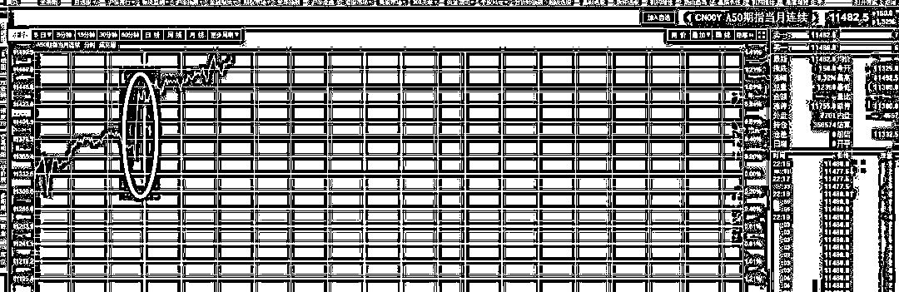
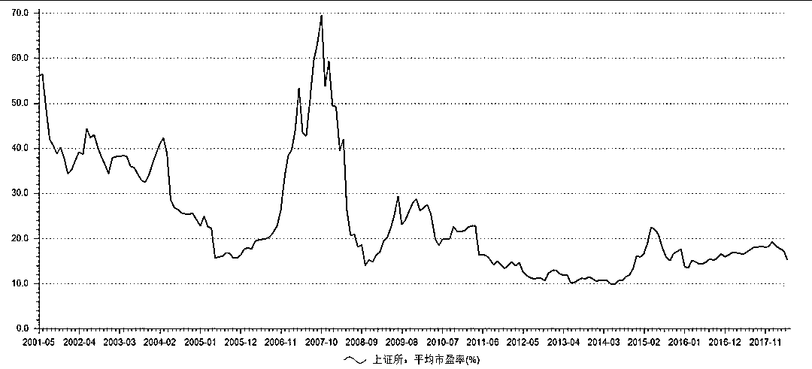

# 沪指盘中击穿 2800 点，不破不立 || 夜报

今天上午，大盘平开平走，本来走势非常稳健，不过 10 点 30 开始，指数开始单边走低，盘中一度击穿 2800 点，然后在努力的护盘之下，才勉强收盘拉回。

这个下跌的原因，主要是因为今天白天，美国闹的很凶，据传要对中国实行更严厉的措施，特朗普有可能启动国际紧急状态法来针对中国，如果他实行了，那么就代表全面开战贸易战，双方再也无可挽回。

这个消息吓蹦了市场，港股今天收跌 1.8%，跌的比 A 股还要惨，大盘一度跌穿 2800，最低 2798。。。

不过到了今天晚上，这个消息被否定了，特朗普决定不对中国实行紧急状态法，今天夜间 8 点，富时 A50 指数和欧股盘中直线拉升，当时还莫名其妙，到了 8 点 20 的时候，消息出来了。

20:20 【特朗普决定不对中国采取最严厉的措施 全球市场短线暴动】格隆汇 27 日讯，据彭博报道，美国总统特朗普决定不对中国投资采取最严厉的措施，全球市场短线暴动不已：美元回落、日元暴跌；离岸人民币兑美元短线拉升逾 180 点；美股指期货全线跳涨，全球股市反弹……彭博报道称，特朗普希望美国投资环境开放。彭博还援引官员称，特朗普不会启动国际紧急状态法来针对中国！特朗普表示，国会需要通过强硬的《外国投资风险评估现代化法案》；如果国会未通过 FIRRMA，他将部署新的手段。

简单的说，特朗普暂时又退了一步，但是依然在要求国会通过更强硬的手段对中国施压，特朗普依然没有放弃这次贸易冲突谈判。

但是对于 A 股来说，整个股市的市盈率已经算是到了历史最低点了，我这里有上证指数历年的市盈率，可以看出，离历史最低点还有距离，但是距离并不是很离谱，其泡沫程度和 08 年完全无法比拟，PE 也就 15 而已，如果和楼市的 70PE，那更是没办法比。

所以，我觉得这个位置无需恐慌，无非多拿一点时间而已。我之前 2856 抄的那一批上证和创业板各一半的 1 成，2906 没跑，非等 100 个点，有点贪了，还是 50 个点把，先把这抄底的 3 成拿出去再说，我决定 2906/2956/3006 各出 1 成，赚一点算一点，这批怎么买的，加一点价就卖掉。

因为从目前特朗普的种种姿态来看，7 月 6 号加征关税怕是避免不了，中国话都放出去了，自然不能服软，到时候又是一地鸡毛，先拿点仓位避一下，今天晚上全球大涨，明天肯定要冲高，从图形来看，也属于不破不立。

但是这几天冲不到 3000，因为谁也拿不准 7 月 6 号特朗普会不会真疯，而且目前看，疯的概率还挺大。

对了，这里有一个时间差，中国决定从 7 月 1 号开始，降低进口汽车关税，从 25%降低到 15%，然后 7 月 6 号的时候，如果美国加征关税，中国会对进口汽车加征 25%的惩罚性关税。所以如果有买车的朋友，可以咨询下 4S 店，看看能不能打个时间差，提前下个单。