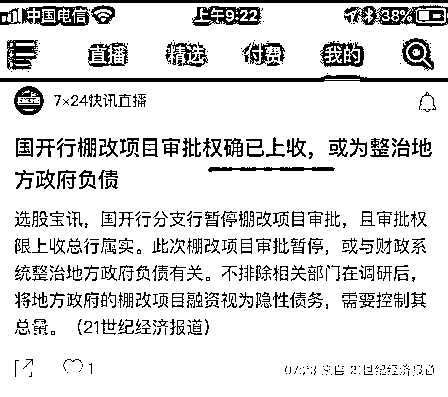
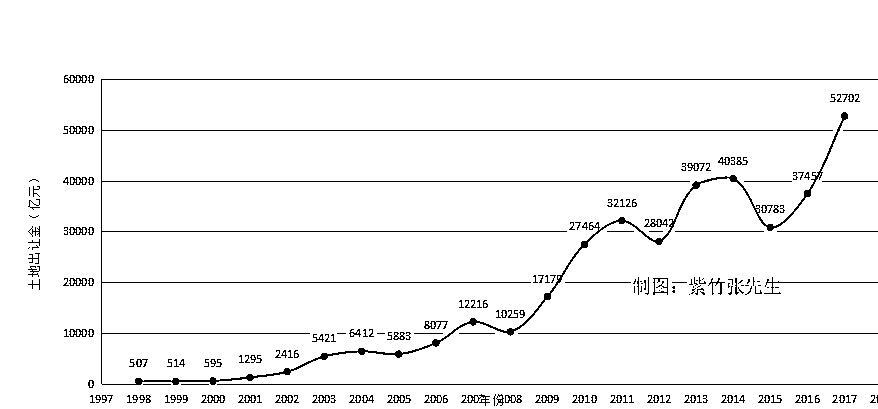
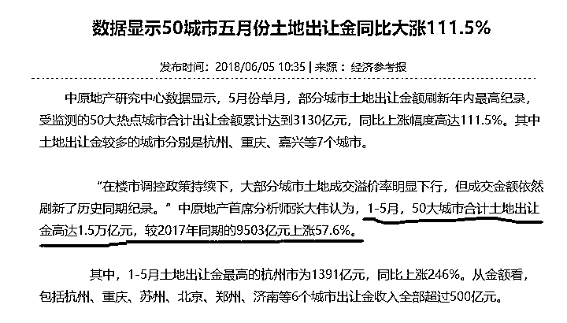
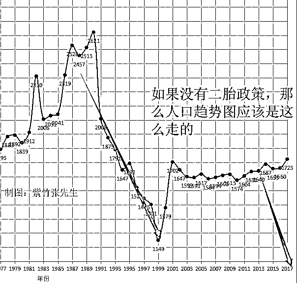

# 用人口和土地的历史数据分析中国房价的未来走势

我们都知道，房地产行业有个金科玉律，那就是短期靠货币、中期靠土地、长期靠人口，昨天晚上我刚刚从货币的角度分析了未来的房价走势，今天我着重从土地和人口的历史数据方面进行分析。

短期靠货币

首先，货币对房价是有直接性刺激的，但是对于货币方面，在 18 年政府进行了全面收紧，银行贷款总额度减少，银行贷款利率上浮等都说明了货币面的紧张，而昨天刚刚宣布的国开行全面收紧货币化棚改政策更是对货币面的釜底抽薪，我昨天在《房价大利空，货币化棚改权限被收回》，一文里进行了全面分析，今天就不赘述了。

有趣的是，昨天晚上紫竹（公众号：紫竹张先生）和大家分析，国开行的这个政策，从目前的新闻表态来看属于默认，按照中国惯例会在一个月内宣布，属于近在咫尺的政策了，结果只过了一夜，今天国开行就公开承认了这个政策。

按照昨晚的分析，全面收紧货币化棚改，房价会马上停止上涨，然后会在前一批拆迁的土地入市的时候体现出寅吃卯粮的恶果。

从短期靠货币的角度出发，反应时间大概是 1~1.5 年，也就是 2019-2020 年，房价会在一波新房源预售入市之后承受巨大的下行压力。

中期靠土地

考虑完货币的影响之后，我们要考虑土地的影响，毕竟如果土地供应量不足的话，在供需失衡的市场条件下，房价依然会暴涨。

关于土地供应量的数据，因为土地单价差距很大，所以亩数没有太大意义，我直接采用国家每年的土地出让金总额来进行衡量，紫竹（公众号：紫竹张先生）制表如下：

从图中我们可以看到，15~17 年，中国的土地出让金大幅度连年增长，当然，随着房价的增长，土地拍卖单价也在上升，但是没有上升的太过离谱，因为多地都采用了限价要求自持的套路，从这个表格可以推断出，15~17 年中国的土地出让速度没有减少，至少也应该是一个持平并加速的数量。所以，土地出让的数量没有出现突然减少的缺口，无法给房价带来供不应求的向上刺激作用。

那么，17 年土地出让金额已经创出历史新高，18 年土地出让的速度有没有大幅减少呢，没有。不仅没有，而且 18 年的土地出让速度比迅速增长的 17 年，还要快，快到了一个吓人的地步来试图抑制房价。

17 年的土地出让金在 16 年的基础上，大增 40%，从 3.7 万亿直接上涨到 5.2 万亿，而今年 1~5 月，前 50 大城市的土地出让金，在 17 年的基础上，同比再增加 57.6%，也就是说，如果下半年还维持这个同比增速的话，18 年的土地出让金总额，会达到 7.9 万亿左右。。。

这个加快推出土地的速度，明显会抑制未来的房价，按照中国惯例，一块土地从拍卖成功到拿到预售证入市销售，大概需要 1.5~2 年时间，一旦开始预售入市，就会对市价构成沉重的压力，土地拍卖明显增速大概是 17 年中下旬开始，到今天 18 年中旬，那么这批土地大概就是 19 年中下旬左右入市吧，大家可以根据数据自行估算一下。

其中，18 年 1~5 月土地出让金增速冠军为杭州，同比上涨 246%，土拍速度远远快于 17 年，这批地的入市时间可以精确到 2020 年中上旬，杭州的朋友自行注意。

从中期靠土地的角度出发，近期爆发式增长的土地拍卖数量，会在 1.5~2 年之后，也就是 2020 年对房价构成强大压力。

长期靠人口

然后进入我们今天的重头戏了，长期靠人口，房子的根源在于人口，人口的多寡才是决定房价的终极因素。

关于中国的历年出生人口数据，搜集的很艰难，而且中国目前有二个版本，一个是人口普查版本，一个是国家统计局版本，为啥会有二个版本呢，因为当年计生背景下，人口普查出来的出生人口数据实在是太少了，所以统计局直接根据其他社会指标进行了修改然后公布，理由是耗资 60 亿，动员 600 万人的人口普查一定查错了，有很多黑户没查出来。

例如 2000 年人口普查显示生育率只有 1.22，出生人口只有 1379 万，但是统计局和计生委直接否决了人口普查的数据，把生育率修改为 1.8，出生人口修改为 1771 万人。

到底是以人口普查数据为准，还是以计生委数据为准，我今天查了一整天的资料，最后决定以人口普查的数据为准，其理由是 1990-2000 年统计局修改后的出生数据，和 2010 年之后的各项人口数据都对不上号，人为增加的 4000 万人口数据，恰好就是 2010 年之后对不上号的人口数据，具体分析过程参见 2017 年 12 月发表在《社会科学论坛》上的《中国大陆当下人口实证研究--2016 年中国只有 12.8 亿人》一文。

另外还有一个证据就是，从 2010 年到 2014 年，国家统计局各年的抽样生育率分别为 1.18、1.04、1.26、1.24、1.27，平均为 1.20，那你说说 2000 年的时候，把人口普查的 1.22 生育率直接拍脑袋修改为 1.8 的依据何在，在同一款生育政策下，人口出生率应该是稳定且缓缓变化的才对，人口的生育习惯不可能轻易被改变。

还有一点就是，2014 年的时候，计生委的专家信口开河说如果开放全面二胎，中国每年的出生人口会达到 4995 万人，而开放后，实际数据是 1665 万人，这差距简直没谱了，这帮专家当年拍脑袋乱改的数据能用吗？

所以，紫竹（公众号：紫竹张先生）决定采用人口普查版本的数据，具体数据为网络查询，可能和精确数字有所出入，但是大的趋势，还是可以看出来的。

新中国成立以来，婴儿的出生不是缓慢平和的逐年不变，而是有三波婴儿潮，第一波婴儿潮是 1962-1972 年，出现了一波出生狂潮，主要得益于解放后生活水平的提升，以及 1959-1961 年三年自然灾害，中国人口出现史无前例的负增长，毛主席号召人多力量大，鼓励多生的政策导致。

第二波婴儿潮在 1982-1992 年附近，主要原因就是第一波婴儿潮的延续，学名次生潮，第一批婴儿潮到了育龄需要生孩子，仅此而已。第三波婴儿潮是第二波婴儿潮的再延续，也是 20 年，在 2002~2012 年完成。

这三波婴儿潮的 20 年周期，大家可以从图表看到，大概有 1 年左右的偏移误差，不过为了好记，我暂定为 20 年。

这里我们还有一个问题，按照婴儿潮的规律，2012 年之后，中国出生人口应该断崖式下跌才对，为何保持了一个稳定的数值，而不像上一波人口空窗期那样出现股灾式的人口下跌。

那是因为，在 2013 年的时候，国家推出了单独二孩政策，松开了多年的计划生育政策，试图增加出生人口，而在 2015 年的时候更是直接推出了全面二孩政策，阻止出生人口断崖式下跌。根据统计数据，2017 年二孩占据全部出生人口的比重达到了 51.2%，数量为 883 万人，这些二孩的出现才挽救了出生人口的数量，让出生人口勉强维持稳定不至于下跌，如果还是坚持独生子女政策，12 年之后的人口数据必然是断崖式下滑。

人口数据我们既然已经确定，那么下面我们就开始利用人口数据进行分析预测了，这个数据搜集的特别辛苦，今天先拿来分析房价，后面紫竹（公众号：紫竹张先生）会拿来分析养老金问题。

按照经济规律，20 岁的时候是人生中的购房黄金期，所谓的丈母娘婚房需求，还有些人熬到 30 岁靠自己赚够了首付，这属于人中精英，大部分人都是 20 岁左右的时候靠父母给了首付才买的房，要么就一辈子买不起了，不是每个人都靠自己凑够首付的，很罕见。所以我们假定，婴儿成长到 20 岁左右，就开始具有了买房需求，能买得起的，应该全买了，买不起的，后面再买的起的概率并不大。

我们知道，房价的腾飞是 2001 年开始的，一直持续到 2011 年结束，我刚才贴了这个图，但是估计你们没有注意到。

2000 年土地出让金数据是 595 亿,在 2001 年直接变成 1295 亿，一年翻倍这种热度就算 16 年房价大牛市也远远比不上，而他连续三年，每年翻番。。。所以 2001-2011 是房地产标准的大牛市，在 2011 之后，明显就涨不动了，开始横盘。

这个时间对应的，正好是 1982-1992 的婴儿潮，他们刚满 20 岁，正是家庭给他们买房子结婚的时候，他们对应的买房周期是 2002-2012 年，所以这一阶段的房价，的确是不存在泡沫的，我们可以看到，这阶段不管造多少新房，不管当时说泡沫多大，后来都卖出去了，而且确实也有人住，库存积压并不多，就是这个原因。

按照出生人口图，1992-2002 年有一波空窗期，出生人口出现断崖式的下跌，其中最低点是 1999 年，按理说，2012 年之后，楼市会处于漫长的压力期，因为需求不足。

而实际上，也确实是这样的，2012 年之后，全国楼市萎靡不振，房价像死鱼一样躺在地上，李嘉诚在 2013 年开始就不断的出售大陆资产，最后演变成“不要让李嘉诚跑了”的媒体口号，至今他也没有买回来。

到 2015 年初的时候，中国大城市的住宅空置率已经达到了惊人的地步，根据 2015 年 5 月腾讯发起的《2015 年 5 月全国城市住房市场调查报告》显示，中国主要城市的住房空置率整体水平在 22%到 26%之间。

这个级别的住房空置率代表什么含义呢，按照国际通行惯例，商品房空置率在 5-10%之间为合理区，空置率在 10-20%之间为危险区，空置率在 20%以上属于严重积压区。

换句话说，2015 年 5 月的中国住宅市场，属于严重积压，房价非常的危险，本来中央政府可能想让地产自由消化泡沫，当时中央的精力中心已经转移到了股市上，试图用牛市+注册制来刺激经济，摆脱地产绑架。但是奈何 2015 年 6 月，A 股崩盘了，国家队二万亿冲进去也无法挽回大局。

最终，2015 年底，中央彻底放弃了股市，重新捡回房地产来拉升经济，于是在 2015 年底，掀起了一波地产牛，用来对冲股灾对经济的不利影响。也就是大家耳熟能详的去库存运动，怎么去库存，涨价制造恐慌才能去库存。

所以，2002-2012 年的地产牛，没人说是泡沫，而这 16 年至今的地产牛，属于标准的泡沫，因为货币和土地政策可以一时刺激，但是归根结底，还是要看人口。

上一波出生人口断崖式下跌，最低点出现在 1999 年，根据 20 年左右的周期，大概在 2019-2021 年附近，这批人会产生婚房需求，新生代接盘侠的数量应该是处于历史最低点，然后才开始反弹。

根据长期靠人口的理论，2019-2021 年，中国房价会处于一个沉重的压力区间。

总结

根据短期靠金融理论，我们推出，中国房价在 2019-2020 年会承受一波巨大的压力，主要压力来源于货币化棚改拆出的土地推向市场预售之日。

根据中期靠土地理论，中国房价在 2020 年会承受一波巨大的压力，主要压力来源于在 2017 年中旬到 2018 年中旬密集推出的土地，大概 1.5-2 年会预售进入市场。

根据长期靠人口理论，中国房价在 2019-2021 年左右会承受一波巨大的压力，主要压力来源于 1999 年是中国出生人口的最低点，他们大概 20~22 岁会进入婚恋购房期，导致这期间的接盘侠人数最低。

而再次根据长期靠人口理论，1992-1999 年中国人口是断崖式下跌趋势，最低点是 1999 年，对应的 2012 年开始，房地产应该一直处于熊市的压抑状态，2015 年商品房库存积压严重可以证明这一点，16 年重启房地产拉升房价是事出有因迫于无奈，所以一旦货币刺激和土地短缺因素都排除掉之后，会立刻打回原形。

综上所述，2019-2020 年左右，中国房价可能会迎来一个重要低点，然后等 02 年之后出生的第三波婴儿潮长大成接盘侠来顶住房价。

觉得此文的分析有道理，对你有所帮助的，请随手转发。

往期回顾（回复“目录”关键词可查看更多）

为什么中国必须购买美国国债？| 租房贷款会将房子拆分成房骨和房皮 | 宁波老虎事件遇难者不应该得到赔偿 | 中国的房价什么时候会崩盘？| 你根本不知道烟草公司有多赚钱 | 如何把自家孩子培养成一个顶尖人才 | 我是如何保证自己不近视的 | 魏忠贤其实是个贤臣 | 2 分钟了解中国 50 年的艰辛发展史 |历史数据表明：中国最赚钱的职业十年一个轮回 |房价大利空，货币化棚改权限被收回

