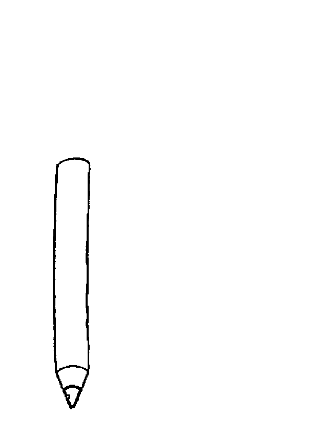

# 怀孕就会被辞退，从经济的角度分析普通人应该怎么做|紫竹张先生

喜欢我的都关注我了~

某单位出台了一个奇葩的规章制度，要求下属女教师们排队计划怀孕，如果有不按照计划表“故意插队”怀孕的，则要开除处理。

按计划表排队怀孕，排队生孩子无疑是非常荒谬的，也是违法的，但是这又是非常无奈的，今天用经济学的道理给大家详细的谈一谈里面的道理，并从经济的角度分析一下，普通人应该怎么办。

首先，要求下属员工按计划怀孕，否则予以辞退这事肯定是违法的，私底下你怎么管员工是你的事，但是只要拿到台面上说，你百分百的要败诉，一丝胜诉的可能性都没有，这是严重违法的行为。

但是，这又是非常无奈的，我们都知道，中小学的女教师数量远超男教师，幼儿园更是女教师的天下，很多幼儿园的女教师占比高达 90%以上。而一名女教师怀孕后休产假的时间长达几个月，单位继续发基本工资+五险一金也就算了，关键的是没人代课啊。

假设某幼儿园有 15 个女教师，产假按 3 个月算，如果恰好有 5 个人扎堆生育，整个幼儿园的教学立刻就瘫痪了。上级总部强制安排怀孕计划表，实属无奈。这不止是幼儿园，很多中小学都有类似的安排，用人单位几乎都这么玩，这属于拿不上台面的潜规则。

这位小学老师属于河南省郑州市中牟县，她被排到了二零二几年，而她已经三十多了，但是当她向本地的教体局信访办举报问题的时候，信访办回应：“学校是教书育人的地方，不是让你去生二胎的”。

其实学校还算好的，还能容忍女员工生孩子，只是排个计划表而已，很多用人单位闻女员工色变，尤其是那种濒临结婚生育期的女员工，更是避之不及，歧视育龄女员工只是没公开写进招聘简历而已，实际上都是这么操作的。

从用人单位的角度考虑，由于法律赋予妇女生育的种种权利和保护，导致女员工的用人成本大大超过男员工，而漫长的产假，让企业也很难敢于冒险提拔他们到管理层，以防生育导致的管理层动荡。

这里插一个小建议，我觉得排队不好，可以选择摇号，摇到了不想生还可以卖号。。。

从经济的角度剖析各方立场

首先，从用人单位的角度而言，因为盈亏自负，他们自然会天然排斥成本过高的女员工，国家妄想通过一个政策就实现国家请客企业买单这是不可能的，企业会自发的利用不招女员工，或者降低女员工的工资来变相的补回自己的损失。

不排除有个人女员工可以利用漏洞获得超额的收益，比如那些过完产假立刻辞职专心带娃的全职妈妈，但是这样做的代价，是企业自发的再度降低女员工的效益来实现平衡，要么薪水低，要么求职难，女员工总能碰到一款代价来抵消法律对你生育权保护所带来的好处。

但是从家庭的角度而言，这个问题分析起来就有趣了。首先，女员工在职场的生育矛盾最核心的一点，就是这个女员工是在职场，如果一结婚就辞职当全职太太，或者压根就不工作，那么这个矛盾冲突完全不会产生。

那么，为什么绝大多数中国女性宁可冒着歧视也要去参加工作，而不愿意当全职妈妈呢。因为在绝大多数中国人的眼里，养孩子是没有价值的，工作赚钱才是有价值的。

很多人说，经济越发达的国家，国民越不愿意生孩子，然后拿出很多西方发达国家做例子，但是据我的观察和研究，这个结论是错误的。正确的结论应该是，社保体系越完善的国家，国民越不愿意生孩子。

我国其实也一样，我国国民生孩子的意愿大幅度降低的时间轴，和我国社保体系完善的时间轴完全重合，而对于那些社保还未完全覆盖到的群体，他们生孩子的意愿完全没有任何降低的迹象，而对于那些社保完全覆盖的群体，他们只愿意生一个，甚至一个都不想生。

因为对于普通人而言，他们一辈子所能进行的投资基本就只有股市、楼市，以及养孩子，孩子是最大的投资，远超楼市，养孩子最大的功能，其实古语已经说的很明白的，那就是养儿防老。

但是如今这个社会，养儿不啃老就不错了，防个鬼的老，加上国家社保的覆盖力度越来越大，养老靠社保就可以了，当然没人愿意生孩子了，大家的经济账都算的鬼精鬼精的。

养老不能完全靠社保

社保是不是个好东西，是的；

现在的老人吃养老金过的爽不爽，很爽；

我们未来的老年生活能不能完全依靠养老金？未必。

这个道理其实非常简单，养老金只是一种代际支付转移而已，养老金本质上是废纸一张，他能拿去换来物资和服务，他才是真正的养老金。总的来说，如果全社会制造出了 100 份蛋糕，拿出 30 份给老人无偿享用是合适的，如果拿出 50 份甚至 70 份给老人，这就很不合适，整个社会的生产体系都会崩溃掉。

现阶段，中国的劳动人口远远超过退休人口，所以发出去的养老金，那就是货真价实的养老金，购买来的物资足够让自己安享晚年。但是再过个几十年，养老人口反超劳动人口的时候，养老压力就会骤然增大，到时候你想靠养老金享受到舒适的晚年，这几乎是不可能的。无论这个财富物资如何转移，总归是要有那么多劳动人口去创造财富，我们才能拿出来给退休人口去分。

如果没有足够物资可以分，任何国家的第一选择都是养老金不涨，同时通货膨胀来变相降低养老金，以保证劳动人口有足够的蛋糕可以吃，这样才能持续稳定的继续生产蛋糕。所以如果中国的生育率持续下滑，几十年之后的老年生活，一定是非常悲惨的，拿着十万一个月的养老金，去买一千块一杯的豆浆。。。

那么用什么东西去抗通胀，普通人只有二条路，房子和孩子。其中在全面老龄化的国家，房价一律都是一蹶不振的，因为老人没有置换房子的需求，年轻人才有，那么其实普通人只剩下最后一条路，就是靠孩子去抵抗通胀。无论货币怎么印刷，人都是不会贬值的，因为人才是核心生产力。过去几百年，不管技术怎么腾飞，不管机器怎么迭代，机器始终都没有取代人，人永远都有适合自己的岗位。

社会的整体养老其实靠二个渠道，第一个渠道是国家社保的财富转移支付，第二个渠道就是自己孩子的养老赡养。

在国家社保的财富转移渠道足够养老的时候，自家孩子的赡养功能就被极度弱化，靠养老金就温饱不愁的时代，养孩子的确没啥用。老年人没啥物质追求，够吃够穿天天跳广场舞，还能偶尔旅游一下，这已经足够啦，要孩子干嘛，还要给他补贴首付。

社保的征收费率越高，生孩子就越没有必要，民众就越倾向于不生孩子，生孩子必亏无疑，谁生孩子谁 SB，这就是生育经济学。

但是当所有人都倾向于不生孩子的时候，年轻劳动力人口会越来越少，无人创造财富和物资，最后大家一群老年人，每人手里捏着几个亿的养老金一起走向毁灭。

从经济的角度谈普通人应该怎么做

从经济的角度来说，如果政策不改，这是不可逆转的趋势，社保缴费率定的越高，人们就越不愿意生孩子，因为生孩子太吃亏。但是人们越不愿意生孩子，养老金压力越大，社保费率或者社保征缴率就会越高，如此恶性循环形成“劣币驱逐良币”，愿意生孩子的老实人吃了大亏，最后大家都不愿意生孩子了，所以我把这种现象称之为不可逆转的经济趋势。

要改变这种趋势，只有二个选择，第一个选择是国家出面给生孩子的人以补贴来弥补他们的损失，因为他们的生育行为对国家做出了贡献，从欧美国家的实践效果来看，结果非常差，因为国家给予的那点补贴，和生育孩子实际遭到的损失相比，九牛一毛，根本无法弥补。

第二个选择就是，降低养老保险，降低养老待遇，清晰明确的告诉民众，养老还得靠孩子，国家只是辅助，孩子才是主力。你一手养育大的孩子，长大后的劳动报酬，会直接反馈到你的身上，而不是反馈到其他老人的身上。自己含辛茹苦养大了一群孩子，长大了辛辛苦苦劳动去养别人的爹，这种感觉真的很不好。

市场经济告诉我们，多劳多得才能激发劳动生产率，吃大锅饭一定无人愿意生产，这个道理替换到养育孩子上面一样成立。

所以，二三十年后，养老金政策一定会改，如果不改，那中国会彻底步入老龄化，然后大家一起走向生产崩溃。多生孩子的人，到了那个时候，随着养老金政策的剧烈变动，一定会大享其福。

到时候，孩子的价值会被社会和国家重新评估，养育孩子的妇女地位也会大幅度提升，全职妈妈不再是一个贬义词，而会是一个被国家高度赞扬并大肆鼓励的职业，用人单位和女员工的矛盾也会大幅缓解，因为女员工都回家做更一个对家庭更有价值的工作，带孩子去了。

当带孩子对家庭没有价值的时候，全职妈妈是被鄙视的，因为家庭的未来不需要很多的孩子，但是当家庭的未来需要很多孩子的时候，全职妈妈的意义怎么高估都不为过，那不是一份工资可以衡量的。

大概二十年前，国家说了一句“只生一个好，国家来养老”，那个时候很多人自作聪明，不听国家的话，拼命的超生，宁可变成超生游击队也非生一个男娃出来不可。

结果 20 年后，那些超生的人全傻眼了，养老不再靠孩子了，生的越多，穷的越厉害，国家直接通过社保强制征收，把你孩子们的工资都直接转移走了，给其他人养老去了。那些拼了命生男娃的家庭就更惨了，除了工资被转移支付了，还得给每个男娃倒贴房子的首付，活的比难民还惨。

而那些当年只生一个孩子的，尤其是只生一个女孩子的家庭，不仅可以在婚恋阶段端着丈母娘的架子横挑鼻子竖挑眼，退休了之后领着养老金天天跳广场舞带外孙，过的别提多滋润了，养老压力？不存在的。

所以说，在中国你就得听国家的话啊，因为国家是可以改政策的，听话的人一般都是政策变动后的受益者，不听话的人，国家会用政策惩罚你。

现在国家开始鼓励生育了，那些自作聪明还是只生一个甚至一个都不生，妄图等老了之后靠养老金吃大锅饭的人，你猜等你老了之后，国家会不会改政策？

觉得此文的分析有道理，对你有所帮助，请随手转发。

长按下方图片，识别二维码，即可关注我

近期精彩文章回顾（回复“目录”关键词可查看更多）

华为员工都这么穷，怪不得拼多多能火 | 房价跌 20%就会全面崩盘，地产杠杆远比你想的要脆弱 |  为什么碧桂园的质量那么差 | 清醒点，放弃全面开征房产税的幻想 | 央行和财政部隔空掐架，我支持央妈 |中国土地制度源自香港，但是香港却是劏房密布 | 为什么中介哄抢租赁房源，因为贩毒都没它来钱快 

复活号+紫竹林功能的公众号

**长按扫描下方二维码即可关注**

