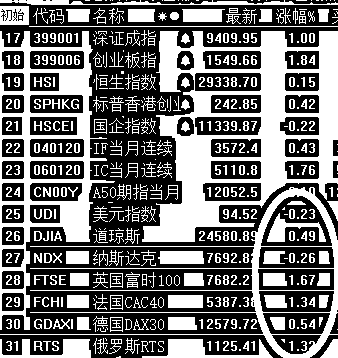
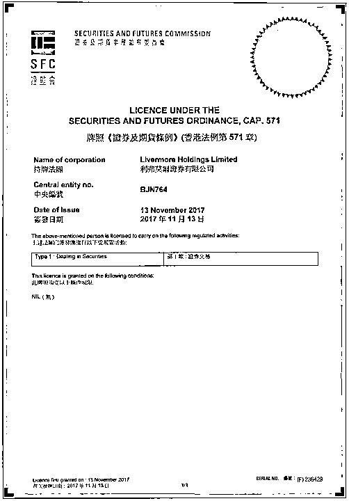
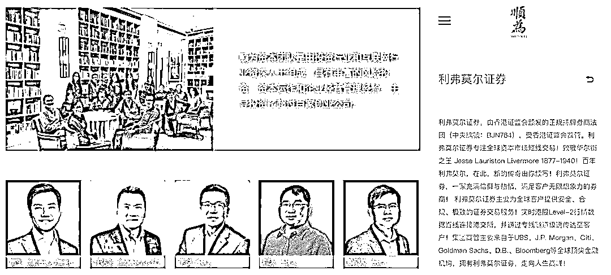
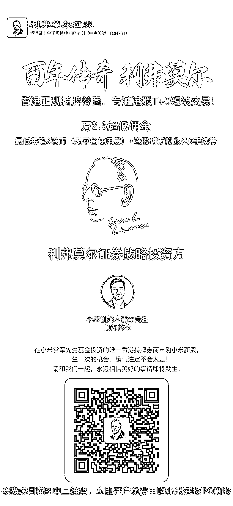

# 融资盘现平仓危机，监管要求日报融资数据 | 夜报

近日，A 股连续大跌，甚至一度触发千股跌停，重现股灾盛况，不仅很多大股东的质押业务频频触发强平警报，甚至很多券商的二融业务，也到了强平的临界点。

6 月 21 日，上海某大型上市券商营业部负责人表示，近日两融爆发的危机比较严重，十分惨烈，二天平了二三十位，涉及资金一亿多，也有部分客户补齐担保品了，但也处在悬崖边缘，目前一天维比低于 130%的客户大幅增加。

虽然场内二融业务的杠杆比例已经放的很低了，但是再低的杠杆比例也架不住连续几年的熊市以及频频下跌的市场，大面积的客户到了强平警戒线之后，如果再度大跌，就很可能会引发多杀多的惨状。这一点在 15 年股灾的时候体现的特别明显，当年有很多高杠杆场外配资所以爆的比较快，但是场内的低杠杆融资，强平起来一样杀伤力巨大，毕竟如今的市场承接力也远不是 15 年可比的了。

目前融资余额规模为 9317.78 亿元，你说如果被强平个二三千亿出来，市场得被砸到什么地步，这可是纯抛盘，平出去就是被市场彻底消灭了，再也不会买回来。

券商负责人透露，“从本周开始上海证监局要求上报两融日报，上次被要求上报两融日报还是在 2015 年 A 股那波异常大跌期间，后来就不报了。”

初次之外，上市公司也大面积触发股权质押警报，这个地雷更大，因为散户就直接强平了，但是大股东这边，因为质押的股份特别多，根本平不出去，一卖就跌停了，不卖就看着他亏，所以更头疼。

部分券商收到监管要求，对股票质押进行专项申报，特别关注违约和被动展期的情况，但并非强制要求不能平仓。

至于一些场外配资，基本都被打穿彻底消灭了，大家可以看一看最近的几十只闪崩股，那些同一时间闪崩的，全是场外配资，还都是大账户配资，崩起来十头牛都拉不住。

总的来说，整个 A 股，已经到了崩盘的边缘线了，毛估估一下，大概 2800 再向下杀 200 个点，2600，整个融资盘就彻底扛不住了，到时候不是股灾也得是股灾，那就是一轮又一轮的强平，等强平盘彻底杀透了，才敢说见底，融资盘一旦爆仓离场，整个市场的人气就彻底废了，没什么破而后立这一说，只能说是历史大底，但是离下一次牛市，那还需要长时间的恢复。

特朗普宣布欧盟长期对美国设立关税和壁垒，不公平，决定对欧盟所有的汽车，征收 20%的关税，这种操作我只能说厉害，特朗普疯起来连盟友都砍，这是效仿慈禧对世界宣战吗？

我只操心中国和美国的谈判，欧美怎么打我就不管了，反正他们的股市涨的都好好的。

~~

周五，证监会宣布 IPO 为 2 家，融资额 9 亿元，如果是 1 家 IPO，那说明证监会想呵护市场，下周会立刻大暴涨，但是很明显官方不愿意体现出自己受市场涨跌所影响，继续坚定的发 2 家，只不过融资额下降了，为历史最低。但是我觉得，短期内他应该不敢再上独角兽了，市场真的撑不住了。

6 月 20 日的消息，6 只独角兽基金合计募集金额有望超过 1000 亿元，远低于预期，预期是多少呢，上次和大家说过了，给的额度是每家 500 亿，合计 3000 亿，如今募集了大概 1/3 的样子，只够再喂 3~4 家独角兽的，为了募集这 1000 亿也对市场造成了重大失血效应，所以这 1000 亿估计就是未来四五个月的全部独角兽融资额了，市场经不起下一次千亿级的抽血了。

周五的时候，一开盘股市就大幅低开，直接打穿 2856，闭着眼睛把最后 1 成子弹打进去了，还是大小盘指数基金各一半，然后继续下跌，当时心里也七上八下的，后来索性不看了，过了几分钟之后发现创业板翻红了，然后上证也翻红了，到了收盘涨的还是可以的，要是 2856 真的收盘被打穿了，那就好玩了。

总的来说，整个 6 月马上就要熬过去了，还剩最后一周，现在仓位已经升到满仓，唯一可惜的就是 5 月的最高点，卖的少了一点。

现在我满仓躺倒了，被套的部分，我觉得下一波涨是能拿回来的，目前还是涨一点卖一点的策略，上次说吃 50 个点就跑，但是第一个 1 成我打算等一等，等 100 个点吧，2950 卖 1 成，其余的 3000 出 2 成，3000 之下分批的买的，3000 全部出清，因为 3000 点不会一次突破返回去。

至于其他的，再看看，我觉得七八月份会有一波明显的上涨。

~~~

今天文末插播一个很有诚意的**港股开户广告**，下周一小米即将在港 IPO，现在开户的话还来得及打新**，****所以**今天给大家推荐一个港股券商。

利弗莫尔证券，香港本土注册的券商，这个是港交所批发的券商牌照信息，机构代码是**BJN764，资金采取三方银行托管，托管行为中国银行（香港）、工商银行亚洲、建设银行亚洲。**

 

这家券商的母公司重要股东是小米创始人雷军先生的顺为资本，因为小米下周一就在港股上市，为了顺便给自己的 IPO 保驾护航，所以他们有一个很特别的规定，就是**交易小米港股永久免佣金。****。。**

利弗莫尔证券这次给了我的老铁们特别优惠：

① 港股交易佣金万 2.5，每笔最低 3 港币！（无平台使用费）

② 0 手续费申购小米+交易小米股票永久免佣金！

③ 永久 0 手续费申购全部港股 IPO 新股！

港股那边打新不需要门票市值，虽然有一些不好的个股上市开盘就破发的，但一年整体打下来是正收益的，而且，不需要锁定三年。。。

**长按并识别下面的二维码就能进入开户流程** 

 我觉得这波广告很有诚意了，如果你也有打算投资一下港股，就开个户打打新，理下财，点击左下角的**阅读原文**按钮也可以进入开户页面。