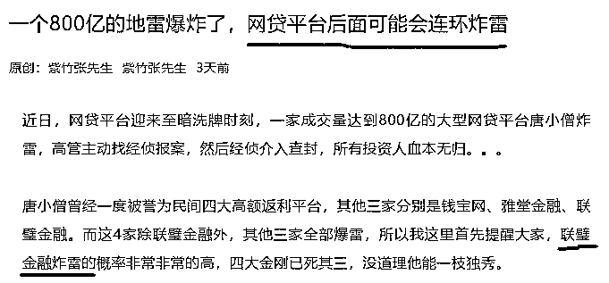
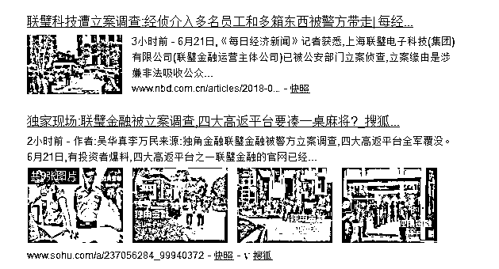
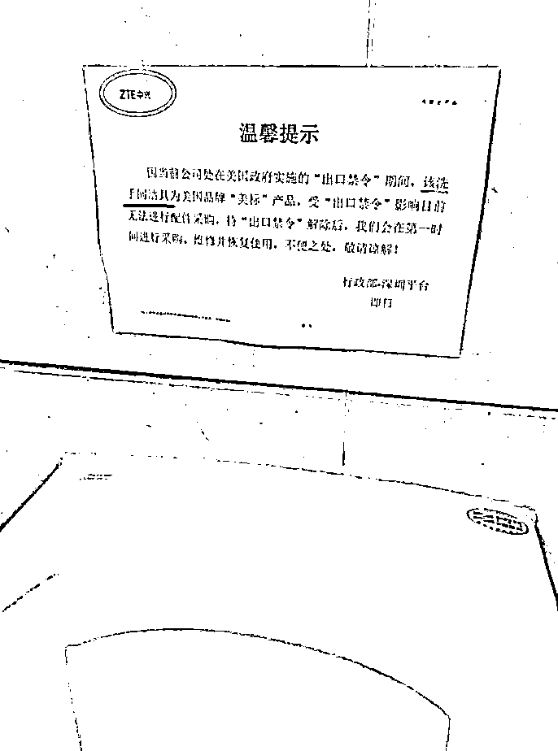
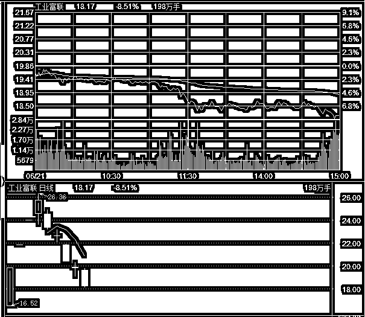
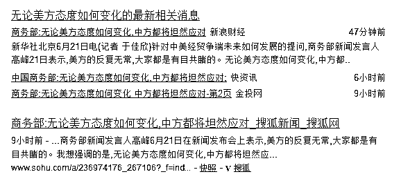

# 联璧金融被立案，网贷平台连环炸雷已经开始 | 夜报

<link rel="stylesheet" href="view/css/APlayer.min.css">

大家还记得，我三天前写了一篇文章，说网贷平台后面可能会连环炸雷，其中炸雷风险最高的，就是联璧金融。

而今天，联璧金融炸雷了，警方宣布对联璧金融立案调查，任何一个网贷平台，如果走到了被立案调查这一步，那就代表了死亡，从无例外。

在唐小僧爆雷当天晚上，我就在网上看到有人列举了高返的四大平台，当我看到里面除了联璧金融其他全死的时候，我就紧急向大家示警，因为根据我对当今金融形势的判断，这种新闻出来，一定会引发一波挤兑，然后我又查看了一下联璧金融的运营模式，发现居然是购物返现，这就直接呵呵了，正经做 P2P 撮合生意，有第三方银行监管，坦白所有底层借贷信息的平台还好一点，这种玩歪门邪道的，必死，只不过是时间问题而已，这一次的新闻挤兑，正好可以加速其死亡。

我看了一下新闻，我那天晚上发布了夜报之后，大概是次日晚上，联璧金融宣布停止提现的，大概还有 20 个小时的抢救期，这期间果断立刻提现的，属于火场逃生，稍有犹豫的，就活埋在里面了。在联璧金融宣布停止提现 2 天之后，今天被立案调查。

挤兑+立案调查+不规范经营，这家网贷平台死的透透的了，没跑出来的参与者，都属于接最后一棒，最后警方能给拿回多少损失，那就看命把，建议不要报太大期望。

你以为联璧金融暴雷了这事就算完了？我之前说的，网贷平台会开始连环炸雷，联璧金融只不过是风险最高，而且摊上风头而已，实际上，出于资金链紧绷的亚健康状态平台，多如牛毛，只不过差一个契机而已。

钱宝网、唐小僧、联璧金融的连环暴雷，会引发全体投资人会整个 P2P 行业的怀疑和恐惧，为了多的那一点利息搭上损失全部本金的风险，实在不划算，我上一次就说过，投资者开始抽资就是网贷行业至暗时刻的开始，当知晓这一原理的聪明的投资者多了起来之后会发生什么事情呢，现有的 P2P 平台造成严重失血，加速其破产整合的速度，这个预期结果，会反过来加速理性资金抽离 P2P 的速度，造成连环炸雷的恶性循环直到整个行业跌到谷底为止。

那么我们能怎么做，就是提前抽资，率先离开不安全的区域，等这一波行业洗牌完成之后，再进场，是否确定安全有一个标准线，6 个月不出现任何 P2P 平台的跑路新闻，我认为就彻底安全了，因为在金融系统整体降杠杆的情况下，整个网贷行业这一波会被打到谷底，用股市术语就是严重超跌，股票会集体闪崩，网贷平台也会。

大家都知道我是轻易不接广告的，17 年的时候 N 多 P2P 平台找我，我也只是经过严格审核之后放出了寥寥几家我觉得安全的，一次审核最多能看半年这么远，我觉得也足够用了。但是从 17 年底到现在半年了，我对所有 P2P 都是全部回绝的，开什么价都不接，甚至 18 年三四月份的时候还开始主动对部分 P2P 平台进行示警处理，就是因为我预感 18 年整个网贷平台的日子不会太好过，哪个安全哪个不安全非常难分辨，索性直接怀疑整个行业，让他自由落体，打到谷底之后，优秀的网贷平台自然会自己涌现出来。

上一次我示警联璧金融后，有人说我不够了解 P2P，这个行业是利国利民的。这里我统一做一个声明，我不否认这个行业是利国利民的，他也的确有存在的必要，但是只要是金融领域企业，都是存在兴衰周期的，如今就是整个金融领域最黑暗的时刻，那么自然是选择保守的产品，而不是激进。

我建议大家回避整个网贷行业，并不是认为这个行业就是骗人的，而是这个行业在 18 年，优劣极难分辨，安全性完全无法保障，至少我是没那个本事进行鉴别，只能说有第三方监管，敢公开底层借贷信息的，会合规一些，仅此而已。我的建议就是，整体回避，让市场大浪淘沙，等不合格的选手全部破产之后，剩下的就都是安全的，大家也不要问我哪个是安全的，我不能保证任何一个是安全的，但是到了 19 年，我就知道谁是安全的了，先等大半年再说呗。

~~~~

今天在网上看到一个图，比较唏嘘感叹，发来给大家看一看。

某兴通讯如今连厕所都没得上了，不做评价，就是给大家看一看而已。

~~~~

今天的股市，再吃一重锤，说实话，前几天的下跌我都有所预料，但是今天的下跌是让我很失望的，主要是从上午开始，走势几乎是单边无抵抗下跌，到了下午跌的很惨了，才出现横盘行为，只是死死抵抗，几乎没有一次像样的反攻。

今天，有 9 只次新股破发，而自 IPO 加速以来，累计的破发新股，也只有 77 只，砸盘的导火索独角兽富士康，这种行情再来二三个，马上也快破发了。

而今天下跌的主要原因，还是贸易战，中美估计又谈的不愉快了，党报再度发生，主要说的就是美方再度攻击中国的市场换技术政策，关于这个政策，我昨天晚上在小号“紫色后花园”发的《贸易战要谨防特朗普的低关税陷阱》里面有详细分析，如果三四天还没有被删除，我会考虑转载到大号里来。

但是不管什么原因，那都是外因，内因就是抽血过度！！！连续不断的 IPO 其实还能忍，密集上市独角兽抽血实在太厉害了，我之前还认为，把富士康和宁德时代安排在前后日上市，监管层有很大把握市场能稳定呢，现在看来，高估管理层的形势判断能力了，居然还要光速上会小米 CDR，临时撤回都没能挽回市场的暴跌。

哪个证监会不想疯狂 IPO 啊，那都是政绩，换我当证监会主席，我也想啊，但是你要考虑市场的承受能力啊，不能竭泽而渔，市场都搞崩了，次新大面积频繁破发的时候，我看你拿什么发新股。

6 月太黑了，打掉了我上半年所有的盈利，还套进去了不少，主要都是节后这一波给砸的，如今只能在里面乖乖躺倒，除非笃定中国会走大熊市，暴跌到 2500 之下，否则这个区域真的没什么好卖的了，股市再怎么跌他都不会归零的，超跌也一定会反弹，等等吧，明天再跌，把最后 1 成子弹打进去，然后拉升 50 个点就卖出刚买入的那部分。