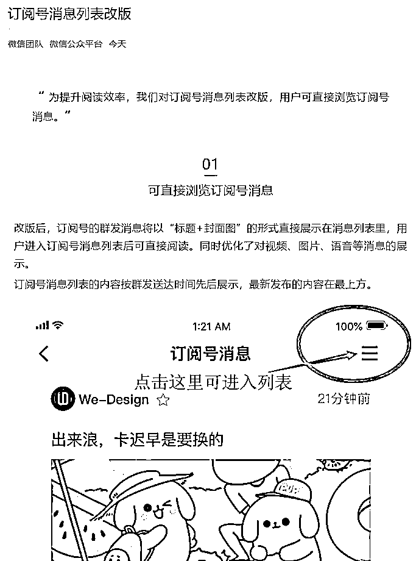
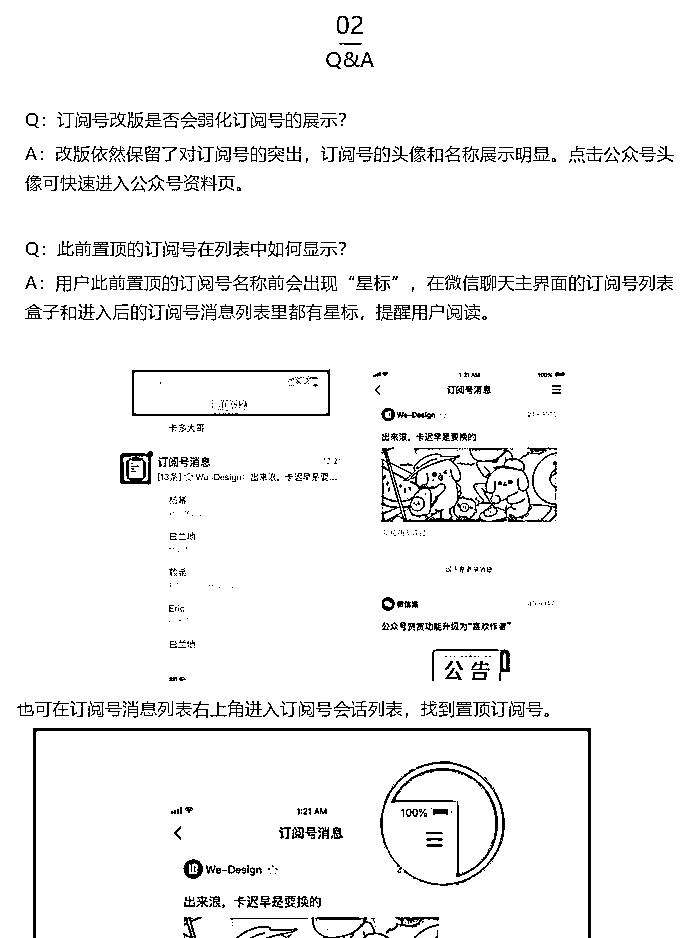
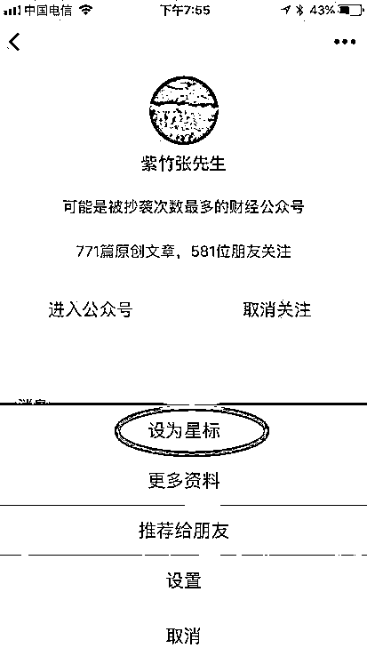
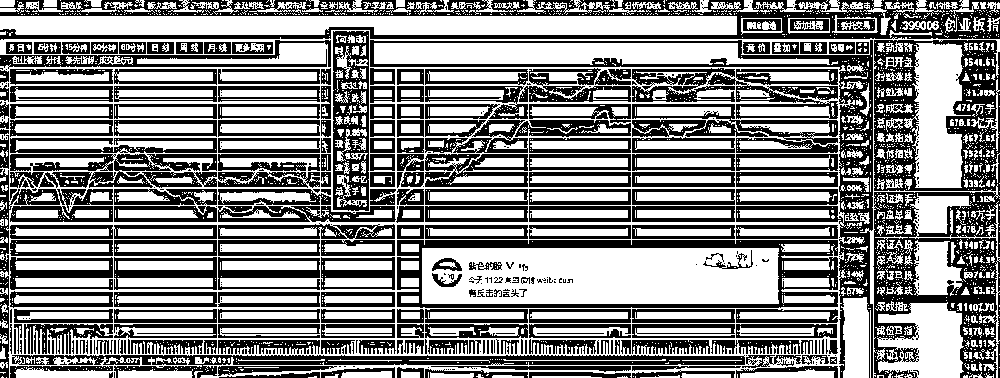

# 重磅改版，公众号改为信息流模式，内容生态会迎接巨变

今天，公众号迎来地震级改版，公众号将从列表展示模式，改为信息流展示模式，大家每天的阅读习惯，可能要迎来颠覆性的改变。

什么叫信息流展示呢，意思就是说，你关注过的所有公众号，他们发送的文章，会先后顺序全部展示在首页，如果你只关注了七八个公众号，那可能没什么影响，如果你关注了七八十个，那么你的首页会遭到铺天盖地的，良莠不齐的文章轰炸，好文章和坏文章的展示权利是一致的，都会很快被埋没进信息海洋之中，最新发布的文章会出现在第一行，然后会迅速的被新发布的帖子给覆盖沉没掉。

这一举动，严重不利于精品原创，是鼓励所有人都去当标题党，为了解决这一问题，腾讯保留了原始的列表展示，点击右上角可以切换，并在第二段声明中提出了星标置顶概念，鼓励大家把精品原创号进行置顶，以此和垃圾营销号进行区分，同时把取消关注的字体进行大幅放大来震慑生产垃圾内容的营销号，这一点是有利于原创号的。

点击人物头像的右上角，会显示设为星标，设置完毕之后，文章就会出现在列表展示的最上方，并且出现星标进行区分提示，这样的话，你才能在信息海洋中捞出你想看的文章，否则找起来都很麻烦。

简单的来说，订阅号的首页直接改为了信息流，如果你不喜欢，点击右上角，可以切换为原来的列表展示模型，但是既然第一眼必须进信息流界面，那么肯定是信息流占据主导。

信息流带来的后果就是，标题党和夸张的封面党占据绝对优势，这一点在今日头条、腾讯新闻、UC 新闻等产品上表现的淋漓尽致了，对于我这种坚持原创精品的人是非常不利的，因为展示的是标题和封面，内容是展示不出来的。但是我还是坚持这么做，毕竟紫竹出品必属精品既然成了我的口号，我就不会轻易改变，哪怕被标题党给轰炸。

这里就只能指望腾讯的第二条了，星标功能，希望他能有点用，这里建议大家都顺手点一下，把自己喜欢的公众号设为星标，否则的话，你可能会被良莠不齐的文章密集轰炸，以至于大幅增加你找到优质内容的难度。

对了，IOS 版本微信，今天晚上 7 点 20 更新的，安卓的，会在几天之内进行更新，整个内容生态会迎来巨变，这个生态到底是劣币驱除良币，把优质原创号给逼成标题党。还是良币驱除劣币，过量劣质信息轰炸引发用户反感疯狂取关营销号，现在争论很激烈，我们就等等看。

我希望是良币驱除劣币，不过就算不是，我也会坚持原创精品号的，就算被淹没也不能随便把垃圾文章放出门啊。

~~~~

这里做个预告，我会在今天凌晨或者明天早上，发送一篇《**贸易战要谨防特朗普的低关税陷阱**》，详细剖析高关税和低关税，对中美两国造成的巨大影响的原理和历史典故，**分析的可能太过深入敏感，我完全没有不被删的把握，所以只发在小号**，大号连转发都不敢，毕竟本月被连删 n 篇了，次数实在太多了。。。

大家可以扫描下方二维码，明天早上起来看，我已经快写完了。

~~~

然后把今天的股市分析一下，昨天千股跌停，一片末日恐慌，而我们坚持的是反人性操作，当初上涨的时候一路涨一路卖，现在下跌的时候一路跌一路买，已经跌的把所有账面浮赢全部打掉了，依然在持续买入。

这一套说起来很简单，但是执行很难，一个是仓位控制，很多人轻易就把子弹打光了，最后抄底的时候就没子弹了，第二个就是跌的时候买真的是反人性的，很难，涨的时候卖，也很难。

昨天我和大家说，2856/2906/2956 各买 1 成，打到满仓状态，这是半年来首次动用储备的 3 成子弹，这些子弹就是等着大型黑天鹅出来的时候用的。

这种逐步买进的办法，是特地给普通散户准备的，操作非常简单，可以说是无脑，不需要过高的盘面判断技巧，而且可以提前不止一天制定，有时候甚至可以提前一周以上制定计划，准备时间非常充分，实际上，如果你盘面中有一些敏锐的观察能力，可以获得更高一点的收益，但是需要长期的联系，而且这是不可能提前预测到的，盘中也没时间通知，差十分钟做出判断，其实就差很多了。

而实际上，今天的上涨，我认为主要是贸易战得到缓解才引发的，因为中 xing 通讯、亚太股市、欧洲股市，都在上涨，不可能是因为给 A 股面子，那么唯一的理由就是，可能中方代表团在美国达成了什么协议，所以才给予反弹的。

至于这种好消息，虽然无法预料，但是也可以预料，那就是前天的利空消息，特朗普直接甩出 4000 亿美元的底牌，属于梭哈行为，消息已经坏到了这个地步，那还能怎么坏，后面要么没消息，要么就是好消息，毕竟贸易战只是利益之争，并不会真正的打起来，真的互相狂加关税的话，对谁都不好。

我对利空消息引起的下跌，不屑一顾，因为那属于黑天鹅，总归还是会收回来的。这种对于好消息引起的上涨，也不屑一顾，因为总归还是会收回来的。市场自发的上涨，才是真正的上涨。

故，这次在 2956/2906 分批抄底了 2 成，预估上涨 80 个点左右，会卖出去，那也就是大概 2986/3036 附近，等二度探底的时候，会在买回来。

如果直接涨上去怎么办，就不下来了怎么办。昨天有人问我这个问题，我想说，如果真涨那么凶，那你怕什么呢，一路涨一路卖就是，仓位那么重，难道你还害怕上涨？

最后，昨天说自己会出 V，结果今天 11 点 22 开始全面反击，创业板盘中一度上涨 2%，可以说算个中型以上的 V 了，离 6 月结束只剩 10 天了，剩下的任务就是一路涨一路卖，以及偶尔做 T 为主了，我觉得在这个底部还要折腾一下，不过不会太久。

反正，这个位置不看空，无论从各种理由，都是敢跌就满仓的区域，唯一需要考虑的，就是 3000 点既然被大阴线打破，是不太可能会瞬间上去的，必有反复的过程。

往期回顾（回复“目录”关键词可查看更多）

为什么中国必须购买美国国债？| 租房贷款会将房子拆分成房骨和房皮 | 宁波老虎事件遇难者不应该得到赔偿 | 中国的房价什么时候会崩盘？| 你根本不知道烟草公司有多赚钱 | 如何把自家孩子培养成一个顶尖人才 | 我是如何保证自己不近视的 |魏忠贤其实是个贤臣 | 2 分钟了解中国 50 年的艰辛发展史

