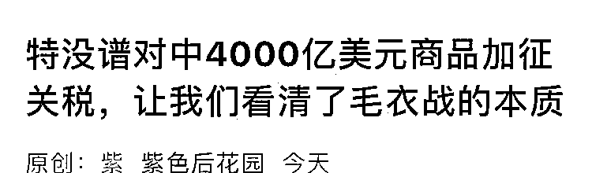
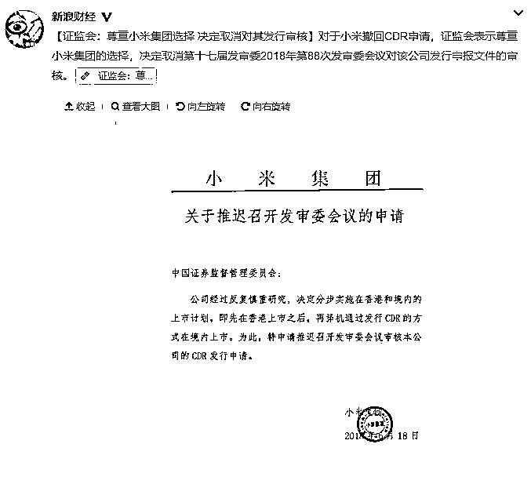
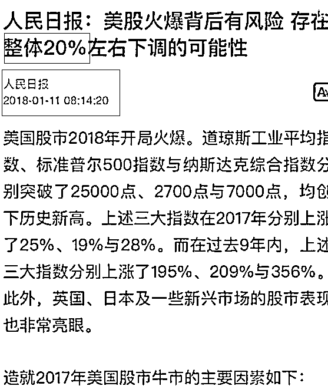
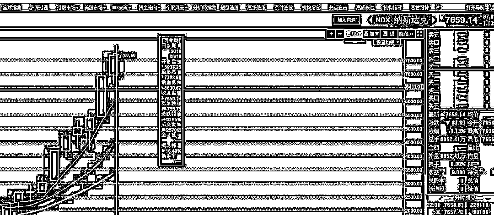
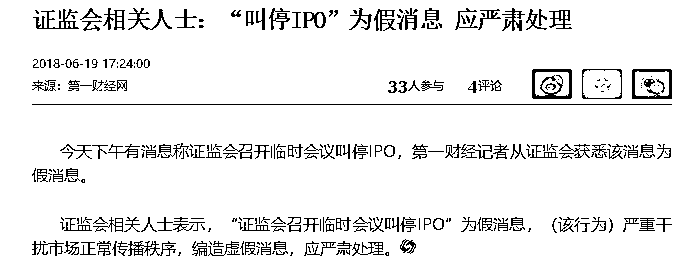

# 千股跌停，明天怎么办

今天股市暴跌，千股跌停，股灾阴影再现，前三次股灾都是前任证监会主席肖刚背锅的，这次他离职了，肯定不能是他背锅了。

至于是谁背锅，在分析之前，我们首先要知道今天毛衣战突然加剧的事情，本来我们认为毛衣战是 500 亿美金的规模，结果今天凌晨，特浪普直接加码到 2000 亿，今天下午直接再加码 2000 亿，一天之内打出了 4000 亿美金的子弹，这个话题太过敏感，我只敢在小号发。

大家可以扫描下方二维码，进入小号的历史信息记录里查看。

* * *

今天凌晨，美股宣布 2000 亿美金的时候，证监会是做了紧急反应的，那就是让小米撤回 CDR 申请，然后证监会立刻同意。小米不可能主动自愿的牺牲自己的重大利益，证监会的行政效率也不会反应这么快，释放利好对冲 2000 亿美金关税的行为非常明显，不过鉴于他还是为股市好，完全可以接受。

按照我们昨天晚上的分析，假期的超大黑天鹅，会毫无悬念的击穿 3000 点，并且引发巨幅暴跌，估计百点暴跌是有的，我们的打算是 2956/2906/2856 分批抄底，趁这个黑天鹅直接吃到满仓。

小米 CDR 推迟的消息，让今天本应该大幅低开的股市，只出现了小幅低开，**但是鉴于以下几个原因，引起了大跌**。

首先是这个低开的幅度太浅了，肯定有抛盘继续压制。然后上午的时候中国对美国反击，下午美国公布的第二个 2000 亿美元计划，对股市造成了第二重黑天鹅打击。最后引发了恐慌盘的连锁崩溃。

但是这个幅度，完全是在预期之中，这一波的回调极限是 2856，明天到了这个位置，就会满仓，满仓卧倒不动赌 2856 的反弹。

这个位置不击穿，大盘还没什么事，如果击穿了，那乐子就大了，首先 2850 是股灾期间的重要地点，其次，从高点 3587 算起，如果击穿 2850，那么累计跌幅是超过 20%的，这会影响整体情绪，追涨杀跌自然是不会的，但是后面的反弹里，所有人都会降低反弹预期，边打边跑估计会形成主流，话放这了，证监会自己看看民意吧。

说到这个 20%，今年 1 月份的时候，人民日报发文警告美股可能有 20%的跌幅。

说实话，绝大部分市场分析人士，都认为美股存在风险，毕竟涨的太多了，简直和中国的房价一样拉不住，完全是一头疯牛。

然后的结果，就不提了，A 股“微跌”成这样，美股至今还处在高位，纳达克斯甚至前几天刚刷新了历史新高，完全不考虑中国股民的感受，这种走势图引起不适，非常想举报。。。

今天一收盘，千股跌停，马上就有市场谣言说证监会要叫停 IPO 了，证监会立刻辟谣。

说实话，我觉得 A 股跌那么惨，毛衣战只能算黑天鹅，核心的根子，还在于抽血过度，严重超出了市场的承受能力，这一点是非常容易预期到的，本届股市的所有结果，都只能本届证监会背锅，甩不出去的。暂停 IPO 是不太可能的，但是降低速度，是可以做到的，可惜今天离周五还远得很，想发布啥利好都来不及，要证监会发一个公文说要降低发行速度那也是不可能的，这代表向市场服软。很难做，那么还剩最后一招就是明天安排国家队入场托市，没其他好办法了。

这一波，我们在 3200 上方最高点卖出了 2 成，亮点是卖出了 2 成，缺点是只卖出了 2 成，然后一路跌，一路买，把仓位几乎都买回来了，如果明天打到了 2856，那么仓位直接会升到满仓，继续打穿这个最低点，也不会盲目割肉的，只会降低反弹预期，从震荡守恒的预期，改为逢反弹边打边撤，仅此而已。震荡行情的网格操作法，就是这么操作的，非常反人性，暴跌的时候一路买，暴涨的时候一路卖，而且不猜顶，不猜底，涨一点卖一点，跌一点买一点。

接下来就是见证时刻，明天杀到 2856 打出最后一颗子弹，然后卧倒等行情来，向上涨的时候再一路涨，一路卖。

往期回顾（回复“目录”关键词可查看更多）

为什么中国必须购买美国国债？| 租房贷款会将房子拆分成房骨和房皮 | 宁波老虎事件遇难者不应该得到赔偿 | 中国的房价什么时候会崩盘？ | 中国地产达到什么样的条件会崩盘？| 你根本不知道烟草公司有多赚钱 | 如何把自家孩子培养成一个顶尖人才 | 我是如何保证自己不近视的

