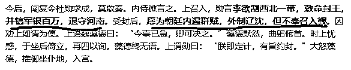

# 魏忠贤其实是个贤臣

魏忠贤何许人也，史料记载为九千岁，祸害天下、横征暴敛、残害忠良等罪行罄竹难书，可谓是十恶不赦，但是事实上，魏忠贤其实是个贤臣。

那是不是史书上是对魏忠贤造谣抹黑呢，并不是，史书上写的全是真的，历史上权臣悍将干过的坏事，魏忠贤基本上都干过，做的坏事肯定是有一箩筐的，但是之所以称之为贤臣，是因为在他后面上台的那群东林党人实在太烂了，把魏忠贤的政绩给衬托出来了。

崇祯之穷

天启驾崩，崇祯登基后的第一件事，就是把魏忠贤给干掉了，当时魏忠贤在内库给崇祯留下 2000 万两白银，大明各地精兵悍将从不断饷，可谓兵精粮足。仅仅 17 年之后，闯王李自成在西安称帝，号称大顺，但是实力很一般，总共就 6 万人，其中能打的不足 1/3，其余都是搬运辎重的民夫。粮饷不足，于是发布檄文，说崇祯是无道昏君，自己要改朝换代，本打算出去洗劫几个县城混口吃的，派大将刘宗敏率 2 万（号称 50 万），亲领 4 万（号称百万）攻打周围的县城，结果发现一路扫荡，遇兵皆降，甚至有官兵主动追来投降的，要求只有一个，给点吃的，这群官兵已经一年多没发饷了。。。

结果闯王的军队滚雪球一样的迅速膨胀，投降的官兵都要吃饭，但是李自成没钱没粮，于是就只能一路打过去，打下一个新县城，才能拿到点粮饷吃几口热饭，投降的官军很快就数倍于大顺，这群饿狼今天能为了军饷投降李自成，一旦发不出军饷，明天就能反噬。

李自成怂了，于是再度发布一个檄文，不再说崇祯是无道昏君了，称崇祯“君非甚暗”，意思还是个好皇帝，还号召崇祯的臣子要“恪尽职守、精忠爱国”，意思是你们别投降了，我养不起了。不再要求改朝换代了，要求崇祯自降为藩王，成为大顺的下属国，另外赔偿一点军饷，李自成马上就退兵。

崇祯拒绝了这个议和条款，但是北直隶等兵马继续接二连三投降李自成，投降的兵马已经超过顺军主力十倍之多，李自成连遣散降军都不敢了，一旦降军作乱，李自成连跑都跑不掉，于是李自成发布了第三道檄文，说崇祯是明君，自己愿意向崇祯投降，只要崇祯封他为藩王，把山西和陕西给他做藩国，并拨给军饷，李自成立刻就率军投降，崇祯继续拒绝“要钱没有，要命一条”。

于是李自成硬着头皮向北京进发，遇到的明军继续是一触即降，到了北京城下的时候，李自成的军力真的有百万之多了，天启留下坐镇北方的雄军几乎全数投降，李自成派出心腹找崇祯求和，只要崇祯愿意给一百万两饷银，他立刻退军，把北直隶的土地和此次投降的明军都还给崇祯，并且愿意替崇祯抵抗满清，甚至还愿意帮崇祯镇压其他农民军，在议和信中，甚至称其他农民军为“群寇”。

李自成根基太浅，他拿得下北京，但是守不住长城，他知道自己的班底还不够深厚，还需要时间打磨自己的班底，崇祯还有留着的必要。

但是崇祯依然不同意，一分钱不给，刘宗敏怒了，这皇帝不见棺材不掉泪啊，都这份上了还死鸭子嘴硬，要求打进北京城把国库的银子拿出来，他都守得住长城我们也守得住。闯王无奈下令攻击北京城，于是北京城唰的一下就破了，崇祯自缢而死，于是李自成顺利继承了崇祯的遗产，北方百万军队的欠饷，无数需要维修的城墙和堡垒，虎视眈眈的清军，以及一个光溜溜的大明国库和皇帝内库。

是的，在北京城破之前，崇祯差点给大臣们都跪下了，请求捐款，众大臣一副自己是清官，家里实在没钱，捐个千两白银就得毁家纾难的样子哭天抢地，崇祯总共只募集了 20 万两，实在凑不够百万白银，于是就自尽了。李自成拿下北京城之后也是被架在火上烤，史书记载闯贼胸无大志，不接受京中重臣的投降，破北京城之后对高级官员大肆抄家，本来吴三桂都打算投降大顺的，就是因为北京的老吴家被抄家了，所以被迫投降清军。

但是李自成也没办法啊，大明的国库和崇祯的内库里面连耗子都快饿死了，就这 20 万两顶什么用，再筹措不到钱粮，不等清军打过来，自己就被饿兵给灭了，只能抄家，崇祯没钱，那这帮贪官一定有钱，只要拷打出百万两白银，就能暂时渡过难关。

结果，李自成拷打出了 7000 万两白银，这个数量让所有人都震惊了，如果不是大顺军根基太浅，底盘不稳，加上李自成被清军偷袭，在战场上直接用隐藏的十几个神弓手集体射击瞬间狙杀，李自成真的能靠这笔钱坐稳龙椅。要知道关外辽东军费最巅峰的时候一年也不过耗费 400 余万两，崇祯末年只要 300 余万两即可，这 7000 万两白银可以抵挡清军 20 年。

京中群官仅仅现银就被李自成拷打出 7000 万两之多，手中店铺、土地更是不计其数，文官之富和崇祯之穷，形成了鲜明的对比。

款爷万历

说完了穷鬼崇祯，就要谈谈款爷万历了，史书记载，万历怠政，几十年不上朝，而且好大喜功，发动万历三大征。

1、宁夏之役，平定蒙古叛乱，奠定了明朝在西北的权威

2、朝鲜战役，在日军占领朝鲜后，出兵救援，把日军打回了老家，奠定了明朝在东亚的权威。

3、播州之役，平定苗疆叛乱，奠定了明朝在西南的权威。

除了三大征之外，万历期间明朝战争不断，几乎从不议和，不服就打，简直就是战争狂人，比今天的美国还要嚣张，但是逢打必赢，丝毫看不出明朝军力羸弱的迹象。为什么差距那么大，除了万历老师张居正临死之前给他留下的班底雄厚之后，还有一个最重要的原因就是万历重用太监去各地收税，收来的矿税、盐税、商税大幅度的充实了皇帝内帑，只要国库没钱，皇帝就大笔一挥从内帑调钱，不管多少军费，从来不加征农业税。

说白了，大炮一响，黄金万两，万历之所以横扫天下，就是靠他手中有钱，明军将士吃饱穿暖，敢于拼命。而大明的规矩，农业税归户部国库，太监收的税归皇帝内库，万历那么有钱，那手下那帮收税收上瘾的太监密不可分。

万历手下的太监收的税有多重呢，商税 2%！你没看错，就是 2%，就是这么“重”的税，把万历给变成了款爷，因为明朝的工商业真的极度发达，已经具备了资本主义的初步雏形，哪怕 2%，只要征收得上来，都是一笔巨款。

魏忠贤的发家

万历死后，明廷内讧，太子朱常洛继位之后仅仅 30 天就不明不白的死了，死因服红丸二枚，史称明末三大案中的红丸案，然后朱常洛的儿子朱由校继位，年仅 17 岁。

而魏忠贤，是陪伴朱由校长大的心腹太监，穷苦出身，吃喝嫖赌导致家破人亡，22 岁自己净身入宫当太监，目不识丁但是是个难得的人才，从一个最低级的太监，火箭一样的飞升为九千岁，成为天下太监的偶像，足以证明其才干是远超普通人的。

明末三大案，梃击案、红丸案、移宫案全部针对天启的父亲朱由校，所以天启不信任外人，只信任长期陪伴自己的魏忠贤。而且魏忠贤也确实能干，统领能力一流，帮天启铲除了所有他看不顺眼的文官，然后帮天启对天下收税，让天启的小金库肥的流油。

可以说，天启就在皇帝的位置上维持明君形象就可以了，脏活累活魏忠贤一个人给他包干了，魏的最大能力不是打压文臣，巩固皇权，是收税。魏忠贤针对工商业、对外贸易发达的江南地区，重新设立了万历末年被东林党废除的工商税、海税，从而让万历年间的军费支出轻轻松松。魏忠贤收税的一大特色就是，穷人出身，所以只对富人收税，严厉打击偷税漏税，但从不对农民加税。（小号 id:紫色后花园，长按下方二维码关注~~）

所以万历年间，关外战乱不断，但是明朝大军从来没断过军饷，对内也没有加征过农税，清军翻不起浪花，关内也无人起义。天启仅仅在位 7 年，而魏忠贤真正掌权也就三四年，前几年都在和文官集团死战夺取权利，天启驾崩崇祯登基的时候，除了每年定期拨给关外的辽饷概不拖欠之外，魏忠贤给崇祯留下的遗产是，2000 万两内帑！堪称收税狂人。

魏忠贤死了

天启驾崩的时候，拉着他弟弟崇祯的手说：“魏忠贤恪谨忠贞,可计大事”，但是崇祯继位后，第一件事就是把魏忠贤给灭了，首要的原因就是崇祯信任东林党人，非常崇尚儒家思想，打骨子里看不起魏忠贤这种地痞流氓且目不识丁的阉人。其次，是魏忠贤仗着天启的信任过于膨胀，人称九千岁，党羽遍布天下，让崇祯有深深的危机感，阉党势大如此，岂能容之。

天启重用阉党来抗衡东林党，崇祯就重用东林党来抗衡阉党，灭了魏忠贤之后大肆清洗阉党，东林党掌权，实现了“众正盈朝”。

这群满嘴仁义道德、一身正气的东林党，主政后的第一件事就是废除太监收税制度，认为商税、矿税、海税等是搜刮民脂民膏，扰乱天下不宁，把魏忠贤建立的税收系统连根拔起，彻底消灭，大幅度降低了江南富庶地区的税负压力。

前方将士打仗没钱怎么办？加税啊，开征三大税，直接把西北穷苦农民的税负提升了接近一倍，魏忠贤是对富人征税穷人减税，东林党是对富人减税穷人征税，魏忠贤是对富裕的江南地区征收商税、矿税、海税，东林党是对贫穷的西北地区征收农税，施政方针恰好反过来了。

带来的后果也很明显，崇祯在位十几年，原本充裕的内库都可以跑老鼠了，关外粮饷不足，只能算是苦苦支撑，清军逐渐势大，而关内因为农民税负过重起义不断，最后因为欠饷一年多，官军疯狂投降，被带着几万乌合之众的李自成兵不血刃的给打下了北京城。

而崇祯信任的东林领袖钱谦益，披着道德圣人的外衣，当崇祯君王死社稷的时候，当初被钱谦益爱国光环吸引来的奇女子柳如是问他是否殉国的时候，钱谦益轻飘飘的来了一句，我愿意啊，就是水太凉了。。。

悔恨的崇祯

当李自成兵围北京城，崇祯求爷爷告奶奶也只募来 20 万两，自知杯水车薪无力回天的时候，哀叹“朕非亡国之君，臣皆亡国之臣”，他身边一个小太监哭诉“若是魏公公在,形势不至于此”。

崇祯醒悟了，可惜已经晚了，大明的江山已经被这帮贪官蛀虫给耗尽了所有的元气，崇祯元年，魏忠贤倒台，东林党满天下屠戮阉党，搜出的脏银都少的不好意思说，哪怕是以污蔑阉党为乐的东林党，都不好意思在史书上记载到底这批阉党贪污了多少银子，因为当初阉党搜出的脏银是一笔小到可以忽略不计的数字。

但是等崇祯上吊，李自成对东林党清算的时候，这个数据震惊天下，仅京城一地，就搜出脏银 7000 万两。。。

崇祯原本是很看不起魏忠贤这种小人的，觉得自己手下正气漫天的东林党，随便拉出一个来都比魏忠贤这种文盲阉人要强太多了，谁知道和手下这帮清谈误国还贪婪成性的东林党相比，魏忠贤真的算是一个贤臣啊。崇祯皇帝上任 17 年来，从不缺席朝政，每日每夜亲自批改奏折，可谓是明朝君王里难得的劳模，可惜他的政绩是历代君王里最差的那个，几十年不上朝的万历，天天当木匠的天启，没有一个把国内的贫富分化搞的那么离谱引发农民起义，也没有一个把国库搞的那么穷，士兵都断饷一年多了居然还想不起来对富商收税。

北京城破之前，崇祯仰之为国之栋梁的文臣们，都在等着效忠李自成当顺民来保全自己的财富地位，敲钟聚集百官议事无一人肯来，他在煤山上吊的时候，身边陪着他的，没有一个文臣，只有一个小太监，这个太监跟着他自尽之后，东林领袖钱谦益收获了水太凉称号一枚。

所以崇祯上吊之前，恨恨的说了一句“文官皆可杀”，可惜他领悟的太晚了。

往期回顾（回复“目录”关键词可查看更多）

为什么中国必须购买美国国债？| 租房贷款会将房子拆分成房骨和房皮 | 宁波老虎事件遇难者不应该得到赔偿 | 中国的房价什么时候会崩盘？ | 中国地产达到什么样的条件会崩盘？| 你根本不知道烟草公司有多赚钱 | 如何把自家孩子培养成一个顶尖人才 | 我是如何保证自己不近视的

