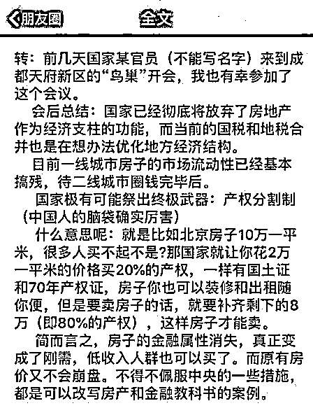

# 房屋产权分割制将要推出，是真的吗？| 紫观点

紫竹张先生

紫竹出品，必属精品

这几天，一张截图在朋友圈和各种微信群里迅速流传，甚至被看成是一则特大新闻，有不少人来询问我其真实性。

这个看起来很真的截图，是标准的谣言，漏洞百出，经不起推敲，我给大家分析一下。

首先，房地产是国之命脉，有任意风吹草动，各大财经媒体第一时间就扑上去报道了，这个图中第二段，说会后总结：国家彻底放弃房地产作为经济支柱的功能。

不知道编这个谣言的人，知不知道房地产目前把经济绑架的有多严重，别说放弃房地产，地产价格有一点波澜，都能引起惊天动荡。别说放弃房地产，国家只要露出一点要摆脱地产绑架的意思，马上就能上头版头条，但是大家看到正规媒体报道了吗？一点影子都没有。

然后，他列出了一个所谓的房屋产权分割制，意思就是说这个创新的制度能让房子的金融属性消失，变成彻底刚需，不再被炒作。意思就是，只要不被当成金融工具炒，房价就不会涨了，刚需也能买得起了，多美好。

我给大家推理一下，假设目前北京房价 10 万一平，切割 20%产权，让你 2 万一平可以买入，归你使用，但是卖房子的时候要补齐 80%产权，如果真的实行这一制度，会带来什么后果呢，会带来房住不炒，人人买得起房的美好未来吗？做梦把，带来的唯一后果就是，房价会立刻暴涨上天。

道理很简单，假设目前市面上有 1 万套房在出售，假设每套 100 平米，原来一套单价要 1000 万，没几个人买得起，现在只需要单价 200 万就可以拿下。会带来的唯一后果是，原来买不起房的人疯狂的上车购买，在售的 1 万套房，会迅速的消失，等市面上无房可卖的时候，房价会飞速的暴涨，因为在供给数量不变的时候，需求被迅速的扩大了。

供需失衡的局面，谁都可以预料到，所以这一政策执行的当晚，原来买过房子的人，也会用其他身份证疯狂的购买，以此来套利。

你说产权只有 20%，没有全部产权啊，这个没关系，假设北京房价从 10 万涨到了 100 万一平，剩下的 80%产权哪怕补 80 万一平也没关系啊，至少我自己的 2 万一平，已经涨到了 20 万一平，结结实实的翻了 10 倍。

我投入 2 万本金，我赚 20 万，我投入 10 万本金，我赚 100 万，这有什么区别嘛？无非是多买几套房的事情，我盈利的比例还是不变的。

如果房子如葱，到处找人接盘都卖不掉，执行这个策略还是可行的，消化了库存，减轻了抛压，是救盘的好手段。

但是这个政策放在这种各地房价轮流暴涨，中央像打鼹鼠一样谁冒头就打谁的档口，推出这个政策，是嫌房价涨的不够凶嘛？所以把这个政策安到房住不炒的头上，是非常可笑的，这个政策是典型的爆炒催化剂。

综上所述，这个在朋友圈刷屏的所谓“内部讲话”的截图，属于谣言。

往期回顾（回复“目录”关键词可查看更多）

为什么中国必须购买美国国债？| 租房贷款会将房子拆分成房骨和房皮 | 宁波老虎事件遇难者不应该得到赔偿 | 中国的房价什么时候会崩盘？ | 中国地产达到什么样的条件会崩盘？| 你根本不知道烟草公司有多赚钱 | 如何把自家孩子培养成一个顶尖人才 | 我是如何保证自己不近视的

