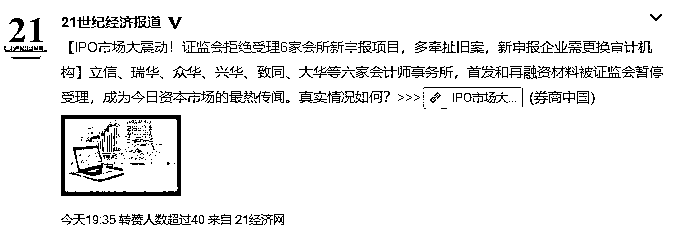
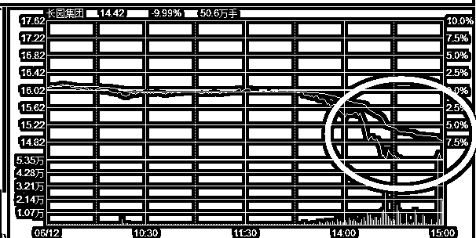
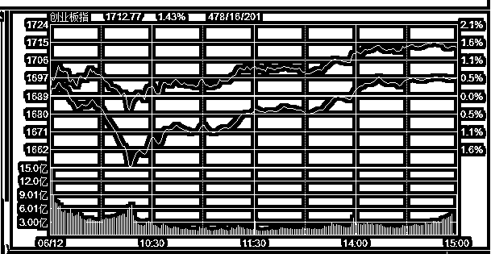
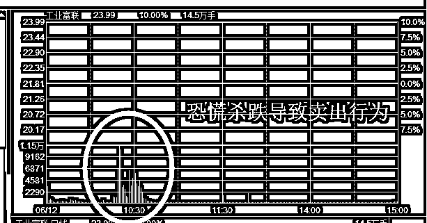
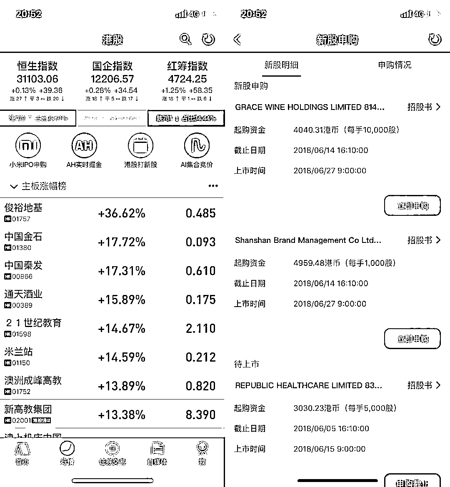
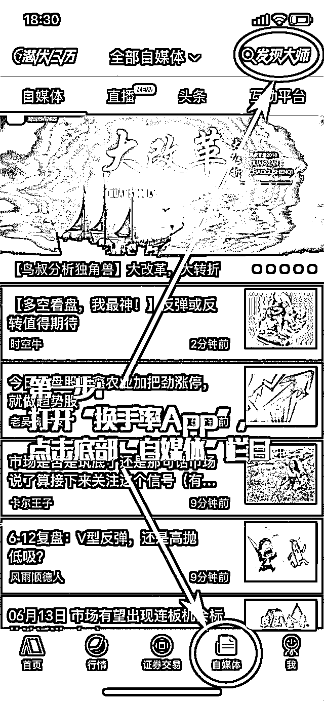
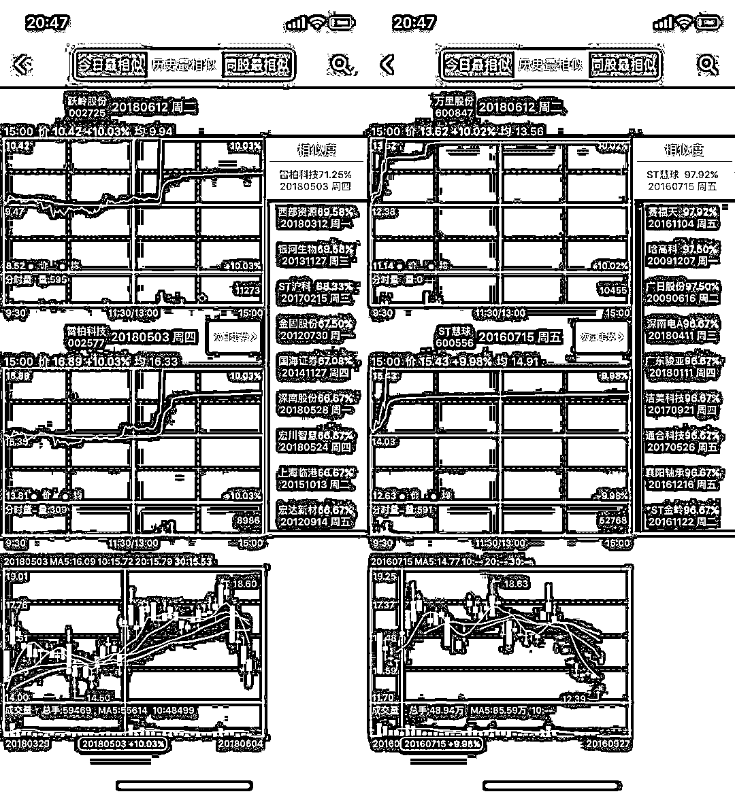

# 多重政策压制，IPO 将全面减速？

<link rel="stylesheet" href="view/css/APlayer.min.css">

今天，证监会发布了一系列的重磅政策，条条针对 IPO，市场受到了巨大的震动。

首先，证监会暂停立信、瑞华、众华、兴华、致同、大华等六家会计师事务所的首发和再融资材料受理，这六家会计事务所的名字大家可能不太熟悉，但是在 IPO 市场，他们六家占据了半壁江山，暂停受理其 IPO 材料对行业影响很大，重新寻找其他会计事务所进行审计，需要耗费很多时间。

至于为什么选择这六家进行打击，因为根据最新的“138 号令”，凡是有旧案在身，尚未结案的会计事务所，全部暂停材料申报。这对会计事务所是巨大的打击，也是证监会追求财务报表真实，杜绝财务造假的重要惩罚手段，凡是上市公司财务出了问题，负责对其审核服务的会计事务所都要遭到巨大的损失。

然后，今天监管部门又发布了最新 IPO 审核 51 条问答，进一步量化、细化审核标准，这 51 条细则都列一遍很啰嗦，我就简单的总结一下，那就是大幅提升审核难度，希望直接劝退 IPO 企业。

最后，今天有 2 家公司首发上会，一家通过，一家被否，打回原形，否决率 50%。

今天，证监会连续发布这三条重磅政策，条条针对 IPO，想从合理合法的角度，人为增加难度，压缩 IPO 的排队数量，虽然其目的非常明确，给独角兽上市保驾护航，但是侧面效果，**降低了 IPO 的数量和抽血强度**，对于股市而言，肯定是利好，**还是比较大的利好**。

~~~

今天**长园集团**盘中突然跌停，其原因在收盘之后得到揭晓，原来本来板上钉钉的格力集团亿 19.8 的价格对长园集团发起 20%股权的要约收购，今天被珠海市国资委否决。

要约收购黄了，这个股跌停是非常正常的，但是在消息公布之前几个小时，这个股就直线跌停，这就有问题了，什么资金如此先知先觉？要查也很好查，看看今天的交易记录是谁突然在下午大举卖出就可以了。

我只能说，**这种利用内幕信息牟利的行为，该管一管了**。

~~~

今天，指数全面反弹，收出中阳线，创业板再回 1710 上方，我在昨天晚上的最后一段话就说，“这个位置，加上政治形式大环境，不适合看空。”

实际上，在今天的盘中，曾有二波非常吓人的杀跌，盘中一度非常恐慌，时间大概是 10 点 15 左右，次新股简直要跌成灰烬，本来被 150 万手封死的富士康，在那一小会，被卖出 10 万手，撤单 40 万手，封单直线减少为 100 万手左右。

在板上还有 150 万封单的时候，就出现大举卖出，可见当时的恐慌氛围，另外今天这么一卖，富士康离开板之日就不远了，可能明天就会开板，如果明天大盘来个中阳，那么最多也就拖到后天，因为今天已经出现了第一波冲击盘。

对于大盘而言，今天在如此恐慌的跳水盘出现的时候，还能拉出中阳线，是非常振奋人心的，我前一段时间说过，本周利空特别多，都是大利空，一个接一个重锤，如果硬吃这么多锤，都没锤破底部的话，那么这个底部将会无比的扎实，后面只有反弹一条路可以走。

二个独角兽我们已经迎接了，然后立刻就收出一根红 K，后面的下一个重量级利空就是美联储加息了，不过这个利空就是走个过场，因为加息概率接近 100%，唯一需要考量的，是中国会不会跟随加息，只要中国不跟随加息，美国宣布加息之后，大盘会立刻反弹，如果中国加息，那么还要吃一锤。

但是不管怎么样，这里都是底部了，本来已经做好破 3000，恐慌盘被杀出之后满仓的准备了，但是连 3000 都不破，所以可能还是级别很大的底部，后面迎接的会是月级别的上涨。

而目前，还在磨底阶段，因为后面还有几发利空，所以直接上涨概率不大，未来几天，平淡交易估计是大概率走势，但是从今天的走势来估计，后面的几发利空，打破底部的概率都不大了，因为最大的利空已经度过去了，后面的利空一个比一个小。

目前的区域，是重要的底部区域，在这个底部一定不能因为利空恐慌，尤其是**那种可以提前预计到的利空，那些只是看着吓人，其实全是纸老虎**。

~~~~~

**小米 7 月即将在香港 IPO 上市！换手率 App 在 7 月将支持港股小米 IPO 申购，港股 IPO 申购不需要市值，中签率也挺高的，****如果****想要申购小米 IPO 的，可以下载“换手率 App”，同时换手率 App 最新版已经免费支持港股 Level-2 行情，我自己体验了一下，感觉非常不错！**

 

**我自己也入驻了“换手率 App”自媒体，会在那边发布一些文字，平时手机看股票，因为对短线要求特别高，幸运的是， “换手率 App”满足了我一切对短线妖股挖掘指标的需求！“换手率 App”最近确实特别火！身边很多国内一线顶尖龙虎榜席位游资操盘手都在用！老铁们可以长按识别图中二维码免费下载“换手率 App”！也可以应用商店直接搜索下载“换手率 App”提前潜伏涨停板！**

 

**第一步：打开“换手率 App”点开底部“自媒体”栏目；**

**第二步：在“自媒体”栏目右上角发现大师搜索“紫色的股”；**

**第三步：进入“紫色的股”的主页，点击关注。** 

**最近很多龙虎榜席位游资都在用的“换手率 App”又免费升级开放了全球独家的“AI 相似涨停板分时图”，非常实用，换手率 App 目前是最具备魔幻创新能力+AI 大数据量化计算能力的手机炒股 App！这个功能主要通过计算机 AI 图形识别，帮助用户免费找到和当日涨停板股票分时图走势相似的历史个股分时图，同时展现这些个股第二天的全部走势，这样就能够****参考****预测每天涨停板第二天的走势情况！****给大家举几个今天涨停板做例子。**

** **

**最后说个秘密，我很早就特邀入驻“换手率 App”了！老铁们猛戳左下角****【阅读原文】****，也能下载“换手率 App”！立刻下载“换手率 App”！在自媒体栏目搜索关注我“紫色的股”，祝老铁们 5 穷 6 绝 7 翻身！**