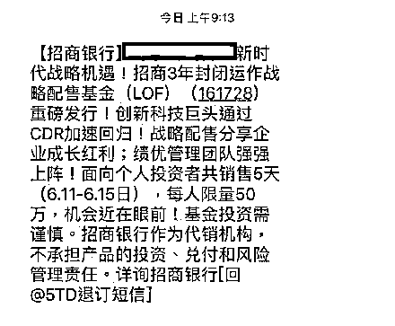
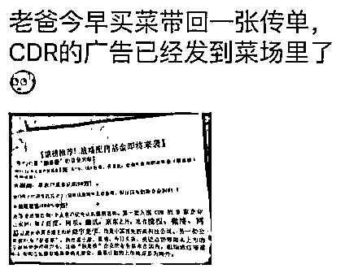
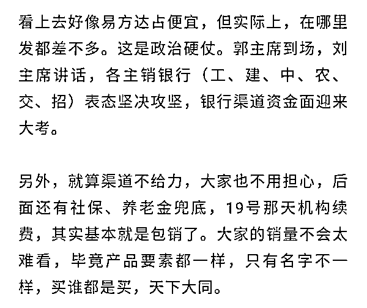
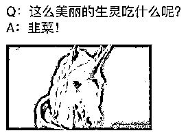
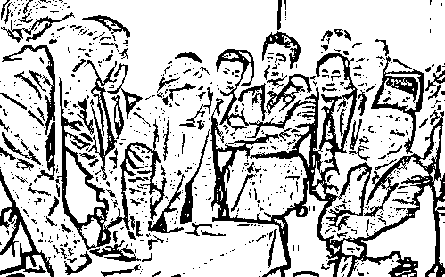

# 周末刷屏的 CDR 基金到底值不值得买？

这个周末，财经媒体上被 CDR 基金，也就是独角兽基金给霸屏了，所有的券商和银行全体出动在疯狂的卖 CDR 基金，大家可以通过下面二个图来感受一下这个热度。

银行铺天盖地的短信轰炸之后，纸质版的宣传材料也发到了菜市场了

那么这么热度的 CDR 基金到底是个什么东西，值不值得购买，我给大家讲一讲。

存托凭证（CDR）的的学术解释是很难懂的，我给大家简化一下，就是发行一个基金，这个基金专门购买一部分在国外上市的国内独角兽公司的股票可转让凭证，如在美国上市的阿里巴巴，甲在美国购买了 1 亿股的阿里巴巴股票，然后出一个凭证，你购买了这个凭证之后，拿着这个凭证就可以拥有 1 亿股阿里巴巴的股票，等于是给那些国外上市的独角兽一个变相回归 A 股的渠道。

为了确保 CDR 回归战略的顺利实施，成立的 CDR 基金，学名叫战略配售封闭基金，民间称之为独角兽基金，这个基金什么也不买，专买从美股和港股回归的独角兽，以及在 A 股直接登录的独角兽如富士康的战略配售部分。

金融系统全力动员，倾力销售 CDR 基金，大量的销售人员，全力营销客户去买，号称单人限额 50 万元，超过就买不到了，这款基金得到了官方的全力推动，6 月 6 日获批，6 月 7 日发公告。从 6 月 11 日到 6 月 15 日面对散户认购，19 号面对机构。如果散户买不完，后面的社保和养老金进行包销处理。

既然是官方全力推动的基金，那么那么这款基金值不值的去买呢？现在好多分析文章，都是冲着 3 年锁定期说事的，认为这款基金买入后即锁定三年，风险太大了，至少 3 年 50%的盈利，才值得去冒锁定 3 年的风险。但是我并不这样认为，如果真的是好东西的话，锁定 3 年算什么，锁定 10 年都不怕，好资产就是要长期持有的，坏资产才是去投机炒作的。

那么 CDR 基金是不是好资产呢，说实话，我并不清楚。发行的这六只公募基金，是可以作为战略投资者进行 CDR 的买入，但是这个 CDR 是怎么定价的，在美股目前的价格上打折嘛？打几折？三年锁定期没满之前，要卖出市场会给予多少折价让我离场？CDR 发行的节奏是怎样的？这款基金是固定收益，还是盈亏自负？交易细则是什么？这款基金会怎么进行操作。

一概没说，我连这款基金是怎么运作的都不清楚，会以几折的价格购买 CDR 也不清楚，只知道钱会被锁定三年，那么我如何去评判这里面的风险和收益进行对比呢，是不可能衡量的出来的，所以我不知道这款基金是好还是坏。

不过，我虽然不知道这款基金是好还是坏，但是我可以通过另外一个途径来判断这款基金值不值得买，那就是倒推法。

众所周知，我国的养老基金是有很多富裕的，急需一个安全的地方获得投资收益，国企和银行的富裕资金也是一大把，成本只要 3%。如果 CDR 基金真的是一款低风险高收益的基金，那么一定是这些资金优先购买，基本不可能轮到散户去买。新股上市之前，大家看到什么人会把原始股卖给散户啦？那些号称卖原始股的，哪一个不是忽悠人的最终根本上不了市的。

所以，就冲周末的时候，各大银行券商火力全开，动用一切宣传能量去销售这款基金，让散户优先购买，我就觉得这款基金有点问题，散户先买，机构后买，养老金最后买，这个顺序好像反了吧。

所以我觉得，CDR 基金亏可能不会亏，但是很可能就是个普通收益的产品，三年锁定期满，收益并不会让人惊叹，风险和收益的比值绝对不是那么划算，至于为什么全力宣传让散户去买，很简单。

韭菜这种植物，不割，就会膨胀成焦虑的中产阶级。

~~~~~~~~~~~

今天的 G7 峰会，美国和其他六国谈崩了，特朗普一口气得罪 6 个国家，对 G7 公报直接表态拒绝签字，并威胁开征汽车进口关税，我们来看一看德国的默克尔和特朗普的对视图。

简直是神之蔑视的既视感，特朗普一个人横扫六国，这里面可全是盟友，而实际上，会场上吵的一团糟，简直就像是小公司在开会吵架一样的感觉。

这个新闻，不评论。

* * *

违规次数再次+1，所以我打算把后续略微有点敏感的东西，全部移到小号去谈，我今天就发了一个《黄圣依家里到底有多少钱？》，大家可以**扫描下方二维码**进入后花园查看，也可以点击今天的次条文章，直接跳转到小号去看。

先用个短文章试验一下效果，后面再慢慢的在小号发长文章。

* * *

本周末，股市全面普跌，我认为和周末突然出现的铺天盖地的 CDR 基金有直接关系，为什么这么说，因为这次 CDR 独角兽基金的销售金额是 3000 亿。

3000 亿的抽血金额是个什么概念，2017 年 IPO 融资为 2301 亿，再融资规模 12705 亿元。而下周一开始，就要销售 3000 亿的基金，其中优先向散户出售，你说市场压力大不大，这个太坑了，比 N 个 IPO 都吓人。

而实际上，下周的时候，还有其他利空，

> *11 日宁德时代上市*
> 
> *12-14 日美国加息公布结果，大概率加息*
> 
> *14 日世界杯开幕&欧洲投票退出 QE*
> 
> *15 日招商策略会&美国公布是否对中国 500 亿美元加征关税*
> 
> *16-18 日端午节，资金有提前避险需求*

这个列表周末的时候也比较火，看起来满地利空，但是反过来你想一下，这些利空除了富士康的上市时间和宁德时代的上市时间是几天前突然公布的，美国加息，世界杯、招商策略会，500 亿关税等全部都是提前就知道的可以预料的。

资本市场里有这么一条定律，公众都提前预料到的利空那不算利空，相反，真到了那一天算利空出尽，因为资本市场反应的是未来。所以只有上周突然公布富士康和宁德时代上市算利空，直接打断了上周的反弹，对于这个我也已经明确说了对策，那就是硬抗，因为这属于本轮回调的底部区域了，正常回调的极限，但是又没有超级异常暴跌要让我们动用满仓的地步，所以唯一对策就是无视波动。

而周五富士康上市，下周一宁德时代上市，2 只独角兽赶到一起上市抽血，这让我很是意外，他们当年过会的时候都是间隔好远啊，怎么突然要放一起上市了，对市场会构成多大资金压力难道他不知道？

我的判断就是，有可能是想把所有坏消息，放到一起宣布，一口气释放完，后面他可能会有其他动作，而且应该是向上的动作，不希望被这些连绵不断的利空给打断，索性一口气释放出去，周五富士康，周末 3000 亿 CDR 基金销售抽血，周一宁德时代上市。

还有比这更密集的利空吗？我估计是没有了，但是如果这样都没砸死大盘的话，我觉得这是很有问题的，按理说这么密集的利空大盘会直接崩掉的，但是并没有。

而我刚刚加仓完毕，目前不打算卖出持仓，我的策略很明确，保持基础仓位，涨一点卖一点仓位，跌一点买一点仓位，无视小曲折，耗时间不耗钱，每一波都赚一点。证监会在过去 2 年里，利用干涉战术把趋势交易者打的哭爹喊娘，如今只有祭出专门对付横盘交易的网格交易模型了。

