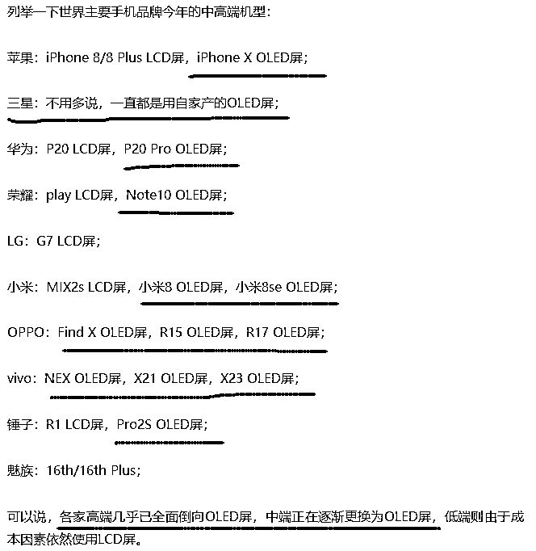
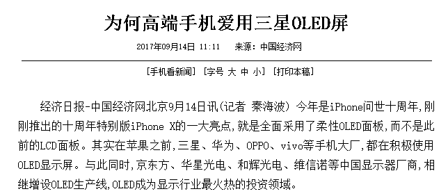
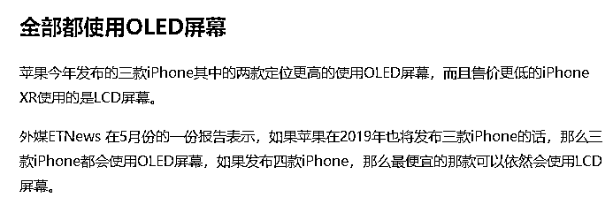
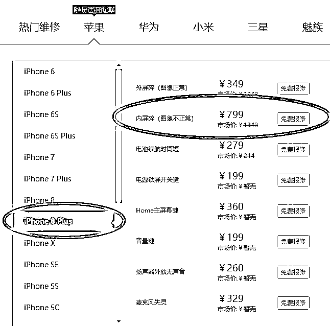
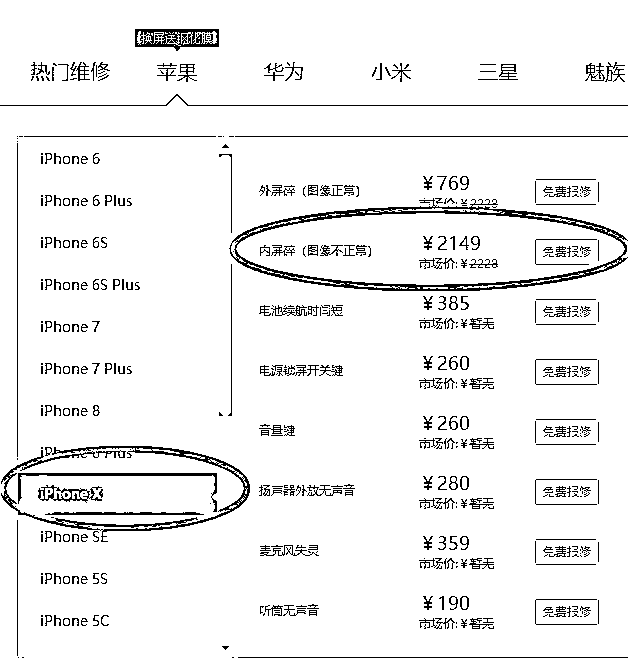
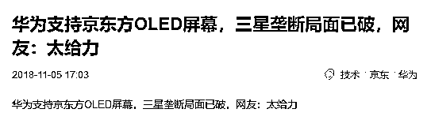

# 我去修一部苹果手机，却被迫换了一块三星屏幕

喜欢我的都关注我了~

前几天，老婆的一部苹果手机摔坏了屏幕，完全花屏那种，要送去修，到商场打听了一下，送到官方维修点，2500 元左右，而且要跑到 10 公里之外。。。

这么贵还这么远，肯定不去啊，附近修手机的这么多，换个屏幕而已，冒点险换个水货屏吧，反正用几年就换了。好心人推荐了我到附近一个小维修点，说服务质量还可以。

然后，我在一个电信营业厅里，在一块挂着小米广告牌的下面，发现了一个小小的维修点，师傅穿着一个马甲，上面绣了四个字“苹果专修”。

看起来好像不是很正规，算了，赶时间要紧，而且说不定能便宜好多，谁都知道苹果零配件很黑。结果这个师傅一张口，报价 2200，要不是因为官方维修点真的很远，我直接就扭头走了，我都出 2200 了还差这 300 嘛，官方质量更有保障啊。

考虑再三，还是在这里修了算了，官方维修点真的很远，于是试图砍一下价，因为我觉得水分很大，我还价到 2000 块钱，我觉得这个只是象征性还价，没时间和师傅墨迹。

结果师傅坚决不同意这个价格，说他这块三星屏进价就是 2000，按这个价格他就一分钱赚不到了，最低 2100 块，便宜点的三星屏也有，1800，但是质量不稳定。我当时以为自己听错了，你说啥，三星屏？我修的是苹果手机，你要给我换苹果屏啊，我花这么多钱你还给我上水货？三星不如苹果谁都知道啊，你给我换一块三星屏，你当我傻啊。

结果师傅笑了，然后认认真真的给我科普了一番，师傅告诉我，现在市面上的高端屏幕全部是 OLED 屏，而且几乎都是三星屏幕，连苹果的都是，三星屏幕占据全球绝对垄断地位。然后师傅赌咒发誓他这块屏的成本如果低于 2000，出门被雷劈。

话到说到这份上了，还有啥好说的，2100 块钱成交，5 分钟维修好了走人。回家之后，我查了一下三星屏幕的市场份额。

1**全球垄断的三星屏**

不查不知道，一查吓一跳，全球的高端手机，确实几乎都使用的 OLED 屏，中段手机也在开始大面积普及，OLED 有全面淘汰 LCD 屏的趋势。而全球唯一可以实现量产的，只有三星，其 OLED 屏市场占有率，超过 95%，这是针对全球的数据，属于绝对垄断，在地球上你就找不到第二家能供货的。

我搜了一下热门机型使用的屏幕，全面沦陷于 OLED 屏，连苹果都扛不住了最终被迫使用 OLED，要知道全球唯有三星能供货的时候，苹果用了三星的屏幕，就等于把命门给掐在三星手里。

苹果并不是最先用三星 OLED 屏的，实际上它应该是最后用的，华为、OPPO、VIVO 等手机大厂早就在旗舰机型上采用了 OLED 屏。

智能手机采用 OLED 屏的市场占有率，从 2015 年第二季度的 34.1%,增长到 2017 年第二季度的 44.4%，今年三季度的数据已经快逼近 60%，要知道这是所有的智能手机数据，里面包括了很多低端品种。

苹果对旗下的供应链，从来都是要求双供应源，以防一家独大，并且可以具备优势谈判地位，而 OLED 全球三星垄断，不符合苹果的标准，所以哪怕三星屏再好，苹果也一直硬挺着不用。但是到了 2018 年，苹果挺不住了，破天荒的使用了单供应源，苹果 X、XS 系列全部使用 OLED 三星屏，只有 XR 系列还使用成本较低的 LCD 屏。

三星凭借全球垄断地位，自然获得了极高的溢价和利润，这个利润大到什么程度呢，我们看一看苹果 8 和苹果 X 的屏幕维修价格就知道了，直接翻一倍。苹果 8PLUS 内屏破碎，维修价 799。

而苹果 X 内屏破碎，维修价直接剧增到 2149，前后只隔了几个月的产品，屏幕价格差这么大。

所以，我觉得果 X 和果 8 的差距不仅体现在性价比上，还体现在维修价上，这果 X 真的是摔不起啊，摔一下等于新换个手机了。

2**三星为什么愿意卖屏幕**

既然三星屏幕这么好，那为什么三星还愿意卖屏幕给苹果和华为呢，直接自己用不就行了，让三星手机独霸天下不是更爽吗？

这里面就涉及到技术经济学了，首先，三星手机不行就是不行，不可能依靠一块屏幕打赢市场，屏幕牛 X 能给它带来一定的优势，但是这并不是绝对性的优势。其次，三星向全球提供 OLED 屏，能有效保持自己的竞争优势，遏制相关屏幕竞争对手的成长。

在三星投身于 OLED 屏开发的初期，日本的技术优势是远超三星的，但是因为种种技术难题，很难进行量产，一旦工业化生产，其不良率和寿命都达不到要求。随后日本企业终止了 OLED 屏的研发，而对大手笔投入 OLED 屏的三星，一度被日本嘲讽，称：“三星量产 OLED 屏相当于倒立着爬富士山”。

当时全球也没什么人看好 OLED 屏，性能的确好，但是量产太难，成本下不去，质量上不来，大家都热衷于研发 LCD 屏，相对而言，质量更容易控制，可以达到工业化量产的要求。

结果三星默默的耕耘了好多年之后，取得了技术的重大突破，最终实现了 OLED 屏的量产，直接垄断了全球市场。

在三星成功之后，其他厂商就认识到，原来 OLED 屏真的是可以量产的，技术上是可行的，于是所有的厂商都开始进入该领域投资研发，试图分一杯羹，打破三星的垄断。

所以，这个时候如果三星拒绝向各大手机厂商提供屏幕，那唯一下场就是逼他们采用其他厂家的 OLED 屏，如果三星愿意提供屏幕，那么凭借先发优势，三星屏可以让其他厂家亏到吐血。

如果你想进入 OLED 领域，你势必要先进行大量的研发投资，烧掉天量的研发费后，你终于成功的获得了量产的技术。但是这个时候你发现，手机厂商都和三星达成了紧密的合作关系，你拿不到屏幕的订单，没有大量的订单，你就是有量产的技术，你也没办法实现量产啊。

当三星发现你成功的突破技术门槛后，就立刻对老技术 OLED 屏进行降价处理，直接打到成本线附近，然后立刻推出新款的 OLED 屏。总之就一句话，让挑战者一直亏钱，亏到破产，亏到无人敢进来伸爪子为止。

中国的芯片领域，以前就是这么被搞死的，如果当时美国不允许卖给中国任何厂商芯片，让手机厂商被迫购买本土的芯片，中国的芯片业早就发展起来了。

3**三星的垄断被中国打破**

2016 年，三星 OLED 屏出货 3.7 亿片，占据全球总出货量 99%。2017 年，全球 OLED 出货 5.7 亿片，三星出货 5.5 亿片。这就导致一贯采用双供应厂商的苹果，在果 X 的 OLED 屏上，不得不独家依赖三星。

骄傲且注重供应链安全的苹果，怎么可能会容忍这种事情，所以苹果大力注资 LG，试图扶持 LG 实现 OLED 屏的量产，苹果告诉 LG，只要你能突破量产的技术门槛，你就不愁订单，我给你。

但是没去，三星屏依然是唯一符合苹果严格质量标准的产品，LG 的 OLED 屏据说达到了苹果 70%的要求，但是依旧没有达标。

苹果在努力扶持自己的 OLED 供应商，中国的厂商也没闲着，华为等大厂，也在扶持自己的后备供应源，毕竟谁都知道，如果全部依赖三星供应，就算能确保供应安全，价格方面也一定是被剥削的。

近日，华为宣布其 mate20pro 将采用京东方和 LG 生产的 OLED 屏幕，其中京东方是主供应商，华为已经向京东方采购了上百万块 OLED 屏幕，京东方对媒体宣布自己已经突破了量产技术。

京东方集团是中国，并且是世界上最大的液晶面板供应商，其 LCD 屏幕市场份额全球第一。并且京东方在很早就开始布局 OLED 屏幕，2016 年京东方集团投资 460 亿人民币，建立了中国第一条六代 OLED 屏幕面板的生产线。

经过了二年的不断测试和优化，京东方 OLED 面板的不良率终于取得重大突破，达到了量产的标准，正式开始投向市场，而华为愿意冒险第一批采用京东方生产的屏幕，既是为了保护自身供应链的安全，也是出于扶持国货的心理。

京东方，出了名的烧钱大户，亏损大户，这么多年，硬生生靠砸钱，不惜代价的冲技术，终于有了拿得出手的产品。

苹果能否靠 LG 打破三星垄断我们先不管，中国能不能打破三星屏的垄断，就看京东方了，希望产品争气，质量过硬，中国人一定会优先使用京东方的 OLED 屏的。毕竟，就三星那个垄断价格，最差的屏幕也要上千块，真的是摔不起啊。

为了我不至于提心吊胆的玩手机，京东方你要加油啊。

觉得此文的分析有道理，对你有所帮助，请随手转发。

长按下方图片，识别二维码，即可关注我

近期精彩文章回顾（回复“目录”关键词可查看更多）

华为员工都这么穷，怪不得拼多多能火 | 房价跌 20%就会全面崩盘，地产杠杆远比你想的要脆弱 |  为什么碧桂园的质量那么差 | 清醒点，放弃全面开征房产税的幻想 | 央行和财政部隔空掐架，我支持央妈 |中国土地制度源自香港，但是香港却是劏房密布 | 为什么中介哄抢租赁房源，因为贩毒都没它来钱快