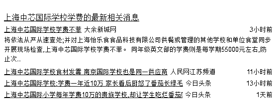
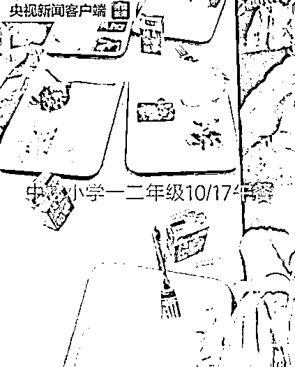
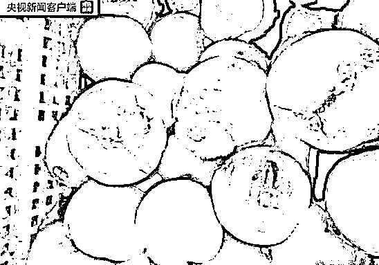
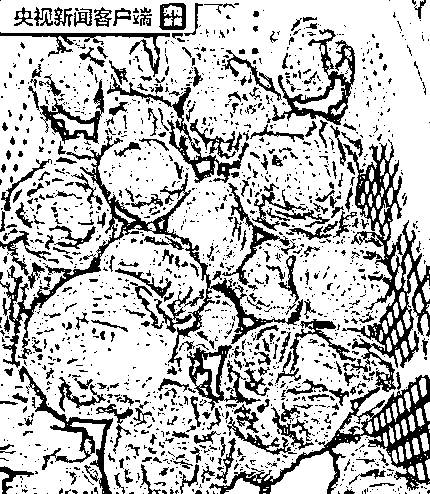
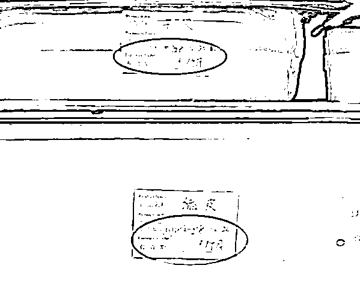
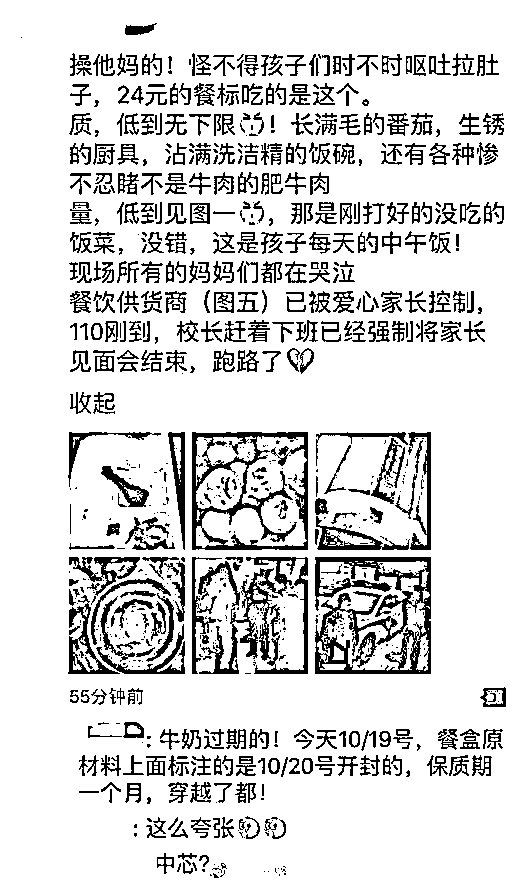
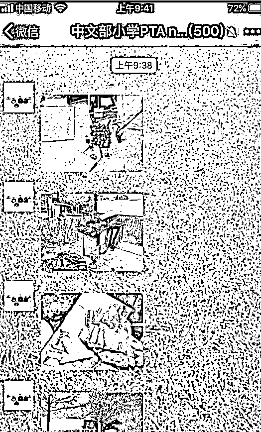
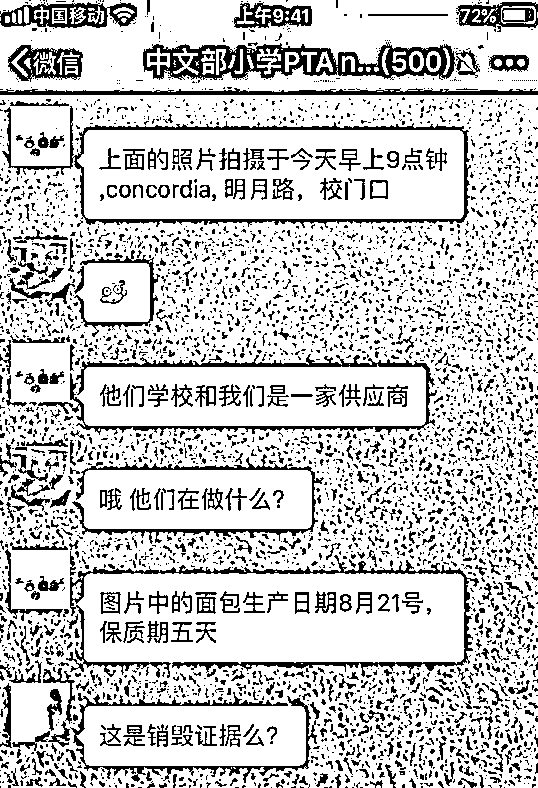
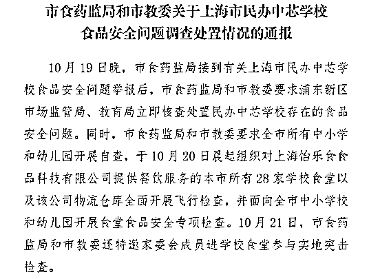

# 为什么说哪怕年入百万，你的孩子一样要吃霉变食品 | 紫竹张先生

喜欢我的都关注我了~

中国的食品安全问题一直不是一个省心的事情，很多人都有这样的误区，自己之所以吃不到放心食品是因为自己钱太少，只要自己步入了富豪阶层，愿意花钱，那么这肯定不是什么问题。

但是惨痛的事实告诉我们，即便你年入百万，即便你把孩子送到一年学费 10 万+的贵族学校，他也逃不过问题食品的魔爪，这里面的原因究竟出在什么地方。

国际贵族学校霉变食品事件

这次的霉变食品事件，源自于上海的一家国际贵族学校，上海中芯国际小学，这是一个标准的贵族学校，我查了一下，学费大概每年消耗 10 万大洋，不是年入百万的家长根本负担不起这么贵的学费，扣掉房贷后还能拿出 10 万当学费的家长真的很牛 X 了。

这次的霉变食品事件，其实是一个乌龙，家长们最初找上门的原因，是因为这家贵族学校收费达 24 元的所谓营养午餐，只提供二个速冻包子，可怜的一点菜和一盒牛奶。

随便去什么学校吃饭，24 块钱都可以吃到很豪华的午餐了，哪怕去肯德基吃都可以，现在这所谓的贵族学校就提供了这种伙食待遇？

家长们愤怒了，找到校长要说理，要求更换午餐的供应商，校长很傲慢的回答：“你没做过领导吧？我都说过了会监督，你还要怎么样”。

于是家长们炸了，要求检查后厨，但是很奇葩的是，校长和供应商进行商量之后同意了这个要求，居然同意了！我这里严重怀疑这些所谓的领导以前从来没进过厨房，否则他们打死都不会同意的，因为家长们很快就在后厨里发现了这些东西。

发霉到这种程度，还打算做菜给孩子们吃的霉变番茄。

处处是霉点，依然是打算拿来做菜的洋葱。

还有显示生产日期为 10 月 20 日的各种食材，要知道家长们是在 10 月 19 日突击检查后厨的，10 月 20 日生产的食材是什么鬼。

家长们气疯了，气愤的程度可以参见这个朋友圈截图。

我们经常告诫自家的孩子，学校食堂的东西最健康，少吃外面饭店的东西，没想到我们遇到的是这种学校食堂。更过分的是，这家国际学校采用的是国际大牌食品供应商，英国团餐巨头康帕斯旗下子公司怡乐食！

在国际上，康帕斯集团的食物就代表着放心、可靠、贵族、特供等一系列含义，没想到来了中国之后，落地就变质了，收着特供食品的钱，却卖着连街头小吃都不如的霉变食品。

更可怕的是，由于康帕斯集团太有名了，上海、甚至北京很多著名贵族学校都是康帕斯集团供应的食品，根据目前的新闻媒体爆料，仅上海，至少有中芯国际，耀中、包校、美国协和、德威等学校采用康帕斯为食物供应商，丑闻爆发后，这些学校的食堂负责人开始紧急处理后厨。

还有 8 月 21 号的面包一直留到 10 月份没吃的。。。

这些家长们以为自己摸到了上流社会的门槛，年入百万，愿意花钱给孩子上中国最顶级的学校，就能让自己的后代享受到高质量分服务，没想到，中国社会用另外一种方式，来实现人人平等，如果不是这次偶然和意外，恐怕这些孩子会在呕吐和腹泻中度过自己的学校生涯，或者直到他们的肠胃开始彻底适应这些霉变食物才算结束。

这件事情，上海有关部门已经开始介入调查，并严肃处理相关责任人，我们等着看结果就可以了，今天我们讨论的主要是，为什么这类事件层出不穷。

如何彻底根除这类问题

中国的食品问题很多，学校问题也很多，甚至某种颜色到现在都是个敏感词，带有这个词汇文章都无法过审。很久以来，类似的问题都是头疼医头，脚疼医脚，发现一起“严肃查处”一起，然后屡禁不绝。

首先，康帕斯旗下的怡乐食之所以敢这么干，完全是因为违法成本太低，罚款的损失和违法所得相比微不足道，也不存在被赶出中国食品流通领域的危机，过几年风头过了，又是一条好汉。

正是因为被抓现行概率太低，抓到之后的处罚也不严，所以这些公司如此肆无忌惮，解决办法很简单，大幅度提升处罚力度，直接罚到倾家荡产。

那么，这是第一条解决思路，也是最简单粗暴的一个思路，这是参考美国的惩罚性赔偿制度来制定的，比如这一次，如果给每个家长赔偿 100 万人民币，按 1000 个人算也要赔偿十亿人民币，一下子就给弄破产了，以儆效尤看下次谁还敢。

但是实际上，这个思路在中国行不通，因为中国目前还没有惩罚性赔偿制度，都是按损失进行赔偿，车祸撞成残废也才赔偿几十万医药费而已，吃个霉变食品算什么，又没吃死人，最多赔偿你几百块钱去打个点滴喽。

那么既然惩罚性赔偿无法推行，还有没有什么其他办法可以解决呢，其实也有。这个办法，首先我们需要分析一下这些学校屡屡出问题的根源。

在我看来，当法律法规存在盲点惩处不到位的时候，市场经济其实是能解决一切的，如果中芯国际或者某园出事之后，以后都门可罗雀无人报名，最终不得不破产关门，那么即便是法律没有任何惩处，他们也会狠抓质量，不敢造次。

那为什么现在的私立学校爆出巨大丑闻之后依然生意兴隆呢，学生络绎不绝，其根本原因就在于中国的学校严重不足，供不应求，很多家长为了找学校上都要到处求爷爷告奶奶，哪里还有挑剔的余地。

看到这里你可能有点疑惑，不是说中国新生儿数量一路下跌吗，十年前那么多新生儿，学校都够用，现在新生儿变那么少了，怎么学校反而不够了？

之所以会产生这种现象，是因为在入学人数急剧减少的这些年，很多地方学校也在大幅度的裁撤、合并，教育局的思路很简单，既然没什么人上学了，这片区域还留这么多学校干嘛，关掉几个有问题吗？

关掉多余的学校当然没问题，这些教育总投入成本最低，由于公立学校的数量是可以人工调控的，所以这么多年来，无论入学人数是增是减，教育资源的供应都是维持在总体供需平衡上，而优质教育资源的供应，永远是供不应求。

在公立学校不断被裁撤的同时，私立学校的进入却设置了大量的行政门槛，需要的审批流程非常繁琐，成立一个工厂很难，但是成立一个私立学校却难上加难。高门槛导致资本很难进入，能开学校光有钱是不行的，还得打通那密密麻麻的关系，所以都知道开学校赚钱，但是学校的数量和规模却始终上不去。

在市场经济里，不会存在赚钱洼地，任何一片蓝海出现，瞬间就会被狂涌而入的资本给杀成红海，私立学校教育领域这么多年都没变成红海，很明显，有某种力量阻碍了资本的涌入。

如果到处都是幼儿园，某园爆出丑闻后，还用得着政府出面惩罚吗？我上哪个学校不是上，还犯得着去你家的幼儿园啊。如果到处都是私立中小学，我上谁家不是上，你家拿霉变食品喂孩子，哪怕政府不罚你，你也等着关门破产吧。

但是实际情况是，这些学校压根不怕没人来，出个道歉声明表示自己痛改前非，以后一定严加管理，这事就算过了，既往不咎。家长们也没办法，学校基数太少，别说好学校了，差学校都不那么好上，你有什么办法呢，整体的学校供应就那么多，没得选。

富裕的学校，在教育局看来是一种浪费，但是这就是市场经济的特征，富裕的供应其实并不是浪费。例如中国家电领域的产能，早就足够中国人用了，但是依然有源源不断的资本新建工厂，整体的产能始终的富裕状态，每年都有小工厂破产，也有小工厂新成立，正是因为如此强大的市场竞争压力，才让中国人享受到了物美价廉大彩电，十年前卖一万的大彩电，现在 2000 都没人要。

如果不是因为彩电产能始终都富裕了一部分，市场经济哪里能发挥的出他优胜劣汰的能力，中国的教育产能别说富裕，始终是供不应求的，滥竽充数的学校在里面无法被淘汰，也是理所当然的。

大幅简化学校的审批手续，取消行政门槛的寻租，让一部分学校因为生源不足自行破产，这样我们才能享受到真正优质的教育。

号称不盈利的教育产业，其实干着最盈利的事情，号称为了盈利而开的家电工厂，却成了公仆产业，这里面的诡异和奇葩之处，就是市场经济的奥妙了。。。

大力推动教育产业化，不是说要减弱公立学校的教育投入，而是在保持公立教育投入的基础上，大力引进私有资本，大幅度扩大教育产能供应才是产业化的核心，它的核心精髓是通过教育产业化得到充沛的产能供应，然后通过市场竞争来优胜劣汰。不断的减少公立教育投入，那不叫教育产业化，应该叫教育甩锅化。

所以，在如今的中华大地上，不管你年入 10 万还是年入 100 万，你的孩子都很难找到一个放心靠谱的学校。

觉得此文的分析有道理，对你有所帮助，请随手转发。

长按下方图片，识别二维码，即可关注我

近期精彩文章回顾（回复“目录”关键词可查看更多）

华为员工都这么穷，怪不得拼多多能火 | 房价跌 20%就会全面崩盘，地产杠杆远比你想的要脆弱 |  为什么碧桂园的质量那么差 | 清醒点，放弃全面开征房产税的幻想 | 央行和财政部隔空掐架，我支持央妈 |中国土地制度源自香港，但是香港却是劏房密布 | 为什么中介哄抢租赁房源，因为贩毒都没它来钱快 

复活号+紫竹林功能的公众号

**长按扫描下方二维码即可关注**

