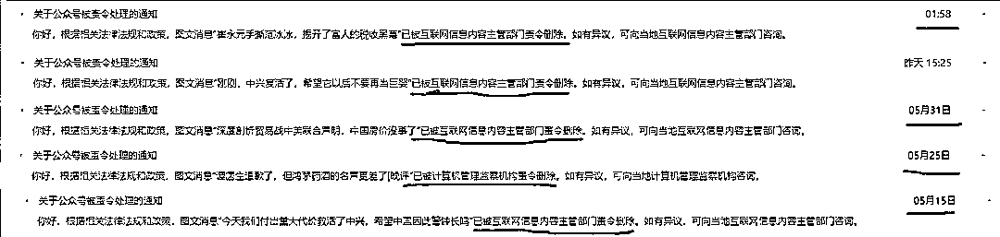
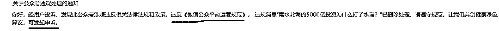
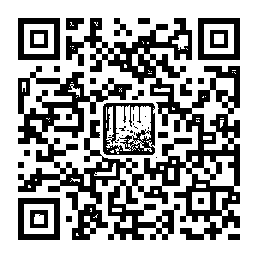

# 删帖保平安，休息二天

<link rel="stylesheet" href="view/css/APlayer.min.css">

今天早上起来，看到《崔永元手撕范冰冰，揭开了富人的税收黑幕》这篇文章又被删除了，我很诧异，因为这篇是呼吁国家对偷税漏税明星进行税务稽查的啊，这也有错？而且这篇是今天凌晨 2 点，被互联网主管部门点名删除，而不是腾讯进行的删除，这就表达了上面的意志了。

这种违规删帖的次数，是会被系统累计的，达到一定的次数，就会被封号处理，他会随着时间的推移慢慢的减轻，但是短时间内如果累计过多，就会出事，先封 7 天，再封 30 天，然后就是永久封号。

那么我最近被删了多少篇呢，20 天吧，5 篇被删除，而且没有一个是因为真正违规被腾讯删除的，删除原因上清楚的表明了删除的源头全是上面的主管部门，清一色责令删除，基本上都属于和中央舆论导向相违背所以才被删掉的。

如果是腾讯删除的，他应该长这个样子，是违反《微信公众平台运营规范》才被删的，而且后面还有一个申诉按钮，理论上你还能申诉恢复，当然一般情况下你申诉是肯定失败的，不过如果是互联网主管部门责令删除，你连申诉按钮都不会有的。除非是上头已经明确的舆论导向被公然违反，否则腾讯一般不会轻易删除帖子，只有那些明确触及雷区的，才会动手，我前几年不清楚政治深浅，贸然去写南水北调 5000 亿的事情，被删是正常的。。。

其实，这个月我还自行删除了几篇，就是那几篇比较出名的关于大型企业的，如不然的话，相信不止 5 篇。

昨天凌晨 2 点，互联网主管部门点名删除崔永元手撕范冰冰一文，但是这篇文章大家也都看过，肯定是不存在反党反社会的，甚至连负能量都没有，满满的正能量，中兴那篇也是。这都被删除只能有一个原因，上头开始插手舆论导向了，那么在这个时候，所有关于娱乐税收黑幕的帖子，都有可能被删除，不信你们看呗，崔永元和娱乐圈的那点事，几天之内就会在自媒体中熄火，只允许官媒发布，不会有什么自媒体再谈了，不是他们不想谈，是发出去的文章里凡是影响力大的都被删了，至于什么原因就不是我能揣测的了，猜不到。娱乐圈里面的水太深，昨天晚上的次条文章《崔永元只曝光了偷税，但是娱乐圈还有洗钱》这篇文章你们看了吧，就是告诉你们，明星不需要洗钱，直接偷税都可以，但是有些大人物必须要用影视进行洗钱，多的不说了，怕继续删。

不过这篇文章你们也看不到了，我自己删了，连同黄圣依 7.5 亿的那个我也自己删了，因为不管从哪个角度，一月 5 篇被主管部门责令删除都有点多了，所以我删帖保平安，要是一个月被删个七篇八篇的，不封号我感觉都对不起互联网管理条例啊。

**我打算休息几天，降低发言频率，其实要想保平安，有以下几个办法：**

1、不说话，多说多错，少说少错，不说不错。

2、只谈社会优点，不谈社会缺点，具体模式参考新闻联播

3、只发鸡汤，不谈时政，只感慨情怀，不批评社会，鸡汤只要你不严重违背社会公德秩序，都是很安全的，时政就不一样了，满满的正能量都有可能被删除，甚至你根本不知道安全标准到底是什么。

很遗憾，三条安全的路都不是我喜欢的路，我自己的路前面满是雷区，一不小心就触雷，关键你连排雷的标准都没有，完全靠猜，现在连纯爱国正能量贴都删，你说写什么才是被主管部门所允许的呢，我也不清楚，只能试试看，当一个月内被责令删除太多的时候，就收敛几天，所以我打算休息 2 天，再闲聊半个月杂事，后面慢慢再谈敏感的时事。

这里面，其实我冒险保留了昨天晚上的那篇文章《高考有利于穷人，而不利于富人》，这篇文章按理说是没事的，正能量，但是正能量这个避雷针现在不好用了，一样可能被删，只有那种完全吹捧社会现状的才是安全的。我现在次数名额有点不够用了，保留他有点冒险，之所以愿意保留他没有自己动手删除，是因为以下事实。

1、北大在 2016 年公布农村生源比例为 15%，而同期农村人口占据全国人口的至少一半以上。

2、刘强东 92 年上人大的时候，班里就 2 个贫困生补助的名额，国家发放助学金，班里大部分人都去抢，因为班里 70%的人来自于农村。后来刘强东有钱之后，给人大捐了一千多万贫困助学金，希望帮一下农村穷困学子。结果一二年过去了很少有人申请，人大的校领导很为难的对刘强东表示，你不要再捐了，助学金实在很难发出去，现在人大里已经基本没有农村来的贫困生了，符合条件的太少。

所以我冒险保留此贴，也是给那些农村孩子留一条活路，向上晋升的大门哪怕能帮他们撑大一丝，我觉得都是划算的，至于这个贴还能活多久会被责令删除，我就不清楚了，看命吧。

那么，周末晚上见。

对了，贴一下我的复活后花园公众号二维码，平时什么也不发，唯一作用就是复活，要是哪天找不到我了，可以来这里。

