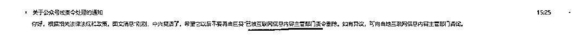
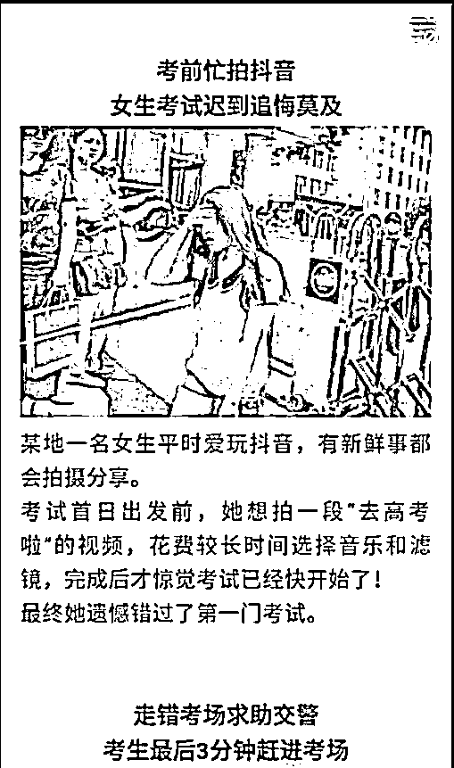
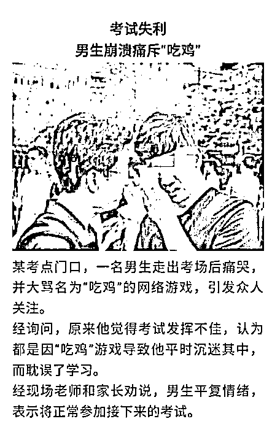
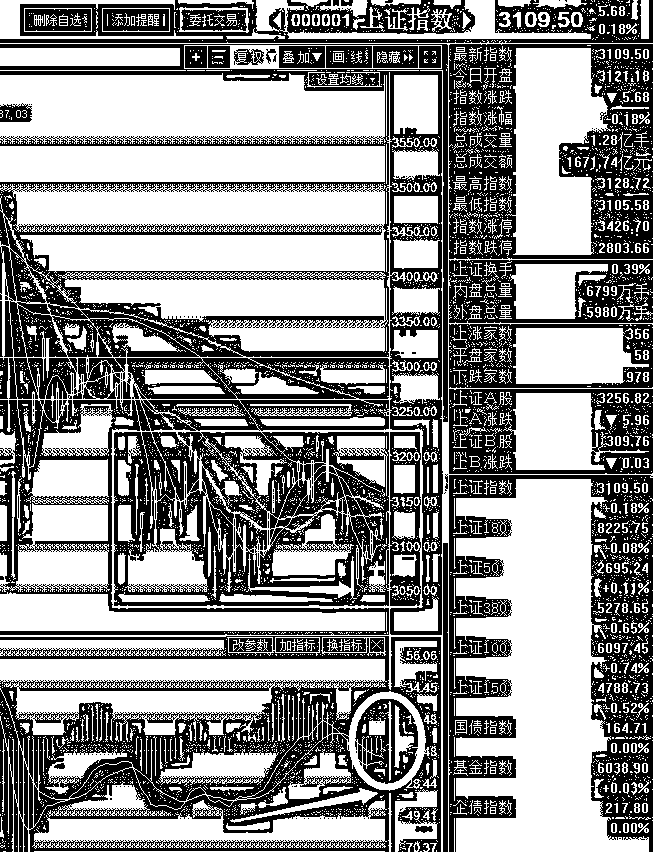

# 文章又被删除了，谈谈董明珠和银隆 | 夜报

首先，昨天关于中兴的大文章又被删掉了，是主管部门点名删除的，其实关于这个互联网的监管把，我也很困惑，我昨天的文章你们也看了，好像也没说什么吧，我已经很注意了，爱国爱党爱人民也照删不误，而且是点名删除。

好了这个不谈了，这玩意很伤感情的。谈谈珠海银隆吧，今天珠海银隆被确认 IPO 被终止辅导，注意是终止辅导，不是“暂时中止”，更不是“持续辅导”，可以说珠海银隆几年之内都没有 IPO 的可能性了。

珠海银隆一直梦想上市，2014 年，珠海银隆就试图借壳上市，2015 年，三友化工曾试图获得银隆 21%的股份，后来双方在增资条件上没有谈妥而搁浅，后来众业达、北巴传媒，格力电器均先后筹划收购银隆，因为各种原因，都没有成功。

最后，董大姐出马了，格力不出钱我出钱，带一帮大佬投了很多钱，得到一众大佬的资本加持后，银隆开始疯狂扩张。

2016 年 12 月，银隆成都新能源产业园项目开工，总投资 100 亿元。

2017 年 1 月，兰州银隆新能源产业园项目签约，前两期计划投资 25 亿元。

2017 年 2 月，银隆与天津市政府签署合作框架协议，建设新能源电池与汽车产业基地，一期投资 70 亿元。

2017 年 5 月，银隆新能源南京基地开工，拟投资 100 亿元。

2017 年 7 月，银隆与攀枝花签署协议，布局新能源、新材料基地，项目投资不低于 50 亿元。当月，银隆收购南京客车制造厂框架协议也完成签约。

2017 年 8 月，银隆宣布在珠海建设新能源产业园及全国总部，总投资 195 亿元。

按照银隆的规划，2017 年要实现三万辆新能源汽车的销售，销售收入 300 亿元。

说实在话，如果我不是今天从媒体上看到这些数字，我都不敢想象银隆有这么大胃口，他才几个钱啊，这一串串的数字加起来多少个亿了，蛇吞象也没这么个吞法吧。资金链玩这么紧绷不太好把。

正好，今年新能源减少补贴，一下子就玩断了，17 年银隆实际销售数据是 3355 辆电动客车，为预期是 10%，创始人和原董事长魏银仓引咎辞职。

格力的中小股东应该长出一口气，幸好没投珠海银隆，否则的话，这些利空消息爆出来，估计跌个 10%是起码的。

~~~~~~

腾讯和头条的战斗越演越烈，到高考的时候都不能平息，今天，有好事的网友截了这么二张图。

首先，是腾讯小编写的关于抖音的报道。

然后，是头条小编写的关于腾讯游戏的报道。

简直是撕逼撕出了新高度，这脑洞大开的，月末要发双份奖金。

~~~

其实我觉得我的推理分析能力是极强的，我曾经在第一篇的中兴文章里推论，为了救活中兴我国必然付出巨大代价，半个月后，官媒承认了。前几天晚上，我推论，崔永元暗指的扬子黄圣依，有 90%以上的可能性就是他，种种迹象都指向了扬子黄圣依，今天，崔永元直接点名了，这个人就是扬子黄圣依。

~~~

明天，是富士康上市交易的日子，下周一宁德时代上市，这些个巨无霸终于来了，各方面都很紧张，监管层已经多次放出暖风，采用了多个策略来提前护盘，所以应该是没大事的，我今天要给大家说的是，真正危险的时刻，不是明天，是他开板的那一天。

原理给大家讲一下，以富士康为例，如果他上市之后，每天涨停，没有换手，绝不开板，别人不买，里面的人也不卖，那么你就是涨上天也对股市没影响的，账面就算赚一万倍，那也只是个账面数字，自己和自己玩去呗。

但是一旦开板就不一样了，第一天开板肯定是巨量换手，药明康德开板第一天吸引了百亿资金前去接盘，富士康估计也不会差，这些资金的突然抽离，就会对其他股票造成抽血影响。毕竟前来买入的资金，是结结实实的二级市场的资金，而卖出的资金，是抽离股市，还是买入其他股票，就不好说了，所以巨无霸第一次开板，抽血效应是很大的。

扛过这一波，我估计市场就全部见底了，这个底我称之为独角兽底，因为对市场的干扰能力太大了。

而总的来说，大盘的图形是特别好看的，典型日 K 底背离+空头能量缩减，简直没有比这个更漂亮的筑底图形了，这个阶段任意卖出是不合理的，所以独角兽开板那一天，也不会对大盘造成重大利空影响，卖压回很弱，而且很有可能市场就在等着这个利空最后一击，所以我宁可等他再震荡震荡。