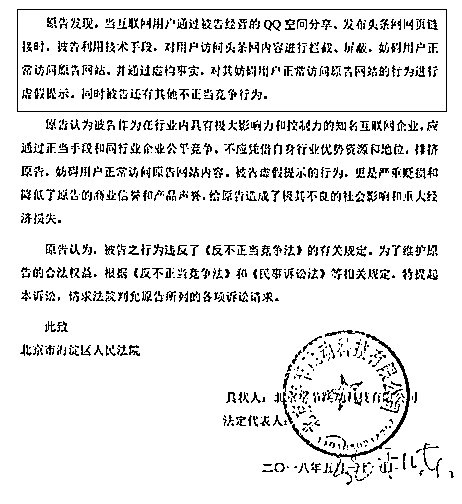
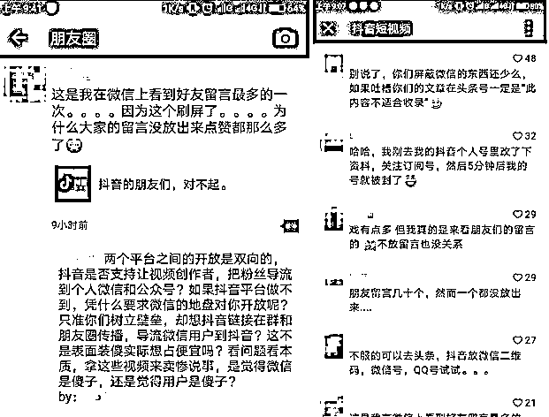
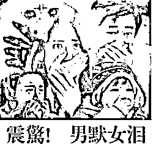
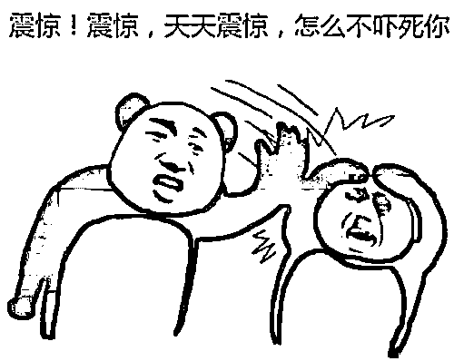
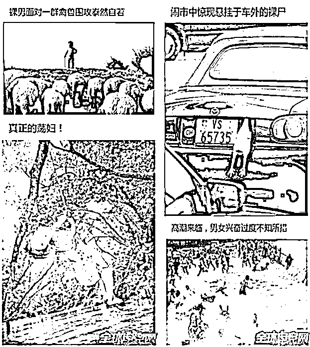
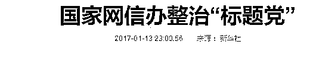
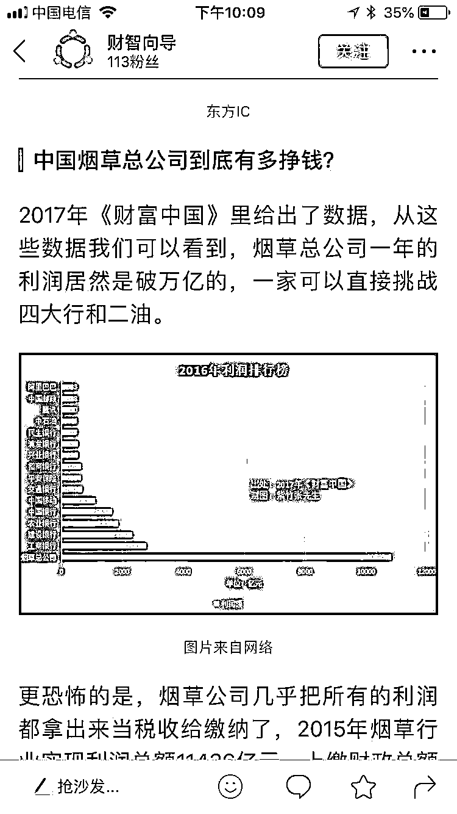
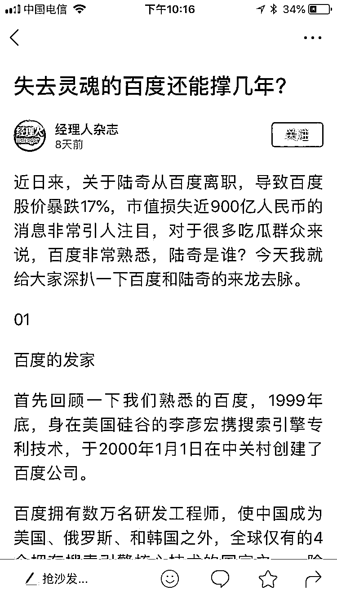

# 今日头条没资格起诉腾讯，它也永远生产不出好内容

紫竹张先生

每篇都有干货的财经公众号

近日，今日头条和腾讯互相起诉，有人将其比拟为当初的 3Q 大战，但是我想说的是，这不是 3Q 大战，今日头条没资格起诉腾讯，他也永远生产不出好内容，下面我和大家说一下为什么。

首先回顾一下事件起源，今日头条首先以以“不正当竞争”为由起诉腾讯，索赔 9000 万元，要求公开道歉，然后腾讯发起反击，反诉今日头条和抖音，要求赔偿 1 元，并公开道歉。今日头条起诉腾讯的理由是，当用户使用 QQ 空间分享发布今日头条链接的时候，腾讯进行了拦截。（科普：图中的公章是字节跳动公司，因为今日头条创始人张一鸣在今年 4 月 24 日将公司名称改为了字节跳动，把今日头条化为其中一个产品）

如果是其他的理由进行起诉，我们可能还不好说什么，如果是用封杀这个理由进行起诉，简直是笑掉大牙，众所周知，对外链接封杀最严重的产品，就是今日头条。你绝对不可能在今日头条上看到任何一个腾讯公众号的链接，注意我用的词是绝对不可能。为什么这么说呢，因为你别说放链接，你就是在文章中偷偷的插一个你公众号的二维码，都会立刻被今日头条封号，我自己的今日头条号就是这么被封掉的，我可以帮腾讯实名举报今日头条恶意拦截公众号链接和二维码。

我可以在这里放出话，哪怕你能在整个今日头条上找到哪怕一个公众号的文章链接，都算我输，相比之下，腾讯封杀外链接的行为是多么的软弱，满地都是外链接。对今日头条和抖音的封杀力度有怀疑的，可以去把自己注册的头条和抖音号，随便发一个东西出去，只要你带了公众号二维码链接，你就可以享受光速式的封号服务，不信的读者可以去亲身体验一下这个封号速度，快的吓死人，不管你用多么取巧，欺骗电脑审核的手段塞进去，都没用，头条养了那么多员工，正事没干，就去干人工审核封号的事情去了。前一段时间，抖音发的一篇文章，恰好下面是有朋友圈留言功能的，各路朋友自己在下面狂喷抖音和头条，留言没有被翻上墙，点赞都这么多，简直吓人。。。

所以，今日头条是没有任何资格起诉腾讯的，如果今日头条要求腾讯赔它 9000 万，那么腾讯完全可以要求今日头条赔它 90 亿。

**今日头条永远生产不出好内容**

大家都知道，上次 3Q 大战，360 和 QQ 打的难舍难分，没有明显的胜负之分，而这次今日头条和腾讯一开打，舆论几乎是一边倒的喷今日头条，大家知道为什么吗？那就是和今日头条的运营模式有关，这种运营模式非常损害用户的利益，而且他也永远生产不出好内容。

你说今日头条内容质量不高我可以理解，用永远二个字去描述有点绝对了吧，你凭什么说今日头条生产永远生产不出好内容呢，这和今日头条的运营模式有关，其算法推荐的模式不改，好内容永远和头条用户无缘。

目前的今日头条是一种算法推荐，平台流量分发的模式，头条无大 V，所有流量属于平台，能获得多少阅读量全靠平台自动分发。而其对手公众号采取的是纯大 V 品牌模式，平台只是平台，流量权是和大 V 平分的。

这种运营模式有什么区别呢，区别简直太大了，在今日头条上面，你的文章好坏并不重要，重要的是标题，因为用户不认你这个人，只认头条平台，那么只要是平台推荐的文章他都看，他根本无法区分标题下面隐藏的内容是好还是坏。

那么就带来一个什么后果呢，标题越劲爆越吸引眼球，带来的流量就越多，短期利益就越大，至于是否存在欺骗读者的问题，反正流量属于平台，关我啥事，至于所谓的算法，只会看到这篇文章点开阅读的人特别多，直接默认是好文章，更加卖力的推荐，而真正的好文章，就被那些标题党给埋没了下去。曾经的 UC 新闻，也是平台进行内容分发，质量完全不亚于今日头条，结果 UC 沦为了标题党大本营。

UC 有一个神秘的部门，叫“UC 震惊部”，这个部门风靡全中国，其震惊体，男默女泪体完全颠覆重铸了中国的汉字文化，成为文学界的一景。

你以为这就完了吗？UC 除了震惊部和沉默部，还有惊呆部、吓尿部、脸红部、不转不是大陆人部等等，一个毫不起眼的素材，毫无营养的内容，在 UC 的文笔加工下，分分钟就可以上头条，大家一起来感受一下。

而今日头条，和当初的 UC 新闻一样，也变成了标题党大本营，把一个劲爆的标题放在一个毫无营养的内容上面，就发了出去。为什么会这样呢，一旦进行平台内容分发，为了争夺点击率，内容制作者必然不择手段。

有自媒体人说过：好好说话就没人搭理你，你写的东西没人看，还说个屁咧?在今日头条这种平台信息海量刷新，每分钟都有大量信息更新的状态下，内容生产者宁愿全家被骂也要拼死标题党啊，只有标题党才能让一堆新闻中自己的那条点击率最高，而且标题党可以胡编乱造，内容制造成本极低，反正流量都是平台的，我只管自己的点击率高就可以了。

于是乎，劣币驱除良币，真正高质量的文章都被头条给淘汰掉了，他们的精工细造模式不适合头条。而对于没有高质量内容，全是小编级新闻的头条而言，别人不如看凤凰网，华尔街日报，联合早报，金融时报甚至中央电视台了，犯得着去看头条吗？

对于标题党的泛滥，严重损害用户利益，破坏互联网生态，劣币驱除良币的问题，国家曾专门下文进行整改。

但是整改成功了吗？没有，没有任何一家网站整改成功了，只是让我上图那种让人有极度被欺骗感觉的标题党稍加收敛而已。一直到 2017 年中下旬，公众号解决了这个问题。

**公众号的优势**

公众号是怎么解决这么问题的呢，是他调集了大量的人手和资源对标题党进行全力打击，删帖警告吗？没有，公众号其实什么也没做，这个问题就自动解决了。

怎么可能会自动解决呢，因为在 2017 年中下旬公众号的总流量达到了瓶颈，流量获取的费用和难度激增，各大自媒体公司的流量获取费用呈现爆发式增长的姿态。在公众号开始的前期，由于微信和公众号还没有完全普及，每时每刻都有新用户下载微信，每时每刻都有新用户初次使用公众号，所以那段时期，你发什么都加粉，发什么都有人看，对于很多常年看报纸，第一次接触公众号的中老年人来说，收到一个你发的胡编乱造的文章，已经感到很有趣了。

所以，在这个阶段，公众号和其他平台没有什么太大区别，UC 标题党横行，公众号的标题党也不少，各种粗制乱造的内容一样充斥朋友圈，还记得前一段时间的量子云吗？50 个小编负责 4000 多个公众号的内容制造，他们的粉丝会收到什么样的内容可想而知。这个阶段，大 V 和小 V 有区别，但是区别不大，在满屏的垃圾信息中，发现优质的内容创造者太难了，好内容泯然于众人矣。

但是等到流量红利消失的时候，大 V 和小 V 的区别就出来了，劣质内容的制造者到处哀叹公众号活不下去了，天天掉粉，别说增粉，连增减粉平衡都做不到了，而优质的内容生产者，其增粉速率依然和以前保持一致，因为好内容的读者，来了就不愿意走，内容的好坏带来的影响就体现出来了。

而对于一个真正的优质内容生产者而言，他的品牌是非常重要的，在经年累月的好内容发布之后，他的用户会形成一个印象，凡是公众号 XX 发布的内容，一定是好内容，这个时候，读者的黏性就会非常大，隔三差五的就要跑到他公众号下面去看看，一篇文章都不想漏掉。这个声誉的形成需要很长时间，但是如果这个公众号胆敢使用标题党或者劣质内容来欺骗读者，只需要三天，他的声誉就会彻底消失，所有人就会形成一个印象，他的内容也未必一定是好内容啊，算了，哪天有空再来看吧。

所以，优质内容的创造者，为了成为大 V，就必须对自己的内容负责，以此来形成自己的品牌和 IP，他们会严格审核自己文章的质量，确保每一篇都符合自己的形象，你比方说我，紫竹张先生出品，必属精品，这是我的口号，也是一直努力的方向，为了形成这个印象我可能要努力几年，但是毁掉这个印象只需要三天，你说我敢放垃圾内容出门吗？

所以，这些大 V 为了对自己的口碑负责，就必须严格审核自己的内容质量，而优质内容的持续输出，就大幅度的降低了读者的选择成本和难度。毕竟在茫茫多的标题海洋中，我根本不知道哪个文章好，哪个文章差，找到好内容需要花费的时间成本太高。如果这个时候我知道有个公众号，他一贯输出高质量文章，几乎没有差作品，那么我的选择难度就小多了，大幅度减少了我的选择时间，降低了我的选择成本。

顺便提一下，百度之所以惹人痛恨，最关键的一点，就是他的竞价排名模式，把所有的垃圾内容和垃圾商家都移到了搜索的前几页，而真正的优质内容和优质商家，因为不舍得交钱买排名，反而都掉到后面去了。这样就大幅度增大了用户的搜索难度，第一页基本是找不到合适的内容的，找到自己想要的资料，恐怕都跑到三四页之后了，这种损害用户利益来获得广告费的模式，才是百度口碑极差的重要原因。

而在这个世界上。90%的好内容，永远都是 1%的大 V 写出来的，这是自然规律，而对于劣币驱除良币的头条号，只会是越来越多的标题党和粗制滥造的营销号所占据。好内容创造者，从知乎微博雪球等一系列平台，全部被公众号给吸过来了，你以为是偶然现象？还是说腾讯给的钱多？都不是，就是因为这种强者越强的优胜劣汰模式，才导致好内容在公众号上产生了聚集效应，进而吸引了更多的好内容入驻，甚至形成一个公司来支撑一个公众号内容创作这种成本夸张到恐怖的内容生产模式。至于其他的平台，以后注定沦为二流标题党和抄袭者的聚集地，成为知识产权法的严打对象。恕我直言，对著作权保护的最好的，就是公众号，其他平台抄袭成风，连洗稿都懒得洗，就是直接全篇复制，这些平台从来不管的。

**给这场官司一点建议**

所以，今日头条顶多就是一个 UC 新闻+微博的结合体，和公众号是完全没办法比的，如果深究原创，强化著作权索赔，我敢保证头条分分钟就要破产。对于头条和腾讯的这场官司，我给腾讯一点建议。

首先，买几十个头条小号，发布一些公众号链接或者二维码，截图保留被封号的时间，这些都可以作为呈堂证供来证明头条恶意拦截他人链接。其次，成立知识产权保护小组，从头条历次推送的文章里，找抄袭公众号的部分，然后替作者进行法庭索赔，反复折腾头条。如果把头条抄袭公众号原创内容的渠道全部断掉，头条上就没有什么优质内容还能吸引读者了，因为他根本生产不出好内容。你比如说我写的文章，随便找几个关键字搜搜，在头条上就有人抄袭我的，直接就是一字不改，如果腾讯这次法庭起诉头条需要，可以拿头条抄袭我的原创部分做呈堂证供，另外因为我放了一次公众号二维码，头条直接把我账号给封了的事情，我也愿意实名举报。

这篇文章全文抄袭我前几天发的《你根本不知道烟草公司有多赚钱》，就是改了个标题和第一段就发出去了，大家可以在今日头条里搜索烟草二个字，就能搜到这篇文章，再比如说下面这个，抄袭者连标题都懒得改了。《失去灵魂的百度还能撑几年？》

我的其他优质文章，绝大部分都能直接在头条里找到抄袭者，大家不信可以自己搜搜看。你说，这种完全靠抄袭别人家原创才苟延残喘的公司，完全靠封禁别人流量，只乐意从别人家偷流量的公司，他有什么资格来起诉腾讯，一旦知识产权进行严打，第一个被算账的就是今日头条，他简直就是标题党和抄袭者的大本营。

今日头条的制度决定了它永远生产不出好内容，只能靠抄袭和偷流量来获取融资，在内容为王的年代，一旦某一天他的抄袭渠道被严打掉了，就只有死路一条。

往期回顾（回复“目录”关键词可查看更多）

001 《为什么中国必须购买美国国债？》 

002 《租房贷款会将房子拆分成房骨和房皮》

003 《中国自古以来就是一夫一妻制》

004 《宁波老虎事件遇难者不应该得到赔偿》

005 《中国的房价什么时候会崩盘？》

006 《中国地产达到什么样的条件会崩盘？》

007 《你根本不知道烟草公司有多赚钱》

008 《如何把自家孩子培养成一个顶尖人才》

009 《我是如何保证自己不近视的》

