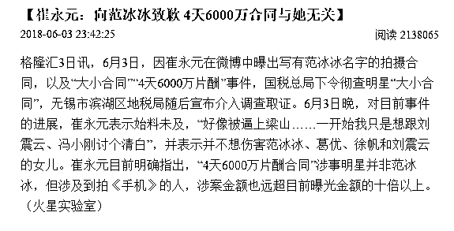
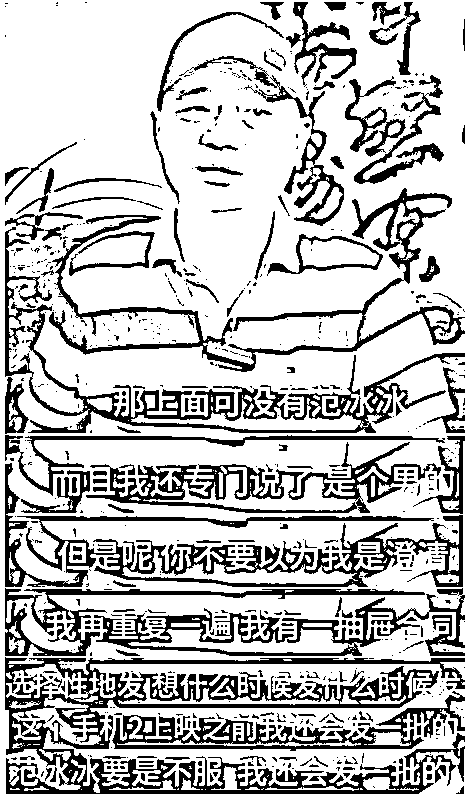
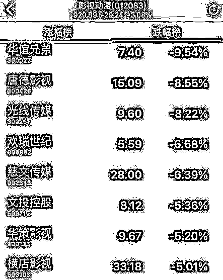
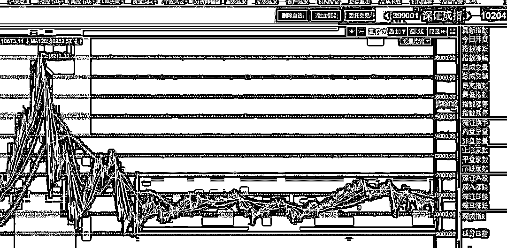

# 崔永元向范冰冰道歉？不存在的 | 夜报

昨天晚上，有媒体爆料说崔永元向范冰冰致歉，承认 6000 万阴阳合同不是范冰冰的，叫什么火星实验室发布的。

当时我就纳闷了，这么大的事情崔永元能搞错？他可是央视主持人出身，常年以说实话著称，于是我就去网上看了采访视频，没看出一丝一毫道歉的意思。

崔永元说，曝光的那份 5000 万的合同里，可没有范冰冰的名字，而且还专门说了是男的，这是不想和范冰冰关系闹的太僵，毕竟和崔永元有仇的主要是刘震云和冯小刚。但是后面很霸气的来了一句，但是你不要以为这是澄清，我有一抽屉合同，想发谁的发谁的，范冰冰要是不服，我还会发一批。

他的意思就是，谁参演手机 2 我就曝光谁，曝光的阴阳合同虽然不是范冰冰的，但是你要，我也有。只要范冰冰不服，我就发一批给你治疗一下，**崔永元向范冰冰道歉？不存在的**。

今天，整个影视传媒版块都崩了，华谊兄弟和预期的一样，接近跌停，关于他崩的原因我昨天已经分析过了，崔永元一个人的炮火其实是没那么猛烈的，最关键的原因，还是长期以来影视圈的灰暗规则本来就有问题，今天一旦摆到台面上去，麻烦就大了。。。

华谊兄弟之所以首当其冲，那是因为他和冯小刚以及手机 2 的干系太大了，2 年前，华谊兄弟出资 10.5 亿元，以 15 亿元估值收购冯小刚控股的空壳公司浙江东阳美拉传媒有限公司(简称“东阳美拉”)，这个公司什么都没有，就是一空壳，价值为 0，之所以愿意送 10 亿给冯小刚，是打算绑定冯小刚这个 IP 五年，为了拿到这 10.5 亿，东阳美拉做出五年 6.75 亿元的业绩对赌协议。

冯小刚承诺 2016 年东阳拉美的税后净利润不低于 1 亿人民币，从 17 年开始每年增长不低于 15%，五年合计 6.75 亿元，若未能完成该目标，冯小刚将以现金补足差额。按理说这个协议是很好的，华谊都给了 10.5 亿的现金和股权给冯小刚了，承诺 5 年 6.75 亿的利润不很正常嘛，自掏腰包补就补呗。对华谊兄弟来说也划算，绑定了冯小刚这个热点 IP，每一个新电影上映，华谊兄弟的股价都能炒上一轮，花在冯小刚身上的钱，从二级市场股民那里可以数倍的拿回来。

但是过去 2 年里，冯小刚业绩表现平平，《我不是潘金莲》、《芳华》两部电影，反响一般，头 2 年的业绩承诺刚刚惊险过关，16 年承诺 1 亿利润，实现 1.02 亿，17 年承诺 1.15 亿，实现 1.17 亿。讲道理，凑这么整，有做账的嫌疑，同时也侧面说明了一件事，这二部电影赚的真的不多，如果爆赚的话，利润太大，账是很难做平的。

所以冯小刚瞄上了当年的成名爆款产品《手机》，打算用《手机 2》来吸一波金，从电影商业逻辑上来说，以《手机》当年的知名度来看，推出《手机 2》可以说是几乎稳赚不赔的生意，而且大赚的可能性非常大，所以冯小刚非常愿意去做这个事，后几年的业绩都有了，压力轻了很多，根据广电总局的公示，这部电影甚至都已经疏通关系拿到了拍摄许可证了。

但是这次被崔永元这么一闹，《手机 2》肯定是黄了，只要崔手里的一抽屉合同炮弹没有全部打出去，所有的演员都会心存顾忌，和冯导的关系是好，但是没好到送命的份上，按现在这个势头，很明显是谁继续支持《手机 2》，崔永元就要曝光谁。

被崔永元这么大的名人给盯上，还手握真材实料，《手机 2》熄火是注定的，那么给冯小刚带来的肯定是强大的业绩压力，重新编排电影可能来不及了，那么 18 年的业绩在哪着落，就不好说了，对于华谊兄弟来说，冯小刚业绩不达标，就代表了今年没什么预期好炒做了，也会对上市公司的业绩造成拖累，业绩下滑是注定的，所以这个跌停给的一点都不冤枉，并非市场情绪化。

~~~~~

“杭州保姆纵火案”二审维持死刑原判，对于这个新闻，我表示强烈支持死刑，说实话，能拖到二审，那是法律赋予莫焕晶的权利，实际上这个案子罪证确凿，就是审理十遍都不可能有其他结果出现的，死刑是肯定的。

做出这么大的恶事，这么多条鲜活的人命都随着一把火化为灰烬，杀人偿命天经地义，如果这都不够格判死刑，我都不知道什么罪行应该判死刑了。

~~~

近日，袁隆平在迪拜沙漠种出了新品种，沙漠水稻，亩产超过 500 公斤，非常值得敬佩的老人，常年穿着 35 元衣服的袁隆平，喂饱了 8 亿人，国家精神造就者荣誉奖，我觉得袁隆平才有资格拿。

~~~~~~

今天，股市全面企稳，领跌的自然是影视传媒股和妖王次新股，其中我们可以看到，带头上涨的，是蓝筹股，我在昨天晚上也说了，周五的时候，券商版块出现了明显的瞬间爆拉，这肯定是异常人为操控的，给市场展示自己的力量，威慑做空者。

既然第一波选择的是金融板块的证券，那么今天蓝筹出现抛压减轻，买单入场是很正常的。总体而言，上证和深成指即将形成日 K 底背离，创业本轮偏弱，但是我不会轻易改动策略，一波一波来慢慢玩，有时候总队总是会出其不意的进行打击，不变应万变最好。

今天，宏川智慧直接跌停，最近的妖王股，不像以前是循序渐进的走，玩的是暴力输出流，一波涨上天，一波砸下地，涨的时候天天拉涨停，跌的时候天天砸跌停，手要快，心要狠。

所以，他直接带崩了药明康德，这个次新股首日开板接近 100 亿换手，吸了太多血了，这得多少资金才顶得住这个版块，我觉得其余妖股的崩盘，和他的开板有很大的关系，直接抽离了市场接近百亿的资金，其余的票哪还有钱去接力。。。

总的来说，这一轮妖股跌透，下一轮妖股起飞之前，我觉得创业板都会暂时弱于上证和深证，但是总是会轮回，差距不会太大，而且说不准，很快就再次逆袭风头，这各不好说的，看总队心情，最近几天抛盘太大，他首先是要力保的是大盘 3000 点不丢，而且连靠近都不允许，这一波扛过去了，腾出手来，他才能收拾个股的事情。

我们把视角拉大一点，就可以看到，从 15 年股灾开始，整体走势就是一个横向空间，涨能涨哪去，跌能跌哪去，一波又一波的，耐住寂寞慢慢玩就可以了，无非耗点时间。

但是耗时间也是好事，我们都知道，股市赚钱主要靠牛市，熊市里的任务就是活着，谁能熬过熊市迎接牛市，谁就能享受下一轮的财富增值。

所以在这个阶段，我一如既往的淡定，走走看呗。现在这个阶段刚刚越过我制定的正常调整的最底部，离出动最后护卫队的标准那还差的太远，而且这个位置，除非有超级大黑天鹅，我不认为会大幅度砸破位。

~~~

招募**股市研究员**

**你想在享受全职炒股乐趣的同时，顺便拥有一份可以提高自己炒股水平的稳定高薪收入吗？**

**快来发简历吧~**

要求：全职炒股，技术扎实，战绩优良，逻辑顺畅，文笔良好。

可以发送个人简历到人事邮箱 723791931@qq.com

邮件正文中需附带以下内容，请务必知悉。

1.  股市的成绩介绍（可以不是高手，但必须真实）

2.  1~2 篇股市分析，  如： 可以是对次天的股市行情进行分析预测，对个股进行点评分析。也可以是挖掘牛股和行业调研报告等等，不限题材。作品、简历、求职信，将成为决定您是否入围的直接因素。为防止格式错乱，简历、求职信、作品请以 word/PDF 格式发来。

3.  后台简历过多，我们会根据应聘者的履历、作品质量和发来的时间先后，通知入围者。如果入围，您会在发来邮件**一周内**接到我们的通知。若未接到通知，则简历未能入围。

该招聘**长期有效。**如果您觉得自己合适但此时因故无法应聘，没有关系，请收好这则招聘信息，有机会我们一定能再见面。请把这篇招聘**转**给身边合适的朋友，股市高手，逻辑顺畅、具有良好文笔的优先。只要你足够优秀，我们会给予匹配你才华的年薪。