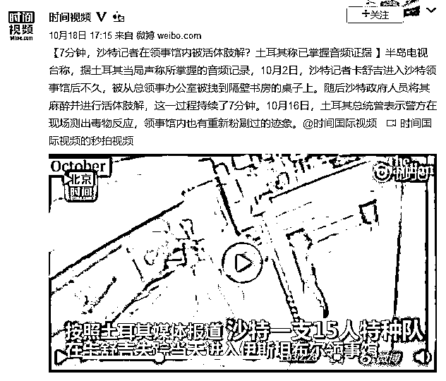
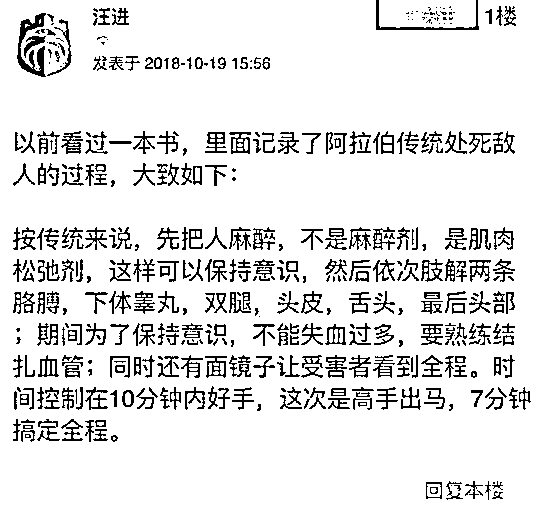
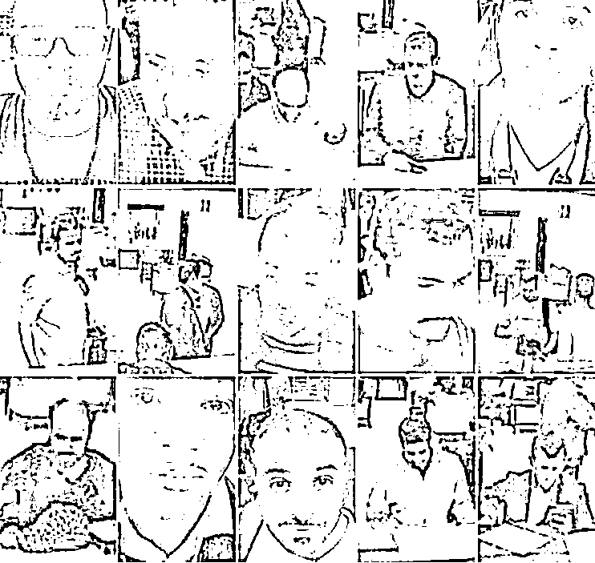
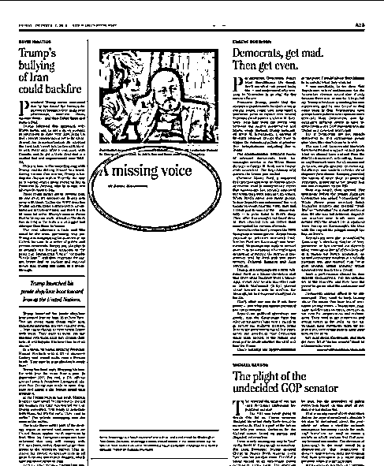
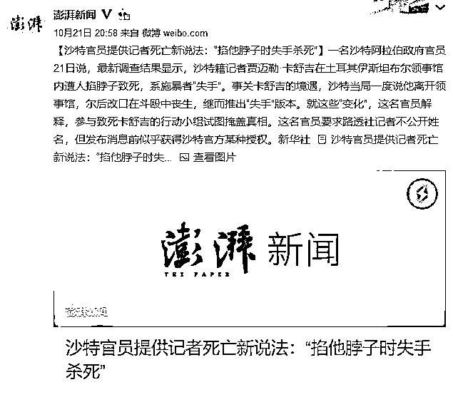
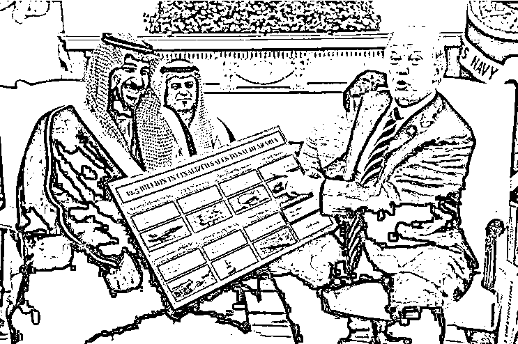
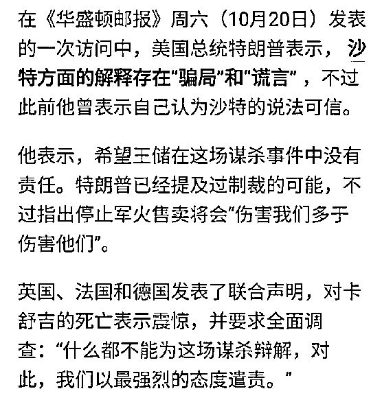

# 特朗普要人权，还是要 1100 亿美元的人血馒头|紫竹张先生

喜欢我的都关注我了~

沙特记者卡舒吉刷屏了，这位可怜的记者因为长期报道沙特王室的负面新闻，被沙特恨之入骨，被迫流亡土耳其。前几天他因结婚需要领取材料，走入沙特驻土耳其领事馆，然后再也没有走出来。而他的未婚妻在领事馆外面等候 11 个小时后被迫报警，据土耳其警方透露，卡舒吉可能已经被活活肢解。

土耳其方面称，卡舒吉被绑在桌上，注射肌肉松弛剂后丧失挣扎能力但是拥有清醒意识，由沙特方面特地赶来的法医亲自肢解，法医在操作时还让人放音乐。据了解，这是一种中东特有的行刑方式，堪比中国的凌迟，整个身体的肢解过程中，要求每下一刀都要绑扎血管，确保犯人不能因为失血而丧失意识，让犯人能清醒的看到自己被肢解的全过程，整个行刑过程一般为 10 分钟，而这次过来的人是高手，仅用 7 分钟就搞定全程。

据土耳其官方称，卡舒吉打算和在土耳其认识的未婚妻结婚，根据相关法律法规，他必须拿到沙特政府提供的离婚材料，于是他前往沙特领事馆办理相关材料，办事人员热情的接待了他，并告知相关材料需要等候国内的批准，预约下周前来领取。

随后，一支 15 人的特种小分队从沙特前往土耳其，包括一名法医，土耳其海关的监控视频记录下了他们的完整面貌。再然后，卡舒吉按照约定的时间进入了沙特领事馆，然后人间蒸发了。卡舒吉出事当天，这 15 人的小分队离开领事馆，分批返回了沙特国内。

卡舒吉虽然只是个记者，但是他并不是籍籍无名之辈，他的叔叔是中东最大军火头目，曾经的世界首富，他的表哥就是 1997 年和戴安娜王妃共赴黄泉的那位公子哥，卡舒吉本人和沙特王室的关系曾经非常之好，也和西方上流社会非常熟悉，拥有极广泛的人脉，甚至和年轻时候的本拉登都是至交好友。

而沙特王国是在 1932 年由伊本.沙特一手创立的，建国后他立下一条规矩，国王采用兄终弟及的制度，老一辈人没死完之前，禁止下一辈人接班，为了留下足够多的继承人可供选择，伊本.沙特结了 300 多次婚，有 50 多个子女，其中有 30 多个王子。

老沙特的目的很明确，所有的王子都去基层锻炼，采用内部选举制，他妄想结合西方选举制的特点来优化家天下继承人能力不足的弱点。要实现这个目的，沙特的王子需要越多越好，所以 76 年后的今天，沙特已经有了 5000 多位王子了，遍布军政商三界。

现任沙特国王老萨勒曼是沙特的第七任国王，他坐稳王座后，篡改了祖传继承法则，不打算把王位传给自己的弟弟了，打算把自己的儿子小萨勒曼立为王储。这当然会激起小萨勒曼叔叔伯伯的巨大不满，因为按照原有规矩，下一任国王应该是他们其中的一个。

于是，小萨勒曼上台后，把自己的叔叔伯伯，堂兄堂弟们全部给关押了起来，以贪腐为借口给他们定罪，必须承认自己贪腐，必须交出大量的钱财，否则不予释放，把整个沙特王室其他旁系的权利给全部接管了。

因为卡舒吉的靠山是小萨勒曼的对头，卡舒吉成了政府的眼中钉，所以卡舒吉选择自我流放到海外，然后开启了炮火模式，成为了华盛顿邮报的特约记者，天天揭发沙特王室的种种黑幕。要是普通记者也就算了，偏偏卡舒吉本身就对沙特王室特别熟悉，在西方上流社会也说得上话，卡舒吉的推特拥有 160 万粉丝，是美国知名的大 V，要知道特朗普也才 1000 万推特粉丝而已。华盛顿邮报这种美国主流媒体特地给卡舒吉开了一个专栏，天天让他发沙特黑稿。卡舒吉死后，华盛顿邮报甚至特地为卡舒吉开了一次天窗，留下大段的空白，仅有一个标题《消失的声音》。

卡舒吉在沙特和西方之间游走了数十年，自认为见过大风大浪，以为沙特绝对不敢触碰到西方的红线，于是大胆进入了沙特领事馆，没想到，对于独裁者而言，他们眼里只有恩怨，没有规则，也没有约束。

西方社会舆论大爆发

卡舒吉事件发生后，西方社会舆论大爆发，如此骇人听闻的事件已经超过的西方能容忍的道德底线，更和西方所标榜的人权水火不容，更是对人类现代文明社会赤裸裸的挑衅。

沙特政府承受了巨大的压力后，发出的第一个声明你们知道是什么吗？沙特方面称，卡舒吉已经自行从领事馆后门走出，至于去哪里了沙特方面并不知情。

这种拙劣的谎言自然引发了西方媒体的嘲弄，这是在侮辱别人的智商，当西方记者要求沙特方面提供领事馆的监控视频来证明卡舒吉自行走出领事馆的时候，沙特方面称，那几天刚好监控视频坏了，真是熟悉的配方熟悉的味道。

在西方媒体的巨大压力下，沙特方面后来改口称卡舒吉确实已经死亡，是因为在领事馆内和工作人员爆发冲突，不小心被掐脖窒息而死，至于尸体去哪了，和谁爆发的冲突，死亡细节是什么，沙特方面正在调查，调查结果出来之前不便公布。

这个理由太拙劣了，其实沙特方面应该说这位 60 岁的老记者在沙特领事馆殴打 15 人的特种小分队，掐法医的脖子，然后被人失手推了一下倒地身亡。或者说卡舒吉自己掐死了自己，15 个特工拉都拉不住，并且卡舒吉用力过度，不小心把自己掐的四分五裂，特种部队出于人道考虑，帮卡舒吉入土为安了。

沙特方面如此颠三倒四，用拙劣的谎言试图掩盖事实，自然激起了西方舆论的愤怒，西方媒体纷纷要求美国出手制裁沙特政府。

尴尬的特朗普

制裁沙特政府的理由很明确，西方一向标榜人权，美国也一直以国际警察，人权卫士自居，沙特政府如此侵犯人权，赤裸裸的践踏现代文明社会，不制裁他制裁谁，要是这都不予制裁，那美国以前以人权为借口干涉他国内政就彻底失去了合法性。

这下特朗普就尴尬了，特朗普心里是打一万个不愿意制裁沙特，因为特朗普和沙特的关系特别好，特朗普的女婿和小萨勒曼还是哥们，小萨勒曼为交好特朗普，特地送给了特朗普一个 1100 亿美元的军火订单，这是人类有史以来最大的军火订单，也是特朗普的重大政绩。

所以，特朗普不可能放弃沙特政府的这个订单，而这次西方媒体要求制裁沙特的最重要的一条就是禁止对沙特军售，因为如此野蛮专制的政府不应该得到先进武器。

所以，特朗普在事件发生后，立刻表示沙特政府的言辞可信，也就是那个自行走出领事馆的版本，后来在媒体铺天盖地的斥责之下，被迫改口称沙特方面的解释存在一定的“谎言”，但是他希望沙特王储在这次谋杀事件中没有责任，并反复强调，停止军售对美国的伤害大于对沙特的伤害。

换句话说，特朗普认为国家利益是要高于国际人权的，你这么说其实也没人说你错，但是你以前打着国际人权要高于国家利益的幌子是干嘛呢，这不是赤裸裸的双重标准码？双方唯一的差别，就是这一次涉及到特朗普的个人政绩了，所以标准开始更改和松动了。

所以，这世界上其实没有什么国际人权，只有美国人权，当沙特赤裸裸的践踏人权，挑衅现代文明的时候，沾满鲜血的双手递过来的钞票，特朗普依然会选择笑纳。

从这次的事件我们可以看出，特朗普宁可放弃国际人权，也要选择 1100 亿美元的人血馒头。在领事馆内肢解华盛顿邮报特约记者这种事都能忍，特朗普为了钱啥事干不出来。

觉得此文的分析有道理，对你有所帮助，请随手转发。

长按下方图片，识别二维码，即可关注我

近期精彩文章回顾（回复“目录”关键词可查看更多）

华为员工都这么穷，怪不得拼多多能火 | 房价跌 20%就会全面崩盘，地产杠杆远比你想的要脆弱 |  为什么碧桂园的质量那么差 | 清醒点，放弃全面开征房产税的幻想 | 央行和财政部隔空掐架，我支持央妈 |中国土地制度源自香港，但是香港却是劏房密布 | 为什么中介哄抢租赁房源，因为贩毒都没它来钱快 

复活号+紫竹林功能的公众号

**长按扫描下方二维码即可关注**

