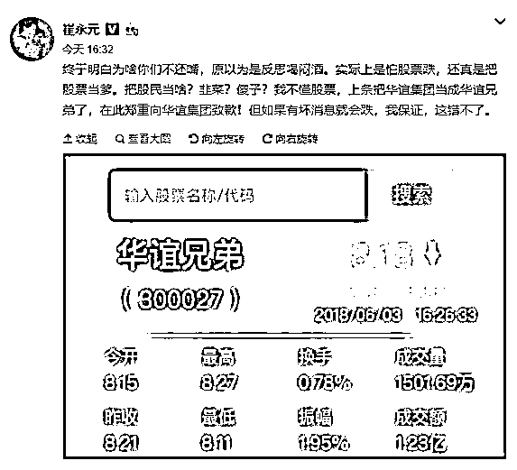
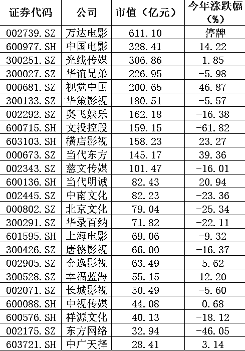
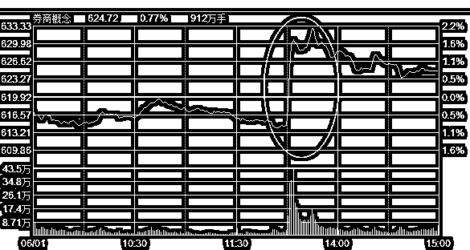

# 影视传媒股下周迎来巨震

首先谈谈周末新闻，本周末最火的就是贸易战最新成果以及范冰冰偷税漏税案件，首先谈谈范冰冰，目前国家税务部门正在和崔永元核实资料真实性，一旦核实，就是一场娱乐圈的地震，而从目前的种种迹象来看，崔永元资料属实的可能性极高。

所以，一定会对娱乐圈造成巨大冲击，税务稽查风暴展开之后，大批明星其实都有问题。。。至于对 A 股的影响，那就是影视传媒股了，查明星偷税漏税肯定会牵扯到他们，这是一个大地雷，税务稽查风暴结束之前，这个版块好不了，简直是锅从天上掉，没什么好办法，节哀顺变。

领跌股，就是华谊兄弟，因为崔永元直接点名手撕华谊公司，并且《手机 2》就是华谊兄弟投资出品，事态发酵到这个地步，就算没有旗下名星被牵扯进去，仅仅《手机 2》背负这么大恶名，他明天就得暴跌开盘，我估计跌停开盘都是有可能的，其他的影视传媒股，无一例外都会受到波及，轻重不同而已吧。

下面这个是影视传媒股汇总，总市值大概 3000 亿，过来看一看，有没有属于你的那口锅。

~~~~

周末，美方和中方代表在北京展开谈判，在农产品和能源进口方面取得了成果，中国将扩大农产品和能源的进口，这个进口对中国也是好事，所以就半推半就了。但是在中国释放善意的时候，美国宣布 6-15 日会对 500 亿美元商品征收 25%关税确实恶心到了中国，要是这么谈判，还能不能好好玩耍了。

所以，官方发布了这么一个声明：中美之间达成的成果，都应基于双方相向而行、不打贸易战这一前提。如果美方出台包括加征关税在内的贸易制裁措施，双方谈判达成的所有经贸成果将不会生效。（新华社）

这个声明非常巧妙，我给你让步了，但是我的让步建立在你也让步的基础上，如果你还继续加税，那么我之前所有的让步全部作废。

这一下，就把贸易战谈判的矛盾全部转移到美国国内了，已经在谈判成果中获益的阶层，会疯狂攻击那些要求继续加税获得更大利益的阶层，直接就演变成了美国内耗，而这个声明没有任何问题，合情合理合法。

非常 6，这个声明一出，我对中国贸易战获胜的评估概率大大提升，这个做法属于四两拨千斤，非常巧妙，让美国自己内部打成一锅粥去。

对股市的影响评估，无明显多空倾向，但是我个人认为，是利好。

~~~~

本周四的时候，出现一根金针探底阳 K，结合当时的大盘形态，可以说，只要后面几天不出现中阴线，深成指和上证指数就会引发日 K 底背离，然后带领大盘向上，但是周五直接一根中阴砸了下来，导致日期会向后拖延几天。

而我们的仓位，也在这一波越跌越买中，加仓到了 7 成，目前属于正常调整范围内的最高仓位状态。虽然周五的时候，已经打穿了最低一层的补仓位 1736，但是他目前还处于正常调整的范围之内。

什么叫正常调整，什么叫不正常调整。我们知道，差不多二年时间了，中国股市受到了非常强烈的人为干涉，人工制造慢牛的意图特别明显，涨快了就有人砸，砸不动了没筹码就出政策砸，跌多了就有人买，钱不够用了就出政策护。总之，过去的 2 年里，趋势交易特别难受，像 15 年那种暴涨暴跌，利用趋势战术就能顺利的逃顶抄底的做法已经玩不转了，整个大盘走势被硬生生的控制成了一个非常狭窄的小箱体里，人称螺狮壳里做道场。

谁也不知道这种状态什么时候会结束，我也不知道，所以最佳的策略选择，就是跟随这种形态，这种形态是典型的横盘形态，那么最好的办法就是，不惊不喜，稳健操作，不轻易因为贪心加仓，也不轻易因为恐惧而减仓。涨就涨，由他去，没什么好追的，跌就跌，由他去，没什么好怕的。因为总会有人出来控制盘面。

比如，在本周二的时候，盘面上就已经出现了非常明显的人工护盘痕迹，周三因为贸易战跳空低开的时候，也出现了大量的买盘，周四的时候，也特别明显。到了周五，这种护盘行为简直是不加掩饰了，周五的时候，证券版块是这么走的。

周五下午 1 点 30 之前，券商版块指数还是-0.9%，在没有任何利好的情况下，瞬间爆拉，最高拉升到 2.1%

你跟我说这是散户自己买上去的？谁信啊，这是赤果果的控制指数啊，咳，是稳定市场。这是国家队昭示自己力量的行为，也是给市场传递政策忍耐极限点位的行为。

可以说，如果没有任何力量插手，任由市场自己走，股市将会是剧烈波动的，一波涨上天，一波跌下地，技术操作会非常顺手，波动剧烈，涨跌惊人，向上突破就大胆买，向下突破就赶紧卖。

但是目前这种样子，只能了向下破位不卖，向上破位不买。最佳的盈利手段是，涨高了就卖一点，跌多了就买一点，每次交易 1 成，只要每一次这个 1 成交易都打出一点点差价，那么就能日积月累的吃到小肉，直到股市底部盘整的熊市给熬过去。

对于这种行情，3~7 成操作之间来回波动操作是最合适不过的，涨的很高了就 3 成，跌的很惨了就 7 成，永远有一点仓位在里面，进行适度加减仓。保留的 3 成仓位和子弹是应对极端情况的，例如突然爆发了大牛市，那么在一波超级猛拉之后，你不会有踏空的感觉，卖出 3 成之后，逢低买回你是敢买的，不会因为涨的太高而始终不敢买。或者突然爆发了超级黑天鹅，猛跌了一大波，那么你也不会有套牢的感觉，再打入 3 成子弹，然后逢高卖出，你是敢卖的，不至于因为账面是亏损的而一动不动。

周五的时候妖王崩盘，宏川智慧跌停，所以带动市场资金整体偏冷，这也是周五的时候创业板跌那么惨的原因，在未来的一周内，由于上证指数和深成指触发日 K 底背离，而妖王股陨落，在下一任妖王被选出之前基本没有太大参与价值，所以创业板都会比较疲软。

但是不管怎么样，淡定持股都是应对这种螺狮壳行情的最佳法宝，下周看企稳，目前已经到达我认为的正常调整的下限区域，但是还没有出现超级黑天鹅级暴跌，所以我维持目前的仓位，下周打算一动不动。

~**招聘**~

高薪招募股市研究员，要求：技术扎实，战绩优良，逻辑顺畅，表达清晰。

可以发送个人简历到人事邮箱 723791931@qq.com，如果入围，您会在发来邮件一周内接到我们的通知。若未接到通知，则简历未能入围。